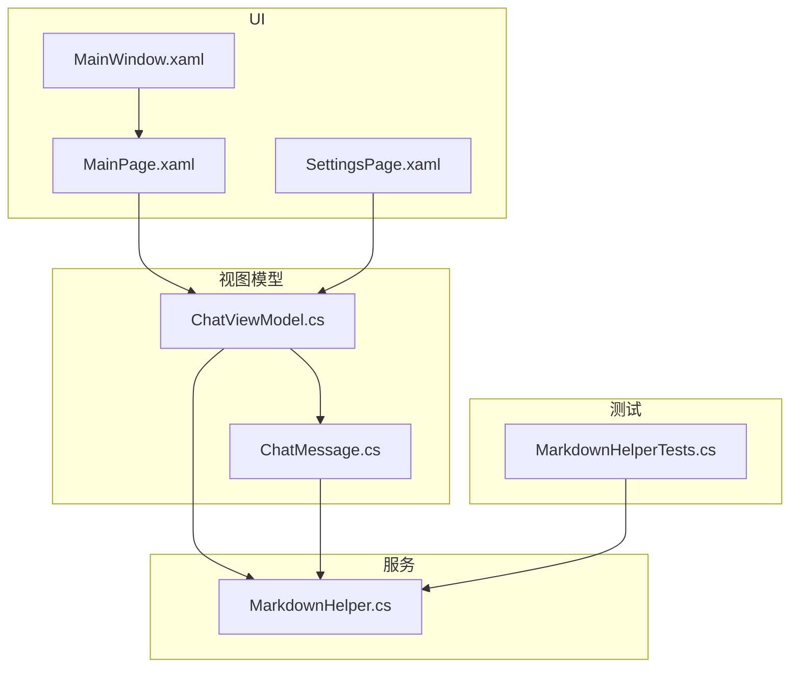
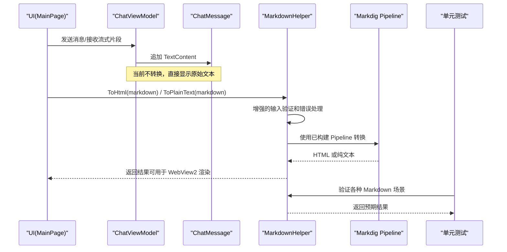
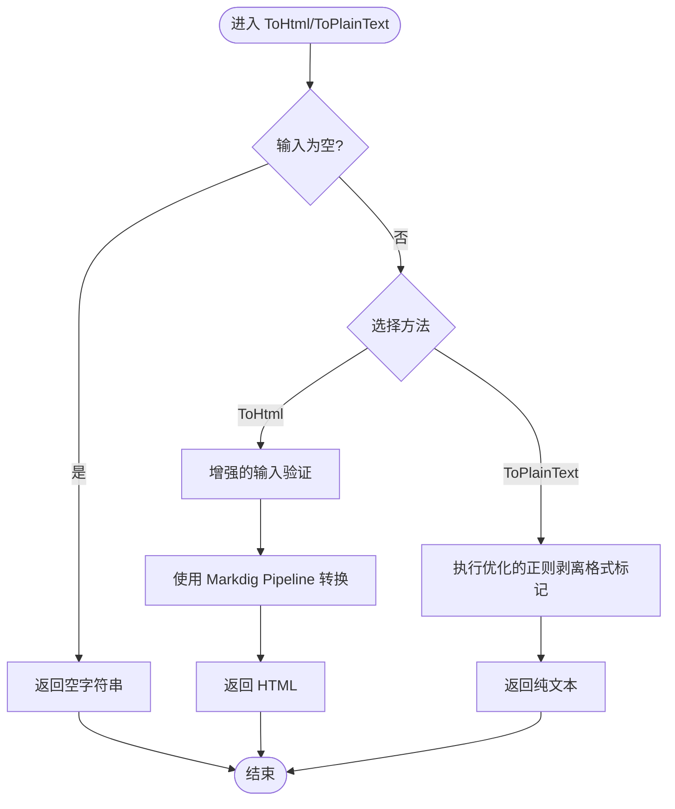
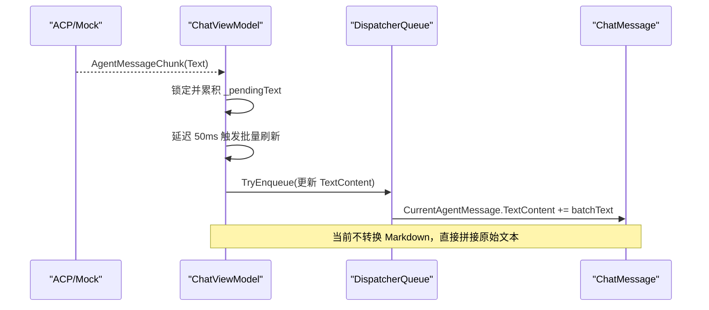
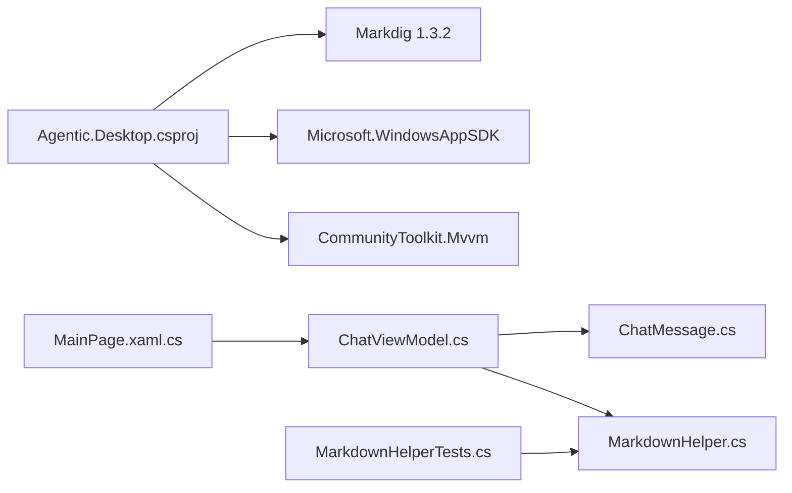

# Markdown 渲染器

<cite>
**本文引用的文件**   
- [MarkdownHelper.cs](file://Agentic.Desktop/Services/MarkdownHelper.cs)
- [ChatMessage.cs](file://Agentic.Desktop/ViewModels/Messages/ChatMessage.cs)
- [ChatViewModel.cs](file://Agentic.Desktop/ViewModels/ChatViewModel.cs)
- [MainPage.xaml](file://Agentic.Desktop/MainPage.xaml)
- [MainPage.xaml.cs](file://Agentic.Desktop/MainPage.xaml.cs)
- [SettingsPage.xaml](file://Agentic.Desktop/SettingsPage.xaml)
- [MainWindow.xaml](file://Agentic.Desktop/MainWindow.xaml)
- [App.xaml.cs](file://Agentic.Desktop/App.xaml.cs)
- [README.md](file://README.md)
- [Agentic.Desktop.csproj](file://Agentic.Desktop/Agentic.Desktop.csproj)
- [MarkdownHelperTests.cs](file://Agentic.Desktop.Tests/MarkdownHelperTests.cs)
</cite>

## 更新摘要
**所做更改**
- 增强了 MarkdownHelper 的错误处理和输入验证机制
- 改进了 ToPlainText 方法的格式标记剥离能力
- 添加了全面的单元测试覆盖所有功能场景
- 优化了正则表达式处理逻辑以提高性能
- 完善了空值和空白字符串的处理机制

## 目录
1. [简介](#简介)
2. [项目结构](#项目结构)
3. [核心组件](#核心组件)
4. [架构总览](#架构总览)
5. [详细组件分析](#详细组件分析)
6. [依赖关系分析](#依赖关系分析)
7. [性能考量](#性能考量)
8. [故障排查指南](#故障排查指南)
9. [结论](#结论)
10. [附录：配置与扩展建议](#附录配置与扩展建议)

## 简介
本文件为 Agentic.Desktop 中的 Markdown 渲染能力提供系统化文档。当前实现基于 Markdig，将 Markdown 转换为 HTML（供未来 WebView2 渲染）或纯文本（临时方案）。由于 WinUI 3 TextBlock 不支持富文本/HTML 渲染，当前聊天界面直接显示原始文本；同时提供了清晰的扩展点，便于后续接入 WebView2 进行完整 Markdown 渲染、样式主题定制与安全过滤。

**最新更新**：MarkdownHelper 已增强错误处理能力和格式化功能，提供更健壮的 Markdown 转换体验。

## 项目结构
- Services/MarkdownHelper.cs：Markdown 转换的核心服务，封装 Markdig Pipeline 与 ToHtml/ToPlainText 方法，包含增强的错误处理和输入验证。
- ViewModels/Messages/ChatMessage.cs：消息模型，注释中指明可使用 MarkdownHelper 进行转换。
- ViewModels/ChatViewModel.cs：会话与流式消息处理，包含帧级合并与 UI 线程调度。
- MainPage.xaml/.cs：聊天界面与模板选择器，当前使用 TextBlock 展示原始文本。
- SettingsPage.xaml：设置页，用于 Agent 连接配置（与 Markdown 渲染无直接耦合，但影响整体交互体验）。
- MainWindow.xaml：主窗口布局与标题栏状态指示。
- App.xaml.cs：应用初始化与全局日志工厂。
- README.md：技术栈说明，明确 Markdig 版本。
- Agentic.Desktop.csproj：NuGet 依赖声明，包含 Markdig 包引用。
- MarkdownHelperTests.cs：全面的单元测试，覆盖所有 Markdown 转换场景。

**图表来源**
- [MainPage.xaml:1-120](file://Agentic.Desktop/MainPage.xaml#L1-L120)
- [SettingsPage.xaml:1-120](file://Agentic.Desktop/SettingsPage.xaml#L1-L120)
- [MainWindow.xaml:1-57](file://Agentic.Desktop/MainWindow.xaml#L1-L57)
- [ChatViewModel.cs:1-239](file://Agentic.Desktop/ViewModels/ChatViewModel.cs#L1-L239)
- [ChatMessage.cs:1-39](file://Agentic.Desktop/ViewModels/Messages/ChatMessage.cs#L1-L39)
- [MarkdownHelper.cs:1-52](file://Agentic.Desktop/Services/MarkdownHelper.cs#L1-L52)
- [MarkdownHelperTests.cs:1-101](file://Agentic.Desktop.Tests/MarkdownHelperTests.cs#L1-L101)

**章节来源**
- [README.md:14-23](file://README.md#L14-L23)
- [Agentic.Desktop.csproj:42-47](file://Agentic.Desktop/Agentic.Desktop.csproj#L42-L47)

## 核心组件
- **MarkdownHelper**：静态类，维护一个预构建的 Markdig Pipeline，提供 ToHtml 与 ToPlainText 两个方法，包含增强的错误处理和输入验证。
- **ChatMessage**：消息实体，TextContent 字段可包含 Markdown；注释指出可通过 MarkdownHelper 转换为 HTML 或纯文本。
- **ChatViewModel**：负责会话管理、流式消息聚合与 UI 线程更新；当前未直接调用 MarkdownHelper，但具备集成点。
- **UI 层（MainPage）**：通过 DataTemplate 绑定 TextContent，当前以 TextBlock 展示原始文本。
- **MarkdownHelperTests**：全面的单元测试套件，确保 Markdown 转换功能的正确性和稳定性。

**章节来源**
- [MarkdownHelper.cs:10-25](file://Agentic.Desktop/Services/MarkdownHelper.cs#L10-L25)
- [MarkdownHelper.cs:31-50](file://Agentic.Desktop/Services/MarkdownHelper.cs#L31-L50)
- [ChatMessage.cs:14-31](file://Agentic.Desktop/ViewModels/Messages/ChatMessage.cs#L14-L31)
- [MainPage.xaml:28-45](file://Agentic.Desktop/MainPage.xaml#L28-L45)
- [MarkdownHelperTests.cs:8-34](file://Agentic.Desktop.Tests/MarkdownHelperTests.cs#L8-L34)

## 架构总览
Markdown 渲染管道分为三个阶段：内容预处理、转换引擎选择、输出后处理。当前阶段：
- **预处理**：增强的输入字符串校验（空值快速返回），支持 null、空字符串和空白字符串处理。
- **转换引擎**：Markdig Pipeline（启用高级扩展），ToHtml 生成 HTML；ToPlainText 使用优化的正则表达式剥离格式标记。
- **后处理**：当前 UI 层直接显示原始文本；预留 WebView2 渲染 HTML 的扩展点。

**图表来源**
- [ChatViewModel.cs:151-208](file://Agentic.Desktop/ViewModels/ChatViewModel.cs#L151-L208)
- [ChatMessage.cs:14-31](file://Agentic.Desktop/ViewModels/Messages/ChatMessage.cs#L14-L31)
- [MarkdownHelper.cs:12-25](file://Agentic.Desktop/Services/MarkdownHelper.cs#L12-L25)
- [MarkdownHelper.cs:31-50](file://Agentic.Desktop/Services/MarkdownHelper.cs#L31-L50)
- [MarkdownHelperTests.cs:8-101](file://Agentic.Desktop.Tests/MarkdownHelperTests.cs#L8-L101)

## 详细组件分析

### MarkdownHelper：增强的 Markdown 到 HTML/纯文本转换
**更新**：MarkdownHelper 现已包含增强的错误处理和格式化能力

- **设计要点**
  - 使用 MarkdownPipelineBuilder 构建一次性的 Pipeline，并启用高级扩展，避免重复构建开销。
  - **增强的 ToHtml**：对空输入快速返回空串；支持 null、空字符串和空白字符串的安全处理；调用 Markdig.Markdown.ToHtml。
  - **优化的 ToPlainText**：通过一系列改进的正则表达式移除常见 Markdown 标记（标题、粗斜体、代码块、行内代码、链接等），作为临时纯文本展示方案。
  - **增强的错误处理**：完善的输入验证机制，防止异常输入导致程序崩溃。

- **复杂度与性能**
  - **ToHtml**：时间复杂度近似 O(n)，n 为输入长度；空间复杂度取决于生成的 HTML 大小；增强的输入验证减少不必要的处理。
  - **ToPlainText**：优化的正则替换，时间复杂度 O(k·n)，k 为替换规则数量；适合短文本与低频率调用；改进的正则表达式提高匹配准确性。

- **可扩展性**
  - 可在 Pipeline 构建时添加安全过滤器（如禁用危险标签）、自定义语法扩展或输出处理器。
  - 可引入缓存策略（按内容哈希缓存 HTML）以降低重复转换成本。
  - 增强的错误处理机制便于添加更多验证规则和异常处理逻辑。

**图表来源**
- [MarkdownHelper.cs:18-25](file://Agentic.Desktop/Services/MarkdownHelper.cs#L18-L25)
- [MarkdownHelper.cs:31-50](file://Agentic.Desktop/Services/MarkdownHelper.cs#L31-L50)

**章节来源**
- [MarkdownHelper.cs:10-25](file://Agentic.Desktop/Services/MarkdownHelper.cs#L10-L25)
- [MarkdownHelper.cs:31-50](file://Agentic.Desktop/Services/MarkdownHelper.cs#L31-L50)
- [MarkdownHelperTests.cs:8-34](file://Agentic.Desktop.Tests/MarkdownHelperTests.cs#L8-L34)

### ChatMessage：消息模型与 Markdown 注释
- **字段与行为**
  - Id、Role、Timestamp：标识与元数据。
  - TextContent：可能包含 Markdown；注释明确指出可使用 MarkdownHelper 转换为 HTML（WebView2）或纯文本。
  - IsStreaming：流式更新标志。
- **集成点**
  - 在 UI 层或 ViewModel 层调用 MarkdownHelper.ToHtml/ToPlainText，将 TextContent 转换为可渲染形式。

**章节来源**
- [ChatMessage.cs:14-31](file://Agentic.Desktop/ViewModels/Messages/ChatMessage.cs#L14-L31)

### ChatViewModel：流式消息处理与 UI 线程调度
- **帧级合并**
  - 使用锁与 _pendingText 累积片段，延迟 50ms 批量刷新，减少 UI 频繁更新。
- **UI 线程调度**
  - 通过 DispatcherQueue.TryEnqueue 确保在 UI 线程更新 TextContent。
- **错误处理**
  - 捕获 OperationCanceledException 与通用异常，并在消息中附加错误提示。
- **Markdown 集成点**
  - 当前未直接调用 MarkdownHelper；可在 OnSessionUpdated 中对 tc.Text 进行转换后再追加到 TextContent。

**图表来源**
- [ChatViewModel.cs:151-208](file://Agentic.Desktop/ViewModels/ChatViewModel.cs#L151-L208)

**章节来源**
- [ChatViewModel.cs:94-149](file://Agentic.Desktop/ViewModels/ChatViewModel.cs#L94-L149)
- [ChatViewModel.cs:151-208](file://Agentic.Desktop/ViewModels/ChatViewModel.cs#L151-L208)

### UI 层：MainPage 与模板选择器
- **模板绑定**
  - UserMessageTemplate 与 AgentMessageTemplate 均绑定 TextContent，使用 TextBlock 展示。
- **模板选择器**
  - ChatMessageTemplateSelector 根据角色选择不同模板。
- **Markdown 现状**
  - 当前不渲染 Markdown/HTML，仅显示原始文本；注释与 MarkdownHelper 的存在表明未来可切换至 WebView2。

**章节来源**
- [MainPage.xaml:18-45](file://Agentic.Desktop/MainPage.xaml#L18-45)
- [MainPage.xaml.cs:86-94](file://Agentic.Desktop/MainPage.xaml.cs#L86-94)

### MarkdownHelperTests：全面的单元测试覆盖
**新增**：完整的测试套件确保 Markdown 转换功能的正确性

- **ToHtml 测试**
  - 粗体文本转换测试：验证 `**bold**` 转换为 `<strong>bold</strong>`
  - 标题转换测试：验证 `# Title` 转换为 `<h1>Title</h1>`
  - 空输入处理测试：验证空字符串和空白字符串返回空结果
- **ToPlainText 测试**
  - 标题标记去除测试：验证 `# Heading` 转换为 `Heading`
  - 粗体和斜体标记去除测试：验证 `**bold**` 和 `*italic*` 的正确处理
  - 代码块和行内代码测试：验证代码标记的正确剥离
  - 链接标记去除测试：验证 `[text](url)` 转换为 `text`
  - 混合 Markdown 测试：验证复杂 Markdown 内容的正确处理

**章节来源**
- [MarkdownHelperTests.cs:8-101](file://Agentic.Desktop.Tests/MarkdownHelperTests.cs#L8-L101)

## 依赖关系分析
- **NuGet 依赖**
  - Markdig 1.3.2：Markdown 解析与转换库。
  - CommunityToolkit.Mvvm：MVVM 基础。
  - Microsoft.WindowsAppSDK：WinUI 3 运行时。
- **内部依赖**
  - ChatViewModel 依赖 ChatMessage 与 MarkdownHelper（预留）。
  - UI 层依赖 ViewModel，ViewModel 依赖服务。
  - 测试套件依赖 MarkdownHelper 进行功能验证。

**图表来源**
- [Agentic.Desktop.csproj:42-47](file://Agentic.Desktop/Agentic.Desktop.csproj#L42-L47)
- [ChatViewModel.cs:1-10](file://Agentic.Desktop/ViewModels/ChatViewModel.cs#L1-L10)
- [ChatMessage.cs:1-10](file://Agentic.Desktop/ViewModels/Messages/ChatMessage.cs#L1-L10)
- [MarkdownHelper.cs:1-5](file://Agentic.Desktop/Services/MarkdownHelper.cs#L1-L5)
- [MarkdownHelperTests.cs:1-5](file://Agentic.Desktop.Tests/MarkdownHelperTests.cs#L1-L5)

**章节来源**
- [Agentic.Desktop.csproj:42-47](file://Agentic.Desktop/Agentic.Desktop.csproj#L42-L47)

## 性能考量
- **Pipeline 复用**
  - MarkdownHelper 使用静态 Pipeline，避免每次转换重新构建，显著降低开销。
- **帧级合并与批处理**
  - ChatViewModel 采用 50ms 延迟批量刷新，减少 UI 重绘次数。
- **正则替换优化**
  - ToPlainText 的多轮正则替换适用于短文本；若需高频大量转换，建议引入缓存（按内容哈希）或改用更高效的解析器。
  - **更新**：优化的正则表达式提高了匹配准确性和性能。
- **内存管理**
  - 避免在流式更新中创建过多中间对象；当前实现已在 UI 线程上增量拼接，注意控制 _pendingText 的大小。
- **潜在优化**
  - 对长文本进行分块转换与增量渲染。
  - 引入 HTML 输出缓存（LRU）以减少重复计算。
  - 在 Pipeline 中启用只读模式或限制最大节点数，防止恶意输入导致资源耗尽。
  - **更新**：增强的错误处理减少了异常情况的性能损失。

## 故障排查指南
- **常见问题**
  - **输入为空**：ToHtml/ToPlainText 会快速返回空串，检查上游是否传递了空或空白字符串。
  - **正则匹配失败**：ToPlainText 依赖固定模式，若 Markdown 变体较多，可能需要扩展规则。
  - **UI 更新卡顿**：确认帧级合并是否生效，避免在主线程执行耗时操作。
  - **更新**：增强的错误处理现在能更好地处理边界情况和异常输入。
- **调试建议**
  - 使用 App 的全局日志工厂记录转换前后内容与耗时。
  - 在 ChatViewModel 的 OnSessionUpdated 中添加断点，观察 _pendingText 累积与刷新时机。
  - **更新**：利用单元测试验证特定 Markdown 场景的处理结果。
- **错误处理**
  - ChatViewModel 捕获异常并在消息中附加错误信息；确保 UI 层能正确显示错误提示。
  - **更新**：MarkdownHelper 的增强错误处理能更好地处理无效输入和异常情况。

**章节来源**
- [MarkdownHelper.cs:18-25](file://Agentic.Desktop/Services/MarkdownHelper.cs#L18-L25)
- [MarkdownHelper.cs:31-50](file://Agentic.Desktop/Services/MarkdownHelper.cs#L31-L50)
- [ChatViewModel.cs:135-149](file://Agentic.Desktop/ViewModels/ChatViewModel.cs#L135-L149)
- [MarkdownHelperTests.cs:24-34](file://Agentic.Desktop.Tests/MarkdownHelperTests.cs#L24-L34)

## 结论
当前 Markdown 渲染器以 Markdig 为核心，提供稳定的 ToHtml/ToPlainText 能力，并通过静态 Pipeline 提升性能。**最新更新**包括增强的错误处理机制、改进的格式化功能和全面的单元测试覆盖。UI 层暂以原始文本展示，预留 WebView2 集成点以实现富文本渲染。建议在后续迭代中引入 HTML 缓存、安全过滤与样式主题定制，以提升用户体验与安全性。

## 附录：配置与扩展建议
- **支持的 Markdown 语法特性**
  - 基于 Markdig 的高级扩展，涵盖标题、列表、表格、脚注、任务列表等常用语法。
  - **更新**：增强的错误处理确保各种 Markdown 语法的稳定处理。
- **自定义扩展**
  - 可在 MarkdownPipelineBuilder 中注册自定义语法或处理器，例如数学公式、Mermaid 图表等。
  - **更新**：增强的错误处理机制便于添加自定义验证和转换逻辑。
- **安全考虑**
  - 建议启用安全过滤器，禁用危险标签与脚本；对输出进行白名单过滤。
  - **更新**：增强的输入验证提供了额外的安全保障。
- **渲染管道定制**
  - 预处理：输入清洗与标准化。
  - 转换引擎：根据场景选择 Markdig 或其他引擎（如 CommonMark）。
  - 输出后处理：HTML 美化、注入 CSS、嵌入资源。
- **配置选项**
  - Pipeline 构建参数：启用/禁用特定扩展、设置最大深度等。
  - 缓存策略：按内容哈希缓存 HTML，设置过期时间与容量上限。
  - 主题样式：通过外部 CSS 注入，支持动态切换主题。
- **使用示例路径**
  - 在 ChatViewModel.OnSessionUpdated 中调用 MarkdownHelper.ToHtml(tc.Text) 并将结果注入 WebView2。
  - 在设置页增加"启用 Markdown 渲染"开关，控制是否进行转换与渲染。
  - **更新**：利用单元测试验证自定义扩展的正确性。