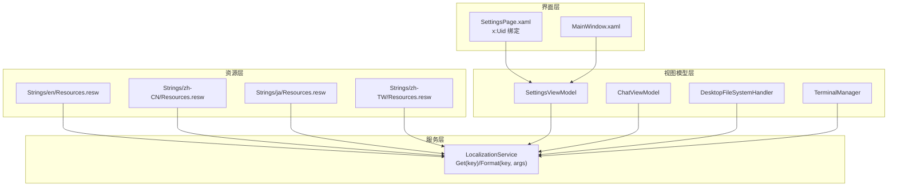
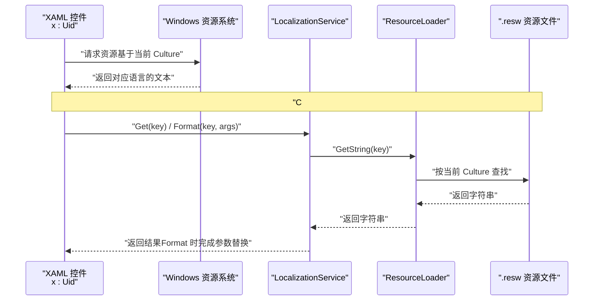
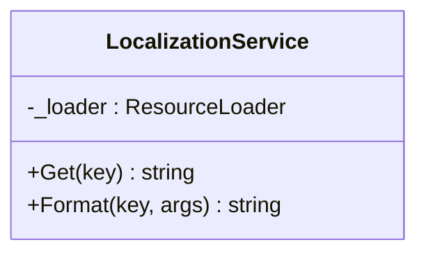
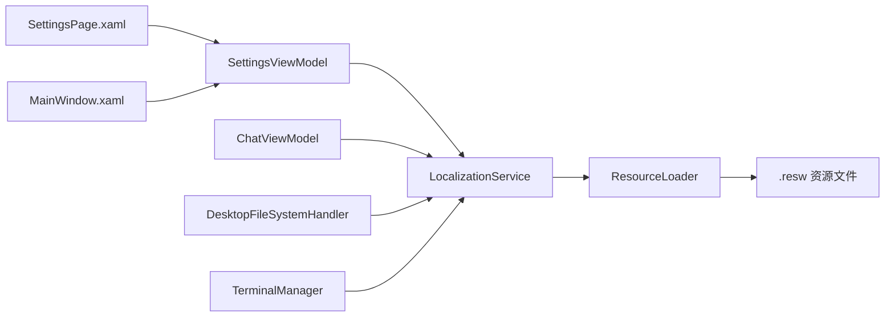

# 国际化服务

<cite>
**本文引用的文件**   
- [LocalizationService.cs](file://Agentic.Desktop/Services/LocalizationService.cs)
- [Resources.resw（en）](file://Agentic.Desktop/Strings/en/Resources.resw)
- [Resources.resw（zh-CN）](file://Agentic.Desktop/Strings/zh-CN/Resources.resw)
- [Resources.resw（ja）](file://Agentic.Desktop/Strings/ja/Resources.resw)
- [Resources.resw（zh-TW）](file://Agentic.Desktop/Strings/zh-TW/Resources.resw)
- [SettingsViewModel.cs](file://Agentic.Desktop/ViewModels/SettingsViewModel.cs)
- [ChatViewModel.cs](file://Agentic.Desktop/ViewModels/ChatViewModel.cs)
- [FileSystemHandler.cs](file://Agentic.Desktop/Services/FileSystemHandler.cs)
- [TerminalManager.cs](file://Agentic.Desktop/Services/TerminalManager.cs)
- [SettingsPage.xaml](file://Agentic.Desktop/SettingsPage.xaml)
- [MainWindow.xaml](file://Agentic.Desktop/MainWindow.xaml)
- [App.xaml.cs](file://Agentic.Desktop/App.xaml.cs)
- [Agentic.Desktop.csproj](file://Agentic.Desktop/Agentic.Desktop.csproj)
</cite>

## 目录
1. [简介](#简介)
2. [项目结构](#项目结构)
3. [核心组件](#核心组件)
4. [架构总览](#架构总览)
5. [详细组件分析](#详细组件分析)
6. [依赖关系分析](#依赖关系分析)
7. [性能考量](#性能考量)
8. [故障排查指南](#故障排查指南)
9. [结论](#结论)
10. [附录：新增语言与最佳实践](#附录新增语言与最佳实践)

## 简介
本文件面向 Agentic.Desktop 的国际化能力，围绕 LocalizationService 的多语言资源管理机制进行系统化说明。内容涵盖 .resw 文件格式、资源查找算法、动态语言切换实现思路、Format 方法的字符串格式化能力（参数替换）、资源文件组织结构与按语言代码分类策略、运行时语言检测与回退机制、用户偏好持久化方案，以及完整的“新增语言”操作流程和最佳实践。

## 项目结构
本项目采用 WinUI 桌面应用结构，多语言资源以 .resw 文件形式存放于 Strings 目录下，按语言代码分文件夹组织；C# 层通过 Windows.ApplicationModel.Resources.ResourceLoader 读取资源。XAML 侧使用 x:Uid 绑定资源键，C# 侧通过 LocalizationService 提供统一的 Get/Format 接口。

图表来源 
- [LocalizationService.cs](file://Agentic.Desktop/Services/LocalizationService.cs)
- [Resources.resw（en）](file://Agentic.Desktop/Strings/en/Resources.resw)
- [Resources.resw（zh-CN）](file://Agentic.Desktop/Strings/zh-CN/Resources.resw)
- [Resources.resw（ja）](file://Agentic.Desktop/Strings/ja/Resources.resw)
- [Resources.resw（zh-TW）](file://Agentic.Desktop/Strings/zh-TW/Resources.resw)
- [SettingsViewModel.cs](file://Agentic.Desktop/ViewModels/SettingsViewModel.cs)
- [ChatViewModel.cs](file://Agentic.Desktop/ViewModels/ChatViewModel.cs)
- [FileSystemHandler.cs](file://Agentic.Desktop/Services/FileSystemHandler.cs)
- [TerminalManager.cs](file://Agentic.Desktop/Services/TerminalManager.cs)
- [SettingsPage.xaml](file://Agentic.Desktop/SettingsPage.xaml)
- [MainWindow.xaml](file://Agentic.Desktop/MainWindow.xaml)

章节来源
- [LocalizationService.cs](file://Agentic.Desktop/Services/LocalizationService.cs)
- [Agentic.Desktop.csproj](file://Agentic.Desktop/Agentic.Desktop.csproj)

## 核心组件
- LocalizationService：封装 ResourceLoader，对外暴露 Get(key) 与 Format(key, params object[] args) 两个方法，分别用于获取本地化字符串与带参数的格式化字符串。
- 资源文件：Strings 下按语言代码划分文件夹，每个语言一个 Resources.resw，包含所有 UI 与 C# 逻辑所需的文本键值对。
- XAML 绑定：通过 x:Uid 将控件属性与资源键关联，由系统自动解析当前文化下的资源。
- ViewModel 集成：在 SettingsViewModel、ChatViewModel、DesktopFileSystemHandler、TerminalManager 中通过 LocalizationService 获取或格式化文本。

章节来源
- [LocalizationService.cs](file://Agentic.Desktop/Services/LocalizationService.cs)
- [SettingsViewModel.cs](file://Agentic.Desktop/ViewModels/SettingsViewModel.cs)
- [ChatViewModel.cs](file://Agentic.Desktop/ViewModels/ChatViewModel.cs)
- [FileSystemHandler.cs](file://Agentic.Desktop/Services/FileSystemHandler.cs)
- [TerminalManager.cs](file://Agentic.Desktop/Services/TerminalManager.cs)
- [SettingsPage.xaml](file://Agentic.Desktop/SettingsPage.xaml)

## 架构总览
下图展示了从 XAML 到资源文件的完整调用链，以及 C# 侧通过 LocalizationService 访问资源的流程。

图表来源 
- [LocalizationService.cs](file://Agentic.Desktop/Services/LocalizationService.cs)
- [SettingsPage.xaml](file://Agentic.Desktop/SettingsPage.xaml)

## 详细组件分析

### LocalizationService：多语言资源访问器
- 职责：封装 ResourceLoader，统一提供 Get/Format 两种访问方式。
- 关键行为：
  - Get(key)：根据 key 获取当前文化下的本地化字符串。
  - Format(key, args)：先获取字符串模板，再使用 string.Format 进行参数替换。
- 复杂度：O(1) 查找（ResourceLoader 内部缓存），string.Format 为 O(n)。
- 错误处理：若 key 不存在，底层会抛出异常；建议在调用处捕获并给出默认文案。

图表来源 
- [LocalizationService.cs](file://Agentic.Desktop/Services/LocalizationService.cs)

章节来源
- [LocalizationService.cs](file://Agentic.Desktop/Services/LocalizationService.cs)

### 资源文件组织结构与命名约定
- 目录结构：Strings/{语言代码}/Resources.resw
- 语言代码示例：en、zh-CN、ja、zh-TW
- 文件内容：XML 格式，包含 resheader 元数据与 data 节点，data.name 为资源键，data.value 为本地化文本。
- 命名建议：
  - 使用“模块.控件名.属性”风格，如 NavChat.Content、SettingsAgentPathLabel.Text。
  - C# 代码中的硬编码文本应抽取为独立键，便于集中管理。
- 一致性：各语言文件需保持相同的键集合，缺失键会导致运行时异常。

章节来源
- [Resources.resw（en）](file://Agentic.Desktop/Strings/en/Resources.resw)
- [Resources.resw（zh-CN）](file://Agentic.Desktop/Strings/zh-CN/Resources.resw)
- [Resources.resw（ja）](file://Agentic.Desktop/Strings/ja/Resources.resw)
- [Resources.resw（zh-TW）](file://Agentic.Desktop/Strings/zh-TW/Resources.resw)

### Format 方法与字符串格式化
- 支持参数替换：Format(key, args) 使用 string.Format 对模板中的占位符进行替换。
- 典型用法：
  - 错误信息拼接：ErrorPrefix + ex.Message
  - 工具调用提示：ToolCallPrefix + toolCall.Title
  - 进程退出消息：StatusAgentDisconnected + exitCode
- 复数形式：当前实现未内置复数规则，如需复数，可在资源文件中定义多条键（如 KeyOne、KeyMany），或在 Format 前做条件判断选择不同键。

章节来源
- [ChatViewModel.cs](file://Agentic.Desktop/ViewModels/ChatViewModel.cs)
- [SettingsViewModel.cs](file://Agentic.Desktop/ViewModels/SettingsViewModel.cs)
- [FileSystemHandler.cs](file://Agentic.Desktop/Services/FileSystemHandler.cs)

### XAML 侧的 x:Uid 绑定
- 在 XAML 中使用 x:Uid 将控件属性与资源键关联，例如 TextBlock 的 Text、TextBox 的 PlaceholderText 等。
- 优点：无需在 C# 中手动设置文本，构建时/运行时无缝解析当前文化资源。
- 适用场景：静态 UI 文案、按钮文本、提示信息等。

章节来源
- [SettingsPage.xaml](file://Agentic.Desktop/SettingsPage.xaml)
- [MainWindow.xaml](file://Agentic.Desktop/MainWindow.xaml)

### ViewModel 中的国际化使用
- SettingsViewModel：初始化连接状态、连接进度、成功/失败消息均通过 LocalizationService 获取或格式化。
- ChatViewModel：错误前缀、工具调用前缀、模拟响应文本均通过 LocalizationService 获取或格式化。
- DesktopFileSystemHandler：路径校验失败时抛出 UnauthorizedAccessException，并使用 LocalizationService.Format 生成国际化错误消息。
- TerminalManager：stderr 输出前缀使用 LocalizationService.Get 获取本地化文本。

章节来源
- [SettingsViewModel.cs](file://Agentic.Desktop/ViewModels/SettingsViewModel.cs)
- [ChatViewModel.cs](file://Agentic.Desktop/ViewModels/ChatViewModel.cs)
- [FileSystemHandler.cs](file://Agentic.Desktop/Services/FileSystemHandler.cs)
- [TerminalManager.cs](file://Agentic.Desktop/Services/TerminalManager.cs)

## 依赖关系分析
- LocalizationService 依赖 Windows.ApplicationModel.Resources.ResourceLoader，后者负责加载 .resw 资源。
- XAML 通过 x:Uid 与系统资源解析器协作，按当前 Culture 选择资源。
- ViewModel 与服务类直接依赖 LocalizationService，形成松耦合的访问点。

图表来源 
- [LocalizationService.cs](file://Agentic.Desktop/Services/LocalizationService.cs)
- [SettingsViewModel.cs](file://Agentic.Desktop/ViewModels/SettingsViewModel.cs)
- [ChatViewModel.cs](file://Agentic.Desktop/ViewModels/ChatViewModel.cs)
- [FileSystemHandler.cs](file://Agentic.Desktop/Services/FileSystemHandler.cs)
- [TerminalManager.cs](file://Agentic.Desktop/Services/TerminalManager.cs)
- [SettingsPage.xaml](file://Agentic.Desktop/SettingsPage.xaml)
- [MainWindow.xaml](file://Agentic.Desktop/MainWindow.xaml)

章节来源
- [LocalizationService.cs](file://Agentic.Desktop/Services/LocalizationService.cs)
- [Agentic.Desktop.csproj](file://Agentic.Desktop/Agentic.Desktop.csproj)

## 性能考量
- ResourceLoader 内部缓存已优化，Get 操作开销极低。
- string.Format 在高频调用时应避免重复创建大对象，可考虑复用模板或减少参数数量。
- XAML 的 x:Uid 在首次解析后由系统缓存，后续切换文化时的重绘成本取决于 UI 层级深度。
- 建议：
  - 避免在热路径中频繁切换文化。
  - 批量更新 UI 时合并多次文本赋值，减少重排。

[本节为通用指导，不直接分析具体文件]

## 故障排查指南
- 常见错误：
  - 资源键缺失：ResourceLoader 抛出异常。检查各语言 .resw 是否包含相同键集合。
  - 参数数量不匹配：Format 的参数与模板占位符不一致导致异常。核对键模板与调用方参数。
  - 文化选择不正确：确认 DefaultLanguage 与系统文化设置，必要时在 App 启动时设置 CurrentUICulture。
- 定位方法：
  - 在调用 LocalizationService 的地方添加 try/catch，记录异常堆栈与 key。
  - 使用调试器观察 ResourceLoader 的当前 Culture。
  - 对比各语言 .resw 的键集合差异。

章节来源
- [LocalizationService.cs](file://Agentic.Desktop/Services/LocalizationService.cs)
- [SettingsViewModel.cs](file://Agentic.Desktop/ViewModels/SettingsViewModel.cs)
- [ChatViewModel.cs](file://Agentic.Desktop/ViewModels/ChatViewModel.cs)
- [FileSystemHandler.cs](file://Agentic.Desktop/Services/FileSystemHandler.cs)

## 结论
本项目通过 LocalizationService 与 .resw 资源文件实现了简洁高效的国际化方案。XAML 侧使用 x:Uid 简化静态文案绑定，C# 侧通过 Get/Format 满足动态文本需求。整体架构清晰、扩展性强，适合持续增加新语言与维护多语言一致性。

[本节为总结性内容，不直接分析具体文件]

## 附录：新增语言与最佳实践

### 新增语言完整流程
- 步骤一：创建资源文件夹与文件
  - 在 Strings 目录下新建语言代码文件夹（如 ko）。
  - 复制现有 Resources.resw 到该文件夹，命名为 Resources.resw。
- 步骤二：翻译资源键值
  - 打开 Resources.resw，逐条翻译 data.value，确保 data.name 不变。
  - 保持与源语言一致的键集合，避免缺失。
- 步骤三：验证与测试
  - 修改系统 UI 语言或设置 CurrentUICulture，运行应用验证显示。
  - 检查 XAML 的 x:Uid 绑定与 C# 的 LocalizationService 调用是否正确。
- 步骤四：提交与发布
  - 将新语言资源纳入版本控制，确保构建脚本能打包 .resw。

章节来源
- [Resources.resw（en）](file://Agentic.Desktop/Strings/en/Resources.resw)
- [Agentic.Desktop.csproj](file://Agentic.Desktop/Agentic.Desktop.csproj)

### 运行时语言检测与切换
- 检测：可通过 CultureInfo.CurrentUICulture 获取当前 UI 文化。
- 切换：在应用启动或设置页中设置 Thread.CurrentThread.CurrentUICulture，随后刷新 UI（重新加载页面或触发重绑定）。
- 注意：切换文化后，XAML 的 x:Uid 会在下次解析时生效；C# 侧的 LocalizationService 会立即反映新文化。

章节来源
- [App.xaml.cs](file://Agentic.Desktop/App.xaml.cs)
- [SettingsPage.xaml](file://Agentic.Desktop/SettingsPage.xaml)

### 用户偏好设置持久化
- 推荐方案：使用 Microsoft.Extensions.Configuration 或 ApplicationData 存储用户选择的语言代码。
- 启动流程：
  - 读取保存的语言代码。
  - 设置 CurrentUICulture。
  - 初始化 UI，确保资源按用户偏好加载。
- 变更流程：
  - 用户在设置页更改语言。
  - 写入配置并重启相关页面或应用。

[本节为通用指导，不直接分析具体文件]

### 回退机制
- 资源查找顺序：精确文化 -> 区域文化 -> 默认语言（DefaultLanguage）-> 英文（fallback）。
- 建议：
  - 始终提供 en 作为兜底语言。
  - 在构建阶段校验缺失键，避免运行时异常。

章节来源
- [Agentic.Desktop.csproj](file://Agentic.Desktop/Agentic.Desktop.csproj)

### 最佳实践
- 命名规范：使用“模块.控件.属性”风格，保证可读性与可维护性。
- 模板设计：将可变部分抽离为占位符，避免拼接复杂逻辑。
- 复数与性别：如需复数或性别变化，定义多个键并在调用处选择合适键。
- 测试覆盖：为关键文案编写单元测试，验证格式化与回退逻辑。
- 文档同步：新增功能时同步更新资源文件与文档。

[本节为通用指导，不直接分析具体文件]