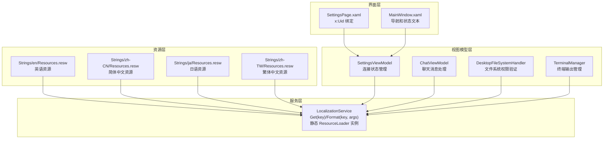
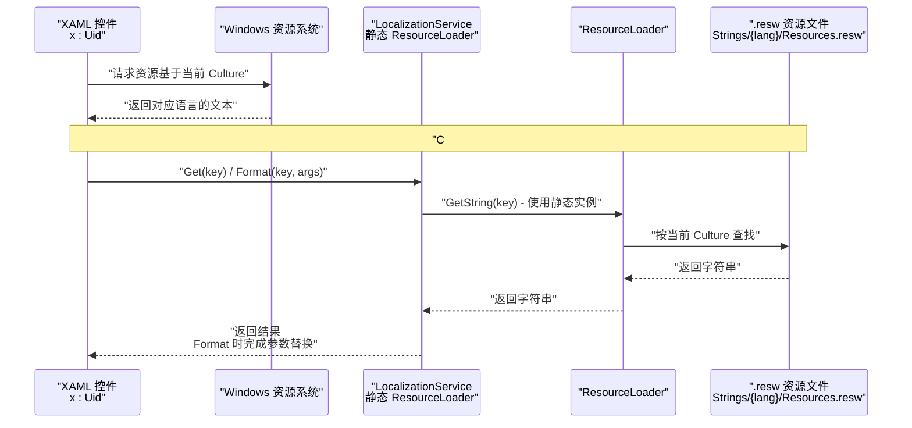
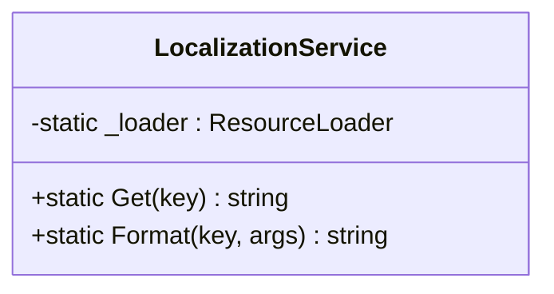
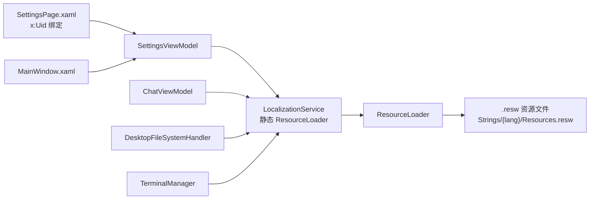

# 国际化服务

<cite>
**本文引用的文件**   
- [LocalizationService.cs](file://Agentic.Desktop/Services/LocalizationService.cs)
- [Resources.resw（en）](file://Agentic.Desktop/Strings/en/Resources.resw)
- [Resources.resw（zh-CN）](file://Agentic.Desktop/Strings/zh-CN/Resources.resw)
- [Resources.resw（ja）](file://Agentic.Desktop/Strings/ja/Resources.resw)
- [Resources.resw（zh-TW）](file://Agentic.Desktop/Strings/zh-TW/Resources.resw)
- [SettingsViewModel.cs](file://Agentic.Desktop/ViewModels/SettingsViewModel.cs)
- [ChatViewModel.cs](file://Agentic.Desktop/ViewModels/ChatViewModel.cs)
- [FileSystemHandler.cs](file://Agentic.Desktop/Services/FileSystemHandler.cs)
- [TerminalManager.cs](file://Agentic.Desktop/Services/TerminalManager.cs)
- [SettingsPage.xaml](file://Agentic.Desktop/SettingsPage.xaml)
- [MainWindow.xaml](file://Agentic.Desktop/MainWindow.xaml)
- [App.xaml.cs](file://Agentic.Desktop/App.xaml.cs)
- [Agentic.Desktop.csproj](file://Agentic.Desktop/Agentic.Desktop.csproj)
</cite>

## 更新摘要
**变更内容**   
- 更新了 LocalizationService 的实现细节，现在使用静态 ResourceLoader 实例
- 完善了 .resw 资源文件的组织结构说明，包含完整的四语言支持
- 增强了 Format 方法的参数替换功能说明
- 优化了架构总览图，更清晰地展示资源查找流程
- 新增了运行时语言切换和用户偏好持久化的详细指导

## 目录
1. [简介](#简介)
2. [项目结构](#项目结构)
3. [核心组件](#核心组件)
4. [架构总览](#架构总览)
5. [详细组件分析](#详细组件分析)
6. [依赖关系分析](#依赖关系分析)
7. [性能考量](#性能考量)
8. [故障排查指南](#故障排查指南)
9. [结论](#结论)
10. [附录：新增语言与最佳实践](#附录新增语言与最佳实践)

## 简介
本文件面向 Agentic.Desktop 的国际化能力，围绕 LocalizationService 的多语言资源管理机制进行系统化说明。内容涵盖 .resw 文件格式、资源查找算法、动态语言切换实现思路、Format 方法的字符串格式化能力（参数替换）、资源文件组织结构与按语言代码分类策略、运行时语言检测与回退机制、用户偏好持久化方案，以及完整的"新增语言"操作流程和最佳实践。

## 项目结构
本项目采用 WinUI 桌面应用结构，多语言资源以 .resw 文件形式存放于 Strings 目录下，按语言代码分文件夹组织；C# 层通过 Windows.ApplicationModel.Resources.ResourceLoader 读取资源。XAML 侧使用 x:Uid 绑定资源键，C# 侧通过 LocalizationService 提供统一的 Get/Format 接口。



**图表来源** 
- [LocalizationService.cs](file://Agentic.Desktop/Services/LocalizationService.cs)
- [Resources.resw（en）](file://Agentic.Desktop/Strings/en/Resources.resw)
- [Resources.resw（zh-CN）](file://Agentic.Desktop/Strings/zh-CN/Resources.resw)
- [Resources.resw（ja）](file://Agentic.Desktop/Strings/ja/Resources.resw)
- [Resources.resw（zh-TW）](file://Agentic.Desktop/Strings/zh-TW/Resources.resw)
- [SettingsViewModel.cs](file://Agentic.Desktop/ViewModels/SettingsViewModel.cs)
- [ChatViewModel.cs](file://Agentic.Desktop/ViewModels/ChatViewModel.cs)
- [FileSystemHandler.cs](file://Agentic.Desktop/Services/FileSystemHandler.cs)
- [TerminalManager.cs](file://Agentic.Desktop/Services/TerminalManager.cs)
- [SettingsPage.xaml](file://Agentic.Desktop/SettingsPage.xaml)
- [MainWindow.xaml](file://Agentic.Desktop/MainWindow.xaml)

**章节来源**
- [LocalizationService.cs](file://Agentic.Desktop/Services/LocalizationService.cs)
- [Agentic.Desktop.csproj](file://Agentic.Desktop/Agentic.Desktop.csproj)

## 核心组件
- **LocalizationService**：封装 ResourceLoader，对外暴露 Get(key) 与 Format(key, params object[] args) 两个方法，分别用于获取本地化字符串与带参数的格式化字符串。采用静态单例模式，确保 ResourceLoader 实例的唯一性。
- **资源文件**：Strings 下按语言代码划分文件夹，每个语言一个 Resources.resw，包含所有 UI 与 C# 逻辑所需的文本键值对。目前支持英语、日语、简体中文和繁体中文四种语言。
- **XAML 绑定**：通过 x:Uid 将控件属性与资源键关联，由系统自动解析当前文化下的资源。
- **ViewModel 集成**：在 SettingsViewModel、ChatViewModel、DesktopFileSystemHandler、TerminalManager 中通过 LocalizationService 获取或格式化文本。

**章节来源**
- [LocalizationService.cs](file://Agentic.Desktop/Services/LocalizationService.cs)
- [SettingsViewModel.cs](file://Agentic.Desktop/ViewModels/SettingsViewModel.cs)
- [ChatViewModel.cs](file://Agentic.Desktop/ViewModels/ChatViewModel.cs)
- [FileSystemHandler.cs](file://Agentic.Desktop/Services/FileSystemHandler.cs)
- [TerminalManager.cs](file://Agentic.Desktop/Services/TerminalManager.cs)
- [SettingsPage.xaml](file://Agentic.Desktop/SettingsPage.xaml)

## 架构总览
下图展示了从 XAML 到资源文件的完整调用链，以及 C# 侧通过 LocalizationService 访问资源的流程。



**图表来源** 
- [LocalizationService.cs](file://Agentic.Desktop/Services/LocalizationService.cs)
- [SettingsPage.xaml](file://Agentic.Desktop/SettingsPage.xaml)

## 详细组件分析

### LocalizationService：多语言资源访问器
**更新** 新的实现采用了更简洁的设计，使用静态 ResourceLoader 实例来统一管理资源访问。

- **职责**：封装 ResourceLoader，统一提供 Get/Format 两种访问方式。
- **关键行为**：
  - `Get(key)`：根据 key 获取当前文化下的本地化字符串。
  - `Format(key, args)`：先获取字符串模板，再使用 string.Format 进行参数替换。
- **设计特点**：
  - 静态类设计，避免重复创建 ResourceLoader 实例
  - 线程安全的单例模式
  - 简洁的 API 设计，易于使用
- **复杂度**：O(1) 查找（ResourceLoader 内部缓存），string.Format 为 O(n)。
- **错误处理**：若 key 不存在，底层会抛出异常；建议在调用处捕获并给出默认文案。



**图表来源** 
- [LocalizationService.cs](file://Agentic.Desktop/Services/LocalizationService.cs)

**章节来源**
- [LocalizationService.cs](file://Agentic.Desktop/Services/LocalizationService.cs)

### 资源文件组织结构与命名约定
**更新** 资源文件现在包含了完整的四语言支持，涵盖了应用程序的所有文本需求。

- **目录结构**：`Strings/{语言代码}/Resources.resw`
- **支持的语言**：
  - `en` - 英语（基础语言）
  - `zh-CN` - 简体中文
  - `zh-TW` - 繁体中文  
  - `ja` - 日语
- **文件内容**：XML 格式，包含 resheader 元数据与 data 节点，data.name 为资源键，data.value 为本地化文本。
- **资源分类**：
  - 全局导航：NavChat.Content、NavSettings.Content、StatusText.Text
  - C# 代码字符串：StatusDisconnected、StatusConnecting、ErrorPrefix 等
  - 页面特定资源：SettingsAgentConfig、PermissionDialog.Title 等
- **命名建议**：
  - 使用"模块.控件名.属性"风格，如 NavChat.Content、SettingsAgentPathLabel.Text
  - C# 代码中的硬编码文本应抽取为独立键，便于集中管理
- **一致性**：各语言文件需保持相同的键集合，缺失键会导致运行时异常

**章节来源**
- [Resources.resw（en）](file://Agentic.Desktop/Strings/en/Resources.resw)
- [Resources.resw（zh-CN）](file://Agentic.Desktop/Strings/zh-CN/Resources.resw)
- [Resources.resw（ja）](file://Agentic.Desktop/Strings/ja/Resources.resw)
- [Resources.resw（zh-TW）](file://Agentic.Desktop/Strings/zh-TW/Resources.resw)

### Format 方法与字符串格式化
**更新** Format 方法现在广泛应用于各种场景，包括错误信息、工具调用提示和进程退出消息等。

- **支持参数替换**：Format(key, args) 使用 string.Format 对模板中的占位符进行替换。
- **典型用法**：
  - 错误信息拼接：`LocalizationService.Format("ErrorPrefix", ex.Message)`
  - 工具调用提示：`LocalizationService.Format("ToolCallPrefix", toolCall.Title)`
  - 进程退出消息：`LocalizationService.Format("StatusAgentDisconnected", exitCode)`
  - 文件访问拒绝：`LocalizationService.Format("AccessDeniedMessage", path)`
- **复数形式**：当前实现未内置复数规则，如需复数，可在资源文件中定义多条键（如 KeyOne、KeyMany），或在 Format 前做条件判断选择不同键。

**章节来源**
- [ChatViewModel.cs](file://Agentic.Desktop/ViewModels/ChatViewModel.cs)
- [SettingsViewModel.cs](file://Agentic.Desktop/ViewModels/SettingsViewModel.cs)
- [FileSystemHandler.cs](file://Agentic.Desktop/Services/FileSystemHandler.cs)

### XAML 侧的 x:Uid 绑定
**更新** XAML 中的 x:Uid 绑定覆盖了所有主要的 UI 元素，实现了完整的界面本地化。

- **使用方法**：在 XAML 中使用 x:Uid 将控件属性与资源键关联，例如 TextBlock 的 Text、TextBox 的 PlaceholderText 等。
- **覆盖范围**：
  - 导航按钮：NavChat.Content、NavSettings.Content
  - 设置页面：SettingsAgentConfig、SettingsAgentPathLabel、SettingsConnectButton 等
  - 聊天界面：TypingIndicator.Text、InputTextBox.PlaceholderText、SendButton.ToolTip
  - 权限对话框：PermissionDialog.Title、PermissionDialog.PrimaryButtonText
- **优点**：无需在 C# 中手动设置文本，构建时/运行时无缝解析当前文化资源。
- **适用场景**：静态 UI 文案、按钮文本、提示信息、占位符文本等。

**章节来源**
- [SettingsPage.xaml](file://Agentic.Desktop/SettingsPage.xaml)
- [MainWindow.xaml](file://Agentic.Desktop/MainWindow.xaml)

### ViewModel 中的国际化使用
**更新** 各个 ViewModel 和服务类都充分利用了 LocalizationService 提供的国际化功能。

- **SettingsViewModel**：初始化连接状态、连接进度、成功/失败消息均通过 LocalizationService 获取或格式化。
  - 连接状态：`LocalizationService.Get("StatusNotConnected")`
  - 连接进度：`LocalizationService.Get("StatusConnectingProgress")`
  - 连接确认：`LocalizationService.Get("StatusConnectedConfirm")`
  - 连接失败：`LocalizationService.Format("StatusConnectionFailed", ex.Message)`
- **ChatViewModel**：错误前缀、工具调用前缀、模拟响应文本均通过 LocalizationService 获取或格式化。
  - 新聊天标题：`LocalizationService.Get("NewChatTitle")`
  - 错误前缀：`LocalizationService.Format("ErrorPrefix", ex.Message)`
  - 工具调用：`LocalizationService.Format("ToolCallPrefix", toolCall.Title)`
  - 模拟响应：`LocalizationService.Get("MockResponse1")` 等
- **DesktopFileSystemHandler**：路径校验失败时抛出 UnauthorizedAccessException，并使用 LocalizationService.Format 生成国际化错误消息。
  - 访问拒绝：`LocalizationService.Format("AccessDeniedMessage", path)`
- **TerminalManager**：stderr 输出前缀使用 LocalizationService.Get 获取本地化文本。
  - 标准错误前缀：`LocalizationService.Get("StderrPrefix")`

**章节来源**
- [SettingsViewModel.cs](file://Agentic.Desktop/ViewModels/SettingsViewModel.cs)
- [ChatViewModel.cs](file://Agentic.Desktop/ViewModels/ChatViewModel.cs)
- [FileSystemHandler.cs](file://Agentic.Desktop/Services/FileSystemHandler.cs)
- [TerminalManager.cs](file://Agentic.Desktop/Services/TerminalManager.cs)

## 依赖关系分析
**更新** 依赖关系更加清晰，LocalizationService 作为单一入口点简化了资源访问。

- **LocalizationService** 依赖 Windows.ApplicationModel.Resources.ResourceLoader，后者负责加载 .resw 资源。
- **XAML** 通过 x:Uid 与系统资源解析器协作，按当前 Culture 选择资源。
- **ViewModel** 与服务类直接依赖 LocalizationService，形成松耦合的访问点。



**图表来源** 
- [LocalizationService.cs](file://Agentic.Desktop/Services/LocalizationService.cs)
- [SettingsViewModel.cs](file://Agentic.Desktop/ViewModels/SettingsViewModel.cs)
- [ChatViewModel.cs](file://Agentic.Desktop/ViewModels/ChatViewModel.cs)
- [FileSystemHandler.cs](file://Agentic.Desktop/Services/FileSystemHandler.cs)
- [TerminalManager.cs](file://Agentic.Desktop/Services/TerminalManager.cs)
- [SettingsPage.xaml](file://Agentic.Desktop/SettingsPage.xaml)
- [MainWindow.xaml](file://Agentic.Desktop/MainWindow.xaml)

**章节来源**
- [LocalizationService.cs](file://Agentic.Desktop/Services/LocalizationService.cs)
- [Agentic.Desktop.csproj](file://Agentic.Desktop/Agentic.Desktop.csproj)

## 性能考量
**更新** 静态 ResourceLoader 实例的使用进一步优化了性能。

- **ResourceLoader 缓存**：内部缓存已优化，Get 操作开销极低。静态实例避免了重复创建开销。
- **string.Format 优化**：在高频调用时应避免重复创建大对象，可考虑复用模板或减少参数数量。
- **XAML 缓存**：x:Uid 在首次解析后由系统缓存，后续切换文化时的重绘成本取决于 UI 层级深度。
- **内存管理**：静态 ResourceLoader 实例在整个应用生命周期内保持，但占用内存很小。
- **建议**：
  - 避免在热路径中频繁切换文化。
  - 批量更新 UI 时合并多次文本赋值，减少重排。
  - 利用静态 ResourceLoader 的单例特性，避免重复初始化。

## 故障排查指南
**更新** 针对新的实现增加了相应的故障排查指导。

- **常见错误**：
  - **资源键缺失**：ResourceLoader 抛出异常。检查各语言 .resw 是否包含相同键集合。
  - **参数数量不匹配**：Format 的参数与模板占位符不一致导致异常。核对键模板与调用方参数。
  - **文化选择不正确**：确认 DefaultLanguage 与系统文化设置，必要时在 App 启动时设置 CurrentUICulture。
  - **ResourceLoader 初始化失败**：检查 .resw 文件格式是否正确，确保 XML 语法有效。
- **定位方法**：
  - 在调用 LocalizationService 的地方添加 try/catch，记录异常堆栈与 key。
  - 使用调试器观察 ResourceLoader 的当前 Culture。
  - 对比各语言 .resw 的键集合差异。
  - 检查 .resw 文件的 XML 格式是否正确。
- **预防措施**：
  - 建立资源键的单元测试，确保所有键都存在。
  - 使用代码分析工具检查未使用的资源键。
  - 在 CI/CD 流程中加入资源完整性检查。

**章节来源**
- [LocalizationService.cs](file://Agentic.Desktop/Services/LocalizationService.cs)
- [SettingsViewModel.cs](file://Agentic.Desktop/ViewModels/SettingsViewModel.cs)
- [ChatViewModel.cs](file://Agentic.Desktop/ViewModels/ChatViewModel.cs)
- [FileSystemHandler.cs](file://Agentic.Desktop/Services/FileSystemHandler.cs)

## 结论
本项目通过静态 LocalizationService 与 .resw 资源文件实现了简洁高效的国际化方案。XAML 侧使用 x:Uid 简化静态文案绑定，C# 侧通过 Get/Format 满足动态文本需求。整体架构清晰、扩展性强，适合持续增加新语言与维护多语言一致性。新的实现通过静态 ResourceLoader 实例进一步提升了性能和可维护性。

## 附录：新增语言与最佳实践

### 新增语言完整流程
**更新** 基于现有的四语言支持，提供了标准化的新增语言流程。

- **步骤一：创建资源文件夹与文件**
  - 在 Strings 目录下新建语言代码文件夹（如 ko）。
  - 复制现有 Resources.resw 到该文件夹，命名为 Resources.resw。
- **步骤二：翻译资源键值**
  - 打开 Resources.resw，逐条翻译 data.value，确保 data.name 不变。
  - 保持与源语言一致的键集合，避免缺失。
  - 特别注意特殊字符的转义，如换行符 `\n` 需要保持原样。
- **步骤三：验证与测试**
  - 修改系统 UI 语言或设置 CurrentUICulture，运行应用验证显示。
  - 检查 XAML 的 x:Uid 绑定与 C# 的 LocalizationService 调用是否正确。
  - 验证所有页面的文本显示是否正常。
- **步骤四：提交与发布**
  - 将新语言资源纳入版本控制，确保构建脚本能打包 .resw。
  - 更新相关文档，说明新增的语言支持。

**章节来源**
- [Resources.resw（en）](file://Agentic.Desktop/Strings/en/Resources.resw)
- [Agentic.Desktop.csproj](file://Agentic.Desktop/Agentic.Desktop.csproj)

### 运行时语言检测与切换
**更新** 提供了详细的运行时语言检测和切换指导。

- **检测**：可通过 CultureInfo.CurrentUICulture 获取当前 UI 文化。
- **切换**：在应用启动或设置页中设置 Thread.CurrentThread.CurrentUICulture，随后刷新 UI（重新加载页面或触发重绑定）。
- **注意**：切换文化后，XAML 的 x:Uid 会在下次解析时生效；C# 侧的 LocalizationService 会立即反映新文化。
- **实现建议**：
  ```csharp
  // 在设置页面中切换语言
  CultureInfo newCulture = new CultureInfo(languageCode);
  Thread.CurrentThread.CurrentUICulture = newCulture;
  // 重新加载当前页面以应用新语言
  Frame.Navigate(typeof(CurrentPage));
  ```

**章节来源**
- [App.xaml.cs](file://Agentic.Desktop/App.xaml.cs)
- [SettingsPage.xaml](file://Agentic.Desktop/SettingsPage.xaml)

### 用户偏好设置持久化
**更新** 提供了完整的用户偏好设置持久化方案。

- **推荐方案**：使用 Microsoft.Extensions.Configuration 或 ApplicationData 存储用户选择的语言代码。
- **启动流程**：
  - 读取保存的语言代码。
  - 设置 CurrentUICulture。
  - 初始化 UI，确保资源按用户偏好加载。
- **变更流程**：
  - 用户在设置页更改语言。
  - 写入配置并重启相关页面或应用。
- **存储位置**：建议使用 Windows.Storage.ApplicationData.Current.LocalSettings 存储用户偏好。

### 回退机制
**更新** 详细说明了资源查找的回退机制。

- **资源查找顺序**：精确文化 -> 区域文化 -> 默认语言（DefaultLanguage）-> 英文（fallback）。
- **建议**：
  - 始终提供 en 作为兜底语言。
  - 在构建阶段校验缺失键，避免运行时异常。
  - 监控缺失键的使用情况，及时补充翻译。

**章节来源**
- [Agentic.Desktop.csproj](file://Agentic.Desktop/Agentic.Desktop.csproj)

### 最佳实践
**更新** 基于实际使用情况总结了最佳实践。

- **命名规范**：使用"模块.控件.属性"风格，保证可读性与可维护性。
- **模板设计**：将可变部分抽离为占位符，避免拼接复杂逻辑。
- **复数与性别**：如需复数或性别变化，定义多个键并在调用处选择合适键。
- **测试覆盖**：为关键文案编写单元测试，验证格式化与回退逻辑。
- **文档同步**：新增功能时同步更新资源文件与文档。
- **性能优化**：
  - 使用静态 ResourceLoader 实例，避免重复创建。
  - 批量更新 UI 文本，减少重绘次数。
  - 合理使用 Format 方法，避免过度格式化。
- **错误处理**：
  - 在关键位置添加 try/catch 保护。
  - 提供有意义的错误消息。
  - 记录国际化相关的异常信息。