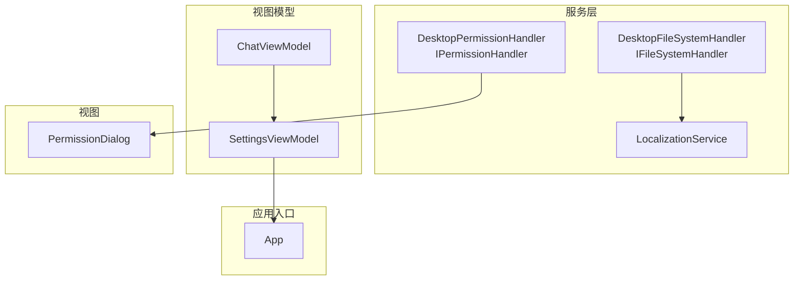
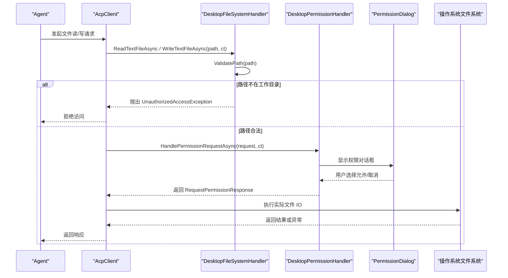
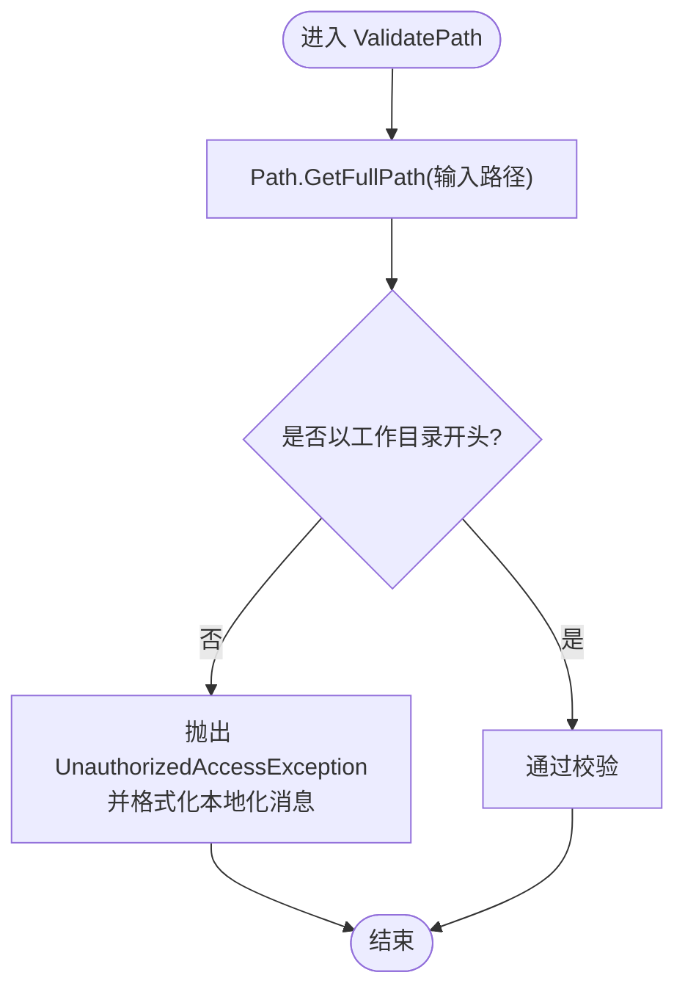
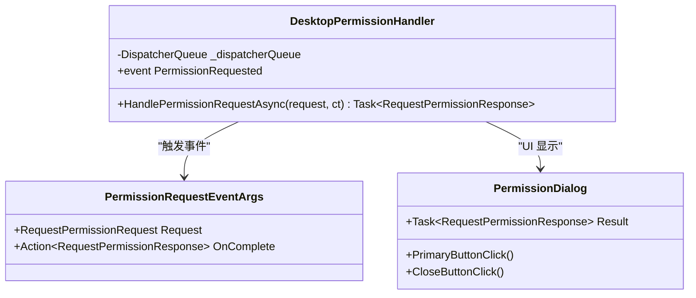
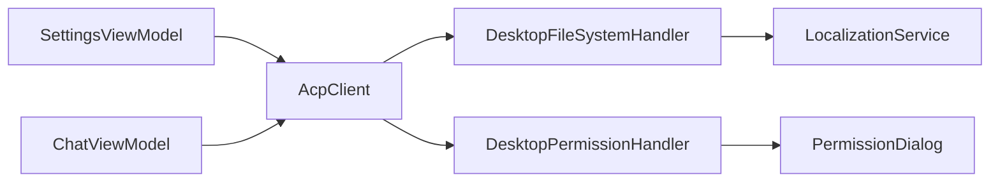
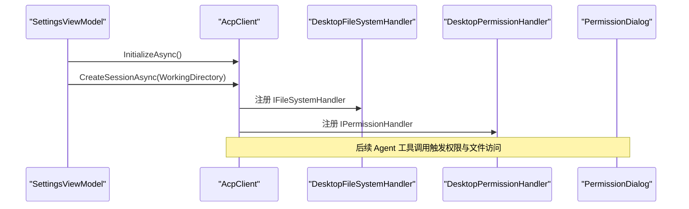

# 文件系统处理器

<cite>
**本文引用的文件**   
- [FileSystemHandler.cs](file://Agentic.Desktop/Services/FileSystemHandler.cs)
- [PermissionHandler.cs](file://Agentic.Desktop/Services/PermissionHandler.cs)
- [LocalizationService.cs](file://Agentic.Desktop/Services/LocalizationService.cs)
- [SettingsViewModel.cs](file://Agentic.Desktop/ViewModels/SettingsViewModel.cs)
- [ChatViewModel.cs](file://Agentic.Desktop/ViewModels/ChatViewModel.cs)
- [App.xaml.cs](file://Agentic.Desktop/App.xaml.cs)
- [PermissionDialog.xaml.cs](file://Agentic.Desktop/Views/PermissionDialog.xaml.cs)
- [README.md](file://README.md)
</cite>

## 目录
1. [简介](#简介)
2. [项目结构](#项目结构)
3. [核心组件](#核心组件)
4. [架构总览](#架构总览)
5. [详细组件分析](#详细组件分析)
6. [依赖关系分析](#依赖关系分析)
7. [性能考量](#性能考量)
8. [故障排查指南](#故障排查指南)
9. [结论](#结论)
10. [附录：ACP 集成示例与最佳实践](#附录acp-集成示例与最佳实践)

## 简介
本文件围绕 ACP（Agent Communication Protocol）桌面客户端中的“文件系统处理器”进行系统化文档说明，重点解析 DesktopFileSystemHandler 的实现原理、路径验证机制、安全访问控制以及异步文件读写封装。同时，结合权限处理与 UI 交互流程，给出在 ACP 协议中集成文件系统权限控制的完整示例，并提供性能优化建议与最佳实践。

## 项目结构
本项目采用 MVVM 架构，服务层提供与 Agent 通信所需的 I/O 能力与权限调度。与文件系统相关的核心代码位于 Services 目录，UI 侧通过 PermissionDialog 展示权限确认对话框，ViewModel 负责连接管理与事件绑定。

图表来源
- [FileSystemHandler.cs:1-41](file://Agentic.Desktop/Services/FileSystemHandler.cs#L1-L41)
- [PermissionHandler.cs:1-52](file://Agentic.Desktop/Services/PermissionHandler.cs#L1-L52)
- [LocalizationService.cs:1-23](file://Agentic.Desktop/Services/LocalizationService.cs#L1-L23)
- [SettingsViewModel.cs:80-118](file://Agentic.Desktop/ViewModels/SettingsViewModel.cs#L80-L118)
- [ChatViewModel.cs:1-200](file://Agentic.Desktop/ViewModels/ChatViewModel.cs#L1-L200)
- [App.xaml.cs:1-84](file://Agentic.Desktop/App.xaml.cs#L1-L84)
- [PermissionDialog.xaml.cs:1-64](file://Agentic.Desktop/Views/PermissionDialog.xaml.cs#L1-L64)

章节来源
- [README.md:1-92](file://README.md#L1-L92)

## 核心组件
- DesktopFileSystemHandler：实现 IFileSystemHandler，提供受限的文件系统访问能力，确保 Agent 只能在工作目录内操作文件。
- DesktopPermissionHandler：实现 IPermissionHandler，将权限请求派发至 UI 线程并弹出对话框，等待用户决策后返回结果。
- LocalizationService：提供本地化字符串获取与格式化，用于错误提示与用户可见文本。
- SettingsViewModel：负责 AcpClient 的创建与初始化，设置会话工作目录，并在连接成功后通知 UI。
- ChatViewModel：管理聊天会话与消息流，间接触发工具调用（如文件读写），并通过 AcpClient 与 Agent 通信。
- App：全局应用上下文，持有 DispatcherQueue 与当前 AcpClient 引用。
- PermissionDialog：UI 弹窗，展示权限请求详情并收集用户选择。

章节来源
- [FileSystemHandler.cs:1-41](file://Agentic.Desktop/Services/FileSystemHandler.cs#L1-L41)
- [PermissionHandler.cs:1-52](file://Agentic.Desktop/Services/PermissionHandler.cs#L1-L52)
- [LocalizationService.cs:1-23](file://Agentic.Desktop/Services/LocalizationService.cs#L1-L23)
- [SettingsViewModel.cs:80-118](file://Agentic.Desktop/ViewModels/SettingsViewModel.cs#L80-L118)
- [ChatViewModel.cs:1-200](file://Agentic.Desktop/ViewModels/ChatViewModel.cs#L1-L200)
- [App.xaml.cs:1-84](file://Agentic.Desktop/App.xaml.cs#L1-L84)
- [PermissionDialog.xaml.cs:1-64](file://Agentic.Desktop/Views/PermissionDialog.xaml.cs#L1-L64)

## 架构总览
下图展示了从 AcpClient 发起文件读取/写入到 UI 权限确认再到实际文件操作的完整调用链。

图表来源
- [FileSystemHandler.cs:17-40](file://Agentic.Desktop/Services/FileSystemHandler.cs#L17-L40)
- [PermissionHandler.cs:26-44](file://Agentic.Desktop/Services/PermissionHandler.cs#L26-L44)
- [PermissionDialog.xaml.cs:26-49](file://Agentic.Desktop/Views/PermissionDialog.xaml.cs#L26-L49)

## 详细组件分析

### DesktopFileSystemHandler：路径验证与安全访问
- 构造时规范化工作目录为绝对路径，避免相对路径带来的歧义。
- 所有文件操作前调用 ValidatePath，使用 Path.GetFullPath 解析目标路径，并以不区分大小写的方式检查是否以工作目录开头，从而防止路径遍历攻击（如 ../ 逃逸）。
- 读操作：ReadTextFileAsync 支持 CancellationToken，直接委托给 .NET 异步 API。
- 写操作：WriteTextFileAsync 先确保目标目录存在，再异步写入内容；同样支持 CancellationToken。
- 非法访问抛出 UnauthorizedAccessException，并使用 LocalizationService 格式化提示信息，便于多语言显示。

图表来源
- [FileSystemHandler.cs:32-40](file://Agentic.Desktop/Services/FileSystemHandler.cs#L32-L40)

章节来源
- [FileSystemHandler.cs:12-40](file://Agentic.Desktop/Services/FileSystemHandler.cs#L12-L40)
- [LocalizationService.cs:15-22](file://Agentic.Desktop/Services/LocalizationService.cs#L15-L22)

### DesktopPermissionHandler：权限请求与 UI 调度
- 通过事件 PermissionRequested 通知 ViewModel 显示权限对话框。
- 使用 DispatcherQueue.TryEnqueue 将 UI 更新调度到主线程，避免跨线程异常。
- 使用 TaskCompletionSource 包装用户选择结果，HandlePermissionRequestAsync 等待用户完成操作后返回 RequestPermissionResponse。
- 支持 CancellationToken，但当前实现未显式监听取消信号，可在上层统一处理取消语义。

图表来源
- [PermissionHandler.cs:11-44](file://Agentic.Desktop/Services/PermissionHandler.cs#L11-L44)
- [PermissionDialog.xaml.cs:15-49](file://Agentic.Desktop/Views/PermissionDialog.xaml.cs#L15-L49)

章节来源
- [PermissionHandler.cs:21-44](file://Agentic.Desktop/Services/PermissionHandler.cs#L21-L44)
- [PermissionDialog.xaml.cs:26-49](file://Agentic.Desktop/Views/PermissionDialog.xaml.cs#L26-L49)

### 与 ACP 协议的集成点
- SettingsViewModel 在连接过程中创建 AcpClient，并设置会话的工作目录（WorkingDirectory）。该工作目录将作为 DesktopFileSystemHandler 的安全边界。
- ChatViewModel 通过 AcpClient 发送 Prompt，Agent 可能通过工具调用触发文件读写。此时 AcpClient 会调用 IFileSystemHandler 和 IPermissionHandler 的具体实现。
- App 提供全局 DispatcherQueue 与当前 AcpClient 引用，供 UI 线程调度与状态同步。

章节来源
- [SettingsViewModel.cs:80-118](file://Agentic.Desktop/ViewModels/SettingsViewModel.cs#L80-L118)
- [ChatViewModel.cs:125-135](file://Agentic.Desktop/ViewModels/ChatViewModel.cs#L125-L135)
- [App.xaml.cs:64-76](file://Agentic.Desktop/App.xaml.cs#L64-L76)

## 依赖关系分析
- DesktopFileSystemHandler 依赖 .NET 文件系统 API 与 LocalizationService。
- DesktopPermissionHandler 依赖 WinUI 的 DispatcherQueue 与 UI 组件（PermissionDialog）。
- SettingsViewModel 依赖 AcpClient、StdioAgentTransport 与 TerminalManager，负责连接与会话生命周期。
- ChatViewModel 依赖 AcpClient 与 UI 调度队列，负责消息流与工具调用展示。

图表来源
- [FileSystemHandler.cs:1-41](file://Agentic.Desktop/Services/FileSystemHandler.cs#L1-L41)
- [PermissionHandler.cs:1-52](file://Agentic.Desktop/Services/PermissionHandler.cs#L1-L52)
- [SettingsViewModel.cs:80-118](file://Agentic.Desktop/ViewModels/SettingsViewModel.cs#L80-L118)
- [ChatViewModel.cs:1-200](file://Agentic.Desktop/ViewModels/ChatViewModel.cs#L1-L200)

章节来源
- [FileSystemHandler.cs:1-41](file://Agentic.Desktop/Services/FileSystemHandler.cs#L1-L41)
- [PermissionHandler.cs:1-52](file://Agentic.Desktop/Services/PermissionHandler.cs#L1-L52)
- [SettingsViewModel.cs:80-118](file://Agentic.Desktop/ViewModels/SettingsViewModel.cs#L80-L118)
- [ChatViewModel.cs:1-200](file://Agentic.Desktop/ViewModels/ChatViewModel.cs#L1-L200)

## 性能考量
- 异步 IO：ReadTextFileAsync 与 WriteTextFileAsync 均使用 .NET 异步 API，避免阻塞 UI 线程，提升响应性。
- 目录预创建：WriteTextFileAsync 在写入前确保目录存在，减少重复判断与异常开销。
- 批量刷新：ChatViewModel 对 Agent 消息流进行批处理合并，降低 UI 更新频率。
- 取消令牌：文件读写方法接受 CancellationToken，便于在长时间操作中及时释放资源。
- 建议：
  - 对于大文件读写，考虑分块读取与流式处理，避免一次性加载到内存。
  - 在高频写入场景下，可引入缓冲与合并策略，减少磁盘 I/O 次数。
  - 对路径校验逻辑保持最小计算量，避免重复解析相同路径。

[本节为通用性能指导，不直接分析具体文件]

## 故障排查指南
- 路径越权访问：
  - 现象：抛出 UnauthorizedAccessException。
  - 原因：ValidatePath 检测到目标路径不在工作目录范围内。
  - 处理：检查工作目录配置是否正确，确保传入路径为相对或绝对路径且位于工作目录下。
- 权限对话框未出现：
  - 现象：权限请求无 UI 反馈。
  - 原因：DispatcherQueue 未正确调度或事件订阅缺失。
  - 处理：确认 UI 线程可用，PermissionRequested 事件已订阅，PermissionDialog 能正常显示。
- 取消操作无效：
  - 现象：CancellationToken 未生效。
  - 原因：当前实现未显式监听取消信号。
  - 处理：在上层捕获 OperationCanceledException 并进行清理。

章节来源
- [FileSystemHandler.cs:32-40](file://Agentic.Desktop/Services/FileSystemHandler.cs#L32-L40)
- [PermissionHandler.cs:26-44](file://Agentic.Desktop/Services/PermissionHandler.cs#L26-L44)
- [ChatViewModel.cs:137-144](file://Agentic.Desktop/ViewModels/ChatViewModel.cs#L137-L144)

## 结论
DesktopFileSystemHandler 通过严格的路径验证与异步 IO 封装，为 ACP Agent 提供了安全的文件系统访问能力。配合 DesktopPermissionHandler 与 PermissionDialog，实现了用户可控的权限审批流程。整体设计清晰、职责明确，具备良好的可扩展性与安全性。建议在后续迭代中增强取消令牌支持与大规模文件处理的性能优化。

[本节为总结性内容，不直接分析具体文件]

## 附录：ACP 集成示例与最佳实践

### 在 ACP 中启用文件系统权限控制
- 步骤概览：
  - 在 SettingsViewModel 中创建 AcpClient 并设置 WorkingDirectory。
  - 将 DesktopFileSystemHandler 与 DesktopPermissionHandler 注入到 AcpClient（由库内部根据接口实现）。
  - 当 Agent 发起文件读写工具调用时，AcpClient 会调用 IFileSystemHandler 与 IPermissionHandler。
  - UI 层通过 PermissionDialog 展示权限请求，用户确认后继续执行。

图表来源
- [SettingsViewModel.cs:80-118](file://Agentic.Desktop/ViewModels/SettingsViewModel.cs#L80-L118)
- [FileSystemHandler.cs:1-41](file://Agentic.Desktop/Services/FileSystemHandler.cs#L1-L41)
- [PermissionHandler.cs:1-52](file://Agentic.Desktop/Services/PermissionHandler.cs#L1-L52)
- [PermissionDialog.xaml.cs:1-64](file://Agentic.Desktop/Views/PermissionDialog.xaml.cs#L1-L64)

### 最佳实践
- 路径安全：
  - 始终使用 Path.GetFullPath 规范化路径，再进行白名单校验。
  - 禁止直接使用用户输入拼接路径，必要时做额外清洗。
- 权限最小化：
  - 仅授予必要的文件访问范围（工作目录及其子目录）。
  - 对敏感操作（删除、覆盖）增加二次确认。
- 异步与取消：
  - 所有 IO 操作使用异步 API，并支持 CancellationToken。
  - 在 UI 层统一处理取消与超时，避免悬挂任务。
- 错误处理：
  - 对 UnauthorizedAccessException 进行友好提示。
  - 记录关键日志以便问题追踪。
- 性能优化：
  - 大文件分块读写，避免内存峰值过高。
  - 合并频繁写入，减少磁盘 I/O 次数。

[本节为通用指导，不直接分析具体文件]