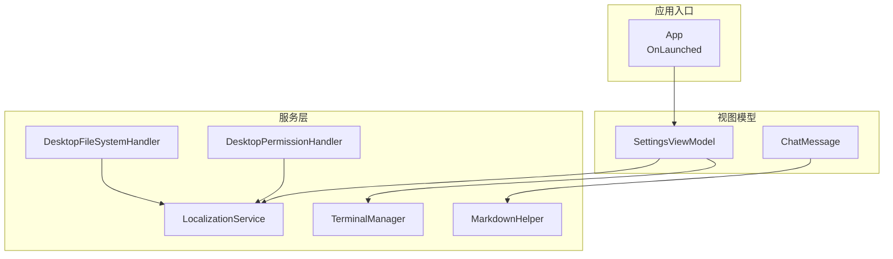
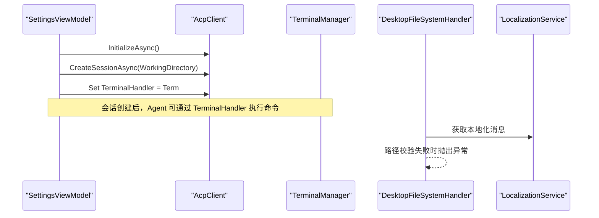
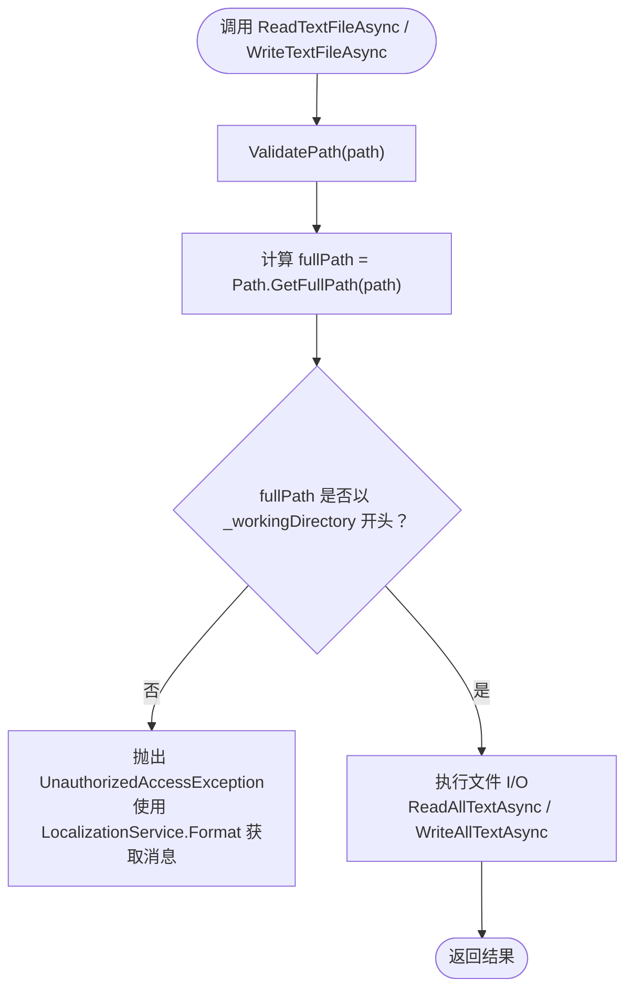
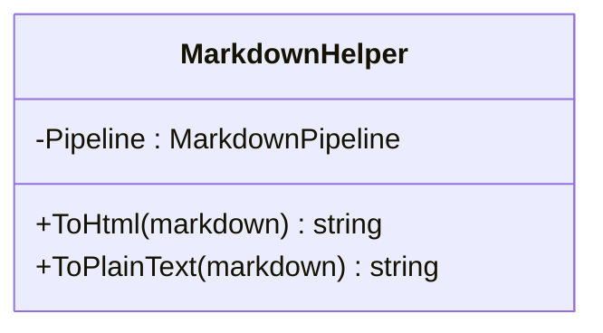
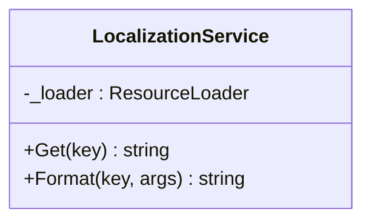
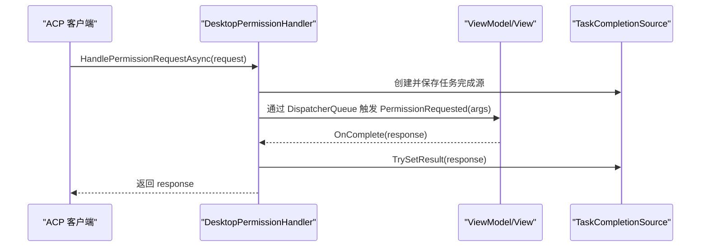
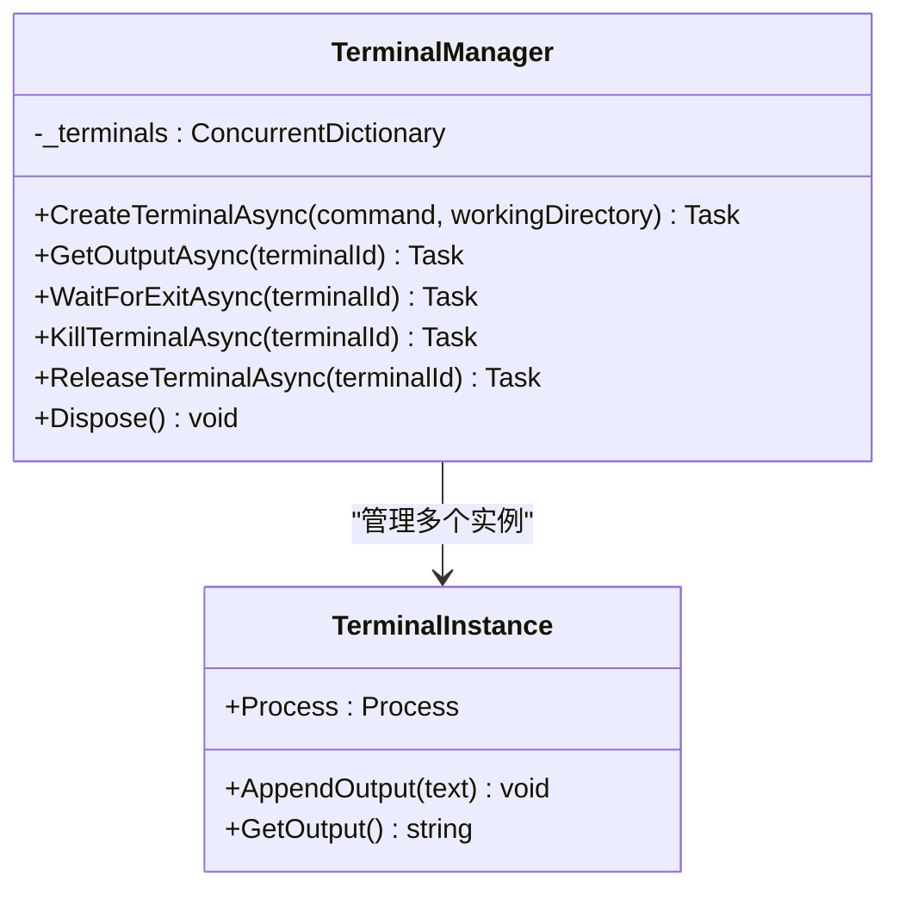
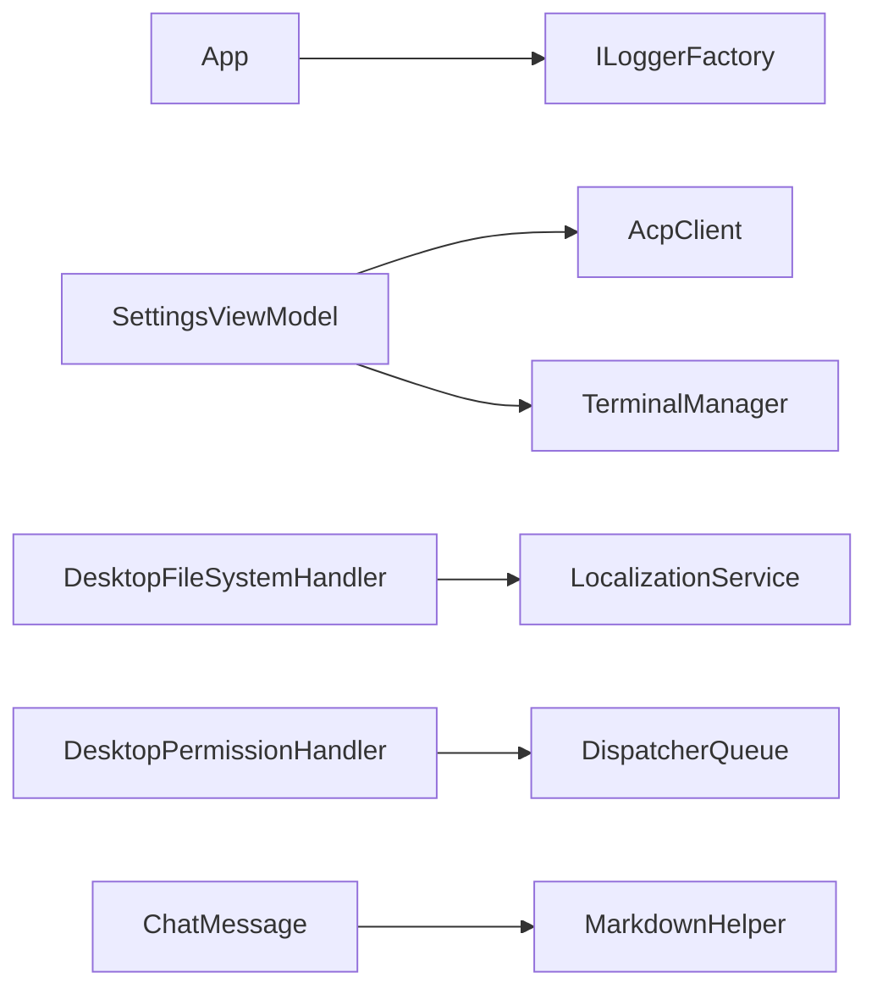

# 服务层设计

<cite>
**本文引用的文件**   
- [FileSystemHandler.cs](file://Agentic.Desktop/Services/FileSystemHandler.cs)
- [MarkdownHelper.cs](file://Agentic.Desktop/Services/MarkdownHelper.cs)
- [LocalizationService.cs](file://Agentic.Desktop/Services/LocalizationService.cs)
- [PermissionHandler.cs](file://Agentic.Desktop/Services/PermissionHandler.cs)
- [TerminalManager.cs](file://Agentic.Desktop/Services/TerminalManager.cs)
- [App.xaml.cs](file://Agentic.Desktop/App.xaml.cs)
- [SettingsViewModel.cs](file://Agentic.Desktop/ViewModels/SettingsViewModel.cs)
- [ChatMessage.cs](file://Agentic.Desktop/ViewModels/Messages/ChatMessage.cs)
- [Resources.resw（中文）](file://Agentic.Desktop/Strings/zh-CN/Resources.resw)
- [Resources.resw（英文）](file://Agentic.Desktop/Strings/en/Resources.resw)
</cite>

## 目录
1. [简介](#简介)
2. [项目结构](#项目结构)
3. [核心组件](#核心组件)
4. [架构总览](#架构总览)
5. [详细组件分析](#详细组件分析)
6. [依赖关系分析](#依赖关系分析)
7. [性能考量](#性能考量)
8. [故障排查指南](#故障排查指南)
9. [结论](#结论)
10. [附录](#附录)

## 简介
本文件面向服务层设计与实现，重点覆盖以下能力：
- FileSystemHandler 的路径验证机制、安全访问控制与文件操作封装
- MarkdownHelper 的内容转换逻辑、性能优化与渲染策略
- LocalizationService 的多语言资源管理、动态语言切换与国际化支持
- 各服务的接口设计、依赖注入配置与使用示例
- 错误处理、日志记录与性能监控
- 服务扩展与自定义实现的指导

## 项目结构
服务层位于 Services 目录，按职责划分：
- 文件系统访问：DesktopFileSystemHandler
- 权限交互：DesktopPermissionHandler
- 终端进程管理：TerminalManager
- 内容转换：MarkdownHelper
- 本地化：LocalizationService

应用启动与全局日志在 App.xaml.cs 中初始化；设置页与连接流程在 SettingsViewModel.cs 中组织。

图表来源
- [App.xaml.cs:64-76](file://Agentic.Desktop/App.xaml.cs#L64-L76)
- [SettingsViewModel.cs:100-106](file://Agentic.Desktop/ViewModels/SettingsViewModel.cs#L100-L106)
- [ChatMessage.cs:1-38](file://Agentic.Desktop/ViewModels/Messages/ChatMessage.cs#L1-L38)

章节来源
- [App.xaml.cs:64-76](file://Agentic.Desktop/App.xaml.cs#L64-L76)
- [SettingsViewModel.cs:100-106](file://Agentic.Desktop/ViewModels/SettingsViewModel.cs#L100-L106)

## 核心组件
- DesktopFileSystemHandler：实现 IFileSystemHandler，提供安全的文本文件读写，内置工作目录白名单校验。
- MarkdownHelper：基于 Markdig 的 Markdown 转 HTML/纯文本工具类，提供高性能管道与正则清理。
- LocalizationService：基于 Windows.Resources.ResourceLoader 的本地化字符串获取与格式化。
- DesktopPermissionHandler：实现 IPermissionHandler，通过 UI 线程派发事件以弹出权限对话框。
- TerminalManager：实现 ITerminalHandler，管理多个终端进程实例，异步读取输出并支持终止与释放。

章节来源
- [FileSystemHandler.cs:8-41](file://Agentic.Desktop/Services/FileSystemHandler.cs#L8-L41)
- [MarkdownHelper.cs:10-51](file://Agentic.Desktop/Services/MarkdownHelper.cs#L10-L51)
- [LocalizationService.cs:8-22](file://Agentic.Desktop/Services/LocalizationService.cs#L8-L22)
- [PermissionHandler.cs:11-51](file://Agentic.Desktop/Services/PermissionHandler.cs#L11-L51)
- [TerminalManager.cs:11-135](file://Agentic.Desktop/Services/TerminalManager.cs#L11-L135)

## 架构总览
服务层围绕 ACP 客户端进行扩展：
- 设置页创建 AcpClient，并注入 TerminalHandler（TerminalManager）。
- 文件系统访问由 DesktopFileSystemHandler 统一封装，确保 Agent 仅能访问工作目录内的文件。
- 权限请求通过 DesktopPermissionHandler 回调到 UI，由 ViewModel 展示对话框并返回结果。
- 本地化字符串通过 LocalizationService 集中管理，便于多语言切换。
- Markdown 内容通过 MarkdownHelper 转换为 HTML（未来 WebView2 渲染）或纯文本。

图表来源
- [SettingsViewModel.cs:97-106](file://Agentic.Desktop/ViewModels/SettingsViewModel.cs#L97-L106)
- [FileSystemHandler.cs:32-40](file://Agentic.Desktop/Services/FileSystemHandler.cs#L32-L40)
- [LocalizationService.cs:15-21](file://Agentic.Desktop/Services/LocalizationService.cs#L15-L21)

## 详细组件分析

### DesktopFileSystemHandler：路径验证与安全访问
- 工作目录白名单：构造时规范化工作目录，所有文件路径必须位于该目录下。
- 路径校验：将传入路径解析为绝对路径并与工作目录前缀比较，不匹配则抛出 UnauthorizedAccessException。
- 文件读写：读/写均先校验路径，写时自动创建必要目录。
- 本地化错误消息：通过 LocalizationService.Format 获取“访问被拒绝”提示。

图表来源
- [FileSystemHandler.cs:17-30](file://Agentic.Desktop/Services/FileSystemHandler.cs#L17-L30)
- [FileSystemHandler.cs:32-40](file://Agentic.Desktop/Services/FileSystemHandler.cs#L32-L40)
- [LocalizationService.cs:20-21](file://Agentic.Desktop/Services/LocalizationService.cs#L20-L21)

章节来源
- [FileSystemHandler.cs:8-41](file://Agentic.Desktop/Services/FileSystemHandler.cs#L8-L41)

### MarkdownHelper：内容转换与渲染策略
- 管道复用：静态 MarkdownPipeline 构建一次，避免重复开销。
- ToHtml：将 Markdown 转为 HTML，适合未来 WebView2 渲染。
- ToPlainText：通过正则移除标题、粗斜体、代码块、行内代码、链接等标记，得到纯文本。
- 性能要点：空输入快速返回；正则批量替换减少中间对象分配。

图表来源
- [MarkdownHelper.cs:12-25](file://Agentic.Desktop/Services/MarkdownHelper.cs#L12-L25)
- [MarkdownHelper.cs:31-50](file://Agentic.Desktop/Services/MarkdownHelper.cs#L31-L50)

章节来源
- [MarkdownHelper.cs:10-51](file://Agentic.Desktop/Services/MarkdownHelper.cs#L10-L51)
- [ChatMessage.cs:8-12](file://Agentic.Desktop/ViewModels/Messages/ChatMessage.cs#L8-L12)

### LocalizationService：多语言资源管理与动态切换
- 资源加载：使用 ResourceLoader("Resources") 从 .resw 文件中读取键值。
- 格式化：Format(key, params) 支持占位符替换。
- 动态切换：运行时根据系统或用户选择的区域设置自动选择对应语言资源。
- 资源文件：zh-CN 与 en 两套 Resources.resw，包含界面与代码中的本地化字符串。

图表来源
- [LocalizationService.cs:10-21](file://Agentic.Desktop/Services/LocalizationService.cs#L10-L21)
- [Resources.resw（中文）:214-217](file://Agentic.Desktop/Strings/zh-CN/Resources.resw#L214-L217)
- [Resources.resw（英文）:214-217](file://Agentic.Desktop/Strings/en/Resources.resw#L214-L217)

章节来源
- [LocalizationService.cs:8-22](file://Agentic.Desktop/Services/LocalizationService.cs#L8-L22)
- [Resources.resw（中文）:214-217](file://Agentic.Desktop/Strings/zh-CN/Resources.resw#L214-L217)
- [Resources.resw（英文）:214-217](file://Agentic.Desktop/Strings/en/Resources.resw#L214-L217)

### DesktopPermissionHandler：权限请求与 UI 交互
- 事件驱动：暴露 PermissionRequested 事件，UI 订阅后显示 ContentDialog。
- 线程调度：通过 DispatcherQueue 将回调投递到 UI 线程。
- 异步等待：使用 TaskCompletionSource 等待用户选择后返回 RequestPermissionResponse。

图表来源
- [PermissionHandler.cs:26-44](file://Agentic.Desktop/Services/PermissionHandler.cs#L26-L44)

章节来源
- [PermissionHandler.cs:11-51](file://Agentic.Desktop/Services/PermissionHandler.cs#L11-L51)

### TerminalManager：终端进程生命周期管理
- 进程创建：跨平台选择 cmd.exe 或 /bin/sh，重定向标准输入/输出/错误。
- 异步读取：后台任务持续读取 stdout/stderr，追加到内部 StringBuilder。
- 并发安全：使用 lock 保护输出缓冲，避免竞态条件。
- 生命周期：提供 Kill、Release、Dispose 等方法确保进程与资源释放。

图表来源
- [TerminalManager.cs:11-135](file://Agentic.Desktop/Services/TerminalManager.cs#L11-L135)
- [TerminalManager.cs:137-160](file://Agentic.Desktop/Services/TerminalManager.cs#L137-L160)

章节来源
- [TerminalManager.cs:11-161](file://Agentic.Desktop/Services/TerminalManager.cs#L11-L161)

## 依赖关系分析
- App 初始化日志工厂，供 AcpClient 使用。
- SettingsViewModel 负责创建 AcpClient、TerminalManager，并注入到客户端。
- DesktopFileSystemHandler 依赖 LocalizationService 获取错误消息。
- MarkdownHelper 无外部状态，依赖 Markdig 库。
- DesktopPermissionHandler 依赖 UI 线程调度器与 ViewModel 的事件订阅。

图表来源
- [App.xaml.cs:67-71](file://Agentic.Desktop/App.xaml.cs#L67-L71)
- [SettingsViewModel.cs:85-106](file://Agentic.Desktop/ViewModels/SettingsViewModel.cs#L85-L106)
- [FileSystemHandler.cs:37-38](file://Agentic.Desktop/Services/FileSystemHandler.cs#L37-L38)
- [MarkdownHelper.cs:12-14](file://Agentic.Desktop/Services/MarkdownHelper.cs#L12-L14)
- [PermissionHandler.cs:21-24](file://Agentic.Desktop/Services/PermissionHandler.cs#L21-L24)

章节来源
- [App.xaml.cs:67-71](file://Agentic.Desktop/App.xaml.cs#L67-L71)
- [SettingsViewModel.cs:85-106](file://Agentic.Desktop/ViewModels/SettingsViewModel.cs#L85-L106)

## 性能考量
- MarkdownHelper
  - 复用 MarkdownPipeline，避免每次构建带来的开销。
  - 空输入短路返回，减少不必要的正则处理。
  - 正则一次性替换常见标记，降低多次遍历成本。
- TerminalManager
  - 使用 ConcurrentDictionary 管理实例，提升并发访问效率。
  - 后台异步读取输出，避免阻塞主流程。
  - 使用 StringBuilder 累积输出，减少频繁内存分配。
- FileSystemHandler
  - 路径校验在前，尽早失败，避免无效 I/O。
  - 写操作自动创建目录，减少上层调用复杂度。
- LocalizationService
  - ResourceLoader 单例缓存，字符串查找高效。
  - Format 方法直接拼接，避免额外对象创建。

[本节为通用性能建议，不直接分析具体文件]

## 故障排查指南
- 文件访问被拒绝
  - 现象：抛出 UnauthorizedAccessException，提示“访问被拒绝”。
  - 原因：目标路径不在工作目录白名单内。
  - 排查：检查传入路径与工作目录的关系，确认相对/绝对路径是否正确。
  - 参考：[FileSystemHandler.cs:32-40](file://Agentic.Desktop/Services/FileSystemHandler.cs#L32-L40)
- 权限对话框未出现
  - 现象：HandlePermissionRequestAsync 一直等待。
  - 原因：UI 线程未订阅 PermissionRequested 或未调用 OnComplete。
  - 排查：确认 ViewModel 已订阅事件并在对话框关闭后调用 OnComplete。
  - 参考：[PermissionHandler.cs:26-44](file://Agentic.Desktop/Services/PermissionHandler.cs#L26-L44)
- 终端输出为空或丢失
  - 现象：GetOutputAsync 返回空或部分内容。
  - 原因：进程未正确启动或输出流未读取。
  - 排查：检查 CreateTerminalAsync 返回值与进程状态，确认后台读取任务仍在运行。
  - 参考：[TerminalManager.cs:38-67](file://Agentic.Desktop/Services/TerminalManager.cs#L38-L67)
- 本地化字符串缺失
  - 现象：GetString 或 Format 返回空或默认值。
  - 原因：资源文件中缺少对应 key。
  - 排查：检查 zh-CN 与 en 的 Resources.resw 是否包含所需 key。
  - 参考：[LocalizationService.cs:15-21](file://Agentic.Desktop/Services/LocalizationService.cs#L15-L21), [Resources.resw（中文）:214-217](file://Agentic.Desktop/Strings/zh-CN/Resources.resw#L214-L217)

章节来源
- [FileSystemHandler.cs:32-40](file://Agentic.Desktop/Services/FileSystemHandler.cs#L32-L40)
- [PermissionHandler.cs:26-44](file://Agentic.Desktop/Services/PermissionHandler.cs#L26-L44)
- [TerminalManager.cs:38-67](file://Agentic.Desktop/Services/TerminalManager.cs#L38-L67)
- [LocalizationService.cs:15-21](file://Agentic.Desktop/Services/LocalizationService.cs#L15-L21)
- [Resources.resw（中文）:214-217](file://Agentic.Desktop/Strings/zh-CN/Resources.resw#L214-L217)

## 结论
服务层通过清晰的职责分离与严格的边界控制，实现了：
- 安全的文件系统访问（工作目录白名单）
- 高效的 Markdown 内容转换（管道复用与正则清理）
- 完善的本地化支持（资源文件与动态切换）
- 健壮的权限交互（UI 线程派发与事件回调）
- 可靠的终端进程管理（异步读取与资源释放）

建议在后续迭代中：
- 引入结构化日志（如文件/控制台输出），增强可观测性
- 对 MarkdownHelper 增加缓存策略（相同输入复用结果）
- 为 TerminalManager 增加超时与重试机制
- 完善单元测试与集成测试，覆盖异常路径

[本节为总结性内容，不直接分析具体文件]

## 附录

### 接口设计与使用示例
- IFileSystemHandler
  - 方法：ReadTextFileAsync、WriteTextTextAsync
  - 使用：在需要 Agent 访问文件的场景，通过 DesktopFileSystemHandler 实现，确保路径安全。
  - 参考：[FileSystemHandler.cs:17-30](file://Agentic.Desktop/Services/FileSystemHandler.cs#L17-L30)
- IPermissionHandler
  - 方法：HandlePermissionRequestAsync
  - 使用：在 AcpClient 初始化后设置 TerminalHandler 与 PermissionHandler，由 UI 订阅事件。
  - 参考：[PermissionHandler.cs:26-44](file://Agentic.Desktop/Services/PermissionHandler.cs#L26-L44)
- ITerminalHandler
  - 方法：CreateTerminalAsync、GetOutputAsync、WaitForExitAsync、KillTerminalAsync、ReleaseTerminalAsync
  - 使用：SettingsViewModel 创建 TerminalManager 并注入到 AcpClient。
  - 参考：[SettingsViewModel.cs:100-106](file://Agentic.Desktop/ViewModels/SettingsViewModel.cs#L100-L106)
- MarkdownHelper
  - 方法：ToHtml、ToPlainText
  - 使用：ChatMessage 注释指出可使用 MarkdownHelper 转换内容用于 WebView2 或纯文本显示。
  - 参考：[ChatMessage.cs:8-12](file://Agentic.Desktop/ViewModels/Messages/ChatMessage.cs#L8-L12)
- LocalizationService
  - 方法：Get、Format
  - 使用：在各服务中获取本地化字符串，保证界面与错误信息一致。
  - 参考：[LocalizationService.cs:15-21](file://Agentic.Desktop/Services/LocalizationService.cs#L15-L21)

### 依赖注入配置
- 当前采用手动装配：
  - App 初始化 ILoggerFactory
  - SettingsViewModel 创建 AcpClient、TerminalManager 并注入
- 建议：
  - 引入 Microsoft.Extensions.DependencyInjection
  - 注册 IFileSystemHandler、IPermissionHandler、ITerminalHandler、LocalizationService、MarkdownHelper
  - 通过构造函数注入到 ViewModel 与服务

章节来源
- [App.xaml.cs:67-71](file://Agentic.Desktop/App.xaml.cs#L67-L71)
- [SettingsViewModel.cs:85-106](file://Agentic.Desktop/ViewModels/SettingsViewModel.cs#L85-L106)

### 错误处理与日志记录
- 错误处理：
  - FileSystemHandler 抛出 UnauthorizedAccessException
  - TerminalManager 捕获异常并忽略，确保稳定性
  - PermissionHandler 使用 TaskCompletionSource 等待用户响应
- 日志记录：
  - App 初始化 ILoggerFactory，设置最小级别为 Debug
  - AcpClient 使用 LoggerFactory.CreateLogger 获取日志实例

章节来源
- [FileSystemHandler.cs:37-38](file://Agentic.Desktop/Services/FileSystemHandler.cs#L37-L38)
- [TerminalManager.cs:48-64](file://Agentic.Desktop/Services/TerminalManager.cs#L48-L64)
- [PermissionHandler.cs:29-44](file://Agentic.Desktop/Services/PermissionHandler.cs#L29-L44)
- [App.xaml.cs:67-71](file://Agentic.Desktop/App.xaml.cs#L67-L71)

### 性能监控建议
- 为 MarkdownHelper.ToHtml/ToPlainText 添加计时统计
- 为 TerminalManager 的进程创建与输出读取添加指标
- 为 FileSystemHandler 的路径校验与 I/O 操作添加耗时统计
- 结合 ILoggerFactory 输出关键路径的性能数据

[本节为通用建议，不直接分析具体文件]