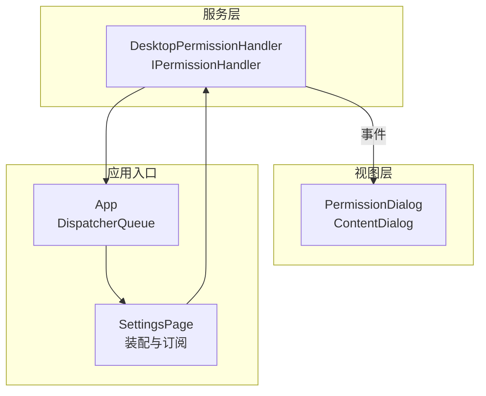
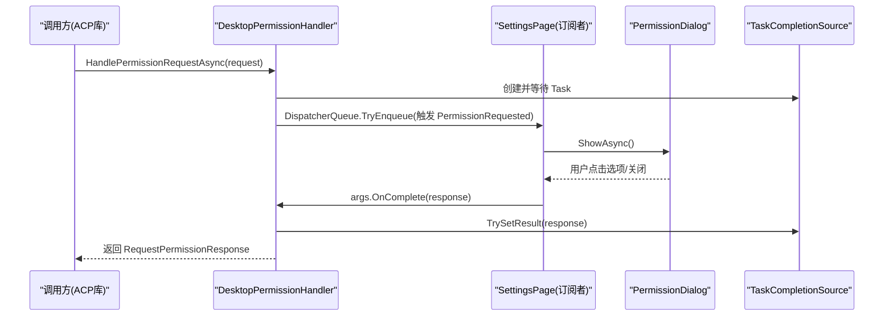
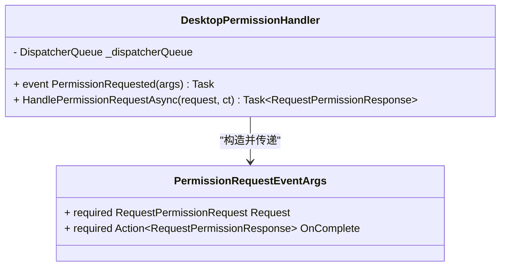
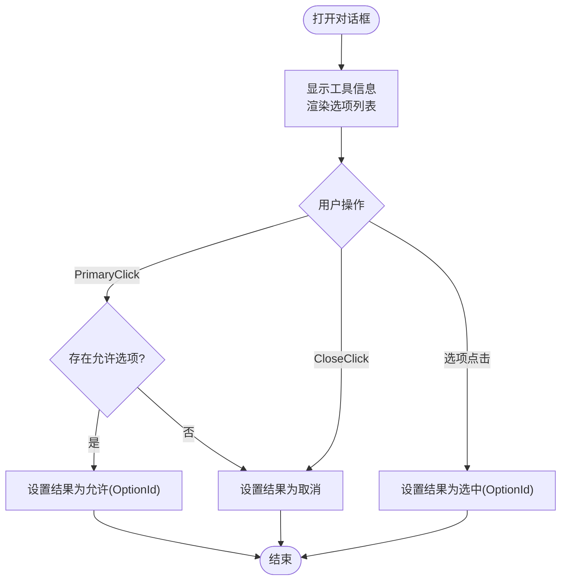
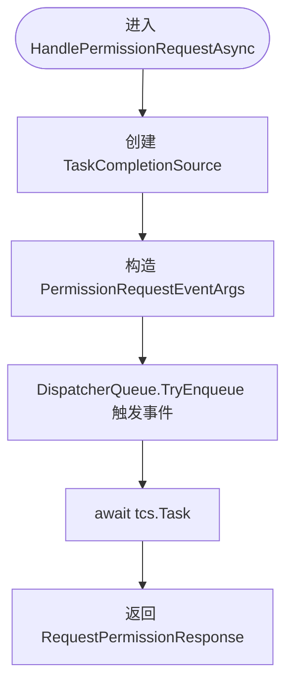
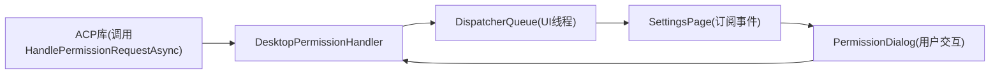

# 权限处理器核心

<cite>
**本文引用的文件**   
- [PermissionHandler.cs](file://Agentic.Desktop/Services/PermissionHandler.cs)
- [PermissionDialog.xaml.cs](file://Agentic.Desktop/Views/PermissionDialog.xaml.cs)
- [PermissionDialog.xaml](file://Agentic.Desktop/Views/PermissionDialog.xaml)
- [SettingsPage.xaml.cs](file://Agentic.Desktop/SettingsPage.xaml.cs)
- [App.xaml.cs](file://Agentic.Desktop/App.xaml.cs)
</cite>

## 目录
1. [简介](#简介)
2. [项目结构](#项目结构)
3. [核心组件](#核心组件)
4. [架构总览](#架构总览)
5. [详细组件分析](#详细组件分析)
6. [依赖关系分析](#依赖关系分析)
7. [性能考量](#性能考量)
8. [故障排查指南](#故障排查指南)
9. [结论](#结论)
10. [附录：扩展自定义权限处理器](#附录扩展自定义权限处理器)

## 简介
本技术文档聚焦于权限处理器核心组件，深入解析 DesktopPermissionHandler 类的实现原理与事件驱动架构。重点涵盖 IPermissionHandler 接口的 UI 层实现、HandlePermissionRequestAsync 的异步处理流程、TaskCompletionSource 的使用模式、PermissionRequestEventArgs 事件参数设计、DispatcherQueue 的线程安全调度机制以及错误处理策略。同时提供扩展自定义权限处理器的实践指导。

## 项目结构
权限相关代码主要分布在 Services 与 Views 两个目录中：
- Services/PermissionHandler.cs：定义 DesktopPermissionHandler 与 PermissionRequestEventArgs
- Views/PermissionDialog.xaml(.cs)：权限弹窗 UI 与交互逻辑
- SettingsPage.xaml.cs：在 Agent 连接后装配权限处理器并订阅事件
- App.xaml.cs：全局 DispatcherQueue 初始化与暴露

图表来源
- [PermissionHandler.cs:11-45](file://Agentic.Desktop/Services/PermissionHandler.cs#L11-L45)
- [PermissionDialog.xaml.cs:8-50](file://Agentic.Desktop/Views/PermissionDialog.xaml.cs#L8-L50)
- [SettingsPage.xaml.cs:22-34](file://Agentic.Desktop/SettingsPage.xaml.cs#L22-L34)
- [App.xaml.cs:64-76](file://Agentic.Desktop/App.xaml.cs#L64-L76)

章节来源
- [PermissionHandler.cs:1-52](file://Agentic.Desktop/Services/PermissionHandler.cs#L1-L52)
- [PermissionDialog.xaml.cs:1-64](file://Agentic.Desktop/Views/PermissionDialog.xaml.cs#L1-L64)
- [PermissionDialog.xaml:1-42](file://Agentic.Desktop/Views/PermissionDialog.xaml#L1-L42)
- [SettingsPage.xaml.cs:1-96](file://Agentic.Desktop/SettingsPage.xaml.cs#L1-L96)
- [App.xaml.cs:1-85](file://Agentic.Desktop/App.xaml.cs#L1-L85)

## 核心组件
- DesktopPermissionHandler：实现 IPermissionHandler，负责将权限请求派发至 UI 线程并通过事件通知上层显示对话框；使用 TaskCompletionSource 等待用户选择结果。
- PermissionRequestEventArgs：封装权限请求对象 Request 与完成回调 OnComplete，用于跨线程传递上下文与结果。
- PermissionDialog：WinUI ContentDialog，展示工具调用详情与可选选项，根据用户操作返回不同的权限结果。
- SettingsPage：在 Agent 连接成功后创建 DesktopPermissionHandler，订阅 PermissionRequested 事件，显示 PermissionDialog 并调用 OnComplete 完成异步等待。
- App：提供全局 DispatcherQueue，确保 UI 线程调用的正确性。

章节来源
- [PermissionHandler.cs:11-51](file://Agentic.Desktop/Services/PermissionHandler.cs#L11-L51)
- [PermissionDialog.xaml.cs:8-63](file://Agentic.Desktop/Views/PermissionDialog.xaml.cs#L8-L63)
- [SettingsPage.xaml.cs:22-34](file://Agentic.Desktop/SettingsPage.xaml.cs#L22-L34)
- [App.xaml.cs:64-76](file://Agentic.Desktop/App.xaml.cs#L64-L76)

## 架构总览
权限处理采用“事件驱动 + 异步任务”的模式：
- 当 Agent 发起权限请求时，调用 HandlePermissionRequestAsync
- 处理器通过 DispatcherQueue 将事件派发到 UI 线程
- ViewModel（此处为 SettingsPage）订阅事件并弹出 PermissionDialog
- 用户在对话框中选择选项或取消，触发 OnComplete 回调，设置 TaskCompletionSource 的结果
- HandlePermissionRequestAsync 返回最终响应

图表来源
- [PermissionHandler.cs:26-44](file://Agentic.Desktop/Services/PermissionHandler.cs#L26-L44)
- [SettingsPage.xaml.cs:22-34](file://Agentic.Desktop/SettingsPage.xaml.cs#L22-L34)
- [PermissionDialog.xaml.cs:26-49](file://Agentic.Desktop/Views/PermissionDialog.xaml.cs#L26-L49)

## 详细组件分析

### DesktopPermissionHandler 类
- 职责
  - 实现 IPermissionHandler.HandlePermissionRequestAsync
  - 通过 DispatcherQueue 将事件调度到 UI 线程
  - 使用 TaskCompletionSource 等待用户交互结果
- 关键成员
  - PermissionRequested：事件委托，向订阅者传递权限请求与完成回调
  - HandlePermissionRequestAsync：构建事件参数、派发事件、等待结果
- 线程模型
  - 非 UI 线程调用时，通过 DispatcherQueue.TryEnqueue 切换到 UI 线程触发事件
  - 避免直接访问 UI 资源导致跨线程异常
- 错误处理
  - 未捕获异常由上层订阅者处理
  - 若订阅者未调用 OnComplete，Task 将一直挂起（需确保订阅者始终调用）

图表来源
- [PermissionHandler.cs:11-45](file://Agentic.Desktop/Services/PermissionHandler.cs#L11-L45)
- [PermissionHandler.cs:47-51](file://Agentic.Desktop/Services/PermissionHandler.cs#L47-L51)

章节来源
- [PermissionHandler.cs:11-51](file://Agentic.Desktop/Services/PermissionHandler.cs#L11-L51)

### PermissionRequestEventArgs 事件参数
- 设计要点
  - Request：原始权限请求对象，包含工具调用信息与可选项
  - OnComplete：回调函数，用于将用户选择结果回传给处理器，完成异步等待
- 使用方式
  - 处理器创建实例并注入 Request 与 OnComplete
  - 订阅者在 UI 线程处理完成后调用 OnComplete，设置结果

章节来源
- [PermissionHandler.cs:47-51](file://Agentic.Desktop/Services/PermissionHandler.cs#L47-L51)

### PermissionDialog 对话框
- 功能
  - 展示工具调用标题与类型
  - 动态渲染权限选项列表
  - 根据用户点击返回不同结果（允许/拒绝/取消）
- 交互流程
  - PrimaryButtonClick：默认选择第一个“允许”选项，否则返回取消
  - CloseButtonClick：返回取消
  - 选项按钮点击：返回所选 OptionId

图表来源
- [PermissionDialog.xaml.cs:26-49](file://Agentic.Desktop/Views/PermissionDialog.xaml.cs#L26-L49)
- [PermissionDialog.xaml:13-40](file://Agentic.Desktop/Views/PermissionDialog.xaml#L13-L40)

章节来源
- [PermissionDialog.xaml.cs:8-63](file://Agentic.Desktop/Views/PermissionDialog.xaml.cs#L8-L63)
- [PermissionDialog.xaml:1-42](file://Agentic.Desktop/Views/PermissionDialog.xaml#L1-42)

### SettingsPage 装配与订阅
- 装配步骤
  - 创建 DesktopPermissionHandler，传入 App.DispatcherQueue
  - 订阅 PermissionRequested 事件
  - 在事件回调中创建并显示 PermissionDialog
  - 等待对话框结果后调用 args.OnComplete(result)
  - 将处理器赋值给 AcpClient.PermissionHandler
- 线程安全
  - 所有 UI 操作均在 UI 线程执行（由 DispatcherQueue 保证）
  - 对话框显示与隐藏遵循 WinUI 生命周期

章节来源
- [SettingsPage.xaml.cs:22-34](file://Agentic.Desktop/SettingsPage.xaml.cs#L22-L34)
- [App.xaml.cs:64-76](file://Agentic.Desktop/App.xaml.cs#L64-L76)

### HandlePermissionRequestAsync 工作流程
- 步骤
  - 创建 TaskCompletionSource 以等待结果
  - 构造 PermissionRequestEventArgs，注入 Request 与 OnComplete
  - 通过 DispatcherQueue.TryEnqueue 将事件派发至 UI 线程
  - 等待 TaskCompletionSource.Task 完成并返回结果
- 关键点
  - 必须确保订阅者调用 OnComplete，否则任务不会完成
  - 支持 CancellationToken（当前未使用），可在未来扩展取消语义

图表来源
- [PermissionHandler.cs:26-44](file://Agentic.Desktop/Services/PermissionHandler.cs#L26-L44)

章节来源
- [PermissionHandler.cs:26-44](file://Agentic.Desktop/Services/PermissionHandler.cs#L26-L44)

## 依赖关系分析
- 外部依赖
  - Microsoft.UI.Dispatching.DispatcherQueue：UI 线程调度
  - Agentic.ACPLibrary.Models：权限请求与响应模型
- 内部依赖
  - SettingsPage：订阅事件并显示对话框
  - PermissionDialog：用户交互与结果生成
  - App：提供全局 DispatcherQueue

图表来源
- [PermissionHandler.cs:11-45](file://Agentic.Desktop/Services/PermissionHandler.cs#L11-L45)
- [SettingsPage.xaml.cs:22-34](file://Agentic.Desktop/SettingsPage.xaml.cs#L22-L34)
- [PermissionDialog.xaml.cs:8-63](file://Agentic.Desktop/Views/PermissionDialog.xaml.cs#L8-L63)
- [App.xaml.cs:64-76](file://Agentic.Desktop/App.xaml.cs#L64-L76)

章节来源
- [PermissionHandler.cs:1-52](file://Agentic.Desktop/Services/PermissionHandler.cs#L1-L52)
- [SettingsPage.xaml.cs:1-96](file://Agentic.Desktop/SettingsPage.xaml.cs#L1-L96)
- [PermissionDialog.xaml.cs:1-64](file://Agentic.Desktop/Views/PermissionDialog.xaml.cs#L1-L64)
- [App.xaml.cs:1-85](file://Agentic.Desktop/App.xaml.cs#L1-L85)

## 性能考量
- 事件派发开销：DispatcherQueue.TryEnqueue 为轻量级队列操作，适合高频调用
- 任务等待：TaskCompletionSource 避免额外线程创建，减少上下文切换
- UI 更新：仅在 UI 线程显示对话框，避免频繁重绘
- 建议
  - 避免在 OnComplete 中进行耗时操作，必要时异步处理
  - 合理管理订阅与取消订阅，防止内存泄漏

[本节为通用性能建议，不直接分析具体文件]

## 故障排查指南
- 常见问题
  - 对话框未显示：检查 DispatcherQueue 是否正确初始化，确认订阅已注册
  - 任务永不完成：确认订阅者是否调用 OnComplete；检查是否存在异常中断
  - 跨线程异常：确保所有 UI 操作在 UI 线程执行（通过 DispatcherQueue）
- 调试建议
  - 在 SettingsPage 的事件回调中添加日志，跟踪事件触发与结果返回
  - 验证 PermissionDialog 的按钮事件是否正确设置结果
  - 检查 App.DispatcherQueue 是否为空或在正确的线程上下文中获取

章节来源
- [SettingsPage.xaml.cs:22-34](file://Agentic.Desktop/SettingsPage.xaml.cs#L22-L34)
- [PermissionDialog.xaml.cs:26-49](file://Agentic.Desktop/Views/PermissionDialog.xaml.cs#L26-L49)
- [App.xaml.cs:64-76](file://Agentic.Desktop/App.xaml.cs#L64-L76)

## 结论
DesktopPermissionHandler 通过事件驱动与异步任务模式，实现了权限请求与 UI 交互的解耦。借助 DispatcherQueue 保证线程安全，TaskCompletionSource 简化了异步等待逻辑。PermissionRequestEventArgs 提供了清晰的上下文传递机制。整体设计简洁、可扩展性强，便于后续定制与增强。

[本节为总结性内容，不直接分析具体文件]

## 附录：扩展自定义权限处理器
- 目标
  - 替换或扩展默认权限处理逻辑，例如添加自动审批、审计记录、多语言提示等
- 步骤
  - 实现 IPermissionHandler 接口（或直接继承 DesktopPermissionHandler 并重写方法）
  - 在 SettingsPage 中替换 PermissionHandler 实例
  - 如需自定义 UI，替换 PermissionDialog 或扩展其交互逻辑
- 注意事项
  - 保持 OnComplete 回调的调用，确保异步任务正常完成
  - 遵循线程模型，所有 UI 操作通过 DispatcherQueue 调度
  - 考虑取消令牌与异常处理，提升健壮性

章节来源
- [PermissionHandler.cs:11-45](file://Agentic.Desktop/Services/PermissionHandler.cs#L11-L45)
- [SettingsPage.xaml.cs:22-34](file://Agentic.Desktop/SettingsPage.xaml.cs#L22-L34)
- [PermissionDialog.xaml.cs:8-63](file://Agentic.Desktop/Views/PermissionDialog.xaml.cs#L8-L63)