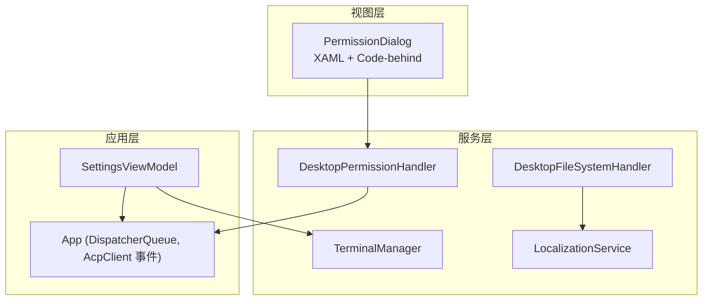
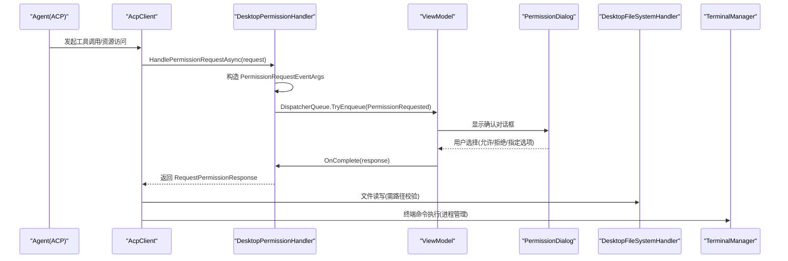
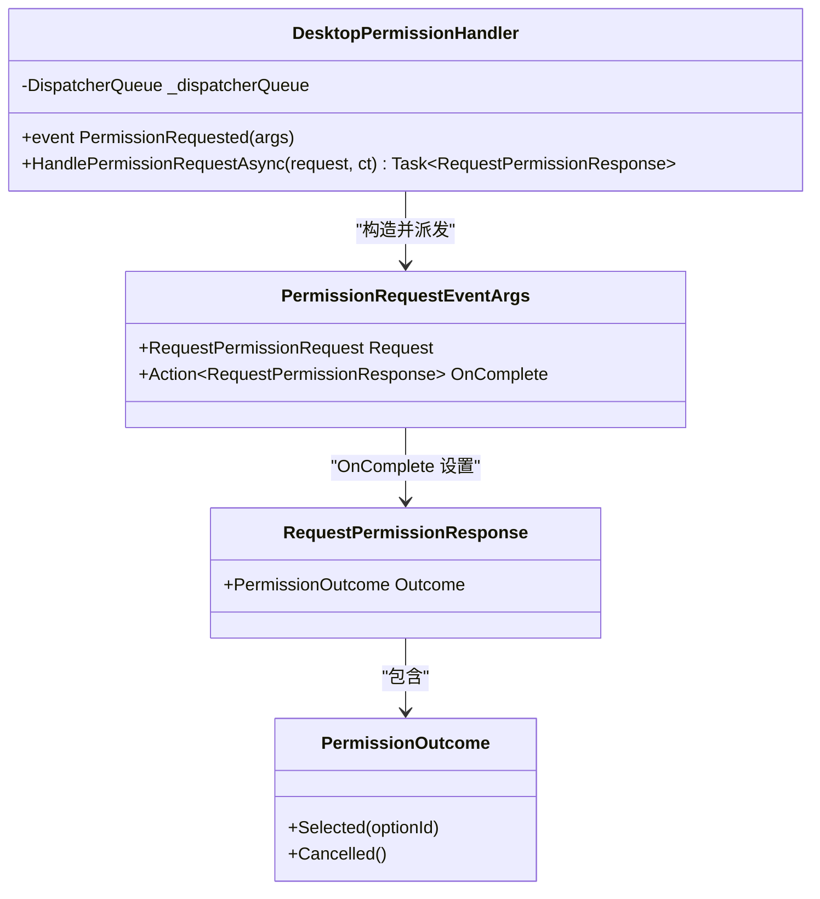
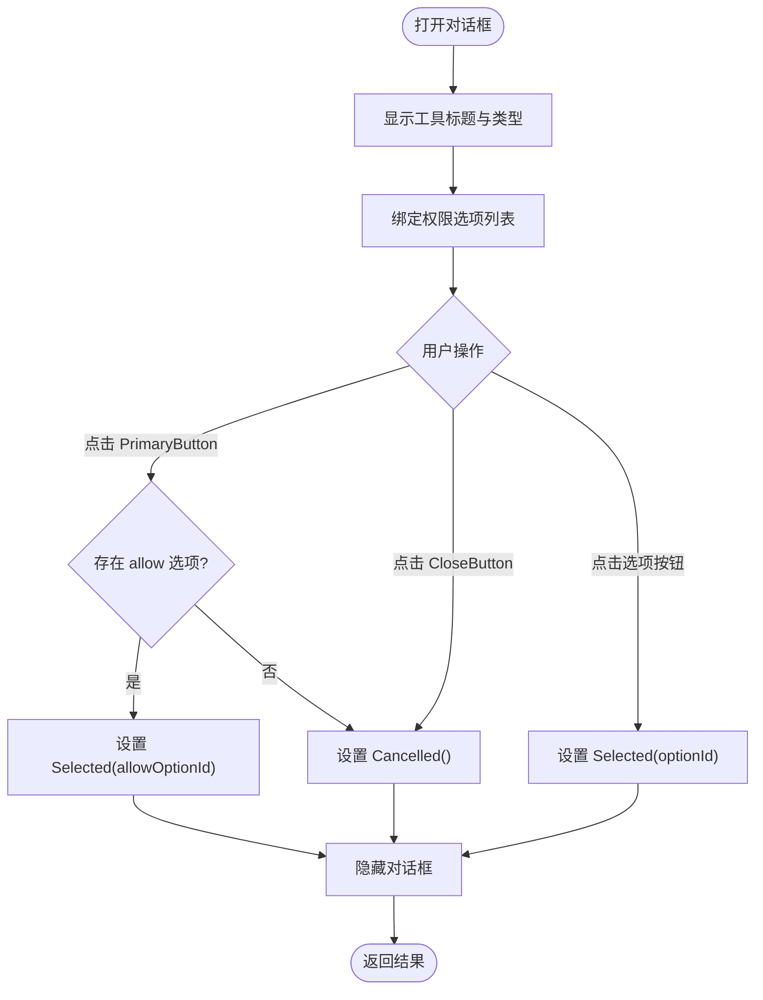
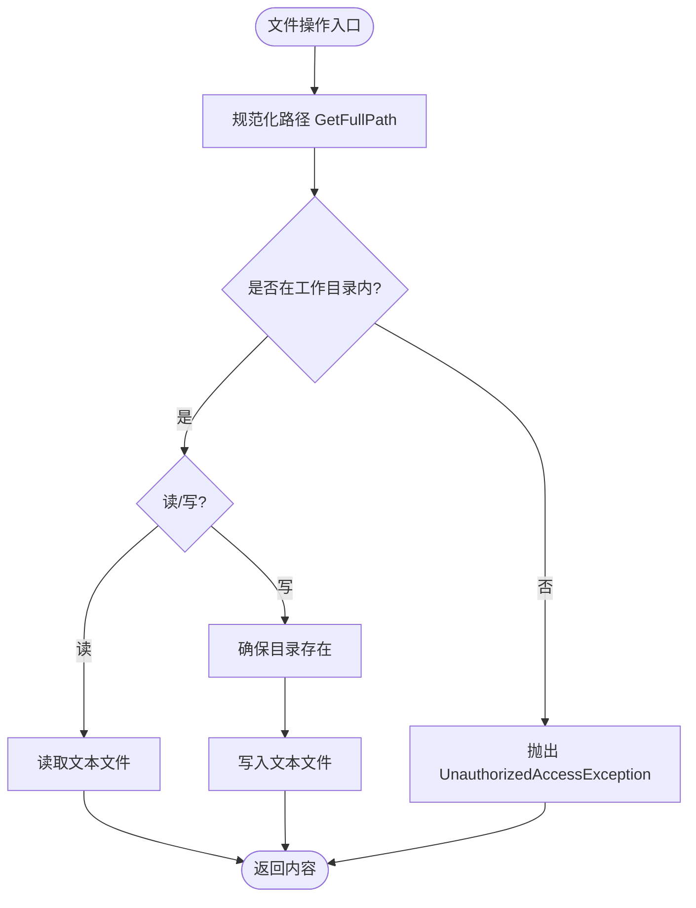
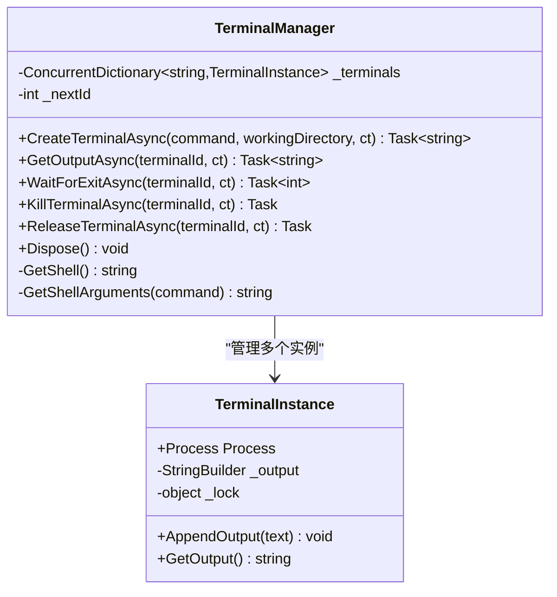
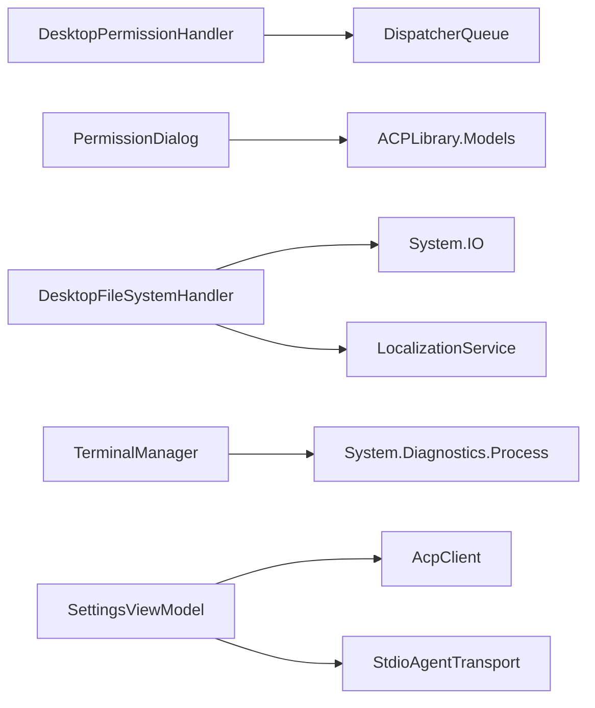

# 权限控制系统

<cite>
**本文引用的文件**
- [PermissionHandler.cs](file://Agentic.Desktop/Services/PermissionHandler.cs)
- [PermissionDialog.xaml.cs](file://Agentic.Desktop/Views/PermissionDialog.xaml.cs)
- [PermissionDialog.xaml](file://Agentic.Desktop/Views/PermissionDialog.xaml)
- [FileSystemHandler.cs](file://Agentic.Desktop/Services/FileSystemHandler.cs)
- [TerminalManager.cs](file://Agentic.Desktop/Services/TerminalManager.cs)
- [LocalizationService.cs](file://Agentic.Desktop/Services/LocalizationService.cs)
- [SettingsViewModel.cs](file://Agentic.Desktop/ViewModels/SettingsViewModel.cs)
- [App.xaml.cs](file://Agentic.Desktop/App.xaml.cs)
</cite>

## 目录
1. [简介](#简介)
2. [项目结构](#项目结构)
3. [核心组件](#核心组件)
4. [架构总览](#架构总览)
5. [详细组件分析](#详细组件分析)
6. [依赖关系分析](#依赖关系分析)
7. [性能考虑](#性能考虑)
8. [故障排查指南](#故障排查指南)
9. [结论](#结论)
10. [附录：扩展与最佳实践](#附录扩展与最佳实践)

## 简介
本技术文档围绕权限控制系统的实现展开，重点解释事件驱动的权限处理机制、UI 线程调度与用户交互流程，以及权限请求的处理、确认对话框的显示逻辑和用户决策的反馈。同时涵盖细粒度访问控制策略（文件系统工作目录白名单）、与终端服务的集成方式，并给出安全考虑、权限验证与审计日志的建议，以及权限扩展开发的指导与最佳实践。

## 项目结构
权限相关代码主要分布在 Services 与 Views 两个层次：
- Services：提供权限处理器、文件系统处理器、终端管理器和本地化服务。
- Views：提供权限确认对话框的 UI 与交互逻辑。
- ViewModels：负责应用连接状态与 AcpClient 生命周期管理，为权限处理器与终端处理器注入到 AcpClient 提供上下文。
- App：提供全局 DispatcherQueue 与 AcpClient 变更通知。

图表来源
- [PermissionDialog.xaml.cs:1-64](file://Agentic.Desktop/Views/PermissionDialog.xaml.cs#L1-L64)
- [PermissionHandler.cs:1-52](file://Agentic.Desktop/Services/PermissionHandler.cs#L1-L52)
- [FileSystemHandler.cs:1-42](file://Agentic.Desktop/Services/FileSystemHandler.cs#L1-L42)
- [TerminalManager.cs:1-161](file://Agentic.Desktop/Services/TerminalManager.cs#L1-L161)
- [LocalizationService.cs:1-23](file://Agentic.Desktop/Services/LocalizationService.cs#L1-L23)
- [SettingsViewModel.cs:1-162](file://Agentic.Desktop/ViewModels/SettingsViewModel.cs#L1-L162)
- [App.xaml.cs:1-85](file://Agentic.Desktop/App.xaml.cs#L1-L85)

章节来源
- [PermissionHandler.cs:1-52](file://Agentic.Desktop/Services/PermissionHandler.cs#L1-L52)
- [PermissionDialog.xaml.cs:1-64](file://Agentic.Desktop/Views/PermissionDialog.xaml.cs#L1-L64)
- [PermissionDialog.xaml:1-44](file://Agentic.Desktop/Views/PermissionDialog.xaml#L1-L44)
- [FileSystemHandler.cs:1-42](file://Agentic.Desktop/Services/FileSystemHandler.cs#L1-L42)
- [TerminalManager.cs:1-161](file://Agentic.Desktop/Services/TerminalManager.cs#L1-L161)
- [LocalizationService.cs:1-23](file://Agentic.Desktop/Services/LocalizationService.cs#L1-L23)
- [SettingsViewModel.cs:1-162](file://Agentic.Desktop/ViewModels/SettingsViewModel.cs#L1-L162)
- [App.xaml.cs:1-85](file://Agentic.Desktop/App.xaml.cs#L1-L85)

## 核心组件
- DesktopPermissionHandler：实现 IPermissionHandler，采用事件驱动模式，将权限请求分发到 UI 线程，触发 ViewModel 订阅的事件以展示确认对话框，并通过 TaskCompletionSource 等待用户决策结果。
- PermissionDialog：WinUI 3 ContentDialog，展示工具调用详情与权限选项，支持“允许”默认项或用户选择具体选项，返回 RequestPermissionResponse。
- DesktopFileSystemHandler：IFileSystemHandler 的实现，通过工作目录白名单校验路径，拒绝越权访问，抛出 UnauthorizedAccessException。
- TerminalManager：ITerminalHandler 的实现，管理多个终端进程实例，异步读取 stdout/stderr，提供输出获取、等待退出、终止与释放能力。
- LocalizationService：从 .resw 资源文件中读取本地化字符串，用于错误提示与界面文案。
- SettingsViewModel：负责 AcpClient 生命周期、会话创建与 TerminalHandler 注入；在连接成功后暴露 OnAgentConnected 回调供 UI 绑定。

章节来源
- [PermissionHandler.cs:1-52](file://Agentic.Desktop/Services/PermissionHandler.cs#L1-L52)
- [PermissionDialog.xaml.cs:1-64](file://Agentic.Desktop/Views/PermissionDialog.xaml.cs#L1-L64)
- [PermissionDialog.xaml:1-44](file://Agentic.Desktop/Views/PermissionDialog.xaml#L1-L44)
- [FileSystemHandler.cs:1-42](file://Agentic.Desktop/Services/FileSystemHandler.cs#L1-L42)
- [TerminalManager.cs:1-161](file://Agentic.Desktop/Services/TerminalManager.cs#L1-L161)
- [LocalizationService.cs:1-23](file://Agentic.Desktop/Services/LocalizationService.cs#L1-L23)
- [SettingsViewModel.cs:1-162](file://Agentic.Desktop/ViewModels/SettingsViewModel.cs#L1-L162)

## 架构总览
权限控制采用“事件驱动 + UI 线程调度”的架构：
- Agent 通过 AcpClient 发起工具调用或资源访问时，若需要权限，则调用 IPermissionHandler.HandlePermissionRequestAsync。
- DesktopPermissionHandler 将请求封装为事件参数，使用 DispatcherQueue 投递到 UI 线程，触发 PermissionRequested 事件。
- ViewModel 订阅该事件后，显示 PermissionDialog，收集用户决策并调用 OnComplete 回调，完成 TaskCompletionSource 的结果设置。
- 对于文件系统访问，DesktopFileSystemHandler 在执行前进行路径白名单校验，确保仅在工作目录下操作。
- 对于终端命令执行，TerminalManager 启动子进程并异步聚合输出，提供统一的接口供上层调用。

图表来源
- [PermissionHandler.cs:26-44](file://Agentic.Desktop/Services/PermissionHandler.cs#L26-L44)
- [PermissionDialog.xaml.cs:26-62](file://Agentic.Desktop/Views/PermissionDialog.xaml.cs#L26-L62)
- [FileSystemHandler.cs:17-40](file://Agentic.Desktop/Services/FileSystemHandler.cs#L17-L40)
- [TerminalManager.cs:16-68](file://Agentic.Desktop/Services/TerminalManager.cs#L16-L68)
- [SettingsViewModel.cs:100-113](file://Agentic.Desktop/ViewModels/SettingsViewModel.cs#L100-L113)

## 详细组件分析

### 权限处理器（DesktopPermissionHandler）
- 事件驱动：通过 PermissionRequested 事件向 ViewModel 广播权限请求。
- UI 线程调度：使用 DispatcherQueue.TryEnqueue 确保对话框在 UI 线程创建与显示。
- 任务同步：使用 TaskCompletionSource 等待用户决策，避免阻塞 UI 线程。
- 参数传递：PermissionRequestEventArgs 包含 Request 与 OnComplete 回调，便于 ViewModel 组装响应。

图表来源
- [PermissionHandler.cs:11-51](file://Agentic.Desktop/Services/PermissionHandler.cs#L11-L51)

章节来源
- [PermissionHandler.cs:11-51](file://Agentic.Desktop/Services/PermissionHandler.cs#L11-L51)

### 权限确认对话框（PermissionDialog）
- 展示内容：工具标题、类型与动态生成的权限选项列表。
- 用户交互：PrimaryButtonClick 默认选择首个 allow 选项；CloseButtonClick 表示拒绝；按钮点击选择具体 OptionId。
- 结果返回：通过内部 TaskCompletionSource 设置 Result，并在 UI 事件中隐藏对话框。

图表来源
- [PermissionDialog.xaml.cs:26-62](file://Agentic.Desktop/Views/PermissionDialog.xaml.cs#L26-L62)
- [PermissionDialog.xaml:15-41](file://Agentic.Desktop/Views/PermissionDialog.xaml#L15-L41)

章节来源
- [PermissionDialog.xaml.cs:15-62](file://Agentic.Desktop/Views/PermissionDialog.xaml.cs#L15-L62)
- [PermissionDialog.xaml:15-41](file://Agentic.Desktop/Views/PermissionDialog.xaml#L15-L41)

### 文件系统访问控制（DesktopFileSystemHandler）
- 白名单策略：所有文件路径必须位于工作目录内，否则抛出 UnauthorizedAccessException。
- 读/写保护：ReadTextFileAsync 与 WriteTextTextAsync 均在操作前调用 ValidatePath。
- 目录自动创建：写入时确保目标目录存在，减少 IO 异常。

图表来源
- [FileSystemHandler.cs:17-40](file://Agentic.Desktop/Services/FileSystemHandler.cs#L17-L40)

章节来源
- [FileSystemHandler.cs:17-40](file://Agentic.Desktop/Services/FileSystemHandler.cs#L17-L40)

### 终端服务集成（TerminalManager）
- 多实例管理：ConcurrentDictionary 维护多个终端实例，支持并发访问。
- 进程启动：根据操作系统选择 shell（cmd.exe 或 /bin/sh），重定向标准输入输出与错误流。
- 异步输出：后台任务持续读取 stdout/stderr 并追加到内存缓冲区，线程安全。
- 生命周期：提供 WaitForExit、Kill、Release、Dispose 等方法，确保资源释放与进程清理。

图表来源
- [TerminalManager.cs:11-161](file://Agentic.Desktop/Services/TerminalManager.cs#L11-L161)

章节来源
- [TerminalManager.cs:11-161](file://Agentic.Desktop/Services/TerminalManager.cs#L11-L161)

### 本地化服务（LocalizationService）
- 资源加载：通过 ResourceLoader 加载 .resw 资源文件。
- 格式化：Format 方法支持占位符替换，便于错误消息与界面文案的动态生成。

章节来源
- [LocalizationService.cs:10-22](file://Agentic.Desktop/Services/LocalizationService.cs#L10-L22)

### 应用连接与会话管理（SettingsViewModel）
- 连接流程：创建 AcpClient、初始化、创建会话、注入 TerminalHandler。
- 事件订阅：订阅 AgentProcessExited 事件，断开时更新状态。
- 权限处理器注入：应在连接阶段将 DesktopPermissionHandler 注入到 AcpClient（当前代码未显式设置，建议补充）。

章节来源
- [SettingsViewModel.cs:61-126](file://Agentic.Desktop/ViewModels/SettingsViewModel.cs#L61-L126)

## 依赖关系分析
- DesktopPermissionHandler 依赖 Microsoft.UI.Dispatching.DispatcherQueue 进行 UI 线程调度。
- PermissionDialog 依赖 WinUI 3 ContentDialog 与 XAML 模板，依赖 Agentic.ACPLibrary.Models 中的模型类型。
- DesktopFileSystemHandler 依赖系统 IO 与 LocalizationService。
- TerminalManager 依赖 System.Diagnostics.Process 与并发容器。
- SettingsViewModel 依赖 AcpClient、JsonRpcDispatcher、StdioAgentTransport 等。

图表来源
- [PermissionHandler.cs:1-24](file://Agentic.Desktop/Services/PermissionHandler.cs#L1-L24)
- [PermissionDialog.xaml.cs:1-12](file://Agentic.Desktop/Views/PermissionDialog.xaml.cs#L1-L12)
- [FileSystemHandler.cs:1-15](file://Agentic.Desktop/Services/FileSystemHandler.cs#L1-L15)
- [TerminalManager.cs:1-35](file://Agentic.Desktop/Services/TerminalManager.cs#L1-L35)
- [SettingsViewModel.cs:73-102](file://Agentic.Desktop/ViewModels/SettingsViewModel.cs#L73-L102)

章节来源
- [PermissionHandler.cs:1-24](file://Agentic.Desktop/Services/PermissionHandler.cs#L1-L24)
- [PermissionDialog.xaml.cs:1-12](file://Agentic.Desktop/Views/PermissionDialog.xaml.cs#L1-L12)
- [FileSystemHandler.cs:1-15](file://Agentic.Desktop/Services/FileSystemHandler.cs#L1-L15)
- [TerminalManager.cs:1-35](file://Agentic.Desktop/Services/TerminalManager.cs#L1-L35)
- [SettingsViewModel.cs:73-102](file://Agentic.Desktop/ViewModels/SettingsViewModel.cs#L73-L102)

## 性能考虑
- UI 线程调度：使用 DispatcherQueue.TryEnqueue 避免跨线程 UI 操作导致的异常与卡顿。
- 任务等待：TaskCompletionSource 避免阻塞 UI 线程，提升响应性。
- 文件 IO：异步读写减少阻塞，写入前自动创建目录降低异常概率。
- 终端输出：后台任务异步读取 stdout/stderr，使用 StringBuilder 与锁保证线程安全与低开销。
- 资源释放：TerminalManager.Dispose 确保进程树被正确终止与对象释放，防止资源泄漏。

[本节为通用性能建议，不直接分析具体文件]

## 故障排查指南
- 权限对话框未显示：检查 DispatcherQueue 是否正确获取并在 UI 线程上调用；确认 ViewModel 已订阅 PermissionRequested 事件。
- 文件访问被拒绝：确认请求路径是否位于工作目录内；检查 ValidatePath 的逻辑与大小写比较。
- 终端无输出：检查 CreateTerminalAsync 是否成功启动进程；确认 StandardOutput/StandardError 读取任务未被取消。
- 进程未释放：确保 ReleaseTerminalAsync 或 Dispose 被调用；检查 Kill 是否成功终止进程树。
- 本地化文案缺失：确认 .resw 资源文件包含对应键值；检查 LocalizationService.Get/Format 的调用。

章节来源
- [PermissionHandler.cs:26-44](file://Agentic.Desktop/Services/PermissionHandler.cs#L26-L44)
- [FileSystemHandler.cs:32-40](file://Agentic.Desktop/Services/FileSystemHandler.cs#L32-L40)
- [TerminalManager.cs:39-68](file://Agentic.Desktop/Services/TerminalManager.cs#L39-L68)
- [TerminalManager.cs:115-128](file://Agentic.Desktop/Services/TerminalManager.cs#L115-L128)
- [LocalizationService.cs:15-22](file://Agentic.Desktop/Services/LocalizationService.cs#L15-L22)

## 结论
本权限控制系统通过事件驱动与 UI 线程调度实现了安全的用户授权流程，结合文件系统白名单与终端进程管理，提供了细粒度的访问控制与可靠的资源管理。建议在连接阶段注入权限处理器，完善审计日志与错误上报，以提升安全性与可观测性。

[本节为总结性内容，不直接分析具体文件]

## 附录：扩展与最佳实践
- 权限扩展开发
  - 新增权限类型：在 PermissionDialog 中扩展选项渲染逻辑，确保每个选项具备明确的语义与唯一 OptionId。
  - 自定义策略：在 DesktopPermissionHandler 中增加前置策略检查（如角色、时间窗口、频率限制），再决定是否弹出对话框。
  - 审计日志：在 HandlePermissionRequestAsync 与 PermissionDialog 决策处记录请求详情、用户决策与时间戳。
- 安全考虑
  - 最小权限原则：仅授予必要的工具调用与文件访问范围。
  - 输入校验：对 ToolCall 与 Options 进行严格校验，防止注入与越权。
  - 进程隔离：终端命令执行应限制可用命令集与工作目录，避免任意命令执行。
- 权限验证与审计
  - 在 AcpClient 层统一拦截权限请求，集中记录审计信息。
  - 对拒绝的请求进行告警与统计，辅助安全策略优化。
- 最佳实践
  - 保持 UI 线程简洁：所有 UI 操作通过 DispatcherQueue 调度。
  - 资源管理：确保所有外部资源（进程、文件句柄）在使用完毕后释放。
  - 可测试性：为权限处理器与对话框编写单元测试与 UI 自动化测试。

[本节为概念性指导，不直接分析具体文件]