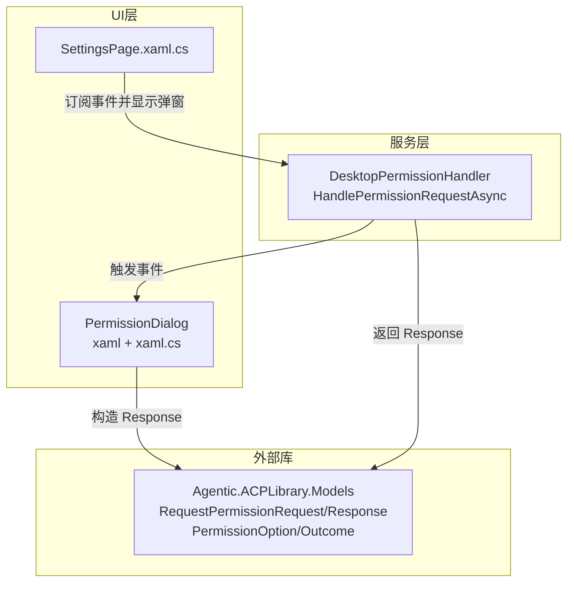
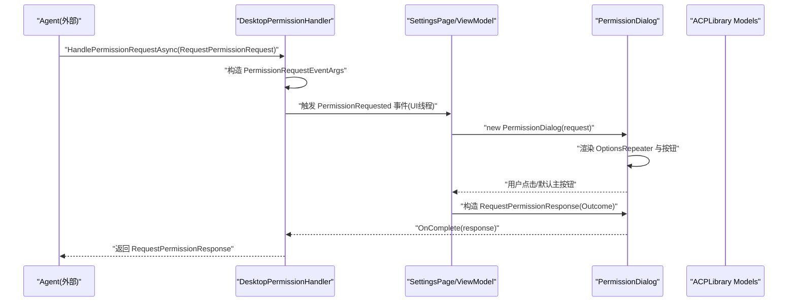
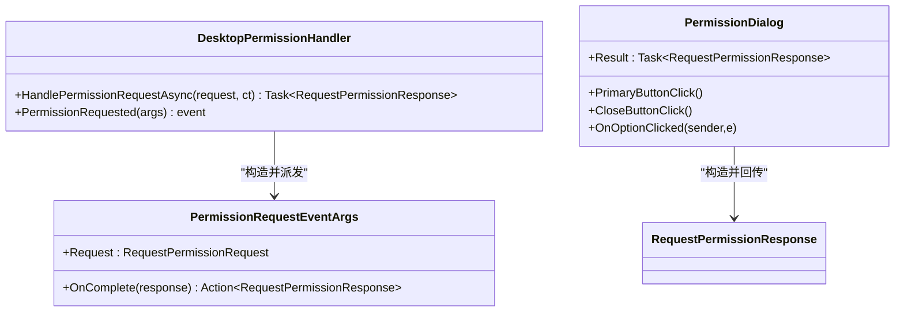
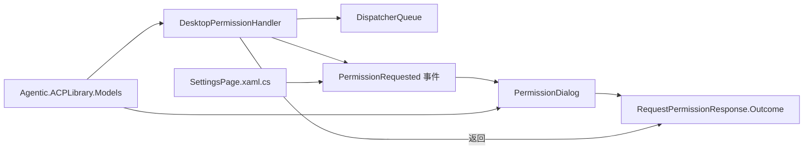

# 权限数据模型

<cite>
**本文引用的文件**   
- [PermissionHandler.cs](file://Agentic.Desktop/Services/PermissionHandler.cs)
- [PermissionDialog.xaml.cs](file://Agentic.Desktop/Views/PermissionDialog.xaml.cs)
- [PermissionDialog.xaml](file://Agentic.Desktop/Views/PermissionDialog.xaml)
- [ChatViewModel.cs](file://Agentic.Desktop/ViewModels/ChatViewModel.cs)
- [SettingsPage.xaml.cs](file://Agentic.Desktop/SettingsPage.xaml.cs)
- [Agentic.Desktop.csproj](file://Agentic.Desktop/Agentic.Desktop.csproj)
</cite>

## 目录
1. [简介](#简介)
2. [项目结构](#项目结构)
3. [核心组件](#核心组件)
4. [架构总览](#架构总览)
5. [详细组件分析](#详细组件分析)
6. [依赖关系分析](#依赖关系分析)
7. [性能考量](#性能考量)
8. [故障排查指南](#故障排查指南)
9. [结论](#结论)
10. [附录](#附录)

## 简介
本技术文档聚焦于权限控制系统的数据模型与交互流程，围绕以下目标展开：
- 深入解释 RequestPermissionRequest 与 RequestPermissionResponse 的数据结构与业务含义（字段、验证规则、语义）。
- 说明 PermissionRequestEventArgs 事件参数的设计模式与数据传递机制。
- 梳理权限类型枚举、资源标识符格式与操作权限分类的约定与实践。
- 阐述数据模型的版本兼容性与扩展机制。
- 提供自定义权限类型的开发指导与数据序列化注意事项。

该权限系统通过 UI 层弹窗与后台服务协作，将 Agent 发起的权限请求以用户可理解的方式呈现，并收集用户决策后回传给调用方。

## 项目结构
与权限相关的关键代码位于 Services 与 Views 两个层次：
- Services/PermissionHandler.cs：实现 IPermissionHandler 的桌面端处理器，负责将权限请求转换为 UI 事件，并通过回调返回结果。
- Views/PermissionDialog.xaml(.cs)：权限确认弹窗，展示工具调用信息与可选操作，生成最终响应。
- ViewModels/ChatViewModel.cs：会话与消息流处理，体现工具调用通知在 UI 中的表现。
- SettingsPage.xaml.cs：订阅权限请求事件，创建并显示权限弹窗，完成结果回传。
- Agentic.Desktop.csproj：声明对 ShihaoShen.Agentic.ACPLibrary 的引用，表明 RequestPermissionRequest、RequestPermissionResponse、PermissionOption、PermissionOutcome 等类型来自该库。

图表来源
- [PermissionHandler.cs:26-44](file://Agentic.Desktop/Services/PermissionHandler.cs#L26-L44)
- [PermissionDialog.xaml.cs:15-50](file://Agentic.Desktop/Views/PermissionDialog.xaml.cs#L15-L50)
- [SettingsPage.xaml.cs:23-25](file://Agentic.Desktop/SettingsPage.xaml.cs#L23-L25)
- [Agentic.Desktop.csproj:59](file://Agentic.Desktop/Agentic.Desktop.csproj#L59)

章节来源
- [PermissionHandler.cs:1-52](file://Agentic.Desktop/Services/PermissionHandler.cs#L1-L52)
- [PermissionDialog.xaml.cs:1-64](file://Agentic.Desktop/Views/PermissionDialog.xaml.cs#L1-L64)
- [PermissionDialog.xaml:1-42](file://Agentic.Desktop/Views/PermissionDialog.xaml#L1-L42)
- [ChatViewModel.cs:180-202](file://Agentic.Desktop/ViewModels/ChatViewModel.cs#L180-L202)
- [SettingsPage.xaml.cs:23-25](file://Agentic.Desktop/SettingsPage.xaml.cs#L23-L25)
- [Agentic.Desktop.csproj:59](file://Agentic.Desktop/Agentic.Desktop.csproj#L59)

## 核心组件
- DesktopPermissionHandler：实现 IPermissionHandler，封装 HandlePermissionRequestAsync，将请求包装为 PermissionRequestEventArgs 并通过事件派发至 UI 线程，等待用户选择后返回 RequestPermissionResponse。
- PermissionRequestEventArgs：事件参数，包含原始请求 Request 与 OnComplete 回调，用于将用户决策回传。
- PermissionDialog：XAML 弹窗，绑定 request.Options 动态渲染选项按钮；根据用户点击或默认主按钮行为构造 RequestPermissionResponse 并设置 Outcome。
- ChatViewModel：处理 ToolCallNotification，在聊天界面中插入系统消息与预览文本，体现工具调用上下文。
- SettingsPage.xaml.cs：订阅 PermissionRequested 事件，创建 PermissionDialog 并传入 Request，完成弹窗生命周期管理。

章节来源
- [PermissionHandler.cs:11-45](file://Agentic.Desktop/Services/PermissionHandler.cs#L11-L45)
- [PermissionHandler.cs:47-51](file://Agentic.Desktop/Services/PermissionHandler.cs#L47-L51)
- [PermissionDialog.xaml.cs:15-50](file://Agentic.Desktop/Views/PermissionDialog.xaml.cs#L15-L50)
- [PermissionDialog.xaml:29-39](file://Agentic.Desktop/Views/PermissionDialog.xaml#L29-L39)
- [ChatViewModel.cs:184-202](file://Agentic.Desktop/ViewModels/ChatViewModel.cs#L184-L202)
- [SettingsPage.xaml.cs:23-25](file://Agentic.Desktop/SettingsPage.xaml.cs#L23-L25)

## 架构总览
权限请求从底层代理（ACPLibrary）进入应用，经由 DesktopPermissionHandler 转为 UI 事件，再由 PermissionDialog 收集用户选择，最后以 RequestPermissionResponse 返回给调用方。

图表来源
- [PermissionHandler.cs:26-44](file://Agentic.Desktop/Services/PermissionHandler.cs#L26-L44)
- [PermissionDialog.xaml.cs:26-49](file://Agentic.Desktop/Views/PermissionDialog.xaml.cs#L26-L49)
- [SettingsPage.xaml.cs:23-25](file://Agentic.Desktop/SettingsPage.xaml.cs#L23-L25)

## 详细组件分析

### 数据模型：RequestPermissionRequest
- 用途：描述一次权限请求的上下文，包括工具调用信息、可用选项集合等。
- 关键字段（依据使用点推断）：
  - ToolCall：包含 Title、Kind 等元数据，用于在弹窗中展示动作名称与类型。
  - Options：PermissionOption 列表，表示可供用户选择的权限项，每个选项含 OptionId 与 Name。
- 验证规则：
  - 若 Options 为空或缺少“允许”类选项，则应降级为取消策略（见弹窗默认主按钮逻辑）。
  - ToolCall 可能为空，需做空值回退（如显示未知动作文案）。
- 业务含义：
  - 代表 Agent 在执行某项工具调用前向用户申请授权，用户可选择具体允许的粒度（按 OptionId 区分）。

章节来源
- [PermissionDialog.xaml.cs:19-24](file://Agentic.Desktop/Views/PermissionDialog.xaml.cs#L19-L24)
- [PermissionDialog.xaml:29-39](file://Agentic.Desktop/Views/PermissionDialog.xaml#L29-L39)

### 数据模型：RequestPermissionResponse
- 用途：承载用户对权限请求的最终决定。
- 关键字段（依据使用点推断）：
  - Outcome：PermissionOutcome，表示“已选择某选项”或“已取消”。
- 构造方式：
  - 用户点击某个选项时，Outcome 设置为 Selected(optionId)。
  - 未明确选择或关闭弹窗时，Outcome 设置为 Cancelled()。
- 业务含义：
  - 上层据此决定是否放行工具调用以及以何种范围放行。

章节来源
- [PermissionDialog.xaml.cs:26-49](file://Agentic.Desktop/Views/PermissionDialog.xaml.cs#L26-L49)

### 事件参数：PermissionRequestEventArgs
- 设计模式：采用“事件+回调”的组合，既支持多订阅者，又保证异步结果回传。
- 字段：
  - Request：只读输入，携带权限请求详情。
  - OnComplete：回调函数，接收 RequestPermissionResponse，由 UI 层在用户决策后调用。
- 数据传递机制：
  - DesktopPermissionHandler 在 UI 线程派发事件，ViewModel 订阅后显示弹窗，弹窗完成后调用 OnComplete，Handler 通过 TaskCompletionSource 将结果返回给调用方。

图表来源
- [PermissionHandler.cs:26-44](file://Agentic.Desktop/Services/PermissionHandler.cs#L26-L44)
- [PermissionHandler.cs:47-51](file://Agentic.Desktop/Services/PermissionHandler.cs#L47-L51)
- [PermissionDialog.xaml.cs:26-49](file://Agentic.Desktop/Views/PermissionDialog.xaml.cs#L26-L49)

章节来源
- [PermissionHandler.cs:11-45](file://Agentic.Desktop/Services/PermissionHandler.cs#L11-L45)
- [PermissionHandler.cs:47-51](file://Agentic.Desktop/Services/PermissionHandler.cs#L47-L51)
- [PermissionDialog.xaml.cs:15-50](file://Agentic.Desktop/Views/PermissionDialog.xaml.cs#L15-L50)

### 权限类型枚举、资源标识符与操作分类
- 权限类型枚举：
  - 通过 PermissionOption.Kind 表达类别（例如“allow”），用于识别是否属于“允许”类选项。
  - 弹窗默认主按钮会优先选择 Kind 包含“allow”的选项，若无则直接取消。
- 资源标识符格式：
  - 通过 PermissionOption.OptionId 唯一标识一个具体的权限项，UI 将其绑定到按钮 Tag，点击时回传。
- 操作权限分类：
  - 通过 ToolCall.Kind 与 Title 描述工具调用的类型与标题，辅助用户理解请求意图。

章节来源
- [PermissionDialog.xaml.cs:28-35](file://Agentic.Desktop/Views/PermissionDialog.xaml.cs#L28-L35)
- [PermissionDialog.xaml:31-36](file://Agentic.Desktop/Views/PermissionDialog.xaml#L31-L36)

### 数据模型版本兼容性与扩展机制
- 向后兼容：
  - ToolCall 可能为空，UI 层需做空值回退（显示未知动作文案）。
  - Options 为空或缺少“允许”选项时，应降级为取消策略。
- 向前扩展：
  - 新增 OptionId 或 Kind 的语义时，需在 UI 层保持对未知值的容错（忽略或提示）。
  - 可在 RequestPermissionRequest 中增加额外上下文字段，并在弹窗中按需展示，不影响旧版本解析。

章节来源
- [PermissionDialog.xaml.cs:19-24](file://Agentic.Desktop/Views/PermissionDialog.xaml.cs#L19-L24)
- [PermissionDialog.xaml.cs:28-40](file://Agentic.Desktop/Views/PermissionDialog.xaml.cs#L28-L40)

### 自定义权限类型的开发指导
- 定义新权限项：
  - 在 Options 中添加新的 PermissionOption，确保 OptionId 全局唯一，Name 对用户友好。
  - 若需要归类，设置合适的 Kind（如 allow/deny/scope 等）。
- UI 适配：
  - 若新 Kind 需要特殊展示或交互，扩展 PermissionDialog 的渲染与选择逻辑。
  - 保持默认主按钮策略的可配置性，避免破坏现有行为。
- 校验与回退：
  - 对缺失字段进行空值保护；对未知 Kind/OptionId 进行安全回退（如拒绝或提示）。

章节来源
- [PermissionDialog.xaml.cs:26-49](file://Agentic.Desktop/Views/PermissionDialog.xaml.cs#L26-L49)
- [PermissionDialog.xaml:29-39](file://Agentic.Desktop/Views/PermissionDialog.xaml#L29-L39)

### 数据序列化注意事项
- 由于 RequestPermissionRequest/Response、PermissionOption、PermissionOutcome 来自外部库，序列化策略需遵循库的实现（通常基于 JSON）。
- 建议：
  - 仅序列化必要字段，避免泄露敏感信息。
  - 对字符串字段进行长度与字符集校验，防止注入或异常。
  - 对枚举 Kind/Outcome 的值域进行白名单校验，拒绝非法值。
  - 在跨进程/网络传输时，统一编码与版本协商，确保兼容性。

章节来源
- [Agentic.Desktop.csproj:59](file://Agentic.Desktop/Agentic.Desktop.csproj#L59)

## 依赖关系分析
- 内部依赖：
  - DesktopPermissionHandler 依赖 DispatcherQueue 进行 UI 线程调度。
  - PermissionDialog 依赖 XAML 控件 ItemsRepeater 与 Button 渲染选项。
  - SettingsPage 订阅 PermissionRequested 事件，创建并管理 PermissionDialog。
- 外部依赖：
  - 所有权限相关的数据类型来自 ShihaoShen.Agentic.ACPLibrary.Models。

图表来源
- [PermissionHandler.cs:21-24](file://Agentic.Desktop/Services/PermissionHandler.cs#L21-L24)
- [PermissionDialog.xaml:29-39](file://Agentic.Desktop/Views/PermissionDialog.xaml#L29-L39)
- [SettingsPage.xaml.cs:23-25](file://Agentic.Desktop/SettingsPage.xaml.cs#L23-L25)
- [Agentic.Desktop.csproj:59](file://Agentic.Desktop/Agentic.Desktop.csproj#L59)

章节来源
- [PermissionHandler.cs:11-45](file://Agentic.Desktop/Services/PermissionHandler.cs#L11-L45)
- [PermissionDialog.xaml.cs:15-50](file://Agentic.Desktop/Views/PermissionDialog.xaml.cs#L15-L50)
- [SettingsPage.xaml.cs:23-25](file://Agentic.Desktop/SettingsPage.xaml.cs#L23-L25)
- [Agentic.Desktop.csproj:59](file://Agentic.Desktop/Agentic.Desktop.csproj#L59)

## 性能考量
- UI 线程调度：使用 DispatcherQueue.TryEnqueue 确保弹窗显示在主线程，避免跨线程异常。
- 批量更新：ChatViewModel 中对流式消息进行帧级合并与延迟刷新，减少 UI 抖动。
- 弹窗渲染：ItemsRepeater 按需渲染选项，避免一次性构建大量控件。
- 任务等待：通过 TaskCompletionSource 避免阻塞线程，提升并发能力。

章节来源
- [PermissionHandler.cs:38-44](file://Agentic.Desktop/Services/PermissionHandler.cs#L38-L44)
- [ChatViewModel.cs:158-182](file://Agentic.Desktop/ViewModels/ChatViewModel.cs#L158-L182)

## 故障排查指南
- 弹窗不显示：
  - 检查 PermissionRequested 事件是否正确订阅。
  - 确认 DispatcherQueue 初始化成功且当前线程可用。
- 选项无法选择：
  - 检查 Options 是否为空或 OptionId 绑定是否正确。
  - 确认按钮 Click 事件与 OnOptionClicked 关联。
- 默认主按钮行为异常：
  - 检查是否存在 Kind 包含“allow”的选项；若无则应返回取消。
- 工具调用信息缺失：
  - 当 ToolCall 为空时，UI 应显示“未知动作”文案，避免崩溃。

章节来源
- [PermissionDialog.xaml.cs:26-49](file://Agentic.Desktop/Views/PermissionDialog.xaml.cs#L26-L49)
- [PermissionDialog.xaml.cs:19-24](file://Agentic.Desktop/Views/PermissionDialog.xaml.cs#L19-L24)

## 结论
本权限数据模型以清晰的事件-回调机制连接后台服务与 UI 弹窗，借助 ACPLibrary 提供的标准模型完成跨层通信。通过合理的默认策略与空值保护，系统在兼容性与健壮性上具备良好基础。后续可扩展更多权限类型与展示细节，同时保持对未知值的容错与序列化安全。

## 附录
- 关键流程时序图与类图已在上述章节给出，便于快速定位问题与扩展功能。
- 如需进一步定制权限弹窗样式或交互，建议在 PermissionDialog 中扩展 DataTemplate 与事件处理逻辑，并确保与后端模型保持一致。