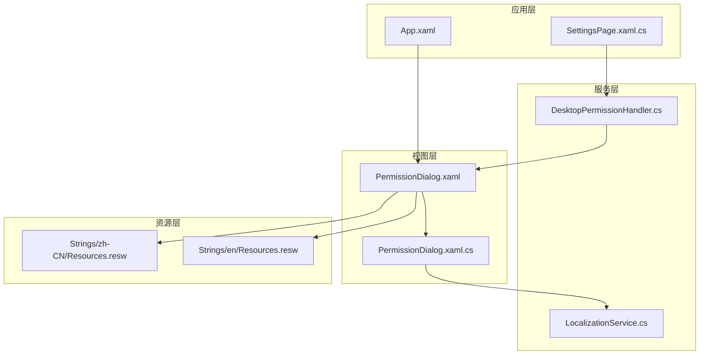
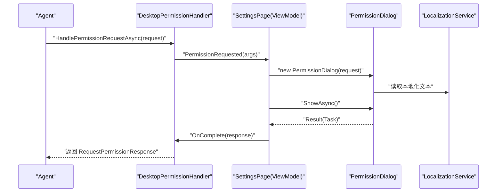
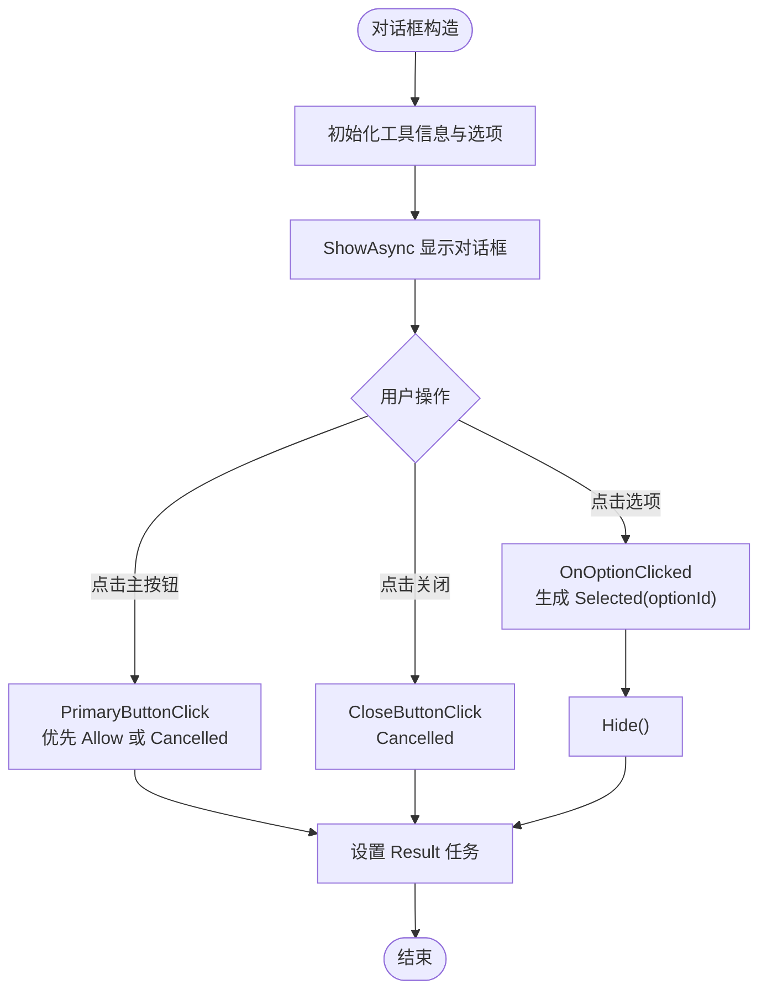
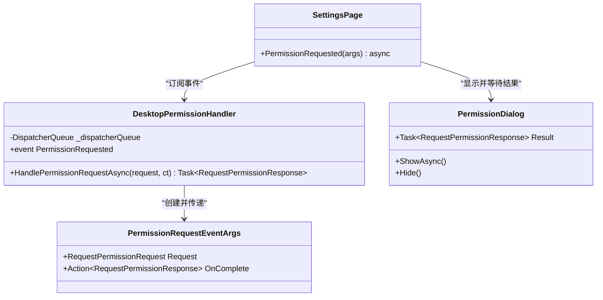
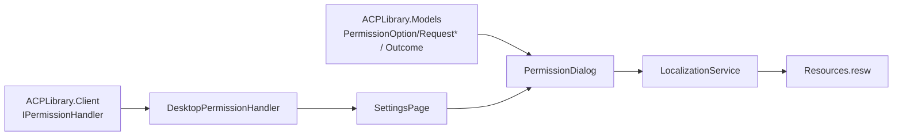

# 权限确认对话框

<cite>
**本文引用的文件**   
- [PermissionDialog.xaml](file://Agentic.Desktop/Agentic.Desktop/Views/PermissionDialog.xaml)
- [PermissionDialog.xaml.cs](file://Agentic.Desktop/Agentic.Desktop/Views/PermissionDialog.xaml.cs)
- [PermissionHandler.cs](file://Agentic.Desktop/Agentic.Desktop/Services/PermissionHandler.cs)
- [LocalizationService.cs](file://Agentic.Desktop/Agentic.Desktop/Services/LocalizationService.cs)
- [Resources.resw（中文）](file://Agentic.Desktop/Agentic.Desktop/Strings/zh-CN/Resources.resw)
- [Resources.resw（英文）](file://Agentic.Desktop/Agentic.Desktop/Strings/en/Resources.resw)
- [App.xaml](file://Agentic.Desktop/Agentic.Desktop/App.xaml)
- [SettingsPage.xaml.cs](file://Agentic.Desktop/Agentic.Desktop/SettingsPage.xaml.cs)
</cite>

## 目录
1. [简介](#简介)
2. [项目结构](#项目结构)
3. [核心组件](#核心组件)
4. [架构总览](#架构总览)
5. [详细组件分析](#详细组件分析)
6. [依赖关系分析](#依赖关系分析)
7. [性能考虑](#性能考虑)
8. [故障排查指南](#故障排查指南)
9. [结论](#结论)
10. [附录](#附录)

## 简介
本技术文档围绕“权限确认对话框”组件展开，系统性说明 PermissionDialog 的用户界面设计、交互逻辑、生命周期管理、用户输入验证与决策反馈机制；阐述其与 PermissionHandler 的事件集成方式，包括权限请求信息的展示与用户选择的处理；并覆盖样式定制、国际化支持与可访问性考虑，提供自定义权限对话框样式的指导与最佳实践。

## 项目结构
权限确认对话框位于 Views 层，采用 XAML + 代码隐藏的模式实现；事件桥接在 Services 层的 DesktopPermissionHandler 中完成；本地化资源通过 Strings 下的 .resw 文件提供；应用级资源字典在 App.xaml 中合并 WinUI 控件资源。

图表来源 
- [PermissionDialog.xaml:1-42](file://Agentic.Desktop/Agentic.Desktop/Views/PermissionDialog.xaml#L1-L42)
- [PermissionDialog.xaml.cs:1-64](file://Agentic.Desktop/Agentic.Desktop/Views/PermissionDialog.xaml.cs#L1-L64)
- [PermissionHandler.cs:1-52](file://Agentic.Desktop/Agentic.Desktop/Services/PermissionHandler.cs#L1-L52)
- [LocalizationService.cs:1-23](file://Agentic.Desktop/Agentic.Desktop/Services/LocalizationService.cs#L1-L23)
- [Resources.resw（中文）:159-174](file://Agentic.Desktop/Agentic.Desktop/Strings/zh-CN/Resources.resw#L159-L174)
- [Resources.resw（英文）:159-174](file://Agentic.Desktop/Agentic.Desktop/Strings/en/Resources.resw#L159-L174)
- [App.xaml:1-17](file://Agentic.Desktop/Agentic.Desktop/App.xaml#L1-L17)
- [SettingsPage.xaml.cs:1-96](file://Agentic.Desktop/Agentic.Desktop/SettingsPage.xaml.cs#L1-L96)

章节来源
- [PermissionDialog.xaml:1-42](file://Agentic.Desktop/Agentic.Desktop/Views/PermissionDialog.xaml#L1-L42)
- [PermissionDialog.xaml.cs:1-64](file://Agentic.Desktop/Agentic.Desktop/Views/PermissionDialog.xaml.cs#L1-L64)
- [PermissionHandler.cs:1-52](file://Agentic.Desktop/Agentic.Desktop/Services/PermissionHandler.cs#L1-L52)
- [LocalizationService.cs:1-23](file://Agentic.Desktop/Agentic.Desktop/Services/LocalizationService.cs#L1-L23)
- [Resources.resw（中文）:159-174](file://Agentic.Desktop/Agentic.Desktop/Strings/zh-CN/Resources.resw#L159-L174)
- [Resources.resw（英文）:159-174](file://Agentic.Desktop/Agentic.Desktop/Strings/en/Resources.resw#L159-L174)
- [App.xaml:1-17](file://Agentic.Desktop/Agentic.Desktop/App.xaml#L1-L17)
- [SettingsPage.xaml.cs:1-96](file://Agentic.Desktop/Agentic.Desktop/SettingsPage.xaml.cs#L1-L96)

## 核心组件
- PermissionDialog：基于 ContentDialog 的权限确认弹窗，负责展示工具调用详情与动态选项列表，收集用户选择并返回结果。
- DesktopPermissionHandler：实现 IPermissionHandler，封装 UI 线程调度与事件分发，将权限请求以事件形式通知上层（如 SettingsPage），并等待用户决策后回传结果。
- LocalizationService：统一从 .resw 资源文件中读取本地化字符串，供对话框文本与提示使用。
- 资源文件（.resw）：为对话框标题、按钮文案、描述文本等提供多语言支持。
- App.xaml：合并 WinUI 控件资源字典，确保对话框使用系统主题与控件样式。
- SettingsPage.xaml.cs：连接 AcpClient 时创建并注入 DesktopPermissionHandler，订阅 PermissionRequested 事件，显示 PermissionDialog 并将结果回调给 Handler。

章节来源
- [PermissionDialog.xaml:1-42](file://Agentic.Desktop/Agentic.Desktop/Views/PermissionDialog.xaml#L1-L42)
- [PermissionDialog.xaml.cs:1-64](file://Agentic.Desktop/Agentic.Desktop/Views/PermissionDialog.xaml.cs#L1-L64)
- [PermissionHandler.cs:1-52](file://Agentic.Desktop/Agentic.Desktop/Services/PermissionHandler.cs#L1-L52)
- [LocalizationService.cs:1-23](file://Agentic.Desktop/Agentic.Desktop/Services/LocalizationService.cs#L1-L23)
- [Resources.resw（中文）:159-174](file://Agentic.Desktop/Agentic.Desktop/Strings/zh-CN/Resources.resw#L159-L174)
- [Resources.resw（英文）:159-174](file://Agentic.Desktop/Agentic.Desktop/Strings/en/Resources.resw#L159-L174)
- [App.xaml:1-17](file://Agentic.Desktop/Agentic.Desktop/App.xaml#L1-L17)
- [SettingsPage.xaml.cs:1-96](file://Agentic.Desktop/Agentic.Desktop/SettingsPage.xaml.cs#L1-L96)

## 架构总览
权限确认对话框的整体流程如下：Agent 发起权限请求 → DesktopPermissionHandler 在 UI 线程触发 PermissionRequested 事件 → SettingsPage 订阅该事件并弹出 PermissionDialog → 用户点击选项或默认主按钮 → PermissionDialog 返回决策结果 → SettingsPage 调用 OnComplete 回调 → DesktopPermissionHandler 完成异步任务并返回 RequestPermissionResponse。

图表来源 
- [PermissionHandler.cs:26-44](file://Agentic.Desktop/Agentic.Desktop/Services/PermissionHandler.cs#L26-L44)
- [SettingsPage.xaml.cs:22-34](file://Agentic.Desktop/Agentic.Desktop/SettingsPage.xaml.cs#L22-L34)
- [PermissionDialog.xaml.cs:15-50](file://Agentic.Desktop/Agentic.Desktop/Views/PermissionDialog.xaml.cs#L15-L50)
- [LocalizationService.cs:10-22](file://Agentic.Desktop/Agentic.Desktop/Services/LocalizationService.cs#L10-L22)

## 详细组件分析

### PermissionDialog（XAML 布局与代码隐藏）
- 布局结构
  - 使用 ContentDialog 作为容器，设置 DefaultButton 为主按钮。
  - 顶部 TextBlock 展示权限描述（绑定 x:Uid）。
  - 中间 Border 包裹 ToolTitle 与 ToolKind，用于展示工具调用详情。
  - 下方 ItemsRepeater 动态渲染 PermissionOption 列表，每个选项为一个 Button，包含 OptionId 与 Name。
- 交互逻辑
  - 构造函数初始化数据：设置工具标题、类型与选项集合。
  - PrimaryButtonClick：若存在允许类选项则选择第一个允许项，否则取消。
  - CloseButtonClick：直接返回取消结果。
  - OnOptionClicked：根据按钮 Tag（OptionId）生成选中结果并关闭对话框。
- 生命周期管理
  - 通过 TaskCompletionSource 暴露 Result 任务，等待用户操作完成后设置结果。
  - ShowAsync 由上层控制显示，Hide 在选项点击后调用。
- 用户输入验证与决策反馈
  - 选项有效性由外部模型保证；内部仅做简单匹配（allow 关键字）与默认行为。
  - 决策通过 PermissionOutcome.Selected(optionId) 或 Cancelled() 表达。

图表来源 
- [PermissionDialog.xaml:12-40](file://Agentic.Desktop/Agentic.Desktop/Views/PermissionDialog.xaml#L12-L40)
- [PermissionDialog.xaml.cs:15-62](file://Agentic.Desktop/Agentic.Desktop/Views/PermissionDialog.xaml.cs#L15-L62)

章节来源
- [PermissionDialog.xaml:1-42](file://Agentic.Desktop/Agentic.Desktop/Views/PermissionDialog.xaml#L1-L42)
- [PermissionDialog.xaml.cs:1-64](file://Agentic.Desktop/Agentic.Desktop/Views/PermissionDialog.xaml.cs#L1-L64)

### DesktopPermissionHandler（事件集成）
- 职责
  - 接收权限请求，封装为 PermissionRequestEventArgs，并通过事件 PermissionRequested 通知 UI。
  - 使用 DispatcherQueue 确保事件在 UI 线程触发。
  - 等待上层通过 OnComplete 回调返回 RequestPermissionResponse，完成异步任务。
- 关键流程
  - HandlePermissionRequestAsync：创建 TCS，构建 args，入队到 UI 线程，返回 await tcs.Task。
  - PermissionRequested：由 ViewModel（SettingsPage）订阅，弹出对话框并调用 OnComplete。

图表来源 
- [PermissionHandler.cs:11-44](file://Agentic.Desktop/Agentic.Desktop/Services/PermissionHandler.cs#L11-L44)
- [SettingsPage.xaml.cs:22-34](file://Agentic.Desktop/Agentic.Desktop/SettingsPage.xaml.cs#L22-L34)
- [PermissionDialog.xaml.cs:10-14](file://Agentic.Desktop/Agentic.Desktop/Views/PermissionDialog.xaml.cs#L10-L14)

章节来源
- [PermissionHandler.cs:1-52](file://Agentic.Desktop/Agentic.Desktop/Services/PermissionHandler.cs#L1-L52)
- [SettingsPage.xaml.cs:22-34](file://Agentic.Desktop/Agentic.Desktop/SettingsPage.xaml.cs#L22-L34)

### 国际化与本地化
- 资源键
  - 对话框标题、主按钮文案、关闭按钮文案、描述文本与未知动作提示均通过 x:Uid 与 LocalizationService.Get 获取。
  - 中文与英文资源分别定义在 zh-CN 与 en 的 Resources.resw 中。
- 使用方式
  - XAML 中的 x:Uid 自动绑定对应资源的 Text/Content 属性。
  - C# 中使用 LocalizationService.Get("UnknownAction") 获取未知动作提示。

章节来源
- [PermissionDialog.xaml:10-15](file://Agentic.Desktop/Agentic.Desktop/Views/PermissionDialog.xaml#L10-L15)
- [PermissionDialog.xaml.cs:20-21](file://Agentic.Desktop/Agentic.Desktop/Views/PermissionDialog.xaml.cs#L20-L21)
- [LocalizationService.cs:10-22](file://Agentic.Desktop/Agentic.Desktop/Services/LocalizationService.cs#L10-L22)
- [Resources.resw（中文）:159-174](file://Agentic.Desktop/Agentic.Desktop/Strings/zh-CN/Resources.resw#L159-L174)
- [Resources.resw（英文）:159-174](file://Agentic.Desktop/Agentic.Desktop/Strings/en/Resources.resw#L159-L174)

### 可访问性（Accessibility）
- 每个选项按钮设置了 AutomationProperties.AutomationId，便于辅助技术识别与自动化测试定位。
- 建议补充合适的 AutomationProperties.Name 与 HelpText，提升屏幕阅读器体验。
- 键盘导航：ItemsRepeater 中的 Button 默认支持 Tab 与 Enter 操作，应确保焦点顺序合理。

章节来源
- [PermissionDialog.xaml:32-36](file://Agentic.Desktop/Agentic.Desktop/Views/PermissionDialog.xaml#L32-L36)

### 样式定制与主题
- 应用资源字典合并了 Microsoft.UI.Xaml.Controls 的资源，确保对话框使用系统主题与控件样式。
- 可通过在 App.xaml 中添加自定义 ResourceDictionary 覆盖 CardBackgroundFillColorDefaultBrush、CardStrokeColorDefaultBrush 等主题资源，实现全局样式定制。
- 建议在资源字典中集中定义对话框相关样式，避免硬编码颜色与尺寸。

章节来源
- [App.xaml:8-12](file://Agentic.Desktop/Agentic.Desktop/App.xaml#L8-L12)

## 依赖关系分析
- 组件耦合
  - PermissionDialog 依赖模型 PermissionOption、RequestPermissionRequest、RequestPermissionResponse、PermissionOutcome（来自 ACPLibrary.Models）。
  - DesktopPermissionHandler 依赖 DispatcherQueue 与 IPermissionHandler 接口（由 ACPLibrary.Client 提供）。
  - SettingsPage 订阅 DesktopPermissionHandler.PermissionRequested，负责显示 PermissionDialog 并回调结果。
- 外部依赖
  - WinUI 3 控件库（ContentDialog、ItemsRepeater、Button 等）。
  - Windows 资源加载器（ResourceLoader）用于本地化。
- 潜在循环依赖
  - 当前无循环引用；事件驱动解耦清晰。

图表来源 
- [PermissionDialog.xaml.cs:1-6](file://Agentic.Desktop/Agentic.Desktop/Views/PermissionDialog.xaml.cs#L1-L6)
- [PermissionHandler.cs:1-5](file://Agentic.Desktop/Agentic.Desktop/Services/PermissionHandler.cs#L1-L5)
- [SettingsPage.xaml.cs:1-6](file://Agentic.Desktop/Agentic.Desktop/SettingsPage.xaml.cs#L1-L6)
- [LocalizationService.cs:1-3](file://Agentic.Desktop/Agentic.Desktop/Services/LocalizationService.cs#L1-L3)

章节来源
- [PermissionDialog.xaml.cs:1-6](file://Agentic.Desktop/Agentic.Desktop/Views/PermissionDialog.xaml.cs#L1-L6)
- [PermissionHandler.cs:1-5](file://Agentic.Desktop/Agentic.Desktop/Services/PermissionHandler.cs#L1-L5)
- [SettingsPage.xaml.cs:1-6](file://Agentic.Desktop/Agentic.Desktop/SettingsPage.xaml.cs#L1-L6)
- [LocalizationService.cs:1-3](file://Agentic.Desktop/Agentic.Desktop/Services/LocalizationService.cs#L1-L3)

## 性能考虑
- 列表渲染
  - 使用 ItemsRepeater 动态渲染选项，适合大量选项场景；应避免在 DataTemplate 中进行复杂计算。
- 线程调度
  - 所有 UI 更新均在 UI 线程执行（DispatcherQueue），避免跨线程异常与重绘开销。
- 任务等待
  - 使用 TaskCompletionSource 避免阻塞 UI 线程；确保 OnComplete 始终被调用，防止任务悬挂。
- 资源加载
  - 本地化字符串按需读取，避免启动时一次性加载全部资源。

[本节为通用性能建议，不直接分析具体文件]

## 故障排查指南
- 对话框未显示
  - 检查 SettingsPage 是否正确订阅 PermissionRequested 并调用 ShowAsync。
  - 确认 XamlRoot 已正确设置。
- 结果未返回
  - 检查 OnOptionClicked、PrimaryButtonClick、CloseButtonClick 是否调用 TrySetResult。
  - 确认 SettingsPage 在 dialog.Result 完成后调用 args.OnComplete(result)。
- 本地化文本缺失
  - 核对 x:Uid 与 .resw 中的 key 是否一致。
  - 确认当前文化下资源文件可用。
- 可访问性问题
  - 检查 AutomationProperties.AutomationId 是否唯一且有意义。
  - 为按钮添加必要的名称与帮助文本。

章节来源
- [SettingsPage.xaml.cs:22-34](file://Agentic.Desktop/Agentic.Desktop/SettingsPage.xaml.cs#L22-L34)
- [PermissionDialog.xaml.cs:26-62](file://Agentic.Desktop/Agentic.Desktop/Views/PermissionDialog.xaml.cs#L26-L62)
- [PermissionDialog.xaml:10-36](file://Agentic.Desktop/Agentic.Desktop/Views/PermissionDialog.xaml#L10-L36)
- [Resources.resw（中文）:159-174](file://Agentic.Desktop/Agentic.Desktop/Strings/zh-CN/Resources.resw#L159-L174)

## 结论
PermissionDialog 以清晰的 XAML 布局与简洁的代码隐藏实现了权限确认的核心功能；通过与 DesktopPermissionHandler 的事件集成，完成了从权限请求到用户决策的完整闭环。借助 LocalizationService 与 .resw 资源文件，实现了良好的国际化支持；通过 App.xaml 合并资源字典，确保了主题一致性。遵循本文档的最佳实践，可进一步扩展对话框样式、增强可访问性与优化性能。

[本节为总结性内容，不直接分析具体文件]

## 附录
- 自定义权限对话框样式最佳实践
  - 在 App.xaml 中新增 ResourceDictionary，覆盖主题资源（如卡片背景、边框色、强调色）。
  - 为 PermissionDialog 的 ItemsRepeater 定义统一的 ItemContainerStyle，确保间距与对齐一致。
  - 为按钮提供 FocusVisual 与状态样式，提升键盘与触控体验。
  - 保持 x:Uid 与资源键命名规范，便于多语言维护。
- 扩展点
  - 可在 PermissionDialog 中增加二次确认、错误提示或加载指示器。
  - 在 DesktopPermissionHandler 中增加超时与取消令牌支持，提升健壮性。

[本节为概念性内容，不直接分析具体文件]