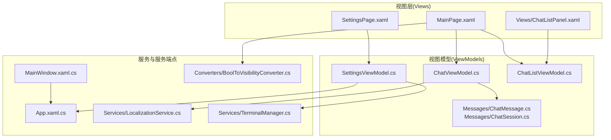
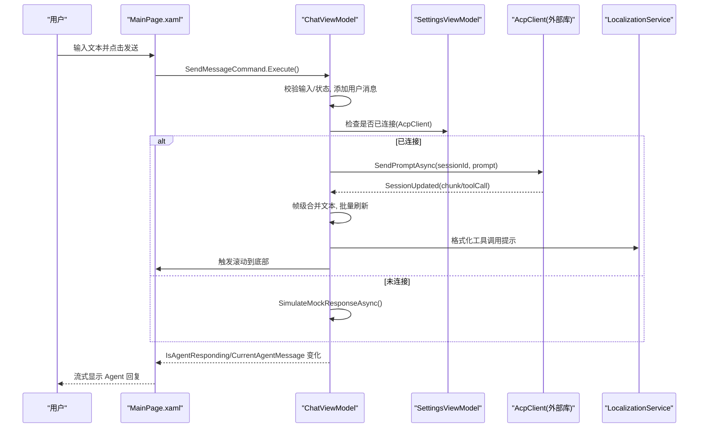
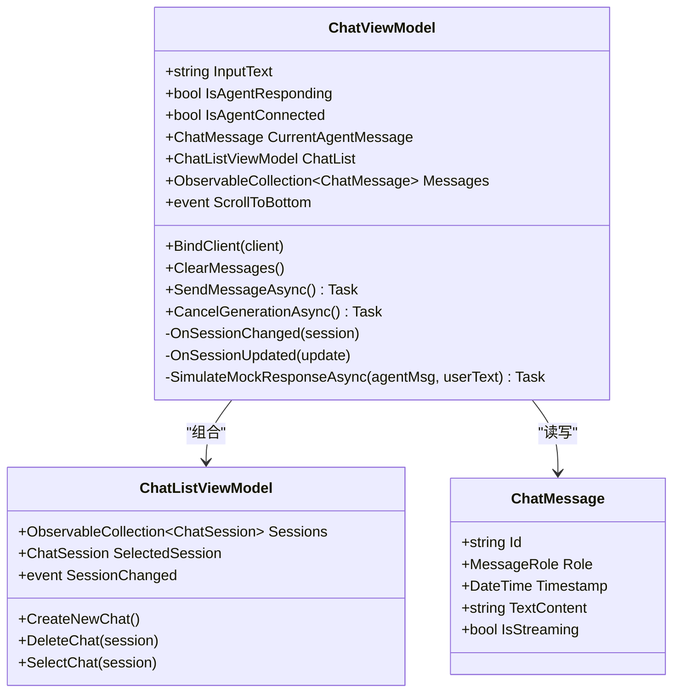
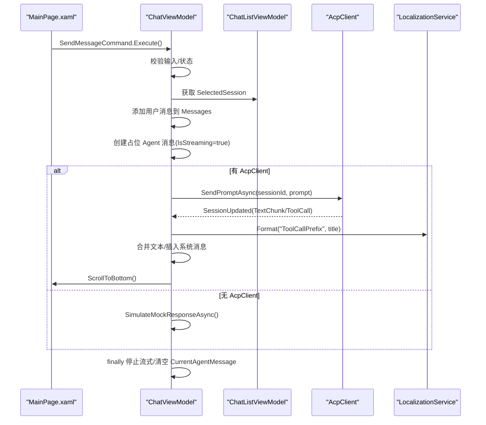
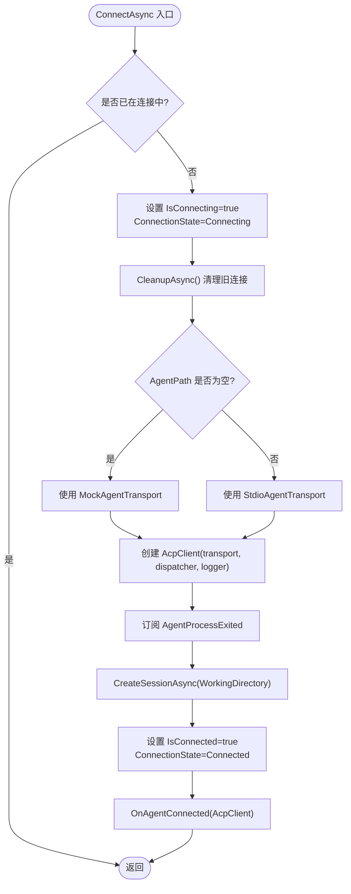
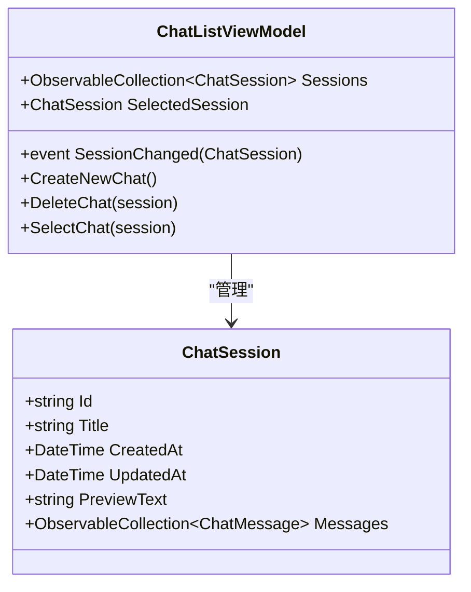
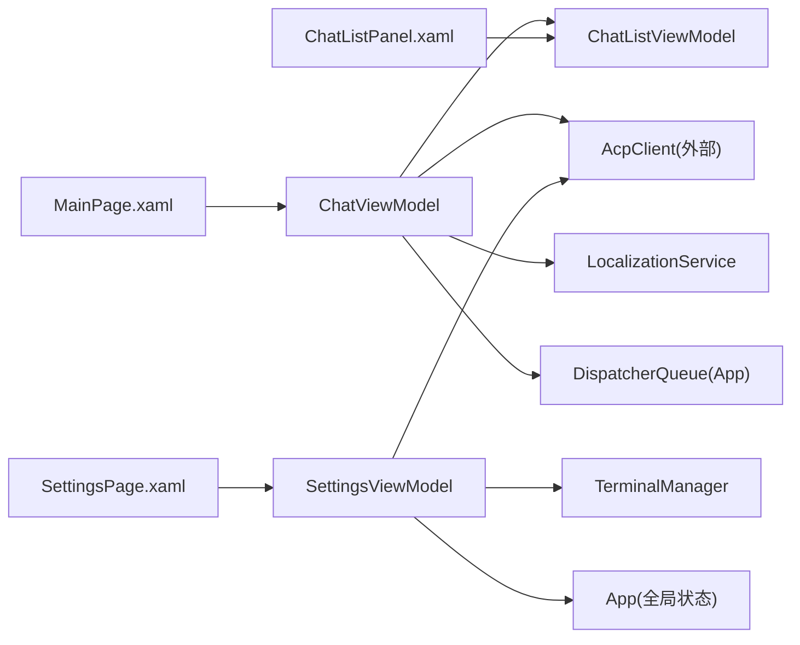

# MVVM 模式设计

<cite>
**本文引用的文件**   
- [ChatViewModel.cs](file://Agentic.Desktop/ViewModels/ChatViewModel.cs)
- [SettingsViewModel.cs](file://Agentic.Desktop/ViewModels/SettingsViewModel.cs)
- [ChatListViewModel.cs](file://Agentic.Desktop/ViewModels/ChatListViewModel.cs)
- [ChatMessage.cs](file://Agentic.Desktop/ViewModels/Messages/ChatMessage.cs)
- [ChatSession.cs](file://Agentic.Desktop/ViewModels/Messages/ChatSession.cs)
- [MainPage.xaml.cs](file://Agentic.Desktop/MainPage.xaml.cs)
- [MainPage.xaml](file://Agentic.Desktop/MainPage.xaml)
- [SettingsPage.xaml](file://Agentic.Desktop/SettingsPage.xaml)
- [ChatListPanel.xaml](file://Agentic.Desktop/Views/ChatListPanel.xaml)
- [App.xaml.cs](file://Agentic.Desktop/App.xaml.cs)
- [MainWindow.xaml.cs](file://Agentic.Desktop/MainWindow.xaml.cs)
- [BoolToVisibilityConverter.cs](file://Agentic.Desktop/Converters/BoolToVisibilityConverter.cs)
- [LocalizationService.cs](file://Agentic.Desktop/Services/LocalizationService.cs)
- [TerminalManager.cs](file://Agentic.Desktop/Services/TerminalManager.cs)
</cite>

## 目录
1. [简介](#简介)
2. [项目结构](#项目结构)
3. [核心组件](#核心组件)
4. [架构总览](#架构总览)
5. [详细组件分析](#详细组件分析)
6. [依赖关系分析](#依赖关系分析)
7. [性能考量](#性能考量)
8. [故障排查指南](#故障排查指南)
9. [结论](#结论)
10. [附录](#附录)

## 简介
本文件系统化阐述 Agentic.Desktop 中的 MVVM（Model-View-ViewModel）设计实现，重点覆盖：
- ViewModel 的职责分离与数据绑定机制
- 命令模式的实践（CommunityToolkit.Mvvm 的 [RelayCommand]）
- 属性变更通知（[ObservableProperty]、INotifyPropertyChanged）
- ChatViewModel、SettingsViewModel、ChatListViewModel 的设计与交互
- 双向数据绑定、命令处理、异步流式更新与 UI 线程调度
- 使用 CommunityToolkit.Mvvm 的最佳实践与注意事项

## 项目结构
项目采用典型的 WinUI 3 + MVVM 分层组织：
- Views：XAML 页面与用户控件，负责展示与用户交互
- ViewModels：业务状态与交互逻辑，通过数据绑定驱动 UI
- Services：跨层服务（本地化、终端管理等）
- Converters：值转换器，用于 XAML 绑定时的类型转换
- Messages：聊天消息与会话的数据模型

图表来源
- [MainPage.xaml:1-163](file://Agentic.Desktop/MainPage.xaml#L1-L163)
- [SettingsPage.xaml:1-121](file://Agentic.Desktop/SettingsPage.xaml#L1-L121)
- [ChatListPanel.xaml:1-88](file://Agentic.Desktop/Views/ChatListPanel.xaml#L1-L88)
- [ChatViewModel.cs:1-237](file://Agentic.Desktop/ViewModels/ChatViewModel.cs#L1-L237)
- [SettingsViewModel.cs:1-162](file://Agentic.Desktop/ViewModels/SettingsViewModel.cs#L1-L162)
- [ChatListViewModel.cs:1-64](file://Agentic.Desktop/ViewModels/ChatListViewModel.cs#L1-L64)
- [ChatMessage.cs:1-39](file://Agentic.Desktop/ViewModels/Messages/ChatMessage.cs#L1-L39)
- [ChatSession.cs:1-28](file://Agentic.Desktop/ViewModels/Messages/ChatSession.cs#L1-L28)
- [App.xaml.cs:1-85](file://Agentic.Desktop/App.xaml.cs#L1-L85)
- [MainWindow.xaml.cs:1-97](file://Agentic.Desktop/MainWindow.xaml.cs#L1-L97)
- [LocalizationService.cs:1-23](file://Agentic.Desktop/Services/LocalizationService.cs#L1-L23)
- [TerminalManager.cs:1-161](file://Agentic.Desktop/Services/TerminalManager.cs#L1-L161)
- [BoolToVisibilityConverter.cs:1-28](file://Agentic.Desktop/Converters/BoolToVisibilityConverter.cs#L1-L28)

章节来源
- [MainPage.xaml.cs:1-105](file://Agentic.Desktop/MainPage.xaml.cs#L1-L105)
- [MainWindow.xaml.cs:1-97](file://Agentic.Desktop/MainWindow.xaml.cs#L1-L97)
- [App.xaml.cs:1-85](file://Agentic.Desktop/App.xaml.cs#L1-L85)

## 核心组件
- ChatViewModel：管理当前会话的消息集合、发送/取消生成、流式响应合并与 UI 刷新。持有 ChatListViewModel，订阅其会话切换事件。
- SettingsViewModel：维护连接配置、建立/断开 AcpClient、进程退出监听、全局连接状态同步。
- ChatListViewModel：会话列表与选中项管理，提供新建/删除/选择会话的命令。
- ChatMessage/ChatSession：可观察的数据模型，承载消息文本、流式状态与会元信息。
- App/MainWindow：应用级入口与窗口导航，提供 DispatcherQueue 与全局 AcpClient 状态广播。

章节来源
- [ChatViewModel.cs:1-237](file://Agentic.Desktop/ViewModels/ChatViewModel.cs#L1-L237)
- [SettingsViewModel.cs:1-162](file://Agentic.Desktop/ViewModels/SettingsViewModel.cs#L1-L162)
- [ChatListViewModel.cs:1-64](file://Agentic.Desktop/ViewModels/ChatListViewModel.cs#L1-L64)
- [ChatMessage.cs:1-39](file://Agentic.Desktop/ViewModels/Messages/ChatMessage.cs#L1-L39)
- [ChatSession.cs:1-28](file://Agentic.Desktop/ViewModels/Messages/ChatSession.cs#L1-L28)
- [App.xaml.cs:1-85](file://Agentic.Desktop/App.xaml.cs#L1-L85)
- [MainWindow.xaml.cs:1-97](file://Agentic.Desktop/MainWindow.xaml.cs#L1-L97)

## 架构总览
MVVM 在该项目中的职责划分清晰：
- View（XAML）仅做声明式绑定与样式呈现，不承载业务逻辑
- ViewModel 暴露属性与命令，封装业务状态与流程
- Model（消息/会话）为纯数据对象，配合 ObservableObject 提供变更通知
- 服务层（本地化、终端管理）被 ViewModel 调用以完成外部交互

图表来源
- [MainPage.xaml:128-156](file://Agentic.Desktop/MainPage.xaml#L128-L156)
- [ChatViewModel.cs:96-151](file://Agentic.Desktop/ViewModels/ChatViewModel.cs#L96-L151)
- [ChatViewModel.cs:153-206](file://Agentic.Desktop/ViewModels/ChatViewModel.cs#L153-L206)
- [LocalizationService.cs:1-23](file://Agentic.Desktop/Services/LocalizationService.cs#L1-L23)

## 详细组件分析

### ChatViewModel 分析
职责与要点：
- 属性变更通知：使用 [ObservableProperty] 自动生成 INotifyPropertyChanged 实现
- 命令：使用 [RelayCommand] 暴露 SendMessageAsync、CancelGenerationAsync
- 数据绑定：
  - InputText 双向绑定到输入框
  - Messages 单向绑定到 ItemsRepeater
  - IsAgentResponding/IsAgentConnected 控制按钮可用性与可见性
- 流式更新：
  - OnSessionUpdated 接收分片文本，进行帧级合并（锁+延迟批处理）
  - 通过 DispatcherQueue.TryEnqueue 确保 UI 线程安全更新
- 会话切换：
  - 订阅 ChatListViewModel.SessionChanged，自动切换消息集合与滚动行为
  - 取消正在进行的流式生成，避免数据损坏

图表来源
- [ChatViewModel.cs:11-237](file://Agentic.Desktop/ViewModels/ChatViewModel.cs#L11-L237)
- [ChatListViewModel.cs:1-64](file://Agentic.Desktop/ViewModels/ChatListViewModel.cs#L1-L64)
- [ChatMessage.cs:1-39](file://Agentic.Desktop/ViewModels/Messages/ChatMessage.cs#L1-L39)

章节来源
- [ChatViewModel.cs:1-237](file://Agentic.Desktop/ViewModels/ChatViewModel.cs#L1-L237)
- [MainPage.xaml.cs:1-105](file://Agentic.Desktop/MainPage.xaml.cs#L1-L105)
- [MainPage.xaml:108-156](file://Agentic.Desktop/MainPage.xaml#L108-L156)

#### 发送消息序列图

图表来源
- [ChatViewModel.cs:96-151](file://Agentic.Desktop/ViewModels/ChatViewModel.cs#L96-L151)
- [ChatViewModel.cs:153-206](file://Agentic.Desktop/ViewModels/ChatViewModel.cs#L153-L206)
- [LocalizationService.cs:1-23](file://Agentic.Desktop/Services/LocalizationService.cs#L1-L23)

### SettingsViewModel 分析
职责与要点：
- 属性变更通知：[ObservableProperty] 暴露路径、参数、工作目录、连接状态等
- 命令：ConnectAsync、DisconnectAsync 管理 AcpClient 生命周期
- 连接流程：
  - 根据配置选择 MockAgentTransport 或 StdioAgentTransport
  - 初始化 JsonRpcDispatcher、Logger、AcpClient
  - 订阅 AgentProcessExited，异常时回滚状态
  - 创建会话后通过 OnAgentConnected 回调通知 ChatViewModel
- 全局状态同步：Disconnect 时调用 App.SetAcpClient(null) 广播

图表来源
- [SettingsViewModel.cs:60-126](file://Agentic.Desktop/ViewModels/SettingsViewModel.cs#L60-L126)
- [App.xaml.cs:78-84](file://Agentic.Desktop/App.xaml.cs#L78-L84)

章节来源
- [SettingsViewModel.cs:1-162](file://Agentic.Desktop/ViewModels/SettingsViewModel.cs#L1-L162)
- [App.xaml.cs:42-84](file://Agentic.Desktop/App.xaml.cs#L42-L84)

### ChatListViewModel 分析
职责与要点：
- 维护会话集合与选中会话
- 提供新建、删除、选择会话的命令
- 选择会话时触发 SessionChanged 事件，供 ChatViewModel 订阅并切换消息源

图表来源
- [ChatListViewModel.cs:1-64](file://Agentic.Desktop/ViewModels/ChatListViewModel.cs#L1-L64)
- [ChatSession.cs:1-28](file://Agentic.Desktop/ViewModels/Messages/ChatSession.cs#L1-L28)

章节来源
- [ChatListViewModel.cs:1-64](file://Agentic.Desktop/ViewModels/ChatListViewModel.cs#L1-L64)
- [ChatSession.cs:1-28](file://Agentic.Desktop/ViewModels/Messages/ChatSession.cs#L1-L28)

### 数据模型与属性变更通知
- ChatMessage/ChatSession 继承自 ObservableObject，使用 [ObservableProperty] 自动生成属性变更通知
- 优点：减少样板代码，提升可读性与一致性；适合频繁更新的流式文本与布尔状态

章节来源
- [ChatMessage.cs:1-39](file://Agentic.Desktop/ViewModels/Messages/ChatMessage.cs#L1-L39)
- [ChatSession.cs:1-28](file://Agentic.Desktop/ViewModels/Messages/ChatSession.cs#L1-L28)

### 数据绑定与命令模式示例（路径引用）
- 双向绑定输入框：
  - [MainPage.xaml:128-136](file://Agentic.Desktop/MainPage.xaml#L128-L136)
- 命令绑定发送/取消：
  - [MainPage.xaml:139-156](file://Agentic.Desktop/MainPage.xaml#L139-L156)
- 列表与选中项绑定：
  - [ChatListPanel.xaml:44-48](file://Agentic.Desktop/Views/ChatListPanel.xaml#L44-L48)
- 条件可见性转换：
  - [BoolToVisibilityConverter.cs:10-27](file://Agentic.Desktop/Converters/BoolToVisibilityConverter.cs#L10-L27)

章节来源
- [MainPage.xaml:128-156](file://Agentic.Desktop/MainPage.xaml#L128-L156)
- [ChatListPanel.xaml:44-48](file://Agentic.Desktop/Views/ChatListPanel.xaml#L44-L48)
- [BoolToVisibilityConverter.cs:10-27](file://Agentic.Desktop/Converters/BoolToVisibilityConverter.cs#L10-L27)

### UI 线程调度与异步处理
- DispatcherQueue：
  - App.DispatcherQueue 作为全局 UI 线程调度器
  - MainWindow.UpdateConnectionStatus 使用 TryEnqueue 更新 UI
- ChatViewModel 流式更新：
  - OnSessionUpdated 中使用 _dispatcherQueue.TryEnqueue 将文本追加到 UI 线程
  - 帧级合并策略：累积文本，延迟 50ms 批量刷新，降低 UI 重绘开销

章节来源
- [App.xaml.cs:27-31](file://Agentic.Desktop/App.xaml.cs#L27-L31)
- [MainWindow.xaml.cs:29-50](file://Agentic.Desktop/MainWindow.xaml.cs#L29-L50)
- [ChatViewModel.cs:153-206](file://Agentic.Desktop/ViewModels/ChatViewModel.cs#L153-L206)

## 依赖关系分析
- ChatViewModel 依赖：
  - ChatListViewModel（会话管理与事件）
  - AcpClient（外部库，发送/取消/会话更新）
  - LocalizationService（本地化字符串）
  - DispatcherQueue（UI 线程调度）
- SettingsViewModel 依赖：
  - AcpClient、JsonRpcDispatcher、LoggerFactory
  - TerminalManager（可选，用于终端输出）
  - App（全局 AcpClient 状态广播）
- View 依赖：
  - 各 ViewModel（通过 x:Bind 绑定）
  - 值转换器（BoolToVisibilityConverter）

图表来源
- [ChatViewModel.cs:1-237](file://Agentic.Desktop/ViewModels/ChatViewModel.cs#L1-L237)
- [SettingsViewModel.cs:1-162](file://Agentic.Desktop/ViewModels/SettingsViewModel.cs#L1-L162)
- [App.xaml.cs:42-84](file://Agentic.Desktop/App.xaml.cs#L42-L84)
- [MainPage.xaml.cs:1-105](file://Agentic.Desktop/MainPage.xaml.cs#L1-L105)
- [ChatListPanel.xaml:1-88](file://Agentic.Desktop/Views/ChatListPanel.xaml#L1-L88)

章节来源
- [ChatViewModel.cs:1-237](file://Agentic.Desktop/ViewModels/ChatViewModel.cs#L1-L237)
- [SettingsViewModel.cs:1-162](file://Agentic.Desktop/ViewModels/SettingsViewModel.cs#L1-L162)
- [App.xaml.cs:42-84](file://Agentic.Desktop/App.xaml.cs#L42-L84)

## 性能考量
- 流式文本合并：
  - 使用锁保护共享缓冲区，避免并发写入竞争
  - 延迟 50ms 批量刷新，减少 UI 重绘频率
- 集合操作：
  - ObservableCollection 的 Add/Clear 会触发 UI 更新，应谨慎在高频循环中调用
- 异步任务：
  - 所有 I/O 与网络请求均使用 async/await，避免阻塞 UI 线程
- 资源释放：
  - SettingsViewModel.CleanupAsync 确保 AcpClient 与 TerminalManager 正确释放

章节来源
- [ChatViewModel.cs:153-206](file://Agentic.Desktop/ViewModels/ChatViewModel.cs#L153-L206)
- [SettingsViewModel.cs:142-160](file://Agentic.Desktop/ViewModels/SettingsViewModel.cs#L142-L160)
- [TerminalManager.cs:115-128](file://Agentic.Desktop/Services/TerminalManager.cs#L115-L128)

## 故障排查指南
- 连接失败：
  - 检查 SettingsViewModel.ConnectAsync 的异常分支，确认 ConnectionStatus 与 ConnectionState 是否正确回滚
- 流式更新卡顿：
  - 检查 OnSessionUpdated 的帧级合并逻辑，确认 _flushScheduled 与 _pendingText 的状态
- UI 未刷新：
  - 确认所有 UI 修改都通过 DispatcherQueue.TryEnqueue 调度
- 会话切换异常：
  - 检查 ChatListViewModel.SelectChat 是否触发 SessionChanged，以及 ChatViewModel.OnSessionChanged 是否正确订阅/取消订阅

章节来源
- [SettingsViewModel.cs:115-126](file://Agentic.Desktop/ViewModels/SettingsViewModel.cs#L115-L126)
- [ChatViewModel.cs:52-74](file://Agentic.Desktop/ViewModels/ChatViewModel.cs#L52-L74)
- [MainWindow.xaml.cs:29-50](file://Agentic.Desktop/MainWindow.xaml.cs#L29-L50)

## 结论
本项目通过清晰的 MVVM 分层与 CommunityToolkit.Mvvm 的强大特性，实现了高内聚、低耦合的可维护架构：
- ViewModel 专注业务状态与流程，View 专注展示与交互
- 使用 [ObservableProperty] 与 [RelayCommand] 简化属性通知与命令实现
- 通过 DispatcherQueue 保证 UI 线程安全，结合帧级合并优化流式更新体验
- 借助 App 全局状态与事件机制，实现跨页面连接状态的同步

## 附录
- 双向数据绑定最佳实践：
  - 输入框使用 TwoWay 绑定，UpdateSourceTrigger=PropertyChanged 实时同步
  - 只读展示使用 OneWay 绑定，避免不必要的写回
- 命令处理建议：
  - 使用 CanExecute 控制按钮可用性（如 IsAgentResponding）
  - 长耗时操作统一使用 async Task，避免阻塞 UI
- 属性变更通知：
  - 优先使用 [ObservableProperty]，减少手写 OnPropertyChanged
  - 复杂计算属性可在 setter 中触发通知