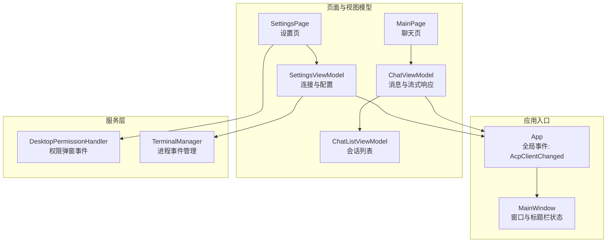
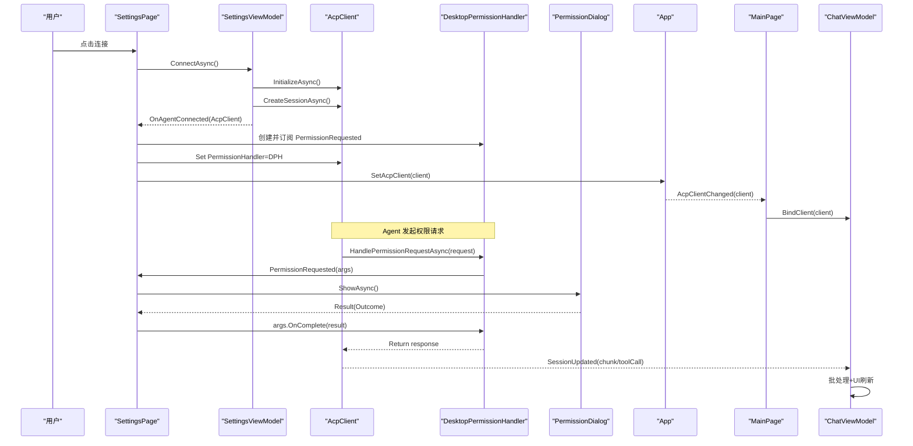
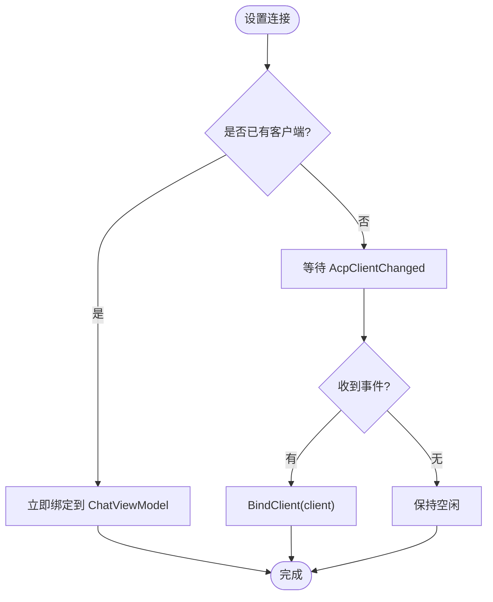
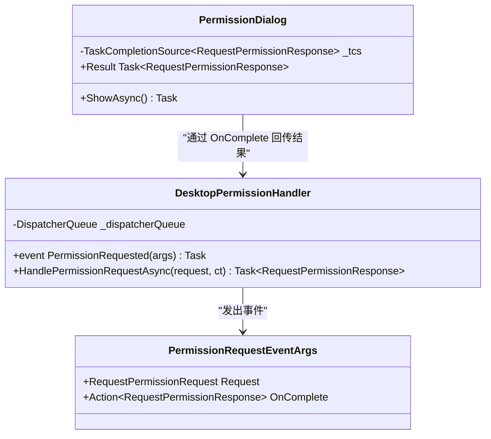
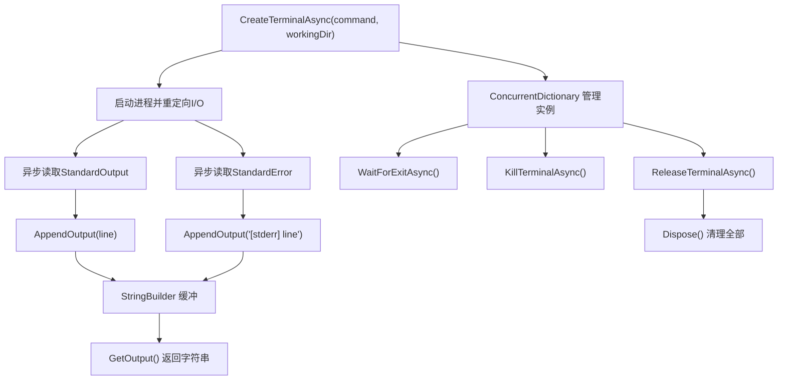
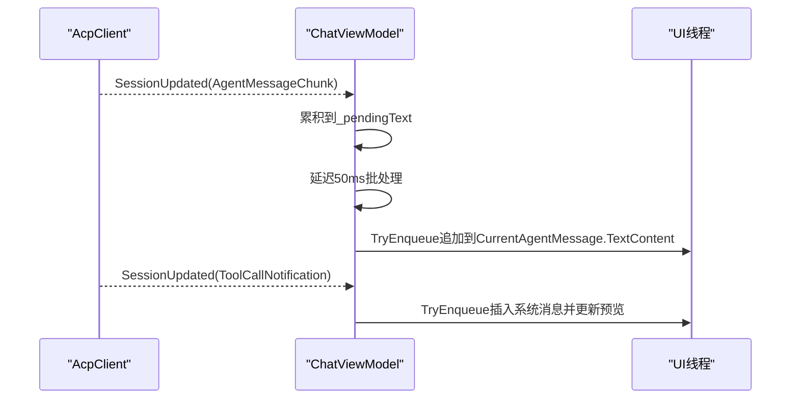
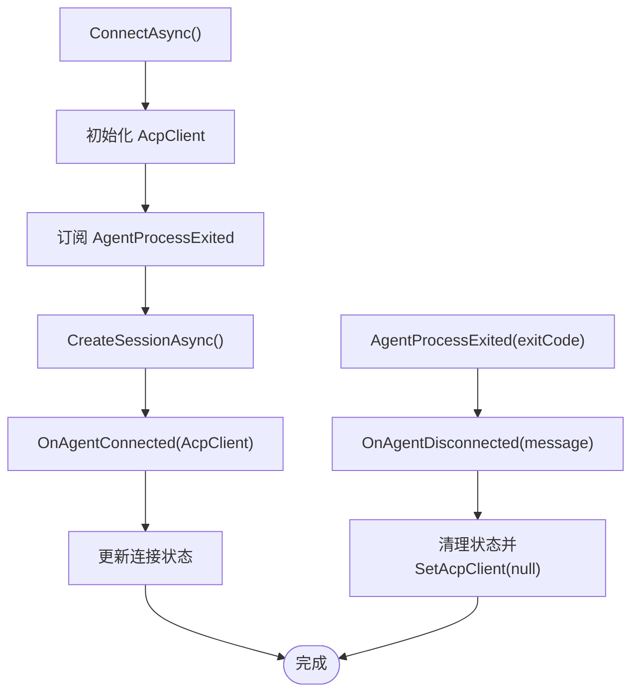
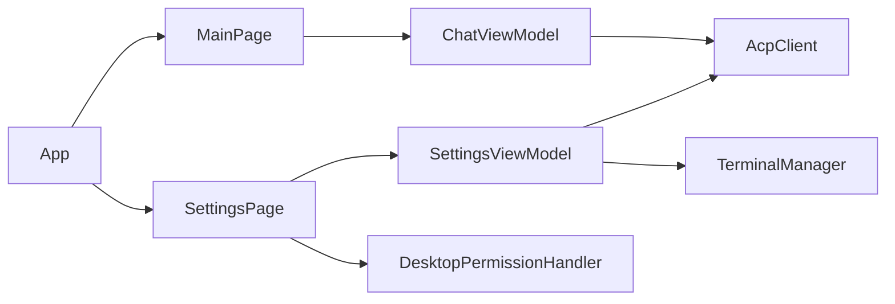
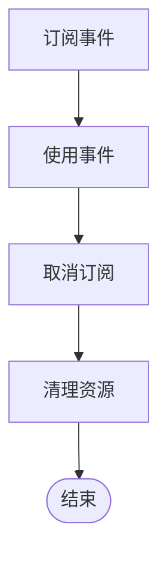

# 事件驱动架构

<cite>
**本文引用的文件**   
- [App.xaml.cs](file://Agentic.Desktop/App.xaml.cs)
- [MainWindow.xaml.cs](file://Agentic.Desktop/MainWindow.xaml.cs)
- [MainPage.xaml.cs](file://Agentic.Desktop/MainPage.xaml.cs)
- [SettingsPage.xaml.cs](file://Agentic.Desktop/SettingsPage.xaml.cs)
- [PermissionHandler.cs](file://Agentic.Desktop/Services/PermissionHandler.cs)
- [TerminalManager.cs](file://Agentic.Desktop/Services/TerminalManager.cs)
- [ChatViewModel.cs](file://Agentic.Desktop/ViewModels/ChatViewModel.cs)
- [SettingsViewModel.cs](file://Agentic.Desktop/ViewModels/SettingsViewModel.cs)
- [ChatListViewModel.cs](file://Agentic.Desktop/ViewModels/ChatListViewModel.cs)
</cite>

## 目录
1. [简介](#简介)
2. [项目结构](#项目结构)
3. [核心组件](#核心组件)
4. [架构总览](#架构总览)
5. [详细组件分析](#详细组件分析)
6. [依赖关系分析](#依赖关系分析)
7. [性能考虑](#性能考虑)
8. [故障排查指南](#故障排查指南)
9. [结论](#结论)
10. [附录：最佳实践与流程图](#附录最佳实践与流程图)

## 简介
本文件面向 Agentic.Desktop 的事件驱动架构，系统性梳理事件总线、事件类型定义、回调机制以及跨组件通信模式。重点覆盖以下方面：
- AcpClientChanged 事件的订阅与发布机制（全局连接状态变更）
- PermissionHandler 中的权限请求事件处理流程（UI 弹窗与异步结果回传）
- TerminalManager 的进程事件管理与资源生命周期
- 事件监听器生命周期管理、内存泄漏防护与性能优化策略
- 异步事件处理与错误传播方式
- 事件流程图与最佳实践，帮助在保持组件松耦合的同时实现高效通信

## 项目结构
应用采用 WinUI 3 + MVVM 分层组织，事件驱动贯穿 UI、ViewModel 与服务层：
- App 层提供全局事件总线（AcpClientChanged）与 UI 线程调度器（DispatcherQueue）
- SettingsPage/SettingsViewModel 负责连接建立、权限处理器装配与终端管理器注入
- MainPage/ChatViewModel 订阅连接变化并绑定 AcpClient，处理会话更新事件
- Services 层封装具体能力：权限弹窗（DesktopPermissionHandler）、进程管理（TerminalManager）

图表来源
- [App.xaml.cs:18-84](file://Agentic.Desktop/App.xaml.cs#L18-L84)
- [MainWindow.xaml.cs:14-96](file://Agentic.Desktop/MainWindow.xaml.cs#L14-L96)
- [SettingsPage.xaml.cs:10-96](file://Agentic.Desktop/SettingsPage.xaml.cs#L10-L96)
- [SettingsViewModel.cs:15-162](file://Agentic.Desktop/ViewModels/SettingsViewModel.cs#L15-L162)
- [MainPage.xaml.cs:12-81](file://Agentic.Desktop/MainPage.xaml.cs#L12-L81)
- [ChatViewModel.cs:11-237](file://Agentic.Desktop/ViewModels/ChatViewModel.cs#L11-L237)
- [ChatListViewModel.cs:8-64](file://Agentic.Desktop/ViewModels/ChatListViewModel.cs#L8-L64)
- [PermissionHandler.cs:11-51](file://Agentic.Desktop/Services/PermissionHandler.cs#L11-L51)
- [TerminalManager.cs:11-161](file://Agentic.Desktop/Services/TerminalManager.cs#L11-L161)

章节来源
- [App.xaml.cs:18-84](file://Agentic.Desktop/App.xaml.cs#L18-L84)
- [SettingsPage.xaml.cs:10-96](file://Agentic.Desktop/SettingsPage.xaml.cs#L10-L96)
- [SettingsViewModel.cs:15-162](file://Agentic.Desktop/ViewModels/SettingsViewModel.cs#L15-L162)
- [MainPage.xaml.cs:12-81](file://Agentic.Desktop/MainPage.xaml.cs#L12-L81)
- [ChatViewModel.cs:11-237](file://Agentic.Desktop/ViewModels/ChatViewModel.cs#L11-L237)
- [ChatListViewModel.cs:8-64](file://Agentic.Desktop/ViewModels/ChatListViewModel.cs#L8-L64)
- [PermissionHandler.cs:11-51](file://Agentic.Desktop/Services/PermissionHandler.cs#L11-L51)
- [TerminalManager.cs:11-161](file://Agentic.Desktop/Services/TerminalManager.cs#L11-L161)

## 核心组件
- 全局事件总线（App.AcpClientChanged）
  - 用于通知所有订阅者当前连接的 IAcpClient 实例或断开状态
  - 通过静态方法 SetAcpClient 触发，确保 UI 与 ViewModel 同步
- 权限处理器（DesktopPermissionHandler）
  - 暴露 PermissionRequested 事件，携带 Request 与 OnComplete 回调
  - 使用 DispatcherQueue 将事件派发至 UI 线程，显示权限对话框
- 终端管理器（TerminalManager）
  - 管理多个子进程实例，异步读取 stdout/stderr，支持等待退出、终止与释放
  - 实现 IDisposable，集中清理资源，避免泄漏
- 视图模型事件
  - ChatViewModel：SessionUpdated 事件（来自 AcpClient），内部聚合流式文本，批量刷新 UI
  - SettingsViewModel：OnAgentConnected/OnAgentDisconnected 回调，桥接外部页面与连接状态
  - ChatListViewModel：SessionChanged 事件，通知选中会话变更

章节来源
- [App.xaml.cs:46-84](file://Agentic.Desktop/App.xaml.cs#L46-L84)
- [PermissionHandler.cs:11-51](file://Agentic.Desktop/Services/PermissionHandler.cs#L11-L51)
- [TerminalManager.cs:11-161](file://Agentic.Desktop/Services/TerminalManager.cs#L11-L161)
- [ChatViewModel.cs:11-237](file://Agentic.Desktop/ViewModels/ChatViewModel.cs#L11-L237)
- [SettingsViewModel.cs:15-162](file://Agentic.Desktop/ViewModels/SettingsViewModel.cs#L15-L162)
- [ChatListViewModel.cs:8-64](file://Agentic.Desktop/ViewModels/ChatListViewModel.cs#L8-L64)

## 架构总览
事件驱动的核心在于“发布者-订阅者”解耦：
- App 作为全局事件源，统一分发连接状态变更
- SettingsPage 在连接成功后装配权限处理器与文件系统处理器，并将 AcpClient 注入到 AcpClient
- MainPage 订阅 App.AcpClientChanged，根据连接状态绑定或清空消息
- ChatViewModel 订阅 AcpClient.SessionUpdated，进行流式合并与 UI 更新
- TerminalManager 以进程事件为中心，提供异步 I/O 与生命周期管理

图表来源
- [SettingsPage.xaml.cs:19-43](file://Agentic.Desktop/SettingsPage.xaml.cs#L19-L43)
- [SettingsViewModel.cs:60-126](file://Agentic.Desktop/ViewModels/SettingsViewModel.cs#L60-L126)
- [App.xaml.cs:78-84](file://Agentic.Desktop/App.xaml.cs#L78-L84)
- [MainPage.xaml.cs:26-47](file://Agentic.Desktop/MainPage.xaml.cs#L26-L47)
- [PermissionHandler.cs:26-44](file://Agentic.Desktop/Services/PermissionHandler.cs#L26-L44)

## 详细组件分析

### AcpClientChanged 事件总线（App）
- 设计要点
  - 静态事件 AcpClientChanged，配合 CurrentAcpClient 属性，形成全局连接状态中心
  - SetAcpClient 原子更新并广播，保证多订阅者一致性
- 订阅与发布
  - MainPage 在构造时立即检查 CurrentAcpClient 并绑定；同时订阅未来变更
  - SettingsPage 在断开时调用 SetAcpClient(null)，触发清理逻辑
- 错误传播
  - 断开场景由 SettingsViewModel 的 OnAgentDisconnected 回调驱动，最终通过 App.SetAcpClient(null) 通知全局

章节来源
- [App.xaml.cs:46-84](file://Agentic.Desktop/App.xaml.cs#L46-L84)
- [MainPage.xaml.cs:26-47](file://Agentic.Desktop/MainPage.xaml.cs#L26-L47)
- [SettingsViewModel.cs:129-140](file://Agentic.Desktop/ViewModels/SettingsViewModel.cs#L129-L140)

### PermissionHandler 权限请求事件处理
- 事件类型与参数
  - PermissionRequested 事件，参数为 PermissionRequestEventArgs，包含 Request 与 OnComplete
- 处理流程
  - DesktopPermissionHandler 将事件派发至 UI 线程，显示 PermissionDialog
  - 用户选择后，PermissionDialog 返回 Outcome，调用 OnComplete 回传结果
- 生命周期与异常
  - TaskCompletionSource 用于等待用户交互结果
  - 若未正确调用 OnComplete，HandlePermissionRequestAsync 将一直挂起

图表来源
- [PermissionHandler.cs:11-51](file://Agentic.Desktop/Services/PermissionHandler.cs#L11-L51)
- [SettingsPage.xaml.cs:23-34](file://Agentic.Desktop/SettingsPage.xaml.cs#L23-L34)

章节来源
- [PermissionHandler.cs:11-51](file://Agentic.Desktop/Services/PermissionHandler.cs#L11-L51)
- [SettingsPage.xaml.cs:23-34](file://Agentic.Desktop/SettingsPage.xaml.cs#L23-L34)

### TerminalManager 进程事件管理
- 功能概述
  - 创建 Shell 进程，异步读取标准输出与错误输出，缓冲到内存
  - 提供获取输出、等待退出、终止进程、释放资源等接口
- 并发与锁
  - 使用 ConcurrentDictionary 管理多实例
  - 使用 StringBuilder 与 lock 保护输出缓冲区
- 生命周期
  - ReleaseTerminalAsync 移除实例并释放进程
  - Dispose 遍历所有实例，强制终止并释放资源

章节来源
- [TerminalManager.cs:11-161](file://Agentic.Desktop/Services/TerminalManager.cs#L11-L161)

### ChatViewModel 会话更新与流式合并
- 事件订阅
  - 订阅 AcpClient.SessionUpdated，处理 AgentMessageChunk 与 ToolCallNotification
- 流式合并
  - 使用 pendingText 与 flushScheduled 控制批处理，延迟 50ms 合并文本，减少 UI 刷新频率
- UI 线程安全
  - 通过 DispatcherQueue.TryEnqueue 确保 UI 更新在主线程执行
- 取消与错误
  - OperationCanceledException 捕获，finally 中重置 IsStreaming 状态

章节来源
- [ChatViewModel.cs:153-206](file://Agentic.Desktop/ViewModels/ChatViewModel.cs#L153-L206)
- [ChatViewModel.cs:123-151](file://Agentic.Desktop/ViewModels/ChatViewModel.cs#L123-L151)

### SettingsViewModel 连接与断连事件
- 连接流程
  - 初始化 AcpClient，订阅 AgentProcessExited，设置 TerminalHandler
  - 创建会话后，通过 OnAgentConnected 回调通知外部页面
- 断连处理
  - AgentProcessExited 触发 OnAgentDisconnected，页面更新状态并调用 App.SetAcpClient(null)
- 资源清理
  - CleanupAsync 解除订阅、关闭 AcpClient、释放 TerminalManager

章节来源
- [SettingsViewModel.cs:60-126](file://Agentic.Desktop/ViewModels/SettingsViewModel.cs#L60-L126)
- [SettingsViewModel.cs:129-160](file://Agentic.Desktop/ViewModels/SettingsViewModel.cs#L129-L160)

## 依赖关系分析
- 组件耦合度
  - App 作为全局事件源，被 MainPage 与 SettingsPage 订阅，低耦合高内聚
  - SettingsPage 负责装配权限处理器与文件系统处理器，注入 AcpClient，职责清晰
  - ChatViewModel 仅依赖 AcpClient 事件，不感知 UI 细节
- 直接依赖
  - SettingsViewModel 依赖 AcpClient、TerminalManager、LoggerFactory
  - DesktopPermissionHandler 依赖 DispatcherQueue 与 UI 库
  - TerminalManager 依赖 System.Diagnostics.Process
- 潜在循环依赖
  - 未发现循环引用；事件通过回调与事件总线解耦

图表来源
- [App.xaml.cs:46-84](file://Agentic.Desktop/App.xaml.cs#L46-L84)
- [SettingsPage.xaml.cs:19-43](file://Agentic.Desktop/SettingsPage.xaml.cs#L19-L43)
- [SettingsViewModel.cs:60-126](file://Agentic.Desktop/ViewModels/SettingsViewModel.cs#L60-L126)
- [MainPage.xaml.cs:26-47](file://Agentic.Desktop/MainPage.xaml.cs#L26-L47)
- [ChatViewModel.cs:77-87](file://Agentic.Desktop/ViewModels/ChatViewModel.cs#L77-L87)

章节来源
- [App.xaml.cs:46-84](file://Agentic.Desktop/App.xaml.cs#L46-L84)
- [SettingsPage.xaml.cs:19-43](file://Agentic.Desktop/SettingsPage.xaml.cs#L19-L43)
- [SettingsViewModel.cs:60-126](file://Agentic.Desktop/ViewModels/SettingsViewModel.cs#L60-L126)
- [MainPage.xaml.cs:26-47](file://Agentic.Desktop/MainPage.xaml.cs#L26-L47)
- [ChatViewModel.cs:77-87](file://Agentic.Desktop/ViewModels/ChatViewModel.cs#L77-L87)

## 性能考虑
- 事件批处理
  - ChatViewModel 对流式文本进行 50ms 批处理，降低 UI 刷新频率，提升渲染性能
- 线程调度
  - 使用 DispatcherQueue.TryEnqueue 确保 UI 操作在主线程执行，避免跨线程异常
- 资源管理
  - TerminalManager.Dispose 集中清理进程与缓冲区，防止内存泄漏
  - SettingsViewModel.CleanupAsync 解除事件订阅，避免悬挂引用
- 异步取消
  - 多处使用 CancellationToken，支持优雅取消长时间任务

[本节为通用性能建议，不直接分析具体文件]

## 故障排查指南
- 权限弹窗不出现
  - 检查 DesktopPermissionHandler.PermissionRequested 是否正确订阅
  - 确认 DispatcherQueue 已初始化并在 UI 线程调用
- 连接状态不同步
  - 确认 App.SetAcpClient 在所有连接/断开路径中被调用
  - 检查 MainPage 是否订阅了 App.AcpClientChanged
- 进程未释放
  - 确保 ReleaseTerminalAsync 或 Dispose 被调用
  - 检查是否有未处理的异常导致提前退出
- 流式输出卡顿
  - 调整批处理延迟时间，观察 UI 刷新频率
  - 检查是否存在过多 UI 更新操作

章节来源
- [PermissionHandler.cs:26-44](file://Agentic.Desktop/Services/PermissionHandler.cs#L26-L44)
- [App.xaml.cs:78-84](file://Agentic.Desktop/App.xaml.cs#L78-L84)
- [TerminalManager.cs:115-128](file://Agentic.Desktop/Services/TerminalManager.cs#L115-L128)
- [ChatViewModel.cs:153-206](file://Agentic.Desktop/ViewModels/ChatViewModel.cs#L153-L206)

## 结论
Agentic.Desktop 的事件驱动架构通过 App 全局事件总线、权限处理器事件与进程事件管理，实现了组件间的松耦合通信。借助 DispatcherQueue 与 TaskCompletionSource，确保了 UI 线程安全与异步交互的正确性。通过批处理与资源清理策略，提升了性能并避免了内存泄漏。整体设计清晰、可扩展性强，适合复杂桌面应用的持续演进。

[本节为总结性内容，不直接分析具体文件]

## 附录：最佳实践与流程图
- 事件订阅与取消
  - 在组件生命周期开始时订阅，结束时取消订阅，避免悬挂引用
  - 示例：SettingsPage.Unloaded 中取消 ViewModel.PropertyChanged 订阅
- 事件参数设计
  - 使用强类型 EventArgs，包含必要数据与回调（如 OnComplete）
  - 避免在事件中传递过大对象，必要时使用引用或 ID
- 异步事件处理
  - 使用 TaskCompletionSource 等待用户交互结果
  - 始终处理取消令牌与异常，确保任务可取消且健壮
- 错误传播
  - 通过回调或事件通知上层，避免吞掉异常
  - 在 finally 中恢复状态，保证一致性
- 性能优化
  - 批处理高频事件（如流式文本）
  - 使用轻量数据结构与锁粒度最小化

[本图为概念性流程图，不映射具体代码文件]

章节来源
- [SettingsPage.xaml.cs:56-59](file://Agentic.Desktop/SettingsPage.xaml.cs#L56-L59)
- [PermissionHandler.cs:26-44](file://Agentic.Desktop/Services/PermissionHandler.cs#L26-L44)
- [ChatViewModel.cs:153-206](file://Agentic.Desktop/ViewModels/ChatViewModel.cs#L153-L206)