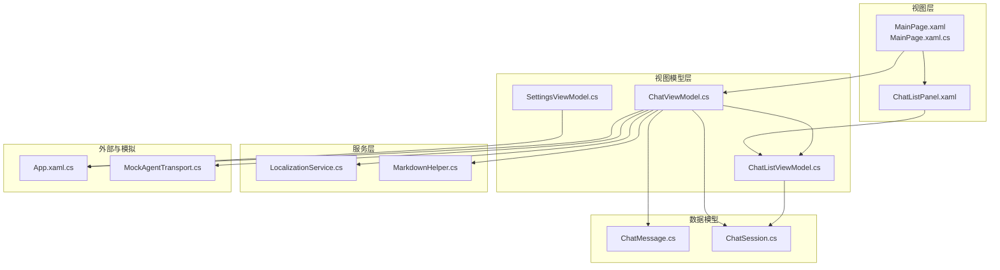
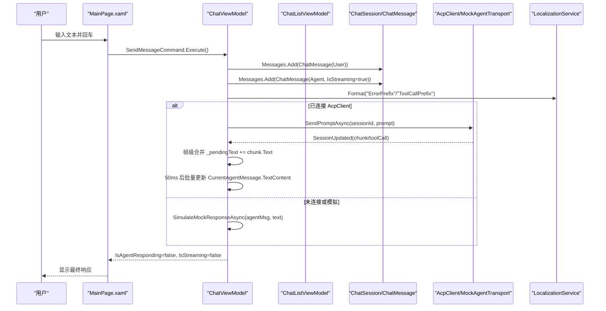
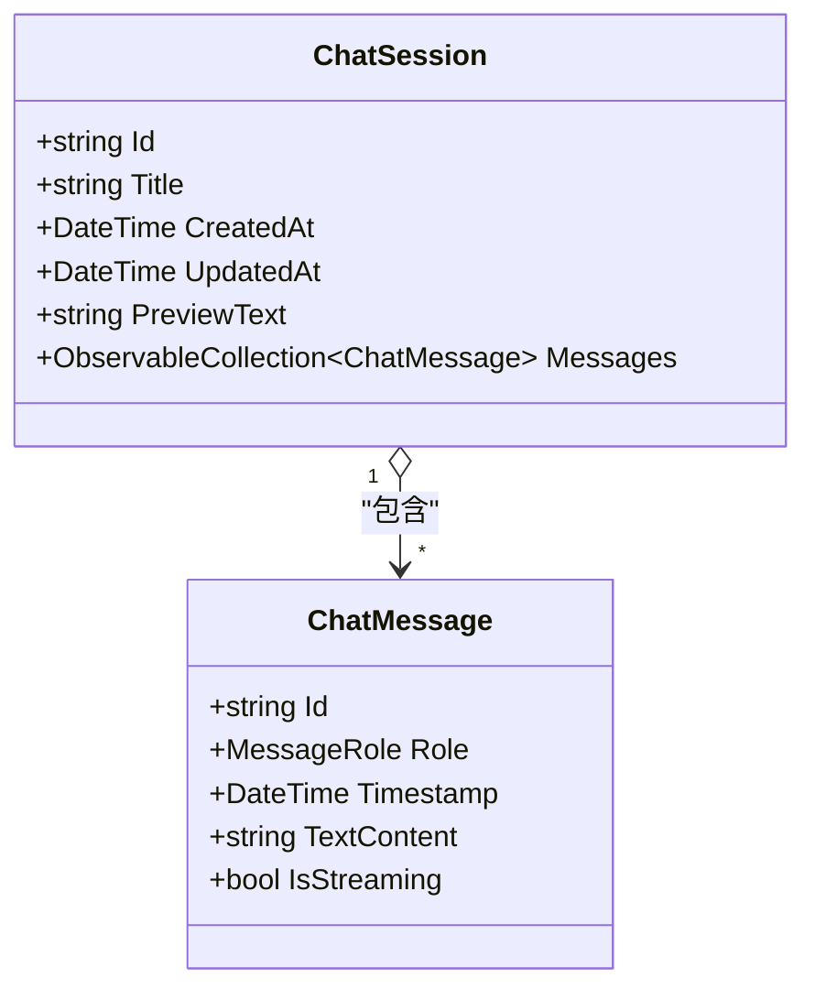
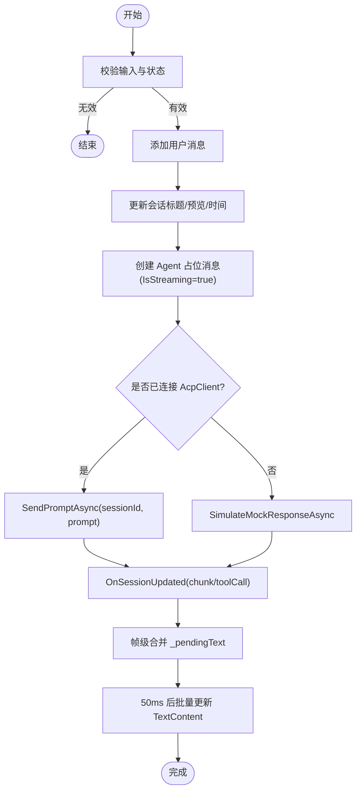
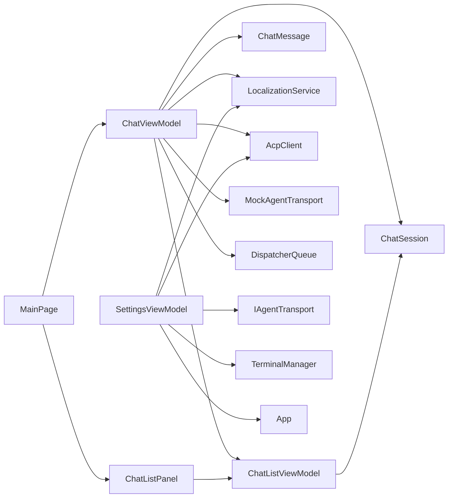
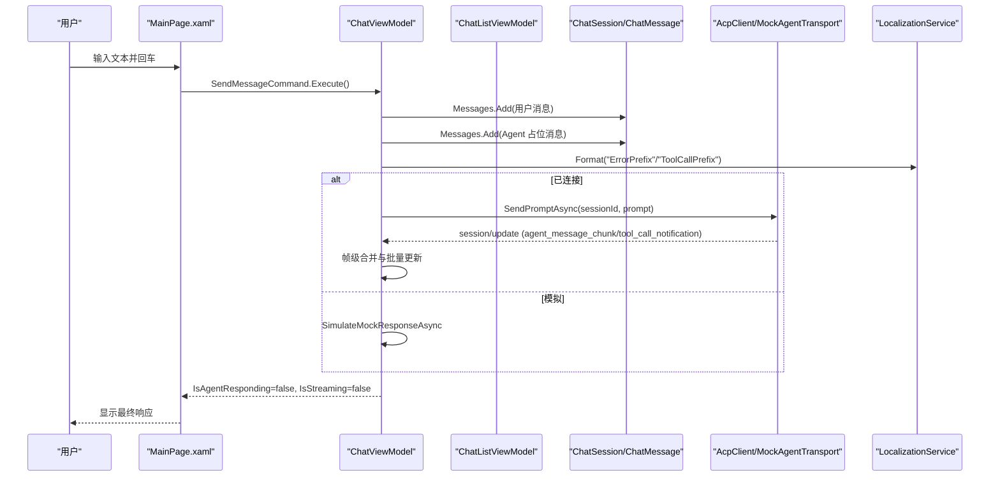
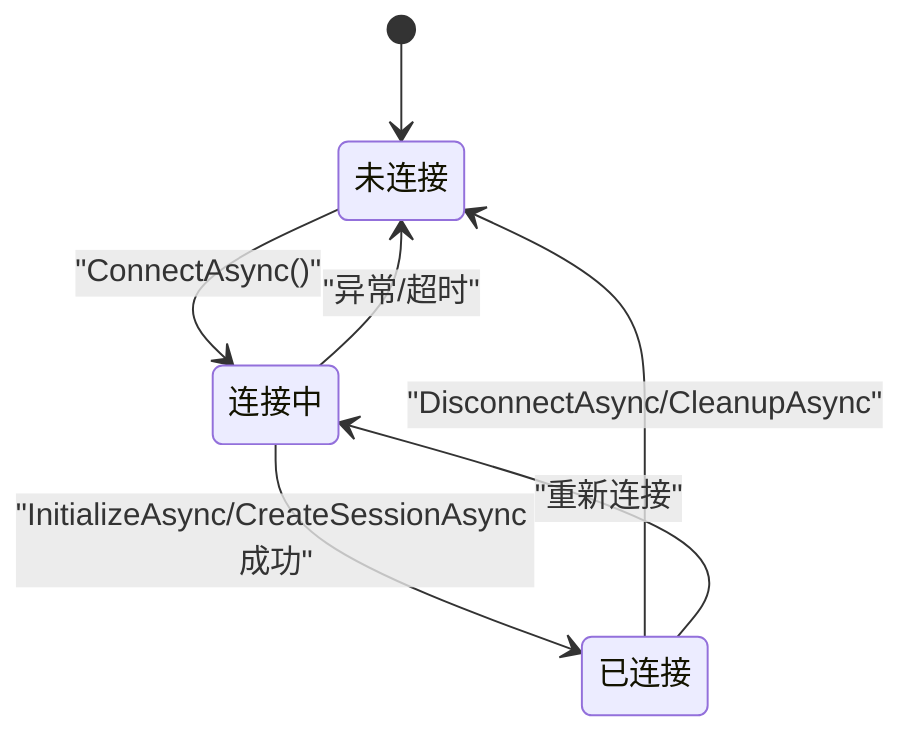

# 数据流设计

<cite>
**本文引用的文件**   
- [ChatMessage.cs](file://Agentic.Desktop/ViewModels/Messages/ChatMessage.cs)
- [ChatSession.cs](file://Agentic.Desktop/ViewModels/Messages/ChatSession.cs)
- [ChatViewModel.cs](file://Agentic.Desktop/ViewModels/ChatViewModel.cs)
- [ChatListViewModel.cs](file://Agentic.Desktop/ViewModels/ChatListViewModel.cs)
- [SettingsViewModel.cs](file://Agentic.Desktop/ViewModels/SettingsViewModel.cs)
- [LocalizationService.cs](file://Agentic.Desktop/Services/LocalizationService.cs)
- [MarkdownHelper.cs](file://Agentic.Desktop/Services/MarkdownHelper.cs)
- [MockAgentTransport.cs](file://Agentic.Desktop/Mocks/MockAgentTransport.cs)
- [App.xaml.cs](file://Agentic.Desktop/App.xaml.cs)
- [MainPage.xaml.cs](file://Agentic.Desktop/MainPage.xaml.cs)
- [MainPage.xaml](file://Agentic.Desktop/MainPage.xaml)
- [ChatListPanel.xaml](file://Agentic.Desktop/Views/ChatListPanel.xaml)
- [BoolToVisibilityConverter.cs](file://Agentic.Desktop/Converters/BoolToVisibilityConverter.cs)
- [zh-CN/Resources.resw](file://Agentic.Desktop/Strings/zh-CN/Resources.resw)
- [en/Resources.resw](file://Agentic.Desktop/Strings/en/Resources.resw)
</cite>

## 目录
1. [简介](#简介)
2. [项目结构](#项目结构)
3. [核心组件](#核心组件)
4. [架构总览](#架构总览)
5. [详细组件分析](#详细组件分析)
6. [依赖关系分析](#依赖关系分析)
7. [性能考虑](#性能考虑)
8. [故障排查指南](#故障排查指南)
9. [结论](#结论)
10. [附录](#附录)

## 简介
本文件面向 Agentic.Desktop 的数据流设计，聚焦“用户输入到 Agent 响应”的完整链路，覆盖 MVVM 中的数据绑定与更新机制、流式消息处理（帧级合并与批量更新）、国际化资源加载与管理、数据验证规则、缓存策略与性能优化。文档提供数据流图与状态转换图，帮助读者快速理解各组件间的数据传递与同步方式。

## 项目结构
- ViewModels：承载业务逻辑与 UI 状态，使用 CommunityToolkit.Mvvm 的 ObservableObject 和 RelayCommand 实现数据绑定与命令驱动。
- Messages：聊天数据模型 ChatMessage 与 ChatSession，封装消息与会话属性及集合。
- Services：服务层包含本地化、Markdown 转换、权限与终端管理等。
- Views/XAML：WinUI 3 界面与数据模板，通过 x:Bind 进行强类型双向/单向绑定。
- Mocks：用于无真实 Agent 时的模拟传输层，便于 UI 开发与演示。
- App/MainPage：应用入口与主页面，负责全局 AcpClient 生命周期与页面级事件订阅。

图表来源 
- [MainPage.xaml.cs:1-105](file://Agentic.Desktop/MainPage.xaml.cs#L1-L105)
- [ChatListPanel.xaml:1-88](file://Agentic.Desktop/Views/ChatListPanel.xaml#L1-L88)
- [ChatViewModel.cs:1-237](file://Agentic.Desktop/ViewModels/ChatViewModel.cs#L1-L237)
- [ChatListViewModel.cs:1-64](file://Agentic.Desktop/ViewModels/ChatListViewModel.cs#L1-L64)
- [SettingsViewModel.cs:1-162](file://Agentic.Desktop/ViewModels/SettingsViewModel.cs#L1-L162)
- [ChatMessage.cs:1-39](file://Agentic.Desktop/ViewModels/Messages/ChatMessage.cs#L1-L39)
- [ChatSession.cs:1-28](file://Agentic.Desktop/ViewModels/Messages/ChatSession.cs#L1-L28)
- [LocalizationService.cs:1-23](file://Agentic.Desktop/Services/LocalizationService.cs#L1-L23)
- [MarkdownHelper.cs:1-52](file://Agentic.Desktop/Services/MarkdownHelper.cs#L1-L52)
- [MockAgentTransport.cs:1-142](file://Agentic.Desktop/Mocks/MockAgentTransport.cs#L1-L142)
- [App.xaml.cs:1-85](file://Agentic.Desktop/App.xaml.cs#L1-L85)

章节来源
- [MainPage.xaml.cs:1-105](file://Agentic.Desktop/MainPage.xaml.cs#L1-L105)
- [ChatListPanel.xaml:1-88](file://Agentic.Desktop/Views/ChatListPanel.xaml#L1-L88)

## 核心组件
- ChatMessage：表示单条聊天消息，包含角色、时间戳、文本内容与流式标记；基于 ObservableObject 的属性变更通知支持 UI 实时更新。
- ChatSession：会话对象，维护标题、创建/更新时间、预览文本以及消息集合 ObservableCollection<ChatMessage>，集合变更触发 UI 刷新。
- ChatViewModel：聊天页面的核心控制器，管理输入、发送消息、流式响应合并、会话切换、滚动到底部等。
- ChatListViewModel：会话列表管理，新增/删除/选择会话，并通过事件通知 ChatViewModel 切换当前会话。
- SettingsViewModel：连接/断开 Agent，初始化 AcpClient，设置工作目录与参数，并在连接成功后通知 ChatViewModel。
- LocalizationService：统一访问 .resw 资源，提供 Get/Format 方法。
- MarkdownHelper：Markdown 转 HTML/纯文本的工具类，为未来 WebView2 渲染做准备。
- MockAgentTransport：模拟 ACP 协议的消息流，用于无真实 Agent 时的 UI 演示。
- App/MainPage：全局 AcpClient 管理与页面级事件订阅，确保连接状态变化时 UI 正确响应。

章节来源
- [ChatMessage.cs:1-39](file://Agentic.Desktop/ViewModels/Messages/ChatMessage.cs#L1-L39)
- [ChatSession.cs:1-28](file://Agentic.Desktop/ViewModels/Messages/ChatSession.cs#L1-L28)
- [ChatViewModel.cs:1-237](file://Agentic.Desktop/ViewModels/ChatViewModel.cs#L1-L237)
- [ChatListViewModel.cs:1-64](file://Agentic.Desktop/ViewModels/ChatListViewModel.cs#L1-L64)
- [SettingsViewModel.cs:1-162](file://Agentic.Desktop/ViewModels/SettingsViewModel.cs#L1-L162)
- [LocalizationService.cs:1-23](file://Agentic.Desktop/Services/LocalizationService.cs#L1-L23)
- [MarkdownHelper.cs:1-52](file://Agentic.Desktop/Services/MarkdownHelper.cs#L1-L52)
- [MockAgentTransport.cs:1-142](file://Agentic.Desktop/Mocks/MockAgentTransport.cs#L1-L142)
- [App.xaml.cs:1-85](file://Agentic.Desktop/App.xaml.cs#L1-L85)
- [MainPage.xaml.cs:1-105](file://Agentic.Desktop/MainPage.xaml.cs#L1-L105)

## 架构总览
整体采用 MVVM 架构：
- View（XAML）通过 x:Bind 绑定 ViewModel 的属性和命令。
- ViewModel 持有并操作数据模型（ChatMessage/ChatSession），并通过事件与外部服务交互。
- 服务层（LocalizationService、MarkdownHelper）提供跨模块能力。
- App 作为全局状态中心，协调 AcpClient 的生命周期与连接事件。

图表来源 
- [MainPage.xaml.cs:1-105](file://Agentic.Desktop/MainPage.xaml.cs#L1-L105)
- [ChatViewModel.cs:96-206](file://Agentic.Desktop/ViewModels/ChatViewModel.cs#L96-L206)
- [ChatSession.cs:1-28](file://Agentic.Desktop/ViewModels/Messages/ChatSession.cs#L1-L28)
- [ChatMessage.cs:1-39](file://Agentic.Desktop/ViewModels/Messages/ChatMessage.cs#L1-L39)
- [LocalizationService.cs:1-23](file://Agentic.Desktop/Services/LocalizationService.cs#L1-L23)
- [MockAgentTransport.cs:55-106](file://Agentic.Desktop/Mocks/MockAgentTransport.cs#L55-L106)

## 详细组件分析

### ChatMessage 与 ChatSession 数据模型
- ChatMessage
  - 属性：Id、Role、Timestamp、TextContent、IsStreaming。
  - 特性：ObservableProperty 自动生成 INotifyPropertyChanged 支持，使 TextContent 与 IsStreaming 的变更能即时反映到 UI。
  - 用途：区分用户/Agent/System 三类消息，IsStreaming 控制“正在输入”指示器显示。
- ChatSession
  - 属性：Id、Title、CreatedAt、UpdatedAt、PreviewText。
  - 集合：Messages（ObservableCollection<ChatMessage>），集合添加/移除会触发 UI 刷新。
  - 用途：会话元数据与消息历史，配合 ChatListViewModel 展示列表项预览。

图表来源 
- [ChatMessage.cs:1-39](file://Agentic.Desktop/ViewModels/Messages/ChatMessage.cs#L1-L39)
- [ChatSession.cs:1-28](file://Agentic.Desktop/ViewModels/Messages/ChatSession.cs#L1-L28)

章节来源
- [ChatMessage.cs:1-39](file://Agentic.Desktop/ViewModels/Messages/ChatMessage.cs#L1-L39)
- [ChatSession.cs:1-28](file://Agentic.Desktop/ViewModels/Messages/ChatSession.cs#L1-L28)

### ChatViewModel：发送与流式处理
- 发送流程
  - 校验输入与状态，避免重复发送。
  - 添加用户消息与占位 Agent 消息（IsStreaming=true）。
  - 更新会话标题与预览文本，记录更新时间。
  - 若已连接 AcpClient，调用 SendPromptAsync；否则进入模拟响应。
- 流式处理
  - OnSessionUpdated 接收 AgentMessageChunk 或 ToolCallNotification。
  - 对文本块进行帧级合并（_pendingText），延迟 50ms 批量写入 CurrentAgentMessage.TextContent，减少 UI 重绘次数。
  - 工具调用消息以 System 角色插入会话，并更新会话预览。
- 取消与错误处理
  - CancelGenerationAsync 调用 AcpClient.CancelSessionAsync，重置 IsAgentResponding 与 IsStreaming。
  - 异常捕获后追加错误前缀提示（通过 LocalizationService.Format）。

图表来源 
- [ChatViewModel.cs:96-206](file://Agentic.Desktop/ViewModels/ChatViewModel.cs#L96-L206)
- [MockAgentTransport.cs:55-106](file://Agentic.Desktop/Mocks/MockAgentTransport.cs#L55-L106)

章节来源
- [ChatViewModel.cs:96-206](file://Agentic.Desktop/ViewModels/ChatViewModel.cs#L96-L206)

### ChatListViewModel：会话列表与选择
- 维护 Sessions 集合与 SelectedSession。
- 新建/删除/选择会话，选择时触发 SessionChanged 事件，供 ChatViewModel 订阅并切换当前会话的消息集合。
- 删除选中会话时自动选择相邻会话或创建新会话，保证列表可用性。

章节来源
- [ChatListViewModel.cs:1-64](file://Agentic.Desktop/ViewModels/ChatListViewModel.cs#L1-L64)

### SettingsViewModel：连接与全局状态
- ConnectAsync：根据配置选择 MockAgentTransport 或 StdioAgentTransport，初始化 AcpClient，创建会话，设置 TerminalManager，更新连接状态并通知 ChatViewModel。
- DisconnectAsync：清理资源，重置状态，调用 App.SetAcpClient(null) 同步全局状态。
- CleanupAsync：解绑事件、关闭客户端、释放终端管理器。

章节来源
- [SettingsViewModel.cs:60-161](file://Agentic.Desktop/ViewModels/SettingsViewModel.cs#L60-L161)

### 国际化数据加载与管理
- LocalizationService：封装 Windows.ApplicationModel.Resources.ResourceLoader，提供 Get(key) 与 Format(key, args)。
- 资源文件：Strings/zh-CN/Resources.resw 与 Strings/en/Resources.resw，按语言组织键值对。
- 使用场景：会话默认标题、错误前缀、工具调用前缀、模拟响应、连接状态提示等。

章节来源
- [LocalizationService.cs:1-23](file://Agentic.Desktop/Services/LocalizationService.cs#L1-L23)
- [zh-CN/Resources.resw:1-223](file://Agentic.Desktop/Strings/zh-CN/Resources.resw#L1-L223)
- [en/Resources.resw:1-223](file://Agentic.Desktop/Strings/en/Resources.resw#L1-L223)

### Markdown 渲染辅助
- MarkdownHelper：提供 ToHtml（用于 WebView2）与 ToPlainText（临时方案，去除常见 Markdown 标记）。
- 当前 WinUI 3 TextBlock 不支持富文本，因此直接显示原始文本；未来可升级为 WebView2 渲染。

章节来源
- [MarkdownHelper.cs:1-52](file://Agentic.Desktop/Services/MarkdownHelper.cs#L1-L52)

### 视图绑定与模板选择
- MainPage.xaml：定义用户/Agent 消息 DataTemplate，使用 BoolToVisibilityConverter 控制“正在输入”指示器可见性。
- ChatMessageTemplateSelector：根据 ChatMessage.Role 选择不同模板。
- ChatListPanel.xaml：绑定 ChatListViewModel.Sessions 与 SelectedSession，展示标题与预览文本。

章节来源
- [MainPage.xaml:1-163](file://Agentic.Desktop/MainPage.xaml#L1-L163)
- [ChatListPanel.xaml:1-88](file://Agentic.Desktop/Views/ChatListPanel.xaml#L1-L88)
- [BoolToVisibilityConverter.cs:1-27](file://Agentic.Desktop/Converters/BoolToVisibilityConverter.cs#L1-L27)

### 应用与页面协作
- App.xaml.cs：提供 DispatcherQueue、WindowHandle、CurrentAcpClient 与 AcpClientChanged 事件，SetAcpClient 用于全局状态同步。
- MainPage.xaml.cs：在构造时绑定 ChatListPanel.ViewModel，订阅 ScrollToBottom 事件，监听 App.AcpClientChanged 以更新连接状态。

章节来源
- [App.xaml.cs:1-85](file://Agentic.Desktop/App.xaml.cs#L1-L85)
- [MainPage.xaml.cs:1-105](file://Agentic.Desktop/MainPage.xaml.cs#L1-L105)

## 依赖关系分析
- ChatViewModel 依赖：
  - ChatListViewModel（会话列表与选择事件）
  - ChatMessage/ChatSession（数据模型）
  - LocalizationService（国际化字符串）
  - AcpClient（真实 Agent）或 MockAgentTransport（模拟）
  - DispatcherQueue（UI 线程调度）
- ChatListViewModel 依赖：
  - ChatSession（会话模型）
- SettingsViewModel 依赖：
  - AcpClient、IAgentTransport、TerminalManager、LocalizationService、App（全局状态）
- 视图依赖：
  - XAML 绑定 ViewModel 属性与命令，使用 Converter 与 DataTemplateSelector 控制显示。

图表来源 
- [ChatViewModel.cs:1-237](file://Agentic.Desktop/ViewModels/ChatViewModel.cs#L1-L237)
- [ChatListViewModel.cs:1-64](file://Agentic.Desktop/ViewModels/ChatListViewModel.cs#L1-L64)
- [SettingsViewModel.cs:1-162](file://Agentic.Desktop/ViewModels/SettingsViewModel.cs#L1-L162)
- [App.xaml.cs:1-85](file://Agentic.Desktop/App.xaml.cs#L1-L85)
- [MainPage.xaml.cs:1-105](file://Agentic.Desktop/MainPage.xaml.cs#L1-L105)

## 性能考虑
- 流式消息帧级合并
  - 使用 _pendingText 累积文本片段，延迟 50ms 批量更新 UI，显著降低频繁属性变更导致的重绘开销。
- 集合变更通知
  - ObservableCollection 仅在实际添加/移除时触发 UI 更新，避免不必要的刷新。
- UI 线程调度
  - 通过 DispatcherQueue.TryEnqueue 将文本更新与滚动操作调度到 UI 线程，避免跨线程异常。
- 资源与渲染
  - 当前直接显示原始 Markdown 文本，避免昂贵的解析与渲染；未来引入 WebView2 时需评估渲染成本。
- 连接状态与事件订阅
  - 会话切换时取消旧订阅并订阅新集合，防止内存泄漏与重复事件处理。

[本节为通用性能建议，不直接分析具体文件]

## 故障排查指南
- 连接失败
  - 检查 SettingsViewModel.ConnectAsync 中的异常处理与 ConnectionStatus 更新。
  - 确认 App.SetAcpClient(null) 是否正确同步全局状态。
- 流式输出异常
  - 检查 OnSessionUpdated 的锁与 _flushScheduled 标志，确保并发安全与去抖。
  - 确认 DispatcherQueue.TryEnqueue 成功执行。
- 国际化缺失
  - 核对 Resources.resw 中对应 key 是否存在，LocalizationService.Get/Format 是否返回空。
- 模板与转换器
  - 检查 BoolToVisibilityConverter 的 Invert 参数与 DataTemplateSelector 的选择逻辑。

章节来源
- [SettingsViewModel.cs:115-140](file://Agentic.Desktop/ViewModels/SettingsViewModel.cs#L115-L140)
- [ChatViewModel.cs:153-206](file://Agentic.Desktop/ViewModels/ChatViewModel.cs#L153-L206)
- [LocalizationService.cs:1-23](file://Agentic.Desktop/Services/LocalizationService.cs#L1-L23)
- [BoolToVisibilityConverter.cs:1-27](file://Agentic.Desktop/Converters/BoolToVisibilityConverter.cs#L1-L27)

## 结论
Agentic.Desktop 的数据流设计以 MVVM 为核心，结合 ObservableObject 与 ObservableCollection 实现高效的双向绑定与集合更新。流式消息处理通过帧级合并与批量更新策略提升 UI 流畅度。国际化资源集中管理，Markdown 渲染预留扩展点。整体架构清晰、职责分离明确，具备良好的可维护性与扩展性。

[本节为总结性内容，不直接分析具体文件]

## 附录

### 数据流图（端到端）

图表来源 
- [MainPage.xaml.cs:1-105](file://Agentic.Desktop/MainPage.xaml.cs#L1-L105)
- [ChatViewModel.cs:96-206](file://Agentic.Desktop/ViewModels/ChatViewModel.cs#L96-L206)
- [ChatSession.cs:1-28](file://Agentic.Desktop/ViewModels/Messages/ChatSession.cs#L1-L28)
- [ChatMessage.cs:1-39](file://Agentic.Desktop/ViewModels/Messages/ChatMessage.cs#L1-L39)
- [LocalizationService.cs:1-23](file://Agentic.Desktop/Services/LocalizationService.cs#L1-L23)
- [MockAgentTransport.cs:55-106](file://Agentic.Desktop/Mocks/MockAgentTransport.cs#L55-L106)

### 状态转换图（连接状态）

图表来源 
- [SettingsViewModel.cs:60-140](file://Agentic.Desktop/ViewModels/SettingsViewModel.cs#L60-L140)

### 数据验证规则
- 路径验证（示例：文件系统访问）
  - 校验请求路径是否在允许的工作目录内，越界则抛出 UnauthorizedAccessException。
- 输入校验
  - 发送消息前检查 InputText 是否为空或空白，且 IsAgentResponding 为 false。
- 资源键存在性
  - LocalizationService.Get/Format 使用前需确保 resw 中存在对应 key。

章节来源
- [SettingsViewModel.cs:60-140](file://Agentic.Desktop/ViewModels/SettingsViewModel.cs#L60-L140)
- [ChatViewModel.cs:96-106](file://Agentic.Desktop/ViewModels/ChatViewModel.cs#L96-L106)
- [LocalizationService.cs:1-23](file://Agentic.Desktop/Services/LocalizationService.cs#L1-L23)

### 缓存策略
- 当前未实现显式缓存层，主要依赖 ObservableCollection 与属性变更通知。
- 未来可在 Markdown 转换结果或长文本片段上引入轻量缓存，以减少重复计算。

[本节为通用建议，不直接分析具体文件]