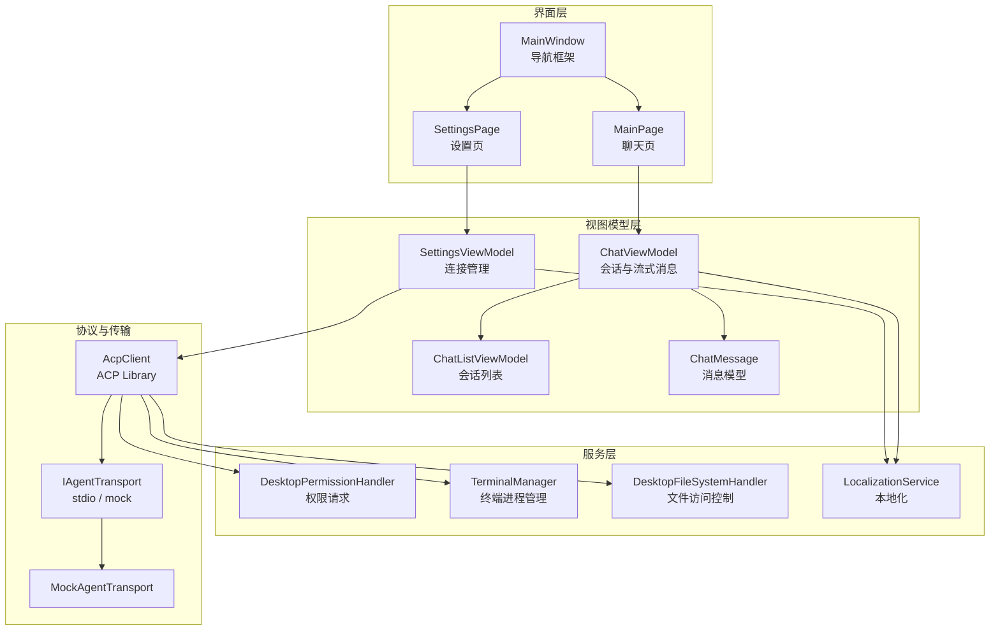
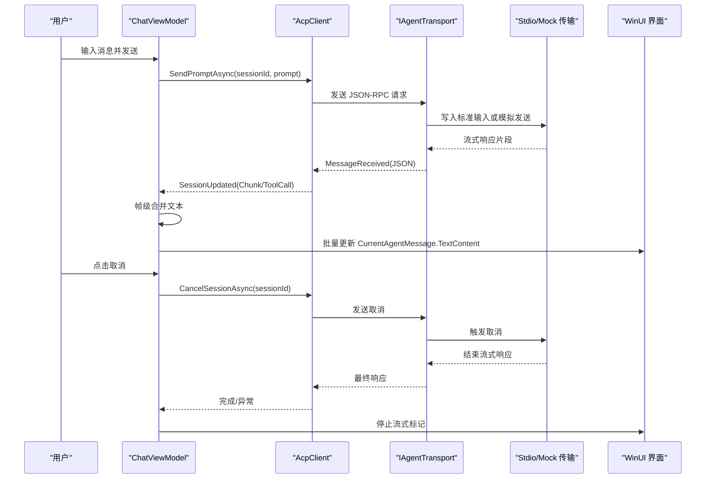
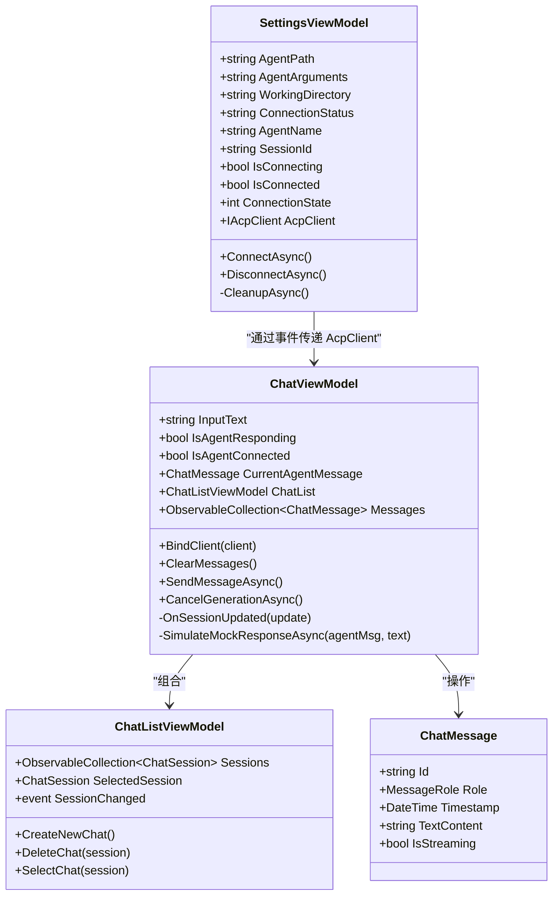
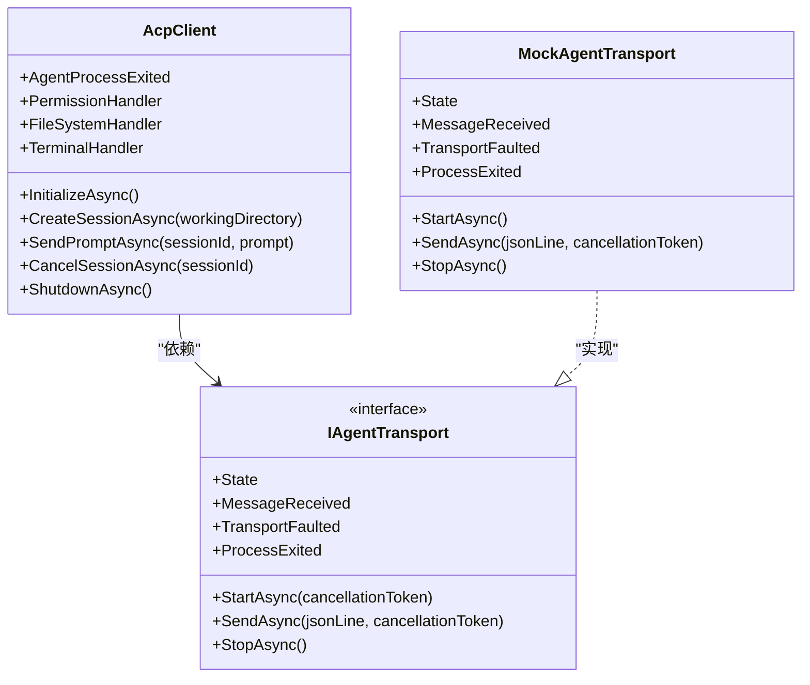
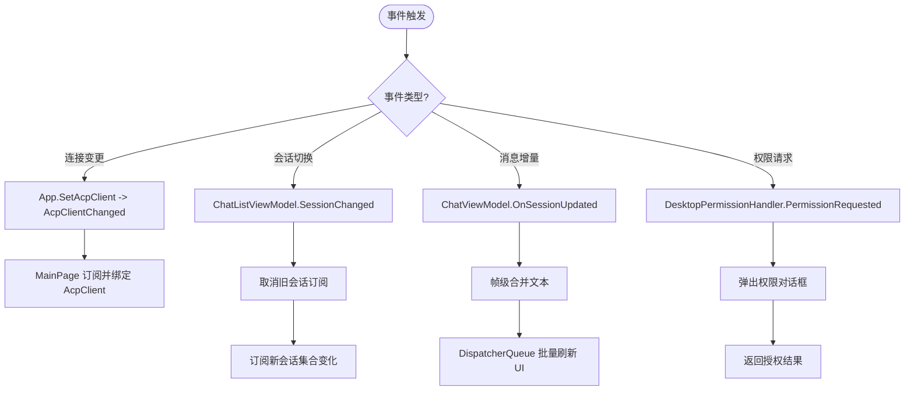
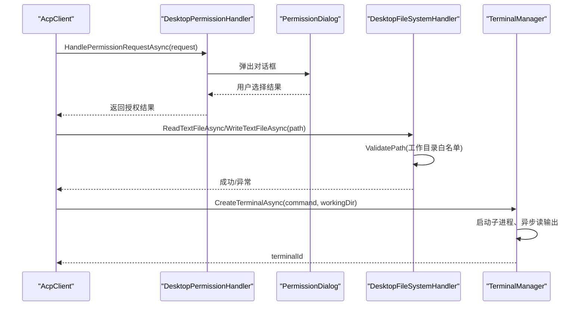
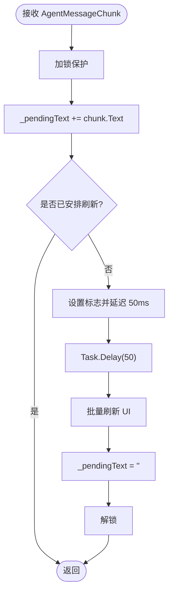
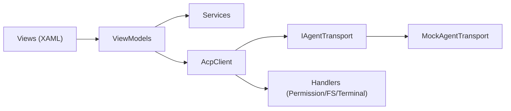

# 架构设计

<cite>
**本文引用的文件**   
- [README.md](file://README.md)
- [App.xaml.cs](file://Agentic.Desktop/App.xaml.cs)
- [MainWindow.xaml.cs](file://Agentic.Desktop/MainWindow.xaml.cs)
- [MainPage.xaml.cs](file://Agentic.Desktop/MainPage.xaml.cs)
- [SettingsPage.xaml.cs](file://Agentic.Desktop/SettingsPage.xaml.cs)
- [ChatViewModel.cs](file://Agentic.Desktop/ViewModels/ChatViewModel.cs)
- [SettingsViewModel.cs](file://Agentic.Desktop/ViewModels/SettingsViewModel.cs)
- [ChatListViewModel.cs](file://Agentic.Desktop/ViewModels/ChatListViewModel.cs)
- [ChatMessage.cs](file://Agentic.Desktop/ViewModels/Messages/ChatMessage.cs)
- [PermissionHandler.cs](file://Agentic.Desktop/Services/PermissionHandler.cs)
- [TerminalManager.cs](file://Agentic.Desktop/Services/TerminalManager.cs)
- [FileSystemHandler.cs](file://Agentic.Desktop/Services/FileSystemHandler.cs)
- [MockAgentTransport.cs](file://Agentic.Desktop/Mocks/MockAgentTransport.cs)
- [LocalizationService.cs](file://Agentic.Desktop/Services/LocalizationService.cs)
- [Agentic.Desktop.csproj](file://Agentic.Desktop/Agentic.Desktop.csproj)
</cite>

## 目录
1. [引言](#引言)
2. [项目结构](#项目结构)
3. [核心组件](#核心组件)
4. [架构总览](#架构总览)
5. [详细组件分析](#详细组件分析)
6. [依赖关系分析](#依赖关系分析)
7. [性能考量](#性能考量)
8. [故障排查指南](#故障排查指南)
9. [结论](#结论)
10. [附录](#附录)

## 引言
本文件为 Agentic.Desktop 的架构设计文档，面向开发者与产品相关读者。文档围绕 MVVM 模式、ACP（Agent Communication Protocol）客户端集成、IAgentTransport 抽象层、事件驱动架构展开，给出系统边界、技术决策、约束条件、架构图与组件分解，并覆盖安全性、监控与错误处理等跨领域关注点。同时记录技术栈选择、第三方依赖与版本兼容性考虑。

## 项目结构
应用采用 WinUI 3 + .NET 10 的桌面应用形态，整体遵循 MVVM：
- Views：XAML 页面与对话框，负责 UI 呈现与用户交互
- ViewModels：业务状态与命令，使用 CommunityToolkit.Mvvm 提供可观察属性与命令
- Services：横切能力（权限、终端、文件系统、本地化）
- Mocks：用于开发调试的模拟传输实现
- App/Window：应用生命周期、全局状态与导航框架

图表来源 
- [MainWindow.xaml.cs:1-97](file://Agentic.Desktop/MainWindow.xaml.cs#L1-L97)
- [MainPage.xaml.cs:1-105](file://Agentic.Desktop/MainPage.xaml.cs#L1-L105)
- [SettingsPage.xaml.cs:1-96](file://Agentic.Desktop/SettingsPage.xaml.cs#L1-L96)
- [ChatViewModel.cs:1-237](file://Agentic.Desktop/ViewModels/ChatViewModel.cs#L1-L237)
- [SettingsViewModel.cs:1-162](file://Agentic.Desktop/ViewModels/SettingsViewModel.cs#L1-L162)
- [ChatListViewModel.cs:1-64](file://Agentic.Desktop/ViewModels/ChatListViewModel.cs#L1-L64)
- [ChatMessage.cs:1-39](file://Agentic.Desktop/ViewModels/Messages/ChatMessage.cs#L1-L39)
- [PermissionHandler.cs:1-52](file://Agentic.Desktop/Services/PermissionHandler.cs#L1-L52)
- [TerminalManager.cs:1-161](file://Agentic.Desktop/Services/TerminalManager.cs#L1-L161)
- [FileSystemHandler.cs:1-42](file://Agentic.Desktop/Services/FileSystemHandler.cs#L1-L42)
- [MockAgentTransport.cs:1-142](file://Agentic.Desktop/Mocks/MockAgentTransport.cs#L1-L142)
- [LocalizationService.cs:1-23](file://Agentic.Desktop/Services/LocalizationService.cs#L1-L23)

章节来源
- [README.md:51-87](file://README.md#L51-L87)
- [Agentic.Desktop.csproj:1-79](file://Agentic.Desktop/Agentic.Desktop.csproj#L1-L79)

## 核心组件
- 应用入口与全局状态
  - App：初始化日志、窗口实例、DispatcherQueue，维护当前 IAcpClient 单例与变更事件
- 主窗口与导航
  - MainWindow：标题栏扩展、图标、尺寸、NavigationView 切换 Chat/Settings，连接状态更新
- 聊天页面与视图模型
  - MainPage：绑定 ChatViewModel、订阅连接变更、输入回车发送、侧边栏切换、自动滚动到底部
  - ChatViewModel：会话与消息集合、流式文本帧级合并、工具调用通知、取消生成、Mock 回退
  - ChatListViewModel：会话列表、新建/删除/选中、SessionChanged 事件
  - ChatMessage：消息角色、时间戳、流式标记、Markdown 文本内容
- 设置页面与连接管理
  - SettingsViewModel：创建/销毁 AcpClient、选择 Stdio/Mock 传输、创建会话、注入 Terminal/FileSystem/Permission 处理器、连接状态与回调
  - SettingsPage：连接成功后装配权限与文件系统处理器、更新标题栏状态、工作目录选择
- 服务与基础设施
  - DesktopPermissionHandler：将 Agent 权限请求调度到 UI 线程，弹出对话框并返回结果
  - TerminalManager：多终端进程生命周期管理、输出缓冲、退出等待、终止与释放
  - DesktopFileSystemHandler：路径校验与工作目录白名单、读写封装
  - LocalizationService：资源加载与格式化
  - MockAgentTransport：模拟 ACP JSON-RPC 流程（initialize/session/new/prompt/cancel），流式推送 session/update

章节来源
- [App.xaml.cs:1-85](file://Agentic.Desktop/App.xaml.cs#L1-L85)
- [MainWindow.xaml.cs:1-97](file://Agentic.Desktop/MainWindow.xaml.cs#L1-L97)
- [MainPage.xaml.cs:1-105](file://Agentic.Desktop/MainPage.xaml.cs#L1-L105)
- [ChatViewModel.cs:1-237](file://Agentic.Desktop/ViewModels/ChatViewModel.cs#L1-L237)
- [SettingsViewModel.cs:1-162](file://Agentic.Desktop/ViewModels/SettingsViewModel.cs#L1-L162)
- [ChatListViewModel.cs:1-64](file://Agentic.Desktop/ViewModels/ChatListViewModel.cs#L1-L64)
- [ChatMessage.cs:1-39](file://Agentic.Desktop/ViewModels/Messages/ChatMessage.cs#L1-L39)
- [PermissionHandler.cs:1-52](file://Agentic.Desktop/Services/PermissionHandler.cs#L1-L52)
- [TerminalManager.cs:1-161](file://Agentic.Desktop/Services/TerminalManager.cs#L1-L161)
- [FileSystemHandler.cs:1-42](file://Agentic.Desktop/Services/FileSystemHandler.cs#L1-L42)
- [LocalizationService.cs:1-23](file://Agentic.Desktop/Services/LocalizationService.cs#L1-L23)
- [MockAgentTransport.cs:1-142](file://Agentic.Desktop/Mocks/MockAgentTransport.cs#L1-L142)

## 架构总览
应用以 MVVM 为核心组织，通过 AcpClient 与 ACP 协议交互；传输层 IAgentTransport 支持 stdio 与 mock；UI 通过事件驱动与 DispatcherQueue 保证线程安全；权限、终端、文件系统通过 Handler 注入 AcpClient，形成松耦合的事件驱动架构。

图表来源 
- [ChatViewModel.cs:96-151](file://Agentic.Desktop/ViewModels/ChatViewModel.cs#L96-L151)
- [ChatViewModel.cs:153-206](file://Agentic.Desktop/ViewModels/ChatViewModel.cs#L153-L206)
- [MockAgentTransport.cs:27-117](file://Agentic.Desktop/Mocks/MockAgentTransport.cs#L27-L117)
- [SettingsViewModel.cs:60-126](file://Agentic.Desktop/ViewModels/SettingsViewModel.cs#L60-L126)

## 详细组件分析

### MVVM 与数据流向
- 视图模型职责
  - ChatViewModel：维护会话列表、消息集合、流式文本累积与 UI 刷新、工具调用通知、取消生成
  - SettingsViewModel：连接生命周期、传输选择、会话创建、处理器注入、状态广播
  - ChatListViewModel：会话 CRUD、选中变更事件
- 数据绑定与事件
  - 使用 ObservableProperty/RelayCommand 自动生成属性与命令
  - 通过事件（如 SessionChanged、ScrollToBottom、AcpClientChanged）解耦 UI 与逻辑
- 线程模型
  - 所有 UI 更新通过 DispatcherQueue.TryEnqueue 确保在 UI 线程执行

图表来源 
- [ChatViewModel.cs:1-237](file://Agentic.Desktop/ViewModels/ChatViewModel.cs#L1-L237)
- [SettingsViewModel.cs:1-162](file://Agentic.Desktop/ViewModels/SettingsViewModel.cs#L1-L162)
- [ChatListViewModel.cs:1-64](file://Agentic.Desktop/ViewModels/ChatListViewModel.cs#L1-L64)
- [ChatMessage.cs:1-39](file://Agentic.Desktop/ViewModels/Messages/ChatMessage.cs#L1-L39)

章节来源
- [ChatViewModel.cs:1-237](file://Agentic.Desktop/ViewModels/ChatViewModel.cs#L1-L237)
- [SettingsViewModel.cs:1-162](file://Agentic.Desktop/ViewModels/SettingsViewModel.cs#L1-L162)
- [ChatListViewModel.cs:1-64](file://Agentic.Desktop/ViewModels/ChatListViewModel.cs#L1-L64)
- [ChatMessage.cs:1-39](file://Agentic.Desktop/ViewModels/Messages/ChatMessage.cs#L1-L39)

### AcpClient 接口设计与 IAgentTransport 抽象层
- AcpClient 职责
  - 初始化、创建会话、发送提示、取消会话、进程退出事件、注入 Permission/FileSystem/Terminal 处理器
- IAgentTransport 抽象
  - 统一传输接口，支持真实 stdio 与 Mock 两种实现
  - 事件：MessageReceived、TransportFaulted、ProcessExited
  - 方法：StartAsync、SendAsync、StopAsync、State
- 设计要点
  - 通过构造函数注入 JsonRpcDispatcher 与 ILoggerFactory，便于扩展与诊断
  - 传输层对上层屏蔽底层通信细节，提升可测试性与可替换性

图表来源 
- [SettingsViewModel.cs:60-126](file://Agentic.Desktop/ViewModels/SettingsViewModel.cs#L60-L126)
- [MockAgentTransport.cs:1-142](file://Agentic.Desktop/Mocks/MockAgentTransport.cs#L1-L142)

章节来源
- [SettingsViewModel.cs:60-126](file://Agentic.Desktop/ViewModels/SettingsViewModel.cs#L60-L126)
- [MockAgentTransport.cs:1-142](file://Agentic.Desktop/Mocks/MockAgentTransport.cs#L1-L142)

### 事件驱动架构的实现
- 连接状态事件
  - App.AcpClientChanged：全局连接变更，MainPage 订阅并在连接时绑定 AcpClient
- 会话与消息事件
  - ChatListViewModel.SessionChanged：切换会话时清理旧订阅、订阅新会话消息集合变化
  - ChatViewModel.ScrollToBottom：消息集合变化后自动滚动
- 权限与工具调用事件
  - DesktopPermissionHandler.PermissionRequested：UI 线程弹出对话框，返回授权结果
  - OnSessionUpdated：解析 AgentMessageChunk 与 ToolCallNotification，分别进行文本累积与系统消息插入

图表来源 
- [App.xaml.cs:78-84](file://Agentic.Desktop/App.xaml.cs#L78-L84)
- [MainPage.xaml.cs:26-47](file://Agentic.Desktop/MainPage.xaml.cs#L26-L47)
- [ChatViewModel.cs:52-74](file://Agentic.Desktop/ViewModels/ChatViewModel.cs#L52-L74)
- [ChatViewModel.cs:153-206](file://Agentic.Desktop/ViewModels/ChatViewModel.cs#L153-L206)
- [PermissionHandler.cs:26-44](file://Agentic.Desktop/Services/PermissionHandler.cs#L26-L44)

章节来源
- [App.xaml.cs:78-84](file://Agentic.Desktop/App.xaml.cs#L78-L84)
- [MainPage.xaml.cs:26-47](file://Agentic.Desktop/MainPage.xaml.cs#L26-L47)
- [ChatViewModel.cs:52-74](file://Agentic.Desktop/ViewModels/ChatViewModel.cs#L52-L74)
- [ChatViewModel.cs:153-206](file://Agentic.Desktop/ViewModels/ChatViewModel.cs#L153-L206)
- [PermissionHandler.cs:26-44](file://Agentic.Desktop/Services/PermissionHandler.cs#L26-L44)

### 权限、终端与文件系统处理
- 权限处理
  - DesktopPermissionHandler：将权限请求调度到 UI 线程，显示 PermissionDialog，返回 RequestPermissionResponse
- 终端管理
  - TerminalManager：并发字典管理多个终端进程，异步读取 stdout/stderr，支持等待退出、终止、释放
- 文件系统处理
  - DesktopFileSystemHandler：路径校验确保仅在工作目录内访问，读写封装

图表来源 
- [PermissionHandler.cs:26-44](file://Agentic.Desktop/Services/PermissionHandler.cs#L26-L44)
- [FileSystemHandler.cs:17-40](file://Agentic.Desktop/Services/FileSystemHandler.cs#L17-L40)
- [TerminalManager.cs:16-68](file://Agentic.Desktop/Services/TerminalManager.cs#L16-L68)

章节来源
- [PermissionHandler.cs:1-52](file://Agentic.Desktop/Services/PermissionHandler.cs#L1-L52)
- [FileSystemHandler.cs:1-42](file://Agentic.Desktop/Services/FileSystemHandler.cs#L1-L42)
- [TerminalManager.cs:1-161](file://Agentic.Desktop/Services/TerminalManager.cs#L1-L161)

### 流式响应与帧级合并
- 帧级合并策略
  - 累积文本至 _pendingText，延迟 50ms 批量刷新，降低 UI 更新频率
  - 使用锁保护并发写，避免竞态
- 取消与异常处理
  - 支持取消生成，清理流式状态与占位消息
  - 捕获异常并格式化错误信息

图表来源 
- [ChatViewModel.cs:153-182](file://Agentic.Desktop/ViewModels/ChatViewModel.cs#L153-L182)

章节来源
- [ChatViewModel.cs:153-182](file://Agentic.Desktop/ViewModels/ChatViewModel.cs#L153-L182)

## 依赖关系分析
- 外部依赖
  - Microsoft.WindowsAppSDK 2.3.1
  - CommunityToolkit.Mvvm 8.4.2
  - Markdig 1.3.2
  - ShihaoShen.Agentic.ACPLibrary 0.1.0-beta.3
  - Microsoft.Extensions.Logging.Debug 9.0.7
- 内部依赖
  - Views 依赖 ViewModels
  - ViewModels 依赖 Services 与 AcpClient
  - AcpClient 依赖 IAgentTransport 与 Handlers

图表来源 
- [Agentic.Desktop.csproj:53-60](file://Agentic.Desktop/Agentic.Desktop.csproj#L53-L60)
- [SettingsViewModel.cs:60-126](file://Agentic.Desktop/ViewModels/SettingsViewModel.cs#L60-L126)
- [MockAgentTransport.cs:1-142](file://Agentic.Desktop/Mocks/MockAgentTransport.cs#L1-L142)

章节来源
- [Agentic.Desktop.csproj:53-60](file://Agentic.Desktop/Agentic.Desktop.csproj#L53-L60)
- [SettingsViewModel.cs:60-126](file://Agentic.Desktop/ViewModels/SettingsViewModel.cs#L60-L126)
- [MockAgentTransport.cs:1-142](file://Agentic.Desktop/Mocks/MockAgentTransport.cs#L1-L142)

## 性能考量
- 流式文本帧级合并减少 UI 重绘次数，提高渲染效率
- 使用 DispatcherQueue 批量调度 UI 更新，避免频繁跨线程调用
- 终端输出异步读取，避免阻塞主线程
- 会话切换时及时取消旧订阅，防止内存泄漏与重复事件
- 建议：
  - 对大段 Markdown 渲染考虑 WebView2 或虚拟列表优化
  - 对长会话消息集合考虑分页或虚拟化
  - 对日志级别按需调整，生产环境关闭 Debug 输出

[本节为通用指导，不直接分析具体文件]

## 故障排查指南
- 连接失败
  - 检查 Agent 路径与参数是否正确
  - 查看连接状态与错误消息
  - 确认工作目录存在且可写
- 权限拒绝
  - 检查路径是否在工作目录白名单内
  - 确认权限对话框正常弹出并返回结果
- 终端无输出
  - 检查子进程是否启动成功
  - 查看 stderr 输出是否有错误信息
- 流式卡顿
  - 检查帧级合并延迟配置
  - 确认 UI 线程未被长时间占用

章节来源
- [SettingsViewModel.cs:115-126](file://Agentic.Desktop/ViewModels/SettingsViewModel.cs#L115-L126)
- [FileSystemHandler.cs:32-40](file://Agentic.Desktop/Services/FileSystemHandler.cs#L32-L40)
- [TerminalManager.cs:77-98](file://Agentic.Desktop/Services/TerminalManager.cs#L77-L98)
- [ChatViewModel.cs:137-151](file://Agentic.Desktop/ViewModels/ChatViewModel.cs#L137-L151)

## 结论
Agentic.Desktop 通过清晰的 MVVM 分层与事件驱动架构，实现了与 ACP Agent 的稳定交互。IAgentTransport 抽象层使传输实现可替换，Mock 支持快速开发与测试。权限、终端与文件系统通过 Handler 注入，增强了安全性与可控性。整体设计具备良好的可扩展性与可维护性，适合持续演进。

[本节为总结，不直接分析具体文件]

## 附录
- 系统边界
  - 应用边界：WinUI 3 桌面应用，运行于 Windows 10 1809+
  - 协议边界：ACP 协议，JSON-RPC 传输
  - 进程边界：Agent 作为独立进程通过 stdio 通信
- 技术决策说明
  - 选择 WinUI 3 以获得 Fluent Design 与现代 UI 体验
  - 使用 CommunityToolkit.Mvvm 简化 MVVM 实现
  - 通过 AcpClient 与 IAgentTransport 解耦协议与传输
- 约束条件
  - 目标平台最低版本限制
  - 需要启用开发者模式
  - 权限与文件系统访问需遵循白名单策略
- 技术栈与兼容性
  - .NET 10.0、Windows App SDK 2.3.1、CommunityToolkit.Mvvm 8.4.2、Markdig 1.3.2、ACPLibrary 0.1.0-beta.3
  - 构建与运行依赖 WinApp CLI

章节来源
- [README.md:14-30](file://README.md#L14-L30)
- [Agentic.Desktop.csproj:1-17](file://Agentic.Desktop/Agentic.Desktop.csproj#L1-L17)
- [Agentic.Desktop.csproj:53-60](file://Agentic.Desktop/Agentic.Desktop.csproj#L53-L60)