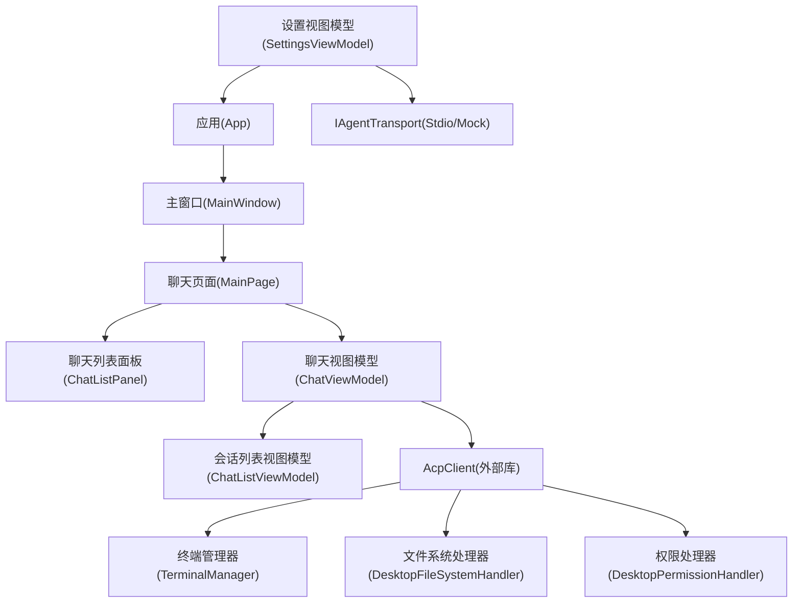
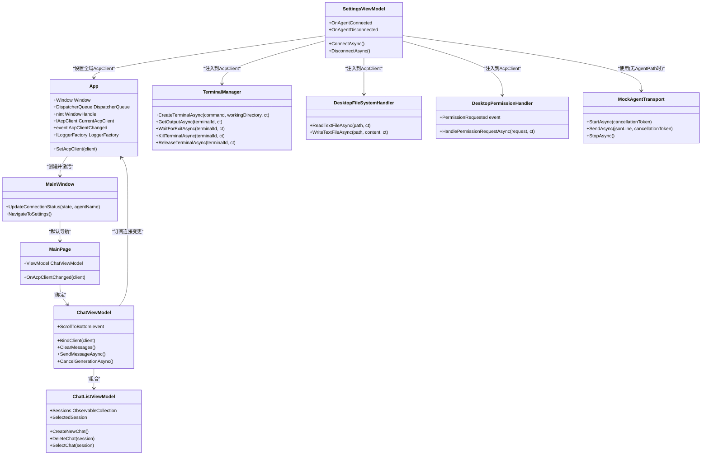
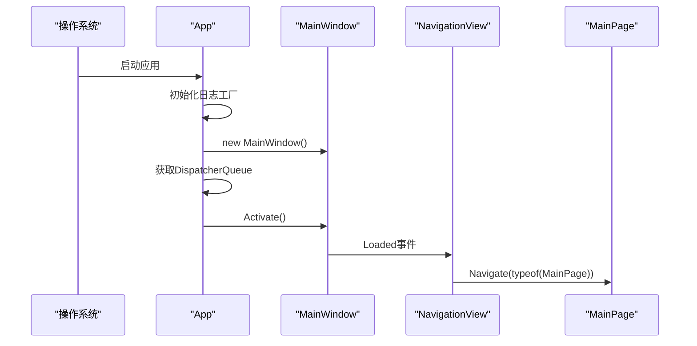
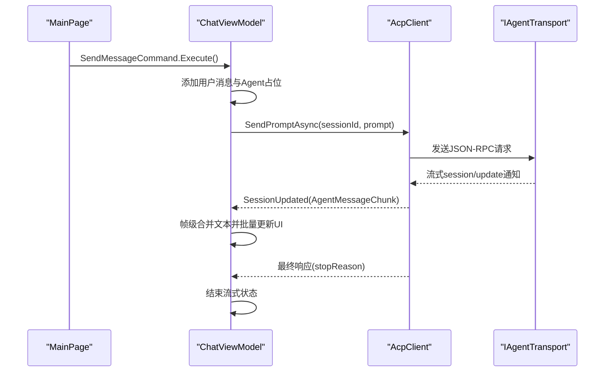
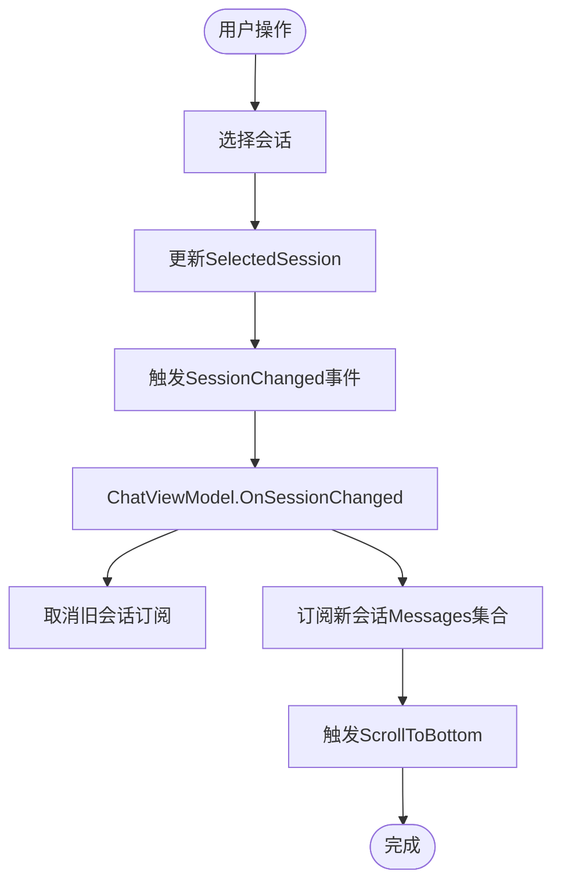
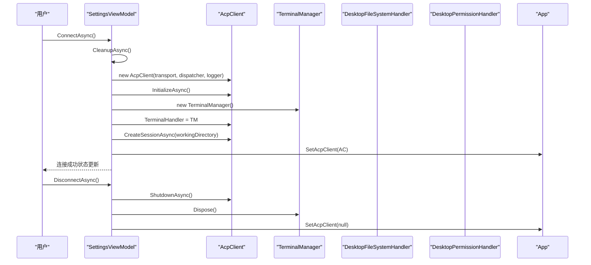
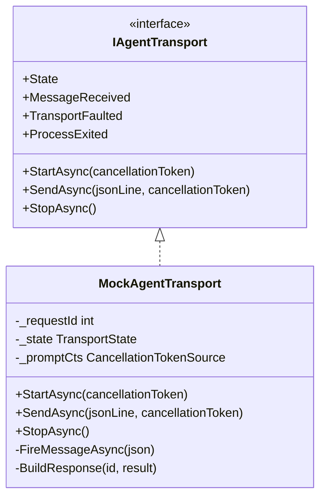
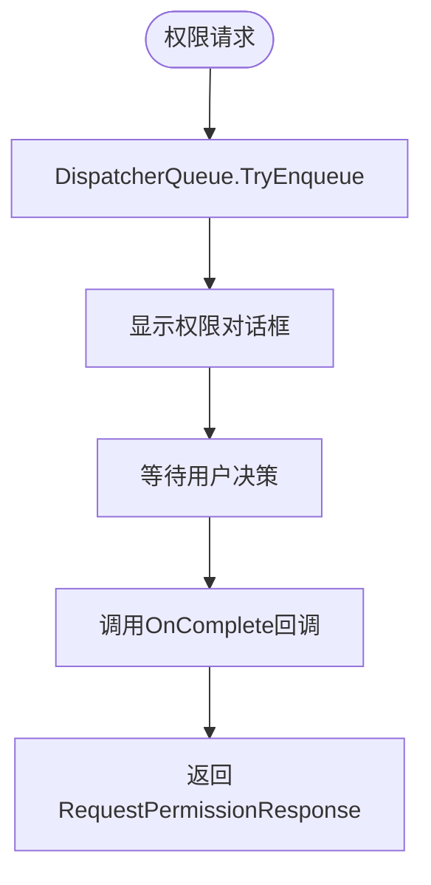
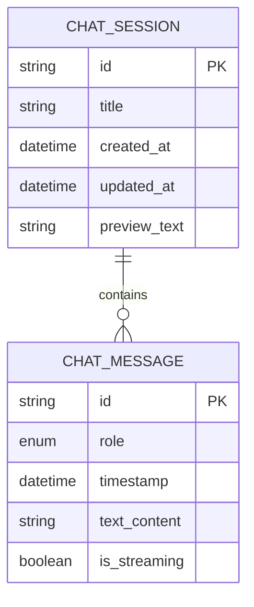
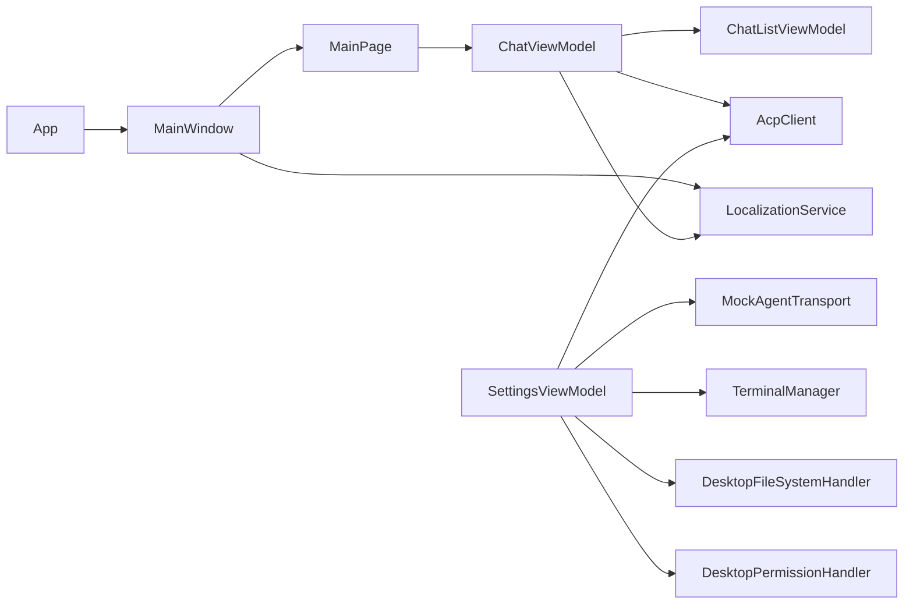

# 组件架构设计

<cite>
**本文引用的文件**
- [App.xaml.cs](file://Agentic.Desktop/App.xaml.cs)
- [MainWindow.xaml.cs](file://Agentic.Desktop/MainWindow.xaml.cs)
- [MainPage.xaml.cs](file://Agentic.Desktop/MainPage.xaml.cs)
- [ChatViewModel.cs](file://Agentic.Desktop/ViewModels/ChatViewModel.cs)
- [ChatListViewModel.cs](file://Agentic.Desktop/ViewModels/ChatListViewModel.cs)
- [SettingsViewModel.cs](file://Agentic.Desktop/ViewModels/SettingsViewModel.cs)
- [TerminalManager.cs](file://Agentic.Desktop/Services/TerminalManager.cs)
- [FileSystemHandler.cs](file://Agentic.Desktop/Services/FileSystemHandler.cs)
- [PermissionHandler.cs](file://Agentic.Desktop/Services/PermissionHandler.cs)
- [LocalizationService.cs](file://Agentic.Desktop/Services/LocalizationService.cs)
- [MockAgentTransport.cs](file://Agentic.Desktop/Mocks/MockAgentTransport.cs)
- [ChatMessage.cs](file://Agentic.Desktop/ViewModels/Messages/ChatMessage.cs)
- [ChatSession.cs](file://Agentic.Desktop/ViewModels/Messages/ChatSession.cs)
- [ChatListPanel.xaml.cs](file://Agentic.Desktop/Views/ChatListPanel.xaml.cs)
- [MainWindow.xaml](file://Agentic.Desktop/MainWindow.xaml)
- [MainPage.xaml](file://Agentic.Desktop/MainPage.xaml)
</cite>

## 目录
1. [简介](#简介)
2. [项目结构](#项目结构)
3. [核心组件](#核心组件)
4. [架构总览](#架构总览)
5. [详细组件分析](#详细组件分析)
6. [依赖关系分析](#依赖关系分析)
7. [性能考量](#性能考量)
8. [故障排查指南](#故障排查指南)
9. [结论](#结论)
10. [附录](#附录)

## 简介
本文件为 Agentic.Desktop 的组件架构设计文档，聚焦于应用整体组件结构与职责划分、生命周期管理、依赖注入与事件通信机制、状态管理模式，以及 IAgentTransport 抽象层的设计理念与扩展点。同时涵盖 AcpClient 的生命周期管理与连接状态监控、组件初始化顺序、资源管理与错误处理策略，并通过交互图与依赖图展示各组件如何协同实现完整的聊天功能。

## 项目结构
- 应用入口与窗口：App、MainWindow
- 主界面与导航：MainPage（聊天页）、SettingsPage（设置页）
- 视图模型：ChatViewModel、ChatListViewModel、SettingsViewModel
- 服务层：TerminalManager、DesktopFileSystemHandler、DesktopPermissionHandler、LocalizationService
- 传输与模拟：MockAgentTransport（IAgentTransport 的实现）
- 数据模型：ChatMessage、ChatSession

图表来源
- [App.xaml.cs:1-85](file://Agentic.Desktop/App.xaml.cs#L1-L85)
- [MainWindow.xaml.cs:1-97](file://Agentic.Desktop/MainWindow.xaml.cs#L1-L97)
- [MainPage.xaml.cs:1-105](file://Agentic.Desktop/MainPage.xaml.cs#L1-L105)
- [ChatViewModel.cs:1-237](file://Agentic.Desktop/ViewModels/ChatViewModel.cs#L1-L237)
- [ChatListViewModel.cs:1-64](file://Agentic.Desktop/ViewModels/ChatListViewModel.cs#L1-L64)
- [SettingsViewModel.cs:1-162](file://Agentic.Desktop/ViewModels/SettingsViewModel.cs#L1-L162)
- [TerminalManager.cs:1-161](file://Agentic.Desktop/Services/TerminalManager.cs#L1-L161)
- [FileSystemHandler.cs:1-42](file://Agentic.Desktop/Services/FileSystemHandler.cs#L1-L42)
- [PermissionHandler.cs:1-52](file://Agentic.Desktop/Services/PermissionHandler.cs#L1-L52)
- [MockAgentTransport.cs:1-142](file://Agentic.Desktop/Mocks/MockAgentTransport.cs#L1-L142)

章节来源
- [App.xaml.cs:1-85](file://Agentic.Desktop/App.xaml.cs#L1-L85)
- [MainWindow.xaml.cs:1-97](file://Agentic.Desktop/MainWindow.xaml.cs#L1-L97)
- [MainPage.xaml.cs:1-105](file://Agentic.Desktop/MainPage.xaml.cs#L1-L105)

## 核心组件
- App：应用全局单例，提供 UI 线程调度器、窗口句柄、日志工厂、当前 AcpClient 及连接变更事件；负责应用启动时的基础配置与窗口创建。
- MainWindow：承载 NavigationView 与 RootFrame，管理页面导航、标题栏扩展、连接状态指示更新。
- MainPage：聊天主页面，绑定 ChatViewModel，订阅 AcpClient 连接变化，处理输入与滚动行为。
- ChatViewModel：聊天业务逻辑与状态管理，包括消息发送、流式响应合并、会话切换、取消生成等。
- ChatListViewModel：会话集合与选中会话管理，维护会话列表与选择事件。
- SettingsViewModel：连接生命周期管理（创建/销毁 AcpClient、TerminalManager），设置 Agent 路径与参数，通过事件通知 UI 连接状态。
- TerminalManager：多终端进程管理，异步读取标准输出/错误，支持退出等待、终止与释放。
- DesktopFileSystemHandler：受工作目录约束的文件读写实现，包含路径校验与安全访问控制。
- DesktopPermissionHandler：权限请求弹窗桥接，将权限请求派发至 UI 线程并等待用户决策。
- MockAgentTransport：IAgentTransport 的模拟实现，用于无真实 Agent 时的 UI 开发与测试。
- LocalizationService：本地化字符串获取与格式化。

章节来源
- [App.xaml.cs:1-85](file://Agentic.Desktop/App.xaml.cs#L1-L85)
- [MainWindow.xaml.cs:1-97](file://Agentic.Desktop/MainWindow.xaml.cs#L1-L97)
- [MainPage.xaml.cs:1-105](file://Agentic.Desktop/MainPage.xaml.cs#L1-L105)
- [ChatViewModel.cs:1-237](file://Agentic.Desktop/ViewModels/ChatViewModel.cs#L1-L237)
- [ChatListViewModel.cs:1-64](file://Agentic.Desktop/ViewModels/ChatListViewModel.cs#L1-L64)
- [SettingsViewModel.cs:1-162](file://Agentic.Desktop/ViewModels/SettingsViewModel.cs#L1-L162)
- [TerminalManager.cs:1-161](file://Agentic.Desktop/Services/TerminalManager.cs#L1-L161)
- [FileSystemHandler.cs:1-42](file://Agentic.Desktop/Services/FileSystemHandler.cs#L1-L42)
- [PermissionHandler.cs:1-52](file://Agentic.Desktop/Services/PermissionHandler.cs#L1-L52)
- [MockAgentTransport.cs:1-142](file://Agentic.Desktop/Mocks/MockAgentTransport.cs#L1-L142)
- [LocalizationService.cs:1-23](file://Agentic.Desktop/Services/LocalizationService.cs#L1-L23)

## 架构总览
应用采用 WinUI 3 + MVVM 架构，以 App 为全局上下文，MainWindow 作为容器，MainPage 承载聊天 UI，ViewModels 负责状态与命令，Services 提供系统能力与外部集成，IAgentTransport 抽象出底层通信方式（真实 Stdio 或 Mock）。

图表来源
- [App.xaml.cs:1-85](file://Agentic.Desktop/App.xaml.cs#L1-L85)
- [MainWindow.xaml.cs:1-97](file://Agentic.Desktop/MainWindow.xaml.cs#L1-L97)
- [MainPage.xaml.cs:1-105](file://Agentic.Desktop/MainPage.xaml.cs#L1-L105)
- [ChatViewModel.cs:1-237](file://Agentic.Desktop/ViewModels/ChatViewModel.cs#L1-L237)
- [ChatListViewModel.cs:1-64](file://Agentic.Desktop/ViewModels/ChatListViewModel.cs#L1-L64)
- [SettingsViewModel.cs:1-162](file://Agentic.Desktop/ViewModels/SettingsViewModel.cs#L1-L162)
- [TerminalManager.cs:1-161](file://Agentic.Desktop/Services/TerminalManager.cs#L1-L161)
- [FileSystemHandler.cs:1-42](file://Agentic.Desktop/Services/FileSystemHandler.cs#L1-L42)
- [PermissionHandler.cs:1-52](file://Agentic.Desktop/Services/PermissionHandler.cs#L1-L52)
- [MockAgentTransport.cs:1-142](file://Agentic.Desktop/Mocks/MockAgentTransport.cs#L1-L142)

## 详细组件分析

### 应用与窗口：App 与 MainWindow
- App 在 OnLaunched 中创建日志工厂、窗口实例与 UI 线程调度器，暴露静态属性供全局访问；提供 SetAcpClient 方法统一设置当前客户端并触发 AcpClientChanged 事件。
- MainWindow 负责标题栏扩展、图标设置、初始尺寸、连接状态指示更新（颜色与文本），以及基于 NavigationView 的页面导航（默认进入 MainPage）。

图表来源
- [App.xaml.cs:64-76](file://Agentic.Desktop/App.xaml.cs#L64-L76)
- [MainWindow.xaml.cs:16-27](file://Agentic.Desktop/MainWindow.xaml.cs#L16-L27)
- [MainWindow.xaml.cs:65-70](file://Agentic.Desktop/MainWindow.xaml.cs#L65-L70)

章节来源
- [App.xaml.cs:1-85](file://Agentic.Desktop/App.xaml.cs#L1-L85)
- [MainWindow.xaml.cs:1-97](file://Agentic.Desktop/MainWindow.xaml.cs#L1-L97)
- [MainWindow.xaml:1-70](file://Agentic.Desktop/MainWindow.xaml#L1-L70)

### 聊天页面与视图模型：MainPage 与 ChatViewModel
- MainPage 构造时绑定 ChatListPanel 的 ViewModel，订阅 ScrollToBottom 事件，若已有连接的 AcpClient 则立即绑定，并订阅 App.AcpClientChanged 以响应连接变化。
- ChatViewModel 维护输入文本、代理响应状态、当前会话消息集合；发送消息时先添加用户消息，再插入占位符的 Agent 消息，调用 AcpClient.SendPromptAsync 或通过本地模拟返回流式内容；对 SessionUpdated 事件进行帧级合并以减少 UI 刷新频率。

图表来源
- [MainPage.xaml.cs:16-47](file://Agentic.Desktop/MainPage.xaml.cs#L16-L47)
- [ChatViewModel.cs:96-151](file://Agentic.Desktop/ViewModels/ChatViewModel.cs#L96-L151)
- [ChatViewModel.cs:153-206](file://Agentic.Desktop/ViewModels/ChatViewModel.cs#L153-L206)

章节来源
- [MainPage.xaml.cs:1-105](file://Agentic.Desktop/MainPage.xaml.cs#L1-L105)
- [ChatViewModel.cs:1-237](file://Agentic.Desktop/ViewModels/ChatViewModel.cs#L1-L237)
- [MainPage.xaml:1-163](file://Agentic.Desktop/MainPage.xaml#L1-L163)

### 会话列表与选择：ChatListViewModel 与 ChatListPanel
- ChatListViewModel 维护会话集合与选中项，提供新建、删除、选择会话的命令；选择会话时触发 SessionChanged 事件，由 ChatViewModel 订阅并切换到对应消息集合。
- ChatListPanel 是 UserControl，将 ViewModel 绑定到控件，并在选择或删除操作时执行相应命令。

图表来源
- [ChatListViewModel.cs:17-63](file://Agentic.Desktop/ViewModels/ChatListViewModel.cs#L17-L63)
- [ChatListPanel.xaml.cs:22-38](file://Agentic.Desktop/Views/ChatListPanel.xaml.cs#L22-L38)
- [ChatViewModel.cs:52-74](file://Agentic.Desktop/ViewModels/ChatViewModel.cs#L52-L74)

章节来源
- [ChatListViewModel.cs:1-64](file://Agentic.Desktop/ViewModels/ChatListViewModel.cs#L1-L64)
- [ChatListPanel.xaml.cs:1-40](file://Agentic.Desktop/Views/ChatListPanel.xaml.cs#L1-L40)

### 设置与连接生命周期：SettingsViewModel
- SettingsViewModel 提供 ConnectAsync 与 DisconnectAsync 命令，负责创建/销毁 AcpClient、TerminalManager，订阅 AgentProcessExited 事件，初始化会话并通知 UI 连接状态。
- 当未配置 AgentPath 时使用 MockAgentTransport 进行模拟；否则使用 StdioAgentTransport 与 JsonRpcDispatcher 建立真实连接。

图表来源
- [SettingsViewModel.cs:60-126](file://Agentic.Desktop/ViewModels/SettingsViewModel.cs#L60-L126)
- [SettingsViewModel.cs:128-140](file://Agentic.Desktop/ViewModels/SettingsViewModel.cs#L128-L140)
- [SettingsViewModel.cs:142-160](file://Agentic.Desktop/ViewModels/SettingsViewModel.cs#L142-L160)
- [App.xaml.cs:78-83](file://Agentic.Desktop/App.xaml.cs#L78-L83)

章节来源
- [SettingsViewModel.cs:1-162](file://Agentic.Desktop/ViewModels/SettingsViewModel.cs#L1-L162)

### 传输抽象层：IAgentTransport 与 MockAgentTransport
- IAgentTransport 定义了 StartAsync、SendAsync、StopAsync 等方法，屏蔽底层通信细节（如 stdio、WebSocket 等），便于替换与扩展。
- MockAgentTransport 实现了协议交互流程（initialize、session/new、session/prompt、session/cancel），并以流式方式推送 session/update 通知，用于 UI 开发调试。

图表来源
- [MockAgentTransport.cs:1-142](file://Agentic.Desktop/Mocks/MockAgentTransport.cs#L1-L142)

章节来源
- [MockAgentTransport.cs:1-142](file://Agentic.Desktop/Mocks/MockAgentTransport.cs#L1-L142)

### 资源与权限：TerminalManager、DesktopFileSystemHandler、DesktopPermissionHandler
- TerminalManager 管理多个终端进程，异步读取 stdout/stderr，支持退出等待、强制终止与释放；Dispose 确保所有进程被清理。
- DesktopFileSystemHandler 限制文件访问在工作目录内，防止越权访问；读写前进行路径校验。
- DesktopPermissionHandler 将权限请求派发至 UI 线程，显示对话框并等待用户决策后返回结果。

图表来源
- [PermissionHandler.cs:26-44](file://Agentic.Desktop/Services/PermissionHandler.cs#L26-L44)

章节来源
- [TerminalManager.cs:1-161](file://Agentic.Desktop/Services/TerminalManager.cs#L1-L161)
- [FileSystemHandler.cs:1-42](file://Agentic.Desktop/Services/FileSystemHandler.cs#L1-L42)
- [PermissionHandler.cs:1-52](file://Agentic.Desktop/Services/PermissionHandler.cs#L1-L52)

### 数据模型：ChatMessage 与 ChatSession
- ChatMessage 表示单条消息，包含角色、时间戳、文本内容与流式标记。
- ChatSession 表示一次会话，包含标题、创建/更新时间、预览文本与消息集合。

图表来源
- [ChatMessage.cs:1-39](file://Agentic.Desktop/ViewModels/Messages/ChatMessage.cs#L1-L39)
- [ChatSession.cs:1-28](file://Agentic.Desktop/ViewModels/Messages/ChatSession.cs#L1-L28)

章节来源
- [ChatMessage.cs:1-39](file://Agentic.Desktop/ViewModels/Messages/ChatMessage.cs#L1-L39)
- [ChatSession.cs:1-28](file://Agentic.Desktop/ViewModels/Messages/ChatSession.cs#L1-L28)

## 依赖关系分析
- App 提供全局上下文（窗口、调度器、日志、AcpClient），被 MainWindow、MainPage、SettingsViewModel 使用。
- MainWindow 依赖 LocalizationService 更新状态文本，依赖 App.Window 进行导航。
- MainPage 依赖 ChatViewModel 与 App.AcpClientChanged 事件。
- ChatViewModel 依赖 ChatListViewModel、AcpClient、LocalizationService。
- SettingsViewModel 依赖 AcpClient、IAgentTransport（Mock/Stdio）、TerminalManager、DesktopFileSystemHandler、DesktopPermissionHandler、App.SetAcpClient。
- Services 之间相对独立，通过 AcpClient 注入到上层。

图表来源
- [App.xaml.cs:1-85](file://Agentic.Desktop/App.xaml.cs#L1-L85)
- [MainWindow.xaml.cs:1-97](file://Agentic.Desktop/MainWindow.xaml.cs#L1-L97)
- [MainPage.xaml.cs:1-105](file://Agentic.Desktop/MainPage.xaml.cs#L1-L105)
- [ChatViewModel.cs:1-237](file://Agentic.Desktop/ViewModels/ChatViewModel.cs#L1-L237)
- [SettingsViewModel.cs:1-162](file://Agentic.Desktop/ViewModels/SettingsViewModel.cs#L1-L162)
- [TerminalManager.cs:1-161](file://Agentic.Desktop/Services/TerminalManager.cs#L1-L161)
- [FileSystemHandler.cs:1-42](file://Agentic.Desktop/Services/FileSystemHandler.cs#L1-L42)
- [PermissionHandler.cs:1-52](file://Agentic.Desktop/Services/PermissionHandler.cs#L1-L52)
- [MockAgentTransport.cs:1-142](file://Agentic.Desktop/Mocks/MockAgentTransport.cs#L1-L142)
- [LocalizationService.cs:1-23](file://Agentic.Desktop/Services/LocalizationService.cs#L1-L23)

章节来源
- [App.xaml.cs:1-85](file://Agentic.Desktop/App.xaml.cs#L1-L85)
- [MainWindow.xaml.cs:1-97](file://Agentic.Desktop/MainWindow.xaml.cs#L1-L97)
- [MainPage.xaml.cs:1-105](file://Agentic.Desktop/MainPage.xaml.cs#L1-L105)
- [ChatViewModel.cs:1-237](file://Agentic.Desktop/ViewModels/ChatViewModel.cs#L1-L237)
- [SettingsViewModel.cs:1-162](file://Agentic.Desktop/ViewModels/SettingsViewModel.cs#L1-L162)

## 性能考量
- 流式响应合并：ChatViewModel 对 AgentMessageChunk 进行帧级合并，延迟 50ms 批量更新 UI，减少频繁重绘。
- UI 线程调度：大量 UI 更新通过 DispatcherQueue.TryEnqueue 确保线程安全。
- 资源释放：TerminalManager 与 AcpClient 在断开连接时正确释放进程与资源，避免内存泄漏。
- 本地模拟：MockAgentTransport 在无真实 Agent 时提供稳定响应，提升开发效率。

[本节为通用指导，不直接分析具体文件]

## 故障排查指南
- 连接失败：检查 SettingsViewModel.ConnectAsync 异常捕获与 ConnectionStatus 更新；确认 AgentPath 与参数是否正确。
- 代理进程意外退出：订阅 AcpClient.AgentProcessExited，通过 OnAgentDisconnected 提示用户并重置状态。
- 权限请求无响应：确认 DesktopPermissionHandler.PermissionRequested 已订阅且 UI 线程调度正常。
- 文件访问拒绝：检查 DesktopFileSystemHandler.ValidatePath 是否抛出 UnauthorizedAccessException，确认工作目录设置。
- 终端进程未释放：确保 TerminalManager.Dispose 被调用，或在应用关闭时统一释放。

章节来源
- [SettingsViewModel.cs:115-126](file://Agentic.Desktop/ViewModels/SettingsViewModel.cs#L115-L126)
- [SettingsViewModel.cs:142-160](file://Agentic.Desktop/ViewModels/SettingsViewModel.cs#L142-L160)
- [PermissionHandler.cs:26-44](file://Agentic.Desktop/Services/PermissionHandler.cs#L26-L44)
- [FileSystemHandler.cs:32-40](file://Agentic.Desktop/Services/FileSystemHandler.cs#L32-L40)
- [TerminalManager.cs:115-128](file://Agentic.Desktop/Services/TerminalManager.cs#L115-L128)

## 结论
Agentic.Desktop 通过清晰的组件分层与 MVVM 模式，实现了可扩展的聊天功能与灵活的传输抽象。App 与 MainWindow 提供应用框架，MainPage 与 ViewModels 管理 UI 与状态，Services 封装系统与外部集成，IAgentTransport 抽象层支持 Mock 与真实 Agent 无缝切换。合理的生命周期管理、事件通信与资源释放策略确保了应用的稳定性与可维护性。

[本节为总结，不直接分析具体文件]

## 附录
- 组件初始化顺序：App.OnLaunched → MainWindow 构造 → NavigationView.Loaded → MainPage 导航 → MainPage 构造绑定 ViewModel → SettingsViewModel 连接（按需）。
- 状态管理模式：App.CurrentAcpClient 与 App.AcpClientChanged 作为全局状态源；ChatViewModel 订阅连接变化并绑定/解绑客户端；SettingsViewModel 负责连接生命周期。
- 扩展点：IAgentTransport 接口允许新增传输实现；TerminalManager、DesktopFileSystemHandler、DesktopPermissionHandler 可通过 AcpClient 注入自定义实现。

[本节为补充信息，不直接分析具体文件]