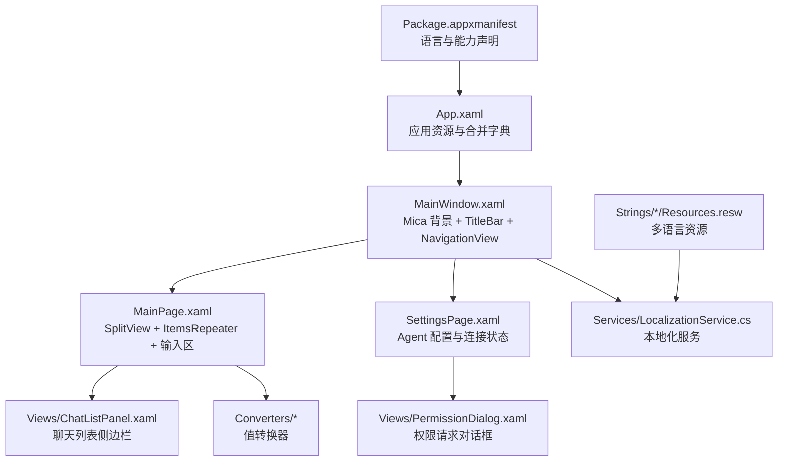
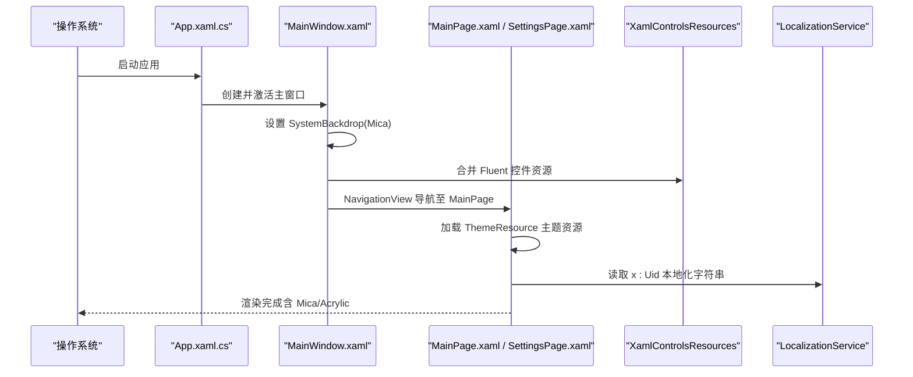
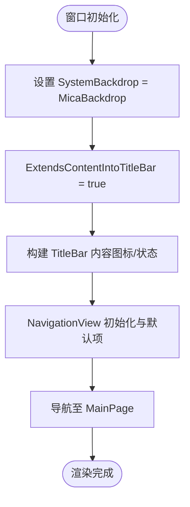
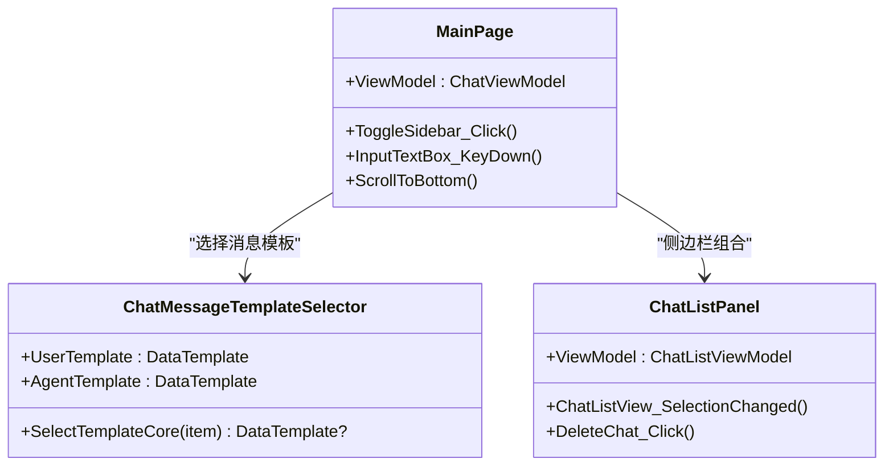
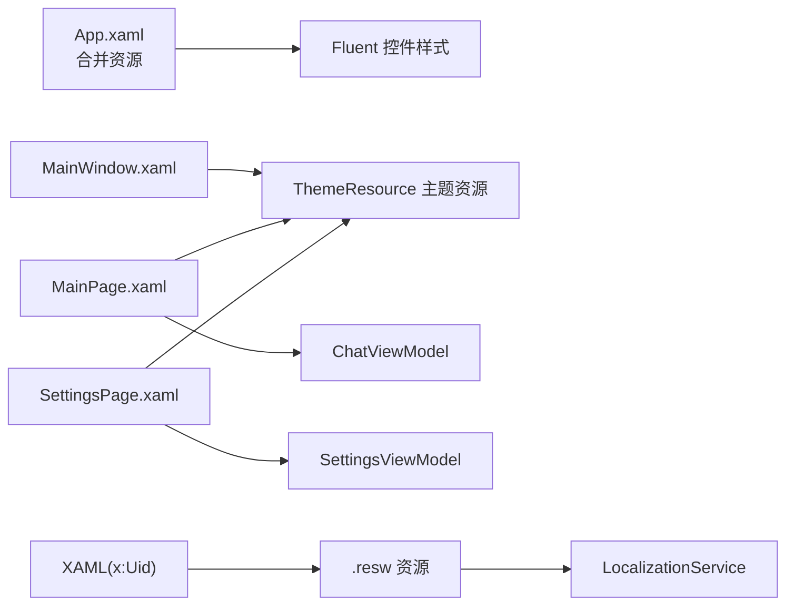

# UI 样式与主题

<cite>
**本文引用的文件**
- [App.xaml](file://Agentic.Desktop/App.xaml)
- [App.xaml.cs](file://Agentic.Desktop/App.xaml.cs)
- [MainWindow.xaml](file://Agentic.Desktop/MainWindow.xaml)
- [MainWindow.xaml.cs](file://Agentic.Desktop/MainWindow.xaml.cs)
- [MainPage.xaml](file://Agentic.Desktop/MainPage.xaml)
- [MainPage.xaml.cs](file://Agentic.Desktop/MainPage.xaml.cs)
- [SettingsPage.xaml](file://Agentic.Desktop/SettingsPage.xaml)
- [SettingsPage.xaml.cs](file://Agentic.Desktop/SettingsPage.xaml.cs)
- [ChatListPanel.xaml](file://Agentic.Desktop/Views/ChatListPanel.xaml)
- [PermissionDialog.xaml](file://Agentic.Desktop/Views/PermissionDialog.xaml)
- [BoolToVisibilityConverter.cs](file://Agentic.Desktop/Converters/BoolToVisibilityConverter.cs)
- [StatusToColorConverter.cs](file://Agentic.Desktop/Converters/StatusToColorConverter.cs)
- [LocalizationService.cs](file://Agentic.Desktop/Services/LocalizationService.cs)
- [Resources.resw (zh-CN)](file://Agentic.Desktop/Strings/zh-CN/Resources.resw)
- [Package.appxmanifest](file://Agentic.Desktop/Package.appxmanifest)
</cite>

## 目录
1. [简介](#简介)
2. [项目结构](#项目结构)
3. [核心组件](#核心组件)
4. [架构总览](#架构总览)
5. [详细组件分析](#详细组件分析)
6. [依赖关系分析](#依赖关系分析)
7. [性能考量](#性能考量)
8. [故障排查指南](#故障排查指南)
9. [结论](#结论)
10. [附录](#附录)

## 简介
本文件面向 WinUI 3 的 UI 样式与主题系统，结合本项目实际代码，系统性阐述 Fluent Design 的应用方式（包括 Mica 背景、亚克力材质与现代视觉效果），并详细说明 App.xaml 中的全局资源定义、样式模板与主题配置；解释 MainWindow 与 MainPage 的布局结构与样式继承机制；覆盖深色/浅色主题切换、动态资源使用与样式定制方法；同时包含可访问性支持、高对比度模式与国际化文本显示的最佳实践，并提供主题扩展与自定义样式的开发指导。

## 项目结构
本项目采用按功能域组织的方式：XAML 视图位于根目录与 Views 子目录，转换器位于 Converters，服务位于 Services，字符串资源位于 Strings。应用入口为 App.xaml.cs，主窗口为 MainWindow，主页面为 MainPage，设置页为 SettingsPage，侧边栏面板为 ChatListPanel，权限对话框为 PermissionDialog。

**图表来源**
- [App.xaml:1-17](file://Agentic.Desktop/App.xaml#L1-L17)
- [MainWindow.xaml:1-70](file://Agentic.Desktop/MainWindow.xaml#L1-L70)
- [MainPage.xaml:1-163](file://Agentic.Desktop/MainPage.xaml#L1-L163)
- [SettingsPage.xaml:1-121](file://Agentic.Desktop/SettingsPage.xaml#L1-L121)
- [ChatListPanel.xaml:1-88](file://Agentic.Desktop/Views/ChatListPanel.xaml#L1-L88)
- [PermissionDialog.xaml:1-42](file://Agentic.Desktop/Views/PermissionDialog.xaml#L1-L42)
- [LocalizationService.cs:1-23](file://Agentic.Desktop/Services/LocalizationService.cs#L1-L23)
- [Package.appxmanifest:1-57](file://Agentic.Desktop/Package.appxmanifest#L1-L57)

**章节来源**
- [App.xaml:1-17](file://Agentic.Desktop/App.xaml#L1-L17)
- [MainWindow.xaml:1-70](file://Agentic.Desktop/MainWindow.xaml#L1-L70)
- [MainPage.xaml:1-163](file://Agentic.Desktop/MainPage.xaml#L1-L163)
- [SettingsPage.xaml:1-121](file://Agentic.Desktop/SettingsPage.xaml#L1-L121)
- [ChatListPanel.xaml:1-88](file://Agentic.Desktop/Views/ChatListPanel.xaml#L1-L88)
- [PermissionDialog.xaml:1-42](file://Agentic.Desktop/Views/PermissionDialog.xaml#L1-L42)
- [LocalizationService.cs:1-23](file://Agentic.Desktop/Services/LocalizationService.cs#L1-L23)
- [Package.appxmanifest:1-57](file://Agentic.Desktop/Package.appxmanifest#L1-L57)

## 核心组件
- 应用资源与主题入口
  - App.xaml 中通过 Application.Resources 与 ResourceDictionary.MergedDictionaries 引入 Microsoft.UI.Xaml.Controls 的 XamlControlsResources，确保 Fluent 控件样式与主题资源可用。
- 主窗口与系统级视觉效果
  - MainWindow.xaml 使用 Window.SystemBackdrop 的 MicaBackdrop 实现 Mica 背景效果；TitleBar 自定义标题栏内容，NavigationView 承载页面导航。
- 主页面与消息界面
  - MainPage.xaml 使用 SplitView 构建左右分栏（侧边栏与聊天内容），ItemsRepeater 渲染消息列表，DataTemplateSelector 根据角色选择用户或 Agent 的消息模板；输入区使用 Acrylic 背景增强层次感。
- 设置页与连接状态
  - SettingsPage.xaml 提供 Agent 路径、参数与工作目录配置，以及连接/断开按钮与状态展示；通过共享 ViewModel 保持跨页面连接状态。
- 值转换器与本地化
  - BoolToVisibilityConverter 将布尔值转换为 Visibility；StatusToColorConverter 将连接状态映射为颜色；LocalizationService 封装 .resw 资源读取；Strings 目录下提供多语言资源。

**章节来源**
- [App.xaml:1-17](file://Agentic.Desktop/App.xaml#L1-L17)
- [MainWindow.xaml:1-70](file://Agentic.Desktop/MainWindow.xaml#L1-L70)
- [MainPage.xaml:1-163](file://Agentic.Desktop/MainPage.xaml#L1-L163)
- [SettingsPage.xaml:1-121](file://Agentic.Desktop/SettingsPage.xaml#L1-L121)
- [BoolToVisibilityConverter.cs:1-28](file://Agentic.Desktop/Converters/BoolToVisibilityConverter.cs#L1-L28)
- [StatusToColorConverter.cs:1-31](file://Agentic.Desktop/Converters/StatusToColorConverter.cs#L1-L31)
- [LocalizationService.cs:1-23](file://Agentic.Desktop/Services/LocalizationService.cs#L1-L23)
- [Resources.resw (zh-CN):1-223](file://Agentic.Desktop/Strings/zh-CN/Resources.resw#L1-L223)

## 架构总览
下图展示了从应用启动到页面渲染的主题与样式加载流程，以及 Mica/Acrylic 等视觉效果的生效位置。

**图表来源**
- [App.xaml.cs:64-76](file://Agentic.Desktop/App.xaml.cs#L64-L76)
- [MainWindow.xaml:11-13](file://Agentic.Desktop/MainWindow.xaml#L11-L13)
- [App.xaml:7-14](file://Agentic.Desktop/App.xaml#L7-L14)
- [MainPage.xaml:14-163](file://Agentic.Desktop/MainPage.xaml#L14-L163)
- [LocalizationService.cs:10-22](file://Agentic.Desktop/Services/LocalizationService.cs#L10-L22)

## 详细组件分析

### App.xaml 与全局资源
- 通过 Application.Resources 定义 ResourceDictionary，并使用 MergedDictionaries 引入 Microsoft.UI.Xaml.Controls 的 XamlControlsResources，确保所有 Fluent 控件具备一致的样式与主题行为。
- 可在该字典中追加自定义资源字典，统一管理全局样式、画刷、字体与动画资源。

**章节来源**
- [App.xaml:7-14](file://Agentic.Desktop/App.xaml#L7-L14)

### MainWindow 与 Mica 背景
- 使用 Window.SystemBackdrop 的 MicaBackdrop 实现系统级毛玻璃背景，提升层次与沉浸感。
- 自定义 TitleBar 内容，集成连接状态指示器（圆点与文本），并通过 NavigationView 管理页面导航。
- 在代码中启用 ExtendsContentIntoTitleBar，使自定义标题栏内容与系统标题栏融合。

**图表来源**
- [MainWindow.xaml:11-13](file://Agentic.Desktop/MainWindow.xaml#L11-L13)
- [MainWindow.xaml.cs:20-27](file://Agentic.Desktop/MainWindow.xaml.cs#L20-L27)
- [MainWindow.xaml:21-42](file://Agentic.Desktop/MainWindow.xaml#L21-L42)
- [MainWindow.xaml.cs:65-70](file://Agentic.Desktop/MainWindow.xaml.cs#L65-L70)

**章节来源**
- [MainWindow.xaml:1-70](file://Agentic.Desktop/MainWindow.xaml#L1-L70)
- [MainWindow.xaml.cs:1-97](file://Agentic.Desktop/MainWindow.xaml.cs#L1-L97)

### MainPage 布局与样式继承
- 使用 SplitView 构建侧边栏与内容区域，侧边栏承载 ChatListPanel，内容区包含消息滚动容器与输入区。
- 消息列表通过 ItemsRepeater 绑定 ViewModel.Messages，并使用 ChatMessageTemplateSelector 根据角色选择 DataTemplate。
- 输入区背景使用 Acrylic 画刷，增强现代感与层次。
- 多处使用 {ThemeResource ...} 引用 Fluent 主题资源，自动适配深浅色主题。

**图表来源**
- [MainPage.xaml.cs:86-103](file://Agentic.Desktop/MainPage.xaml.cs#L86-L103)
- [MainPage.xaml:16-54](file://Agentic.Desktop/MainPage.xaml#L16-L54)
- [ChatListPanel.xaml:1-88](file://Agentic.Desktop/Views/ChatListPanel.xaml#L1-L88)

**章节来源**
- [MainPage.xaml:1-163](file://Agentic.Desktop/MainPage.xaml#L1-L163)
- [MainPage.xaml.cs:1-105](file://Agentic.Desktop/MainPage.xaml.cs#L1-L105)
- [ChatListPanel.xaml:1-88](file://Agentic.Desktop/Views/ChatListPanel.xaml#L1-L88)

### SettingsPage 与连接状态
- 提供 Agent 路径、参数与工作目录配置，支持浏览选择工作目录。
- 连接/断开按钮绑定命令，进度环与状态文本反映当前连接状态。
- 通过共享 SettingsViewModel 保持连接状态跨页面一致，并在连接成功后更新主窗口标题栏状态。

**章节来源**
- [SettingsPage.xaml:1-121](file://Agentic.Desktop/SettingsPage.xaml#L1-L121)
- [SettingsPage.xaml.cs:1-96](file://Agentic.Desktop/SettingsPage.xaml.cs#L1-L96)

### 值转换器与可见性控制
- BoolToVisibilityConverter：将布尔值转换为 Visibility，支持“反转”参数以简化条件逻辑。
- StatusToColorConverter：将连接状态整型映射为 SolidColorBrush，用于状态指示。

**章节来源**
- [BoolToVisibilityConverter.cs:1-28](file://Agentic.Desktop/Converters/BoolToVisibilityConverter.cs#L1-L28)
- [StatusToColorConverter.cs:1-31](file://Agentic.Desktop/Converters/StatusToColorConverter.cs#L1-L31)

### 权限对话框与交互
- PermissionDialog 使用 ContentDialog 展示权限请求，动态生成选项按钮，用户选择后回调完成处理。
- 通过 x:Uid 绑定本地化文本，确保多语言一致性。

**章节来源**
- [PermissionDialog.xaml:1-42](file://Agentic.Desktop/Views/PermissionDialog.xaml#L1-L42)
- [SettingsPage.xaml.cs:24-33](file://Agentic.Desktop/SettingsPage.xaml.cs#L24-L33)

### 国际化与本地化
- 使用 x:Uid 在 XAML 中引用资源键，运行时由 LocalizationService 从 .resw 文件中读取对应语言文本。
- Package.appxmanifest 声明支持的语言（en、zh-CN、zh-TW、ja）。
- Strings 目录下按语言组织 Resources.resw，便于维护与扩展。

**章节来源**
- [LocalizationService.cs:1-23](file://Agentic.Desktop/Services/LocalizationService.cs#L1-L23)
- [Package.appxmanifest:29-34](file://Agentic.Desktop/Package.appxmanifest#L29-L34)
- [Resources.resw (zh-CN):1-223](file://Agentic.Desktop/Strings/zh-CN/Resources.resw#L1-L223)

## 依赖关系分析
- 样式与主题依赖
  - App.xaml 合并 XamlControlsResources，为所有 Fluent 控件提供基础样式与主题资源。
  - 各页面通过 {ThemeResource ...} 引用主题画刷与颜色，自动响应系统主题变化。
- 数据与视图依赖
  - MainPage 依赖 ChatViewModel 与 Message 模型，通过 DataTemplateSelector 选择不同模板。
  - SettingsPage 依赖 SettingsViewModel，共享连接状态并驱动 UI 更新。
- 本地化依赖
  - 所有带 x:Uid 的元素依赖 .resw 资源文件，运行时由 LocalizationService 解析。

**图表来源**
- [App.xaml:7-14](file://Agentic.Desktop/App.xaml#L7-L14)
- [MainPage.xaml:14-163](file://Agentic.Desktop/MainPage.xaml#L14-L163)
- [SettingsPage.xaml:12-121](file://Agentic.Desktop/SettingsPage.xaml#L12-L121)
- [LocalizationService.cs:10-22](file://Agentic.Desktop/Services/LocalizationService.cs#L10-L22)

**章节来源**
- [App.xaml:7-14](file://Agentic.Desktop/App.xaml#L7-L14)
- [MainPage.xaml:14-163](file://Agentic.Desktop/MainPage.xaml#L14-L163)
- [SettingsPage.xaml:12-121](file://Agentic.Desktop/SettingsPage.xaml#L12-L121)
- [LocalizationService.cs:10-22](file://Agentic.Desktop/Services/LocalizationService.cs#L10-L22)

## 性能考量
- 使用 ItemsRepeater 替代 ListView/GridView 渲染长列表，减少内存占用与布局开销。
- 避免在频繁更新的 UI 上创建新画刷实例，尽量复用静态画刷或使用 ThemeResource。
- 使用 DispatcherQueue.TryEnqueue 进行 UI 线程调度，避免阻塞与闪烁。
- 合理拆分 DataTemplate，按需加载，减少初始渲染时间。

[本节为通用指导，不直接分析具体文件]

## 故障排查指南
- 主题资源未生效
  - 确认 App.xaml 已合并 XamlControlsResources。
  - 检查页面 Background 是否使用 {ThemeResource ApplicationPageBackgroundThemeBrush}。
- Mica/Acrylic 不显示
  - 确认 Window.SystemBackdrop 设置为 MicaBackdrop。
  - 检查输入区背景是否使用 Acrylic 画刷且未被覆盖。
- 本地化文本为空
  - 检查 x:Uid 是否与 .resw 中的 data name 一致。
  - 确认 Package.appxmanifest 已声明对应语言。
- 连接状态不一致
  - 确认 SettingsViewModel 为单例共享，避免页面重建导致状态丢失。
  - 检查 App.SetAcpClient 调用与事件订阅是否正确。

**章节来源**
- [App.xaml:7-14](file://Agentic.Desktop/App.xaml#L7-L14)
- [MainWindow.xaml:11-13](file://Agentic.Desktop/MainWindow.xaml#L11-L13)
- [MainPage.xaml:121-121](file://Agentic.Desktop/MainPage.xaml#L121-L121)
- [Package.appxmanifest:29-34](file://Agentic.Desktop/Package.appxmanifest#L29-L34)
- [SettingsPage.xaml.cs:12-13](file://Agentic.Desktop/SettingsPage.xaml.cs#L12-L13)
- [App.xaml.cs:78-83](file://Agentic.Desktop/App.xaml.cs#L78-L83)

## 结论
本项目在 WinUI 3 中充分应用了 Fluent Design 的核心要素：通过 Mica 背景与 Acrylic 材质营造现代视觉体验，借助 ThemeResource 实现深浅色主题的无缝切换，利用 x:Uid 与 .resw 资源完成国际化支持。App.xaml 作为全局资源入口，统一注入 Fluent 控件样式；MainWindow 与 MainPage 通过合理的布局与样式继承，构建了清晰、可扩展的 UI 架构。遵循本文档的实践建议，可进一步扩展主题与样式，提升可访问性与用户体验。

[本节为总结性内容，不直接分析具体文件]

## 附录

### 主题与样式最佳实践
- 使用 {ThemeResource ...} 引用主题画刷与颜色，避免硬编码颜色值。
- 在 App.xaml 中集中管理全局样式与资源字典，便于统一维护。
- 使用 DataTemplate 与 DataTemplateSelector 分离不同内容的呈现逻辑。
- 通过 x:Uid 绑定本地化文本，确保多语言一致性。
- 使用 Converter 处理简单逻辑转换，避免在代码中编写复杂 UI 逻辑。

### 可访问性与高对比度模式
- 为关键控件设置 AutomationProperties.AutomationId，便于辅助技术识别。
- 使用 Fluent 控件的默认样式，确保高对比度模式下的一致性。
- 避免仅通过颜色传达信息，辅以文字或图标说明。

### 主题扩展与自定义样式
- 在 App.xaml 的 ResourceDictionary 中添加自定义样式与画刷。
- 通过 BasedOn 继承现有样式，快速定制控件外观。
- 使用 ThemeDictionaries 针对深浅色主题分别定义资源，实现主题切换。

[本节为通用指导，不直接分析具体文件]