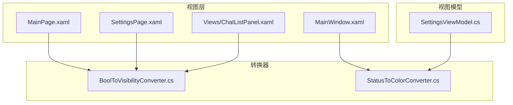
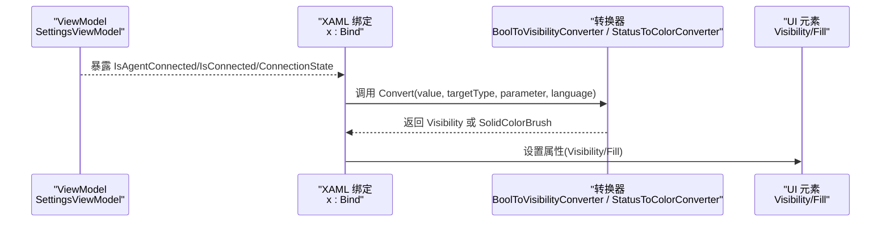
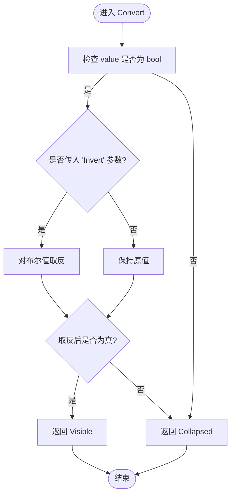
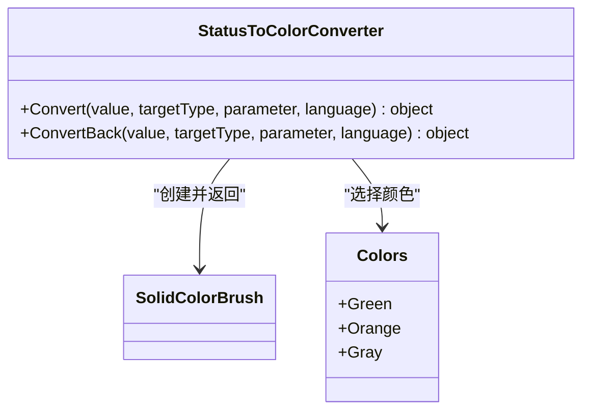
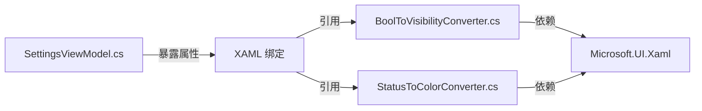

# XAML 值转换器

<cite>
**本文引用的文件**   
- [BoolToVisibilityConverter.cs](file://Agentic.Desktop/Converters/BoolToVisibilityConverter.cs)
- [StatusToColorConverter.cs](file://Agentic.Desktop/Converters/StatusToColorConverter.cs)
- [MainPage.xaml](file://Agentic.Desktop/Agentic.Desktop/MainPage.xaml)
- [SettingsPage.xaml](file://Agentic.Desktop/Agentic.Desktop/SettingsPage.xaml)
- [ChatListPanel.xaml](file://Agentic.Desktop/Agentic.Desktop/Views/ChatListPanel.xaml)
- [MainWindow.xaml](file://Agentic.Desktop/Agentic.Desktop/MainWindow.xaml)
- [SettingsViewModel.cs](file://Agentic.Desktop/Agentic.Desktop/ViewModels/SettingsViewModel.cs)
</cite>

## 目录
1. [简介](#简介)
2. [项目结构](#项目结构)
3. [核心组件](#核心组件)
4. [架构总览](#架构总览)
5. [详细组件分析](#详细组件分析)
6. [依赖关系分析](#依赖关系分析)
7. [性能考虑](#性能考虑)
8. [故障排查指南](#故障排查指南)
9. [结论](#结论)
10. [附录](#附录)

## 简介
本技术文档聚焦于 WinUI 3（XAML）中的值转换器，围绕两个关键实现展开：
- BoolToVisibilityConverter：将布尔值转换为 UI 可见性状态，支持可选的反转参数。
- StatusToColorConverter：将连接状态整数映射为颜色 SolidColorBrush，用于指示连接状态。

文档涵盖数据绑定与转换逻辑、在 XAML 中的声明与注册方式、IValueConverter 接口实现细节、性能优化建议以及自定义转换器的开发最佳实践。

## 项目结构
本项目采用按功能域组织的方式，转换器统一放置在 Converters 命名空间下，便于在多个页面中复用。XAML 页面通过资源字典或控件资源声明转换器实例，并在 x:Bind 绑定中使用。

图表来源
- [MainPage.xaml:47-48](file://Agentic.Desktop/Agentic.Desktop/MainPage.xaml#L47-L48)
- [SettingsPage.xaml:14-16](file://Agentic.Desktop/Agentic.Desktop/SettingsPage.xaml#L14-L16)
- [ChatListPanel.xaml:13-15](file://Agentic.Desktop/Agentic.Desktop/Views/ChatListPanel.xaml#L13-L15)
- [MainWindow.xaml:31-34](file://Agentic.Desktop/Agentic.Desktop/MainWindow.xaml#L31-L34)
- [BoolToVisibilityConverter.cs:1-28](file://Agentic.Desktop/Agentic.Desktop/Converters/BoolToVisibilityConverter.cs#L1-L28)
- [StatusToColorConverter.cs:1-31](file://Agentic.Desktop/Agentic.Desktop/Converters/StatusToColorConverter.cs#L1-L31)
- [SettingsViewModel.cs:44-46](file://Agentic.Desktop/Agentic.Desktop/ViewModels/SettingsViewModel.cs#L44-L46)

章节来源
- [MainPage.xaml:47-48](file://Agentic.Desktop/Agentic.Desktop/MainPage.xaml#L47-L48)
- [SettingsPage.xaml:14-16](file://Agentic.Desktop/Agentic.Desktop/SettingsPage.xaml#L14-L16)
- [ChatListPanel.xaml:13-15](file://Agentic.Desktop/Agentic.Desktop/Views/ChatListPanel.xaml#L13-L15)
- [MainWindow.xaml:31-34](file://Agentic.Desktop/Agentic.Desktop/MainWindow.xaml#L31-L34)

## 核心组件
- BoolToVisibilityConverter：实现 IValueConverter，将 bool 转为 Visibility；当 ConverterParameter 为 "Invert" 时反转逻辑；非 bool 输入默认返回 Collapsed。
- StatusToColorConverter：实现 IValueConverter，将 int 状态映射为 SolidColorBrush；状态 2=Connected（绿色）、1=Connecting（橙色）、其他=Disconnected（灰色）。

章节来源
- [BoolToVisibilityConverter.cs:10-27](file://Agentic.Desktop/Agentic.Desktop/Converters/BoolToVisibilityConverter.cs#L10-L27)
- [StatusToColorConverter.cs:10-30](file://Agentic.Desktop/Agentic.Desktop/Converters/StatusToColorConverter.cs#L10-L30)

## 架构总览
值转换器作为数据绑定链中的一环，位于 ViewModel 属性与 UI 属性之间。XAML 通过 x:Bind 单向绑定到 ViewModel 的布尔或整型属性，转换器负责类型与语义转换，最终影响 UI 呈现。

图表来源
- [SettingsViewModel.cs:44-46](file://Agentic.Desktop/Agentic.Desktop/ViewModels/SettingsViewModel.cs#L44-L46)
- [MainPage.xaml:95-96](file://Agentic.Desktop/Agentic.Desktop/MainPage.xaml#L95-L96)
- [SettingsPage.xaml:97-107](file://Agentic.Desktop/Agentic.Desktop/SettingsPage.xaml#L97-L107)
- [BoolToVisibilityConverter.cs:12-21](file://Agentic.Desktop/Agentic.Desktop/Converters/BoolToVisibilityConverter.cs#L12-L21)
- [StatusToColorConverter.cs:12-24](file://Agentic.Desktop/Agentic.Desktop/Converters/StatusToColorConverter.cs#L12-L24)

## 详细组件分析

### BoolToVisibilityConverter 分析
- 作用：将布尔值转换为 Visibility，常用于控制 UI 元素的显示/隐藏。
- 转换逻辑：
  - 若输入为 bool，则根据是否传入 "Invert" 参数决定是否取反。
  - 真值返回 Visible，假值返回 Collapsed。
  - 非 bool 输入直接返回 Collapsed，避免异常。
- ConvertBack：未实现，抛出 NotImplementedException，适用于单向绑定场景。
- 典型使用：
  - MainPage.xaml 中用于“正在生成”提示的可见性与取消按钮的可见性。
  - SettingsPage.xaml 中用于连接成功后的信息面板显示。
  - ChatListPanel.xaml 中声明了转换器资源以便复用。

图表来源
- [BoolToVisibilityConverter.cs:12-21](file://Agentic.Desktop/Agentic.Desktop/Converters/BoolToVisibilityConverter.cs#L12-L21)

章节来源
- [BoolToVisibilityConverter.cs:10-27](file://Agentic.Desktop/Agentic.Desktop/Converters/BoolToVisibilityConverter.cs#L10-L27)
- [MainPage.xaml:95-96](file://Agentic.Desktop/Agentic.Desktop/MainPage.xaml#L95-L96)
- [MainPage.xaml:151-152](file://Agentic.Desktop/Agentic.Desktop/MainPage.xaml#L151-L152)
- [SettingsPage.xaml:97-107](file://Agentic.Desktop/Agentic.Desktop/SettingsPage.xaml#L97-L107)
- [ChatListPanel.xaml:13-15](file://Agentic.Desktop/Agentic.Desktop/Views/ChatListPanel.xaml#L13-L15)

### StatusToColorConverter 分析
- 作用：将连接状态整数映射为 SolidColorBrush，用于直观展示连接状态。
- 状态映射：
  - 2 → 绿色（已连接）
  - 1 → 橙色（连接中）
  - 其他 → 灰色（未连接）
- 返回值：始终返回 SolidColorBrush 实例，供 Fill、Foreground 等属性使用。
- ConvertBack：未实现，抛出 NotImplementedException，适用于单向绑定场景。
- 典型使用：可用于标题栏状态点、状态指示器等 UI 元素的颜色绑定。

图表来源
- [StatusToColorConverter.cs:12-24](file://Agentic.Desktop/Agentic.Desktop/Converters/StatusToColorConverter.cs#L12-L24)

章节来源
- [StatusToColorConverter.cs:10-30](file://Agentic.Desktop/Agentic.Desktop/Converters/StatusToColorConverter.cs#L10-L30)
- [MainWindow.xaml:31-34](file://Agentic.Desktop/Agentic.Desktop/MainWindow.xaml#L31-L34)
- [SettingsViewModel.cs:44-46](file://Agentic.Desktop/Agentic.Desktop/ViewModels/SettingsViewModel.cs#L44-L46)

### XAML 中的声明与使用
- 声明方式：
  - 在 Page.Resources 或 UserControl.Resources 中声明转换器实例，并指定 x:Key。
  - 使用 xmlns:converters="using:Agentic.Desktop.Converters" 引入命名空间。
- 使用方式：
  - 在 x:Bind 绑定中通过 Converter={StaticResource ...} 引用转换器。
  - 可通过 ConverterParameter 传递额外参数（如 "Invert"）。
- 示例位置：
  - MainPage.xaml：声明并使用 BoolToVisibilityConverter。
  - SettingsPage.xaml：声明并使用 BoolToVisibilityConverter。
  - ChatListPanel.xaml：声明转换器资源。

章节来源
- [MainPage.xaml:47-48](file://Agentic.Desktop/Agentic.Desktop/MainPage.xaml#L47-L48)
- [MainPage.xaml:95-96](file://Agentic.Desktop/Agentic.Desktop/MainPage.xaml#L95-L96)
- [MainPage.xaml:151-152](file://Agentic.Desktop/Agentic.Desktop/MainPage.xaml#L151-L152)
- [SettingsPage.xaml:14-16](file://Agentic.Desktop/Agentic.Desktop/SettingsPage.xaml#L14-L16)
- [SettingsPage.xaml:97-107](file://Agentic.Desktop/Agentic.Desktop/SettingsPage.xaml#L97-L107)
- [ChatListPanel.xaml:13-15](file://Agentic.Desktop/Agentic.Desktop/Views/ChatListPanel.xaml#L13-L15)

### IValueConverter 接口实现细节
- Convert：
  - 输入 value 可能为 null 或非目标类型，需进行类型检查与容错处理。
  - 合理使用 parameter 扩展行为（如反转、格式化规则）。
  - 返回类型必须与目标属性匹配（如 Visibility、Brush）。
- ConvertBack：
  - 对于只读或单向绑定可抛出 NotImplementedException。
  - 双向绑定时应提供合理的反向转换逻辑。
- 线程与生命周期：
  - 转换器实例通常由 XAML 资源管理，应避免持有长生命周期状态。
  - 避免在 Convert 中进行耗时操作，确保 UI 流畅。

章节来源
- [BoolToVisibilityConverter.cs:12-27](file://Agentic.Desktop/Agentic.Desktop/Converters/BoolToVisibilityConverter.cs#L12-L27)
- [StatusToColorConverter.cs:12-30](file://Agentic.Desktop/Agentic.Desktop/Converters/StatusToColorConverter.cs#L12-L30)

## 依赖关系分析
- 转换器依赖 WinUI 类型：
  - Microsoft.UI.Xaml.Data.IValueConverter
  - Microsoft.UI.Xaml.Visibility
  - Microsoft.UI.Xaml.Media.SolidColorBrush
  - Microsoft.UI.Colors
- XAML 页面依赖转换器资源：
  - 通过 StaticResource 引用转换器实例。
- ViewModel 暴露状态：
  - SettingsViewModel 暴露 IsConnected、IsConnecting、ConnectionState 等属性，供转换器消费。

图表来源
- [SettingsViewModel.cs:44-46](file://Agentic.Desktop/Agentic.Desktop/ViewModels/SettingsViewModel.cs#L44-L46)
- [BoolToVisibilityConverter.cs:1-3](file://Agentic.Desktop/Agentic.Desktop/Converters/BoolToVisibilityConverter.cs#L1-L3)
- [StatusToColorConverter.cs:1-4](file://Agentic.Desktop/Agentic.Desktop/Converters/StatusToColorConverter.cs#L1-L4)
- [MainPage.xaml:47-48](file://Agentic.Desktop/Agentic.Desktop/MainPage.xaml#L47-L48)
- [SettingsPage.xaml:14-16](file://Agentic.Desktop/Agentic.Desktop/SettingsPage.xaml#L14-L16)

章节来源
- [SettingsViewModel.cs:44-46](file://Agentic.Desktop/Agentic.Desktop/ViewModels/SettingsViewModel.cs#L44-L46)
- [BoolToVisibilityConverter.cs:1-3](file://Agentic.Desktop/Agentic.Desktop/Converters/BoolToVisibilityConverter.cs#L1-L3)
- [StatusToColorConverter.cs:1-4](file://Agentic.Desktop/Agentic.Desktop/Converters/StatusToColorConverter.cs#L1-L4)
- [MainPage.xaml:47-48](file://Agentic.Desktop/Agentic.Desktop/MainPage.xaml#L47-L48)
- [SettingsPage.xaml:14-16](file://Agentic.Desktop/Agentic.Desktop/SettingsPage.xaml#L14-L16)

## 性能考虑
- 避免在 Convert 中进行阻塞或昂贵计算，确保响应式 UI。
- 尽量复用 SolidColorBrush 实例以减少内存分配（当前实现每次返回新实例，可在高频更新场景中考虑缓存策略）。
- 使用 OneWay 绑定减少不必要的反向转换开销。
- 合理设置 UpdateSourceTrigger，避免频繁触发转换。
- 对于复杂转换逻辑，考虑在 ViewModel 中预处理数据，降低转换器复杂度。

[本节为通用指导，不直接分析具体文件]

## 故障排查指南
- 转换器未生效：
  - 确认已在 XAML 中正确声明转换器资源。
  - 检查 x:Bind 的 Converter 是否正确引用 StaticResource。
- 可见性不符合预期：
  - 检查是否传入了 "Invert" 参数导致逻辑反转。
  - 确认绑定源属性是否为 bool 类型。
- 颜色未更新：
  - 确认 ViewModel 的属性变更通知是否正常触发。
  - 检查绑定模式是否为 OneWay，且目标属性支持 Brush。
- 运行时异常：
  - ConvertBack 未实现时，避免双向绑定。
  - 输入类型不匹配时，转换器应返回默认值而非抛异常。

章节来源
- [BoolToVisibilityConverter.cs:23-26](file://Agentic.Desktop/Agentic.Desktop/Converters/BoolToVisibilityConverter.cs#L23-L26)
- [StatusToColorConverter.cs:26-29](file://Agentic.Desktop/Agentic.Desktop/Converters/StatusToColorConverter.cs#L26-L29)
- [MainPage.xaml:95-96](file://Agentic.Desktop/Agentic.Desktop/MainPage.xaml#L95-L96)
- [SettingsPage.xaml:97-107](file://Agentic.Desktop/Agentic.Desktop/SettingsPage.xaml#L97-L107)

## 结论
BoolToVisibilityConverter 与 StatusToColorConverter 提供了简洁而强大的数据到 UI 的转换能力，广泛应用于 WinUI 3 应用中。通过规范的 IValueConverter 实现与 XAML 资源管理，开发者可以高效构建响应式界面。在实际项目中，建议遵循性能优化与错误处理的最佳实践，确保用户体验与稳定性。

[本节为总结性内容，不直接分析具体文件]

## 附录
- 自定义转换器开发指导：
  - 实现 IValueConverter 接口，重写 Convert 与 ConvertBack。
  - 在 Convert 中进行类型检查与边界处理，返回合适的默认值。
  - 在 XAML 中声明转换器资源，并通过 StaticResource 引用。
  - 避免在转换器中持有状态，确保无副作用。
  - 对于复杂逻辑，优先考虑在 ViewModel 中预处理数据。
- 最佳实践：
  - 使用 OneWay 绑定提升性能。
  - 合理设计 ConverterParameter 以增强灵活性。
  - 编写单元测试验证转换逻辑的正确性。
  - 在高频更新场景中考虑对象池或缓存策略。

[本节为通用指导，不直接分析具体文件]