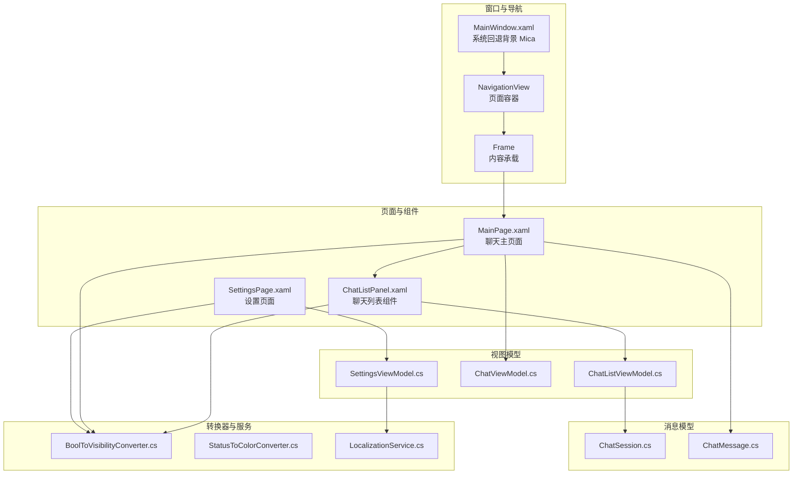
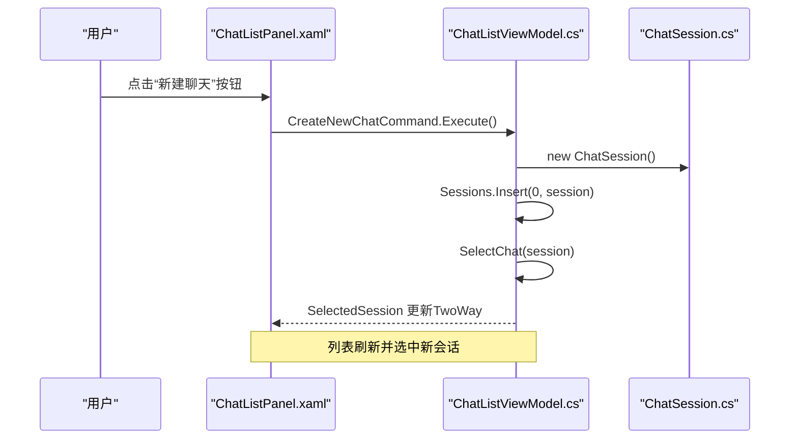
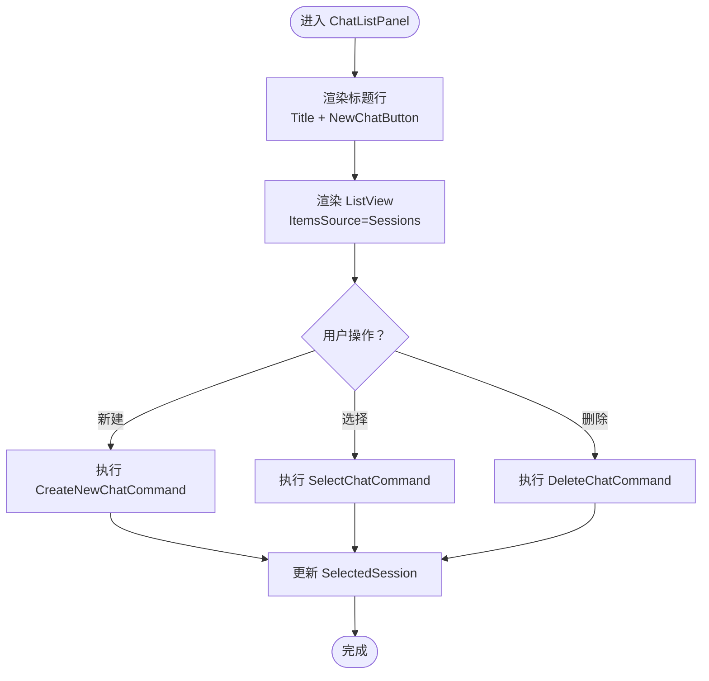
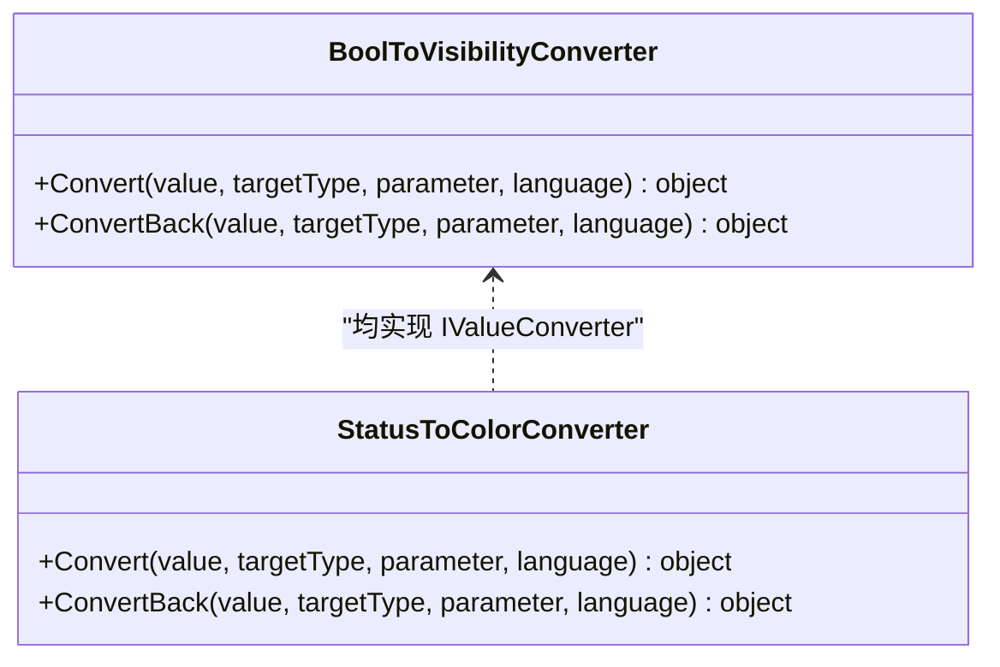
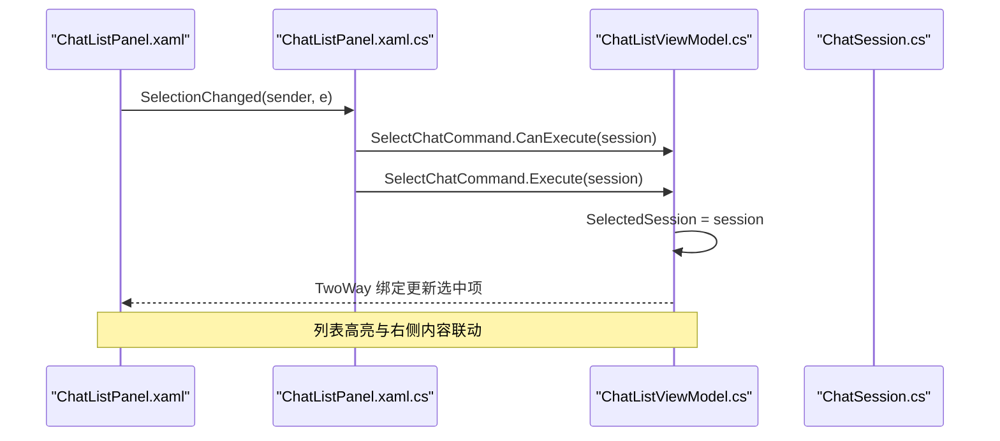
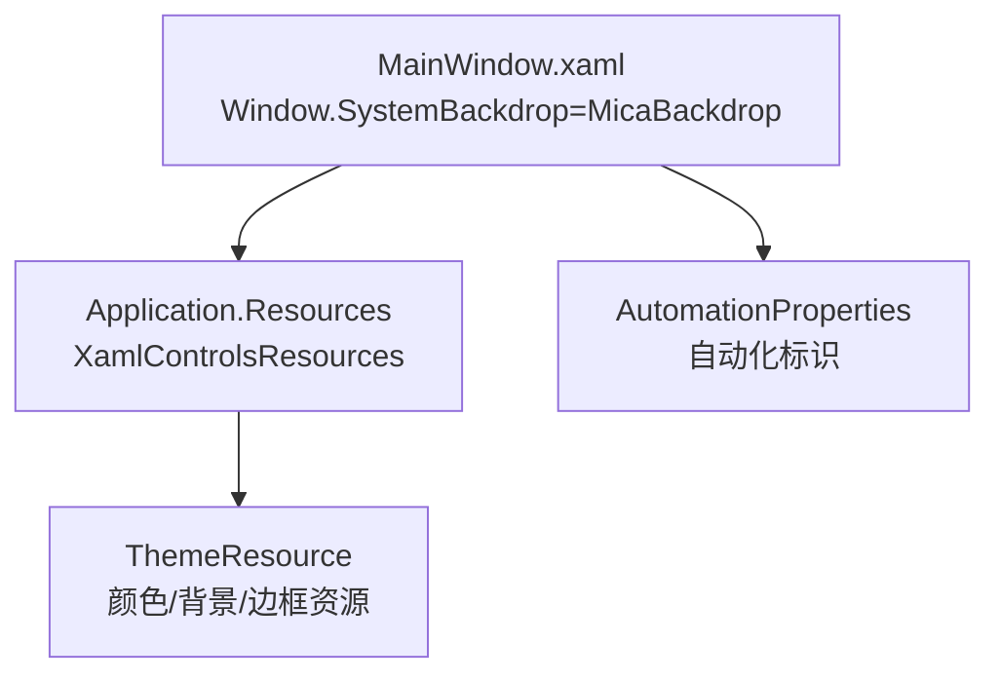
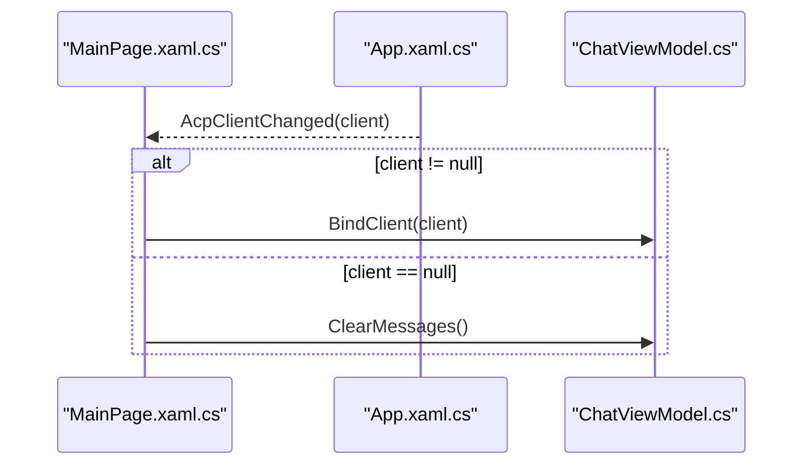
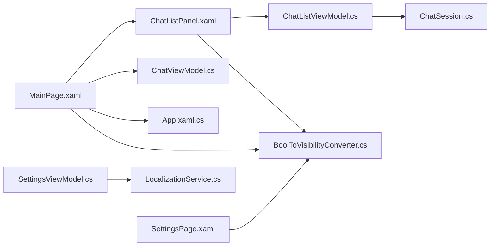

# 用户界面组件

<cite>
**本文引用的文件**
- [ChatListPanel.xaml](file://Agentic.Desktop/Views/ChatListPanel.xaml)
- [ChatListPanel.xaml.cs](file://Agentic.Desktop/Views/ChatListPanel.xaml.cs)
- [BoolToVisibilityConverter.cs](file://Agentic.Desktop/Converters/BoolToVisibilityConverter.cs)
- [StatusToColorConverter.cs](file://Agentic.Desktop/Converters/StatusToColorConverter.cs)
- [ChatListViewModel.cs](file://Agentic.Desktop/ViewModels/ChatListViewModel.cs)
- [ChatSession.cs](file://Agentic.Desktop/ViewModels/Messages/ChatSession.cs)
- [MainWindow.xaml](file://Agentic.Desktop/MainWindow.xaml)
- [App.xaml.cs](file://Agentic.Desktop/App.xaml.cs)
- [MainPage.xaml](file://Agentic.Desktop/MainPage.xaml)
- [MainPage.xaml.cs](file://Agentic.Desktop/MainPage.xaml.cs)
- [SettingsPage.xaml](file://Agentic.Desktop/SettingsPage.xaml)
- [LocalizationService.cs](file://Agentic.Desktop/Services/LocalizationService.cs)
- [README.md](file://README.md)
</cite>

## 目录
1. [简介](#简介)
2. [项目结构](#项目结构)
3. [核心组件](#核心组件)
4. [架构总览](#架构总览)
5. [详细组件分析](#详细组件分析)
6. [依赖关系分析](#依赖关系分析)
7. [性能考虑](#性能考虑)
8. [故障排查指南](#故障排查指南)
9. [结论](#结论)
10. [附录：扩展与自定义指南](#附录扩展与自定义指南)

## 简介
本文件为用户界面组件的详细说明文档，聚焦 ChatListPanel 的布局、交互与响应式实现，并深入解析 XAML 值转换器（BoolToVisibilityConverter、StatusToColorConverter）的数据绑定逻辑。同时涵盖 Fluent Design 的应用（Mica 背景与主题资源）、MVVM 数据绑定、命令模式与事件处理机制、样式定制、主题支持与可访问性考虑，并提供 UI 扩展与自定义组件的开发指导。

## 项目结构
该 WinUI 3 桌面应用采用 MVVM 架构，视图层使用 XAML，视图模型基于 CommunityToolkit.Mvvm，服务层提供本地化、权限、终端等能力。ChatListPanel 作为侧边栏聊天列表组件，通过 x:Bind 与 ChatListViewModel 进行强类型双向绑定，并使用值转换器控制可见性与颜色映射。

图表来源
- [MainWindow.xaml:11-13](file://Agentic.Desktop/MainWindow.xaml#L11-L13)
- [MainPage.xaml:1-20](file://Agentic.Desktop/MainPage.xaml#L1-L20)
- [ChatListPanel.xaml:1-20](file://Agentic.Desktop/Views/ChatListPanel.xaml#L1-L20)
- [SettingsPage.xaml:1-20](file://Agentic.Desktop/SettingsPage.xaml#L1-L20)
- [ChatListViewModel.cs:1-20](file://Agentic.Desktop/ViewModels/ChatListViewModel.cs#L1-L20)
- [ChatSession.cs:1-20](file://Agentic.Desktop/ViewModels/Messages/ChatSession.cs#L1-L20)
- [BoolToVisibilityConverter.cs:1-15](file://Agentic.Desktop/Converters/BoolToVisibilityConverter.cs#L1-L15)
- [StatusToColorConverter.cs:1-15](file://Agentic.Desktop/Converters/StatusToColorConverter.cs#L1-L15)
- [LocalizationService.cs:1-15](file://Agentic.Desktop/Services/LocalizationService.cs#L1-L15)

章节来源
- [README.md:1-30](file://README.md#L1-L30)
- [MainWindow.xaml:11-13](file://Agentic.Desktop/MainWindow.xaml#L11-L13)

## 核心组件
- ChatListPanel：聊天列表的用户控件，包含标题区与列表区，支持新建会话、选择会话、删除会话。
- ChatListViewModel：管理会话集合、选中项与相关命令（创建、删除、选择），并通过事件通知上层。
- BoolToVisibilityConverter：将布尔值转换为 Visibility，支持反转参数。
- StatusToColorConverter：将连接状态整型映射为颜色（灰/橙/绿）。
- MainWindow：应用主窗口，启用 Mica 背景，承载 NavigationView 与 TitleBar。
- MainPage：聊天主页面，组合 ChatListPanel 与消息展示区域，订阅连接变化。
- SettingsPage：设置页面，使用值转换器显示连接状态信息。
- LocalizationService：统一读取 .resw 资源字符串。

章节来源
- [ChatListPanel.xaml:17-86](file://Agentic.Desktop/Views/ChatListPanel.xaml#L17-L86)
- [ChatListPanel.xaml.cs:10-39](file://Agentic.Desktop/Views/ChatListPanel.xaml.cs#L10-L39)
- [ChatListViewModel.cs:10-63](file://Agentic.Desktop/ViewModels/ChatListViewModel.cs#L10-L63)
- [BoolToVisibilityConverter.cs:10-27](file://Agentic.Desktop/Converters/BoolToVisibilityConverter.cs#L10-L27)
- [StatusToColorConverter.cs:10-30](file://Agentic.Desktop/Converters/StatusToColorConverter.cs#L10-L30)
- [MainWindow.xaml:11-13](file://Agentic.Desktop/MainWindow.xaml#L11-L13)
- [MainPage.xaml:16-49](file://Agentic.Desktop/MainPage.xaml#L16-L49)
- [SettingsPage.xaml:14-16](file://Agentic.Desktop/SettingsPage.xaml#L14-L16)
- [LocalizationService.cs:8-22](file://Agentic.Desktop/Services/LocalizationService.cs#L8-L22)

## 架构总览
应用遵循 MVVM 分层：XAML 视图通过 x:Bind 绑定到 ViewModel；ViewModel 暴露 ObservableCollection 与 RelayCommand；UI 事件在代码后置中调用命令或触发事件。全局 App 提供 DispatcherQueue 与 AcpClient 生命周期管理；MainWindow 使用 Mica 背景提升视觉层次。

图表来源
- [ChatListPanel.xaml:34-41](file://Agentic.Desktop/Views/ChatListPanel.xaml#L34-L41)
- [ChatListViewModel.cs:22-28](file://Agentic.Desktop/ViewModels/ChatListViewModel.cs#L22-L28)
- [ChatSession.cs:10-27](file://Agentic.Desktop/ViewModels/Messages/ChatSession.cs#L10-L27)

章节来源
- [App.xaml.cs:64-76](file://Agentic.Desktop/App.xaml.cs#L64-L76)
- [MainWindow.xaml:11-13](file://Agentic.Desktop/MainWindow.xaml#L11-L13)

## 详细组件分析

### ChatListPanel 界面布局与交互
- 布局结构：顶部标题行（标题 + 新建按钮），下方 ListView 展示会话列表。
- 数据绑定：ItemsSource 绑定 ViewModel.Sessions；SelectedItem 双向绑定 ViewModel.SelectedSession。
- 交互流程：
  - 新建聊天：按钮 Command 绑定 CreateNewChatCommand。
  - 选择会话：ListView SelectionChanged 事件调用 SelectChatCommand。
  - 删除会话：删除按钮 Click 事件调用 DeleteChatCommand，Tag 传递 ChatSession。
- 响应式设计：使用 Grid Row/Column 定义自适应布局；TextBlock 使用 TextTrimming 与 MaxLines 适配长文本；Padding/Spacing 保证间距一致。

图表来源
- [ChatListPanel.xaml:17-86](file://Agentic.Desktop/Views/ChatListPanel.xaml#L17-L86)
- [ChatListPanel.xaml.cs:22-38](file://Agentic.Desktop/Views/ChatListPanel.xaml.cs#L22-L38)
- [ChatListViewModel.cs:22-54](file://Agentic.Desktop/ViewModels/ChatListViewModel.cs#L22-L54)

章节来源
- [ChatListPanel.xaml:17-86](file://Agentic.Desktop/Views/ChatListPanel.xaml#L17-L86)
- [ChatListPanel.xaml.cs:10-39](file://Agentic.Desktop/Views/ChatListPanel.xaml.cs#L10-L39)
- [ChatListViewModel.cs:10-63](file://Agentic.Desktop/ViewModels/ChatListViewModel.cs#L10-L63)

### XAML 值转换器详解
- BoolToVisibilityConverter
  - 作用：将 bool 转为 Visibility（Visible/Collapsed）。
  - 参数：ConverterParameter="Invert" 时反转逻辑。
  - 使用场景：根据 IsConnected、IsStreaming 等布尔属性控制元素显示/隐藏。
- StatusToColorConverter
  - 作用：将 ConnectionState（int）映射为 SolidColorBrush（Gray/Orange/Green）。
  - 使用场景：标题栏状态点颜色、设置页连接状态指示。

图表来源
- [BoolToVisibilityConverter.cs:10-27](file://Agentic.Desktop/Converters/BoolToVisibilityConverter.cs#L10-L27)
- [StatusToColorConverter.cs:10-30](file://Agentic.Desktop/Converters/StatusToColorConverter.cs#L10-L30)

章节来源
- [BoolToVisibilityConverter.cs:10-27](file://Agentic.Desktop/Converters/BoolToVisibilityConverter.cs#L10-L27)
- [StatusToColorConverter.cs:10-30](file://Agentic.Desktop/Converters/StatusToColorConverter.cs#L10-L30)
- [MainPage.xaml:38-49](file://Agentic.Desktop/MainPage.xaml#L38-L49)
- [SettingsPage.xaml:98-114](file://Agentic.Desktop/SettingsPage.xaml#L98-L114)

### MVVM 数据绑定与命令模式
- 视图模型：
  - ChatListViewModel：ObservableCollection<Sessions>、SelectedSession、RelayCommand（CreateNewChat、DeleteChat、SelectChat）。
  - ChatSession：Id、Title、CreatedAt、UpdatedAt、PreviewText、Messages。
- 绑定方式：
  - x:Bind 强类型绑定，OneWay/TwoWay 明确方向。
  - ItemsSource、SelectedItem、Text、Visibility 等常见属性绑定。
- 命令模式：
  - 按钮 Command 直接绑定 ViewModel 的 RelayCommand。
  - 事件驱动（SelectionChanged、Click）在代码后置中调用命令，确保参数正确传递。

图表来源
- [ChatListPanel.xaml.cs:22-29](file://Agentic.Desktop/Views/ChatListPanel.xaml.cs#L22-L29)
- [ChatListViewModel.cs:56-62](file://Agentic.Desktop/ViewModels/ChatListViewModel.cs#L56-L62)
- [ChatSession.cs:10-27](file://Agentic.Desktop/ViewModels/Messages/ChatSession.cs#L10-L27)

章节来源
- [ChatListViewModel.cs:10-63](file://Agentic.Desktop/ViewModels/ChatListViewModel.cs#L10-L63)
- [ChatSession.cs:10-27](file://Agentic.Desktop/ViewModels/Messages/ChatSession.cs#L10-L27)
- [ChatListPanel.xaml.cs:22-38](file://Agentic.Desktop/Views/ChatListPanel.xaml.cs#L22-L38)

### Fluent Design、Mica 背景与主题资源
- Mica 背景：MainWindow 使用 Window.SystemBackdrop 配置 MicaBackdrop，提供现代模糊背景效果。
- 主题资源：大量使用 ThemeResource（如 ApplicationPageBackgroundThemeBrush、CardBackgroundFillColorDefaultBrush、SystemAccentColor）实现自适应主题。
- 可访问性：AutomationProperties.AutomationId 用于辅助技术识别；TitleBar 与 NavViewItem 提供语义化标签。

图表来源
- [MainWindow.xaml:11-13](file://Agentic.Desktop/MainWindow.xaml#L11-L13)
- [App.xaml:8-12](file://Agentic.Desktop/App.xaml#L8-L12)
- [MainPage.xaml:20-44](file://Agentic.Desktop/MainPage.xaml#L20-L44)
- [MainWindow.xaml:31-40](file://Agentic.Desktop/MainWindow.xaml#L31-L40)

章节来源
- [MainWindow.xaml:11-13](file://Agentic.Desktop/MainWindow.xaml#L11-L13)
- [App.xaml:8-12](file://Agentic.Desktop/App.xaml#L8-L12)
- [MainPage.xaml:20-44](file://Agentic.Desktop/MainPage.xaml#L20-L44)

### 事件处理机制
- ChatListPanel：
  - SelectionChanged：检查命令可用性后执行 SelectChatCommand。
  - DeleteChat_Click：从 Button.Tag 获取 ChatSession 并执行 DeleteChatCommand。
- MainPage：
  - 订阅 App.AcpClientChanged 事件，动态绑定 AcpClient 或清空消息。
  - 滚动到底部事件 ScrollToBottom。

图表来源
- [MainPage.xaml.cs:36-47](file://Agentic.Desktop/MainPage.xaml.cs#L36-L47)
- [App.xaml.cs:78-83](file://Agentic.Desktop/App.xaml.cs#L78-L83)

章节来源
- [ChatListPanel.xaml.cs:22-38](file://Agentic.Desktop/Views/ChatListPanel.xaml.cs#L22-L38)
- [MainPage.xaml.cs:36-47](file://Agentic.Desktop/MainPage.xaml.cs#L36-L47)
- [App.xaml.cs:78-83](file://Agentic.Desktop/App.xaml.cs#L78-L83)

### 样式定制与主题支持
- 使用 ThemeResource 统一颜色与背景，确保深色/浅色主题切换一致性。
- Card 风格消息气泡使用 CornerRadius、BorderBrush、Background 资源。
- 字体与间距通过 Spacing、Padding、FontSize、FontWeight 保持一致性。

章节来源
- [MainPage.xaml:18-44](file://Agentic.Desktop/MainPage.xaml#L18-L44)
- [SettingsPage.xaml:20-44](file://Agentic.Desktop/SettingsPage.xaml#L20-L44)

### 可访问性考虑
- AutomationProperties.AutomationId 为关键 UI 元素提供唯一标识，便于屏幕阅读器与测试框架识别。
- TitleBar 与 NavViewItem 使用 x:Uid 指向本地化资源，确保多语言可读性。

章节来源
- [MainWindow.xaml:31-40](file://Agentic.Desktop/MainWindow.xaml#L31-L40)
- [MainWindow.xaml:52-64](file://Agentic.Desktop/MainWindow.xaml#L52-L64)

## 依赖关系分析
- ChatListPanel 依赖 ChatListViewModel（强类型 x:Bind）。
- ChatListViewModel 依赖 ChatSession（集合与选中项）。
- MainPage 依赖 ChatViewModel（消息流与滚动行为），并与 App 的全局 AcpClient 事件解耦。
- 值转换器独立于业务逻辑，仅负责数据转换。
- 本地化服务被 ViewModel 与 UI 共同使用。

图表来源
- [ChatListPanel.xaml:1-15](file://Agentic.Desktop/Views/ChatListPanel.xaml#L1-L15)
- [ChatListViewModel.cs:1-10](file://Agentic.Desktop/ViewModels/ChatListViewModel.cs#L1-L10)
- [ChatSession.cs:1-10](file://Agentic.Desktop/ViewModels/Messages/ChatSession.cs#L1-L10)
- [MainPage.xaml:1-15](file://Agentic.Desktop/MainPage.xaml#L1-L15)
- [App.xaml.cs:1-15](file://Agentic.Desktop/App.xaml.cs#L1-L15)
- [BoolToVisibilityConverter.cs:1-10](file://Agentic.Desktop/Converters/BoolToVisibilityConverter.cs#L1-L10)
- [SettingsPage.xaml:1-15](file://Agentic.Desktop/SettingsPage.xaml#L1-L15)
- [LocalizationService.cs:1-10](file://Agentic.Desktop/Services/LocalizationService.cs#L1-L10)

章节来源
- [ChatListPanel.xaml:1-15](file://Agentic.Desktop/Views/ChatListPanel.xaml#L1-L15)
- [ChatListViewModel.cs:1-10](file://Agentic.Desktop/ViewModels/ChatListViewModel.cs#L1-L10)
- [MainPage.xaml:1-15](file://Agentic.Desktop/MainPage.xaml#L1-L15)

## 性能考虑
- 使用 ObservableCollection 与 ObservableProperty 减少不必要的 UI 重绘。
- DataTemplate 限定 x:DataType 提升绑定性能。
- TextTrimming 与 MaxLines 避免过长文本导致布局抖动。
- 值转换器避免复杂计算，保持 Convert 轻量。
- 事件订阅注意生命周期，避免内存泄漏（如 App.AcpClientChanged 在页面卸载时取消订阅）。

[本节为通用指导，不直接分析具体文件]

## 故障排查指南
- 列表未更新：检查 ViewModel.Sessions 是否为 ObservableCollection，并确保新增/删除后触发变更。
- 选择无效：确认 SelectedItem 双向绑定与 SelectionChanged 事件中 CanExecute 判断。
- 删除异常：确保 Button.Tag 正确绑定 ChatSession，且 DeleteChatCommand 能处理空引用。
- 可见性错误：检查 BoolToVisibilityConverter 的 ConverterParameter 是否正确使用“Invert”。
- 颜色映射异常：确认传入状态值为 int（0/1/2），否则默认返回灰色。
- 主题不一致：检查是否使用了正确的 ThemeResource 键名。

章节来源
- [ChatListPanel.xaml.cs:22-38](file://Agentic.Desktop/Views/ChatListPanel.xaml.cs#L22-L38)
- [BoolToVisibilityConverter.cs:12-26](file://Agentic.Desktop/Converters/BoolToVisibilityConverter.cs#L12-L26)
- [StatusToColorConverter.cs:12-24](file://Agentic.Desktop/Converters/StatusToColorConverter.cs#L12-L24)

## 结论
ChatListPanel 以清晰的 MVVM 结构与强类型绑定实现了健壮的聊天列表功能。值转换器简化了可见性与颜色映射逻辑，Fluent Design 与主题资源确保了良好的视觉体验与可访问性。通过命令模式与事件机制，UI 与业务逻辑解耦，便于扩展与维护。

[本节为总结，不直接分析具体文件]

## 附录：扩展与自定义指南
- 新增列表项模板：在 ListView.ItemTemplate 中添加新的 DataTemplate，绑定 ChatSession 的新字段。
- 自定义值转换器：实现 IValueConverter，注册到 Resources，并在 XAML 中使用 StaticResource 引用。
- 主题扩展：在 App.xaml 的 ResourceDictionary 中合并自定义主题字典，覆盖 ThemeResource 键。
- 可访问性增强：为新增控件添加 AutomationProperties.AutomationId 与合适的工具提示。
- 响应式优化：使用 Grid 自适应列宽与 Spacing/Padding 调整间距，避免固定像素布局。

[本节为概念性指导，不直接分析具体文件]