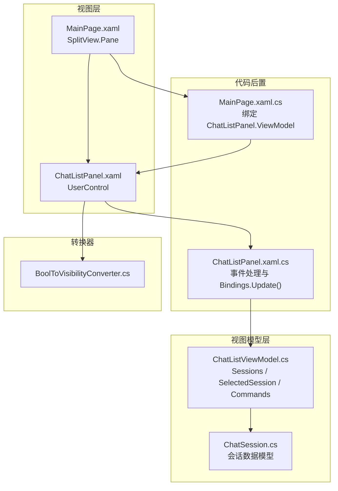
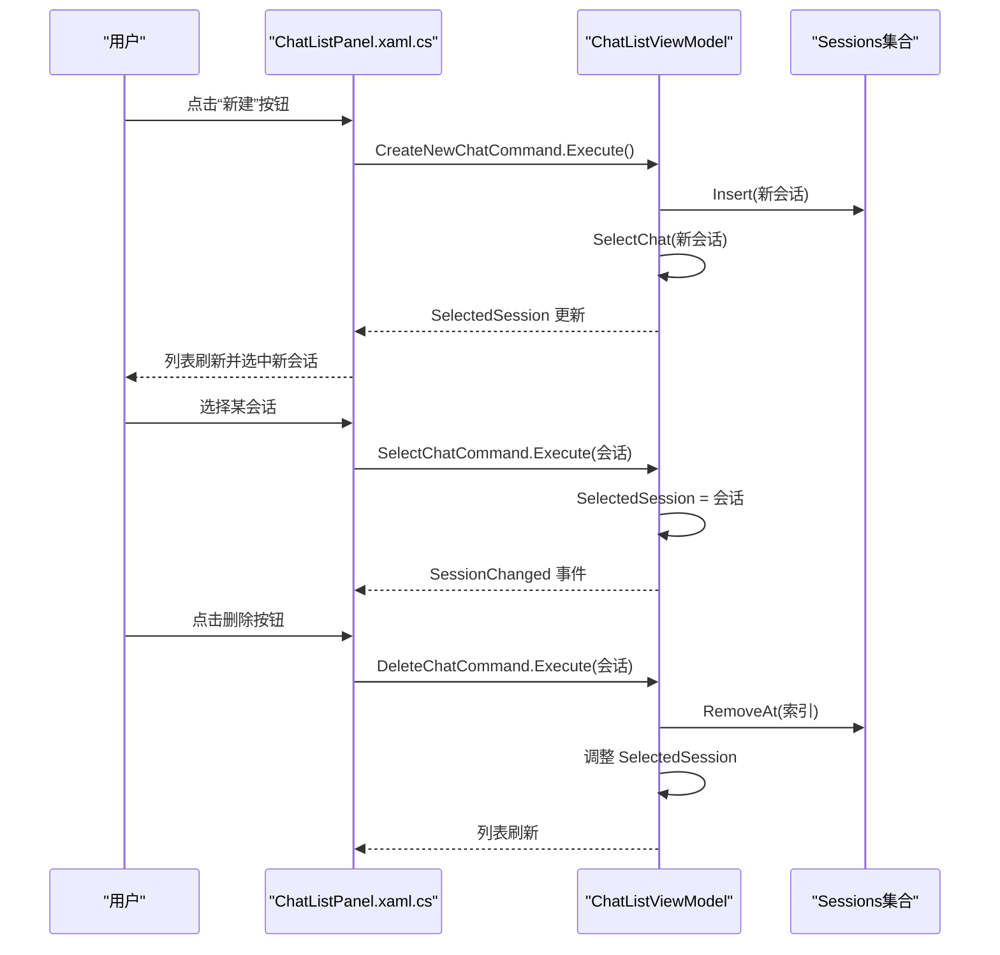
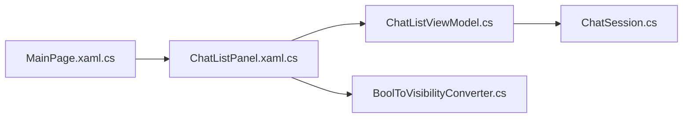

# 聊天列表面板组件

<cite>
**本文引用的文件**   
- [ChatListPanel.xaml](file://Agentic.Desktop/Views/ChatListPanel.xaml)
- [ChatListPanel.xaml.cs](file://Agentic.Desktop/Views/ChatListPanel.xaml.cs)
- [ChatListViewModel.cs](file://Agentic.Desktop/ViewModels/ChatListViewModel.cs)
- [ChatSession.cs](file://Agentic.Desktop/ViewModels/Messages/ChatSession.cs)
- [BoolToVisibilityConverter.cs](file://Agentic.Desktop/Converters/BoolToVisibilityConverter.cs)
- [MainPage.xaml](file://Agentic.Desktop/MainPage.xaml)
- [MainPage.xaml.cs](file://Agentic.Desktop/MainPage.xaml.cs)
- [ChatViewModel.cs](file://Agentic.Desktop/ViewModels/ChatViewModel.cs)
</cite>

## 目录
1. [简介](#简介)
2. [项目结构](#项目结构)
3. [核心组件](#核心组件)
4. [架构总览](#架构总览)
5. [详细组件分析](#详细组件分析)
6. [依赖关系分析](#依赖关系分析)
7. [性能考量](#性能考量)
8. [故障排查指南](#故障排查指南)
9. [结论](#结论)
10. [附录：扩展与自定义指南](#附录扩展与自定义指南)

## 简介
本文件为 ChatListPanel 聊天列表面板组件的 UI 文档，面向开发者与产品人员。内容涵盖该 UserControl 的界面布局设计、用户交互模式与响应式行为；详细说明与 ChatListViewModel 的数据绑定机制（含 ViewModel 属性设置与 Bindings.Update() 的作用）；解释会话选择事件处理与删除操作的实现逻辑；阐述命令模式的应用（SelectChatCommand 与 DeleteChatCommand 的执行流程）；并提供组件扩展与自定义的实践指导。

## 项目结构
ChatListPanel 位于 Views 层，采用 XAML + Code-behind 的 WinUI 3 模式，数据由 ViewModels 层的 ChatListViewModel 提供，并通过 x:Bind 进行强类型双向/单向绑定。主页面 MainPage 通过 SplitView 将 ChatListPanel 作为侧边栏展示，并在初始化时完成 ViewModel 注入。



图表来源
- [MainPage.xaml:56-65](file://Agentic.Desktop/MainPage.xaml#L56-L65)
- [ChatListPanel.xaml:1-88](file://Agentic.Desktop/Views/ChatListPanel.xaml#L1-L88)
- [ChatListPanel.xaml.cs:1-40](file://Agentic.Desktop/Views/ChatListPanel.xaml.cs#L1-L40)
- [ChatListViewModel.cs:1-64](file://Agentic.Desktop/ViewModels/ChatListViewModel.cs#L1-L64)
- [ChatSession.cs:1-28](file://Agentic.Desktop/ViewModels/Messages/ChatSession.cs#L1-L28)
- [BoolToVisibilityConverter.cs:1-28](file://Agentic.Desktop/Converters/BoolToVisibilityConverter.cs#L1-L28)

章节来源
- [MainPage.xaml:56-65](file://Agentic.Desktop/MainPage.xaml#L56-L65)
- [MainPage.xaml.cs:20-22](file://Agentic.Desktop/MainPage.xaml.cs#L20-L22)
- [ChatListPanel.xaml:17-84](file://Agentic.Desktop/Views/ChatListPanel.xaml#L17-L84)
- [ChatListPanel.xaml.cs:10-15](file://Agentic.Desktop/Views/ChatListPanel.xaml.cs#L10-L15)
- [ChatListViewModel.cs:10-20](file://Agentic.Desktop/ViewModels/ChatListViewModel.cs#L10-L20)

## 核心组件
- ChatListPanel（UserControl）
  - 职责：渲染聊天列表头部（标题 + 新建按钮）、会话列表项模板、删除按钮；处理选择与删除交互。
  - 关键绑定：ItemsSource 绑定 Sessions，SelectedItem 双向绑定 SelectedSession，按钮 Command 绑定 CreateNewChatCommand。
- ChatListViewModel（ObservableObject）
  - 职责：维护会话集合、当前选中会话、会话切换与删除命令、创建新会话。
  - 关键属性：Sessions（ObservableCollection<ChatSession>）、SelectedSession（可观察）。
  - 关键命令：CreateNewChatCommand、DeleteChatCommand、SelectChatCommand（由 [RelayCommand] 自动生成）。
- ChatSession（ObservableObject）
  - 职责：表示一次会话，包含标题、预览文本、时间戳与消息集合等。
- BoolToVisibilityConverter
  - 职责：布尔值到 Visibility 的转换，支持反转参数。

章节来源
- [ChatListPanel.xaml:44-84](file://Agentic.Desktop/Views/ChatListPanel.xaml#L44-L84)
- [ChatListPanel.xaml.cs:10-15](file://Agentic.Desktop/Views/ChatListPanel.xaml.cs#L10-L15)
- [ChatListViewModel.cs:10-20](file://Agentic.Desktop/ViewModels/ChatListViewModel.cs#L10-L20)
- [ChatSession.cs:10-27](file://Agentic.Desktop/ViewModels/Messages/ChatSession.cs#L10-L27)
- [BoolToVisibilityConverter.cs:10-21](file://Agentic.Desktop/Converters/BoolToVisibilityConverter.cs#L10-L21)

## 架构总览
ChatListPanel 通过 x:Bind 与 ChatListViewModel 建立强类型绑定。ViewModel 暴露集合与属性，UI 自动响应变化；用户交互通过事件转发到命令执行。整体遵循 MVVM 模式，视图仅负责展示与事件转发，业务逻辑集中在 ViewModel。

```mermaid
classDiagram
class ChatListPanel {
+ViewModel : ChatListViewModel?
+ChatListView_SelectionChanged(sender, e)
+DeleteChat_Click(sender, e)
}
class ChatListViewModel {
+Sessions : ObservableCollection~ChatSession~
+SelectedSession : ChatSession?
+SessionChanged : event
+CreateNewChatCommand()
+DeleteChatCommand(session)
+SelectChatCommand(session)
}
class ChatSession {
+Id : string
+Title : string
+PreviewText : string
+CreatedAt : DateTime
+UpdatedAt : DateTime
+Messages : ObservableCollection~ChatMessage~
}
ChatListPanel --> ChatListViewModel : "x : Bind 绑定"
ChatListViewModel --> ChatSession : "管理集合"
```

图表来源
- [ChatListPanel.xaml.cs:10-15](file://Agentic.Desktop/Views/ChatListPanel.xaml.cs#L10-L15)
- [ChatListPanel.xaml:44-84](file://Agentic.Desktop/Views/ChatListPanel.xaml#L44-L84)
- [ChatListViewModel.cs:10-20](file://Agentic.Desktop/ViewModels/ChatListViewModel.cs#L10-L20)
- [ChatSession.cs:10-27](file://Agentic.Desktop/ViewModels/Messages/ChatSession.cs#L10-L27)

## 详细组件分析

### 界面布局设计
- 顶部区域：标题 TextBlock 与“新建”按钮并排，使用 Grid 两列布局，左侧自适应宽度，右侧固定宽度。
- 列表区域：ListView 承载会话列表，每项 DataTemplate 包含标题与预览文本，右侧显示删除按钮。
- 资源：注册 BoolToVisibilityConverter，用于后续可见性控制。

章节来源
- [ChatListPanel.xaml:17-41](file://Agentic.Desktop/Views/ChatListPanel.xaml#L17-L41)
- [ChatListPanel.xaml:44-84](file://Agentic.Desktop/Views/ChatListPanel.xaml#L44-L84)
- [ChatListPanel.xaml:13-15](file://Agentic.Desktop/Views/ChatListPanel.xaml#L13-L15)

### 用户交互模式
- 新建会话：点击“新建”按钮触发 CreateNewChatCommand，在 ViewModel 中插入新会话并选中。
- 选择会话：ListView 的 SelectionChanged 事件检查 SelectChatCommand 是否可执行，若可执行则传入选中的 ChatSession 执行。
- 删除会话：每个列表项的删除按钮 Click 事件中，从 Tag 获取 ChatSession，校验 DeleteChatCommand 可执行后执行删除。

章节来源
- [ChatListPanel.xaml:34-40](file://Agentic.Desktop/Views/ChatListPanel.xaml#L34-L40)
- [ChatListPanel.xaml:44-49](file://Agentic.Desktop/Views/ChatListPanel.xaml#L44-L49)
- [ChatListPanel.xaml:73-80](file://Agentic.Desktop/Views/ChatListPanel.xaml#L73-L80)
- [ChatListPanel.xaml.cs:22-29](file://Agentic.Desktop/Views/ChatListPanel.xaml.cs#L22-L29)
- [ChatListPanel.xaml.cs:31-38](file://Agentic.Desktop/Views/ChatListPanel.xaml.cs#L31-L38)

### 响应式行为与数据绑定
- ItemsSource="{x:Bind ViewModel.Sessions}"：单向绑定会话集合，集合变更自动刷新 UI。
- SelectedItem="{x:Bind ViewModel.SelectedSession, Mode=TwoWay}"：双向绑定当前选中会话，UI 与 ViewModel 同步。
- ViewModel 属性的 setter 调用 Bindings.Update()：确保在运行时动态设置 ViewModel 后，XAML 绑定的上下文立即更新。

章节来源
- [ChatListPanel.xaml:46-48](file://Agentic.Desktop/Views/ChatListPanel.xaml#L46-L48)
- [ChatListPanel.xaml.cs:11-15](file://Agentic.Desktop/Views/ChatListPanel.xaml.cs#L11-L15)

### 命令模式应用与执行流程
- CreateNewChatCommand：由 [RelayCommand] 生成，点击“新建”按钮触发，插入新会话并选中。
- SelectChatCommand：由 [RelayCommand] 生成，SelectionChanged 事件中校验并执行，更新 SelectedSession 并触发 SessionChanged 事件。
- DeleteChatCommand：由 [RelayCommand] 生成，删除按钮 Click 事件中校验并执行，移除会话并处理选中状态。



图表来源
- [ChatListPanel.xaml:34-40](file://Agentic.Desktop/Views/ChatListPanel.xaml#L34-L40)
- [ChatListPanel.xaml:44-49](file://Agentic.Desktop/Views/ChatListPanel.xaml#L44-L49)
- [ChatListPanel.xaml:73-80](file://Agentic.Desktop/Views/ChatListPanel.xaml#L73-L80)
- [ChatListPanel.xaml.cs:22-38](file://Agentic.Desktop/Views/ChatListPanel.xaml.cs#L22-L38)
- [ChatListViewModel.cs:22-28](file://Agentic.Desktop/ViewModels/ChatListViewModel.cs#L22-L28)
- [ChatListViewModel.cs:30-54](file://Agentic.Desktop/ViewModels/ChatListViewModel.cs#L30-L54)
- [ChatListViewModel.cs:56-62](file://Agentic.Desktop/ViewModels/ChatListViewModel.cs#L56-L62)

### 会话选择事件处理（ChatListView_SelectionChanged）
- 检查 SelectChatCommand.CanExecute(SelectedItem) 是否为真。
- 若 SelectedItem 是 ChatSession，则调用 Execute(session)。
- 命令内部设置 SelectedSession 并触发 SessionChanged 事件，供上层订阅以更新消息区。

章节来源
- [ChatListPanel.xaml.cs:22-29](file://Agentic.Desktop/Views/ChatListPanel.xaml.cs#L22-L29)
- [ChatListViewModel.cs:56-62](file://Agentic.Desktop/ViewModels/ChatListViewModel.cs#L56-L62)

### 删除操作（DeleteChat_Click）
- 从 Button.Tag 获取被删除的 ChatSession。
- 校验 DeleteChatCommand.CanExecute(session) 是否为真。
- 执行命令：从集合移除会话；若被删除的是当前选中会话，则选择相邻会话或空列表时自动新建。

章节来源
- [ChatListPanel.xaml.cs:31-38](file://Agentic.Desktop/Views/ChatListPanel.xaml.cs#L31-L38)
- [ChatListViewModel.cs:30-54](file://Agentic.Desktop/ViewModels/ChatListViewModel.cs#L30-L54)

### 数据模型与 UI 映射
- ChatSession.Title 与 PreviewText 分别映射到列表项的两行文本。
- Messages 集合由上层 ChatViewModel 根据 SelectedSession 提供，用于右侧消息区展示。

章节来源
- [ChatListPanel.xaml:62-70](file://Agentic.Desktop/Views/ChatListPanel.xaml#L62-L70)
- [ChatSession.cs:14-26](file://Agentic.Desktop/ViewModels/Messages/ChatSession.cs#L14-L26)
- [ChatViewModel.cs:33-34](file://Agentic.Desktop/ViewModels/ChatViewModel.cs#L33-L34)

## 依赖关系分析
- ChatListPanel 依赖 ChatListViewModel（通过 x:Bind 与属性 setter 注入）。
- ChatListViewModel 依赖 ChatSession（集合元素）与 CommunityToolkit.Mvvm（ObservableObject、RelayCommand）。
- MainPage 在初始化时将 ChatListPanel.ViewModel 设置为 ChatViewModel.ChatList，完成视图与模型的装配。



图表来源
- [MainPage.xaml.cs:20-22](file://Agentic.Desktop/MainPage.xaml.cs#L20-L22)
- [ChatListPanel.xaml.cs:10-15](file://Agentic.Desktop/Views/ChatListPanel.xaml.cs#L10-L15)
- [ChatListViewModel.cs:1-5](file://Agentic.Desktop/ViewModels/ChatListViewModel.cs#L1-L5)
- [ChatSession.cs:1-5](file://Agentic.Desktop/ViewModels/Messages/ChatSession.cs#L1-L5)
- [BoolToVisibilityConverter.cs:1-5](file://Agentic.Desktop/Converters/BoolToVisibilityConverter.cs#L1-L5)

章节来源
- [MainPage.xaml.cs:20-22](file://Agentic.Desktop/MainPage.xaml.cs#L20-L22)
- [ChatListPanel.xaml.cs:10-15](file://Agentic.Desktop/Views/ChatListPanel.xaml.cs#L10-L15)
- [ChatListViewModel.cs:1-5](file://Agentic.Desktop/ViewModels/ChatListViewModel.cs#L1-L5)
- [ChatSession.cs:1-5](file://Agentic.Desktop/ViewModels/Messages/ChatSession.cs#L1-L5)

## 性能考量
- 使用 ObservableCollection 保证集合变更通知高效且线程安全（UI 线程更新）。
- x:Bind 强类型绑定相比传统 Binding 具有更好的编译期优化与运行期性能。
- 列表项模板简洁，避免复杂计算；如需更多字段，建议懒加载或虚拟化（ListView 已具备虚拟化）。
- 删除与选择操作均为 O(1)/O(n) 级别，对常规会话数量无显著影响。

[本节为通用性能建议，不直接分析具体文件]

## 故障排查指南
- 绑定未生效
  - 确认 ChatListPanel.ViewModel 已在 MainPage 中正确赋值。
  - 检查 ViewModel 属性的 setter 是否调用了 Bindings.Update()。
- 选择无效
  - 检查 SelectChatCommand.CanExecute 条件是否满足（SelectedItem 非空且为 ChatSession）。
- 删除无效
  - 检查按钮 Tag 是否正确绑定 ChatSession。
  - 确认 DeleteChatCommand.CanExecute 返回 true。
- 列表不刷新
  - 确认 Sessions 为 ObservableCollection，且通过 Add/Remove/Insert 等操作触发通知。
  - 确认 SelectedSession 更新后 UI 能响应（双向绑定）。

章节来源
- [MainPage.xaml.cs:20-22](file://Agentic.Desktop/MainPage.xaml.cs#L20-L22)
- [ChatListPanel.xaml.cs:11-15](file://Agentic.Desktop/Views/ChatListPanel.xaml.cs#L11-L15)
- [ChatListPanel.xaml.cs:22-38](file://Agentic.Desktop/Views/ChatListPanel.xaml.cs#L22-L38)
- [ChatListViewModel.cs:30-54](file://Agentic.Desktop/ViewModels/ChatListViewModel.cs#L30-L54)

## 结论
ChatListPanel 是一个结构清晰、职责单一的聊天列表面板，通过强类型 x:Bind 与命令模式实现了高效的 UI-ViewModel 交互。其布局简洁、交互直观，易于扩展与定制。配合 ChatListViewModel 与 ChatSession 数据模型，能够稳定地支撑会话管理与选择/删除等核心功能。

[本节为总结性内容，不直接分析具体文件]

## 附录：扩展与自定义指南
- 新增列表项字段
  - 在 ChatSession 中添加可观察属性，并在 DataTemplate 中绑定对应字段。
  - 注意文本截断与最大行数设置，避免溢出。
- 自定义样式与主题
  - 修改 ListView.ItemTemplate 中的控件样式与间距。
  - 使用主题资源（如 Foreground、Background）保持风格一致。
- 增强命令逻辑
  - 在 ChatListViewModel 中扩展 SelectChatCommand 或 DeleteChatCommand 的行为（如二次确认、撤销）。
  - 通过 SessionChanged 事件向上层传递更丰富的状态。
- 国际化与本地化
  - 使用 x:Uid 与资源文件（Strings/zh-CN/Resources.resw 等）管理文案。
  - 标题与按钮文案应通过资源键引用，便于多语言切换。
- 性能优化
  - 大数据量场景启用虚拟化（默认已启用）。
  - 避免在 DataTemplate 中进行耗时计算，必要时使用转换器或后台任务。

章节来源
- [ChatSession.cs:14-26](file://Agentic.Desktop/ViewModels/Messages/ChatSession.cs#L14-L26)
- [ChatListPanel.xaml:62-70](file://Agentic.Desktop/Views/ChatListPanel.xaml#L62-L70)
- [ChatListPanel.xaml:30-40](file://Agentic.Desktop/Views/ChatListPanel.xaml#L30-L40)
- [ChatListViewModel.cs:22-28](file://Agentic.Desktop/ViewModels/ChatListViewModel.cs#L22-L28)
- [ChatListViewModel.cs:30-54](file://Agentic.Desktop/ViewModels/ChatListViewModel.cs#L30-L54)
- [ChatListViewModel.cs:56-62](file://Agentic.Desktop/ViewModels/ChatListViewModel.cs#L56-L62)