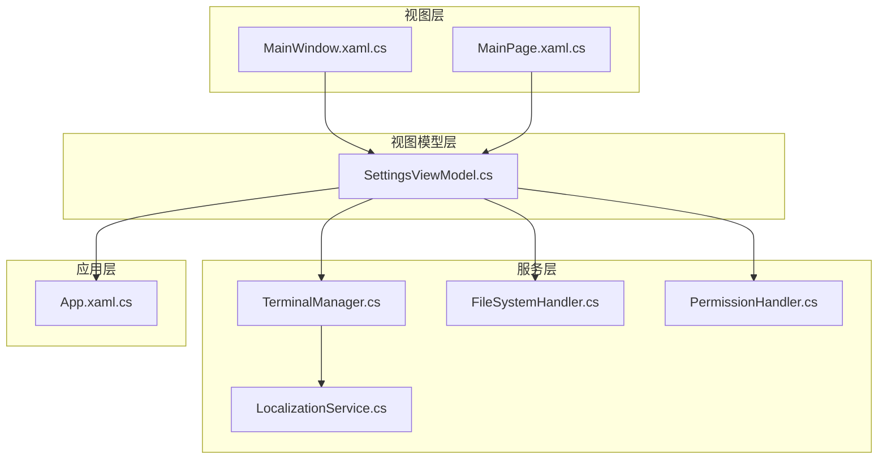
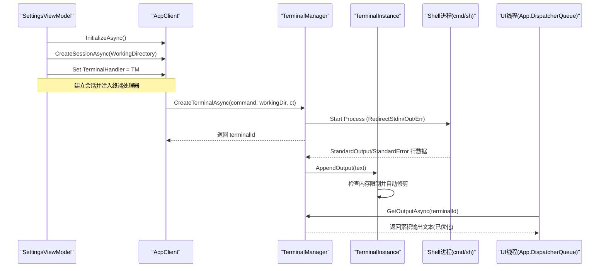
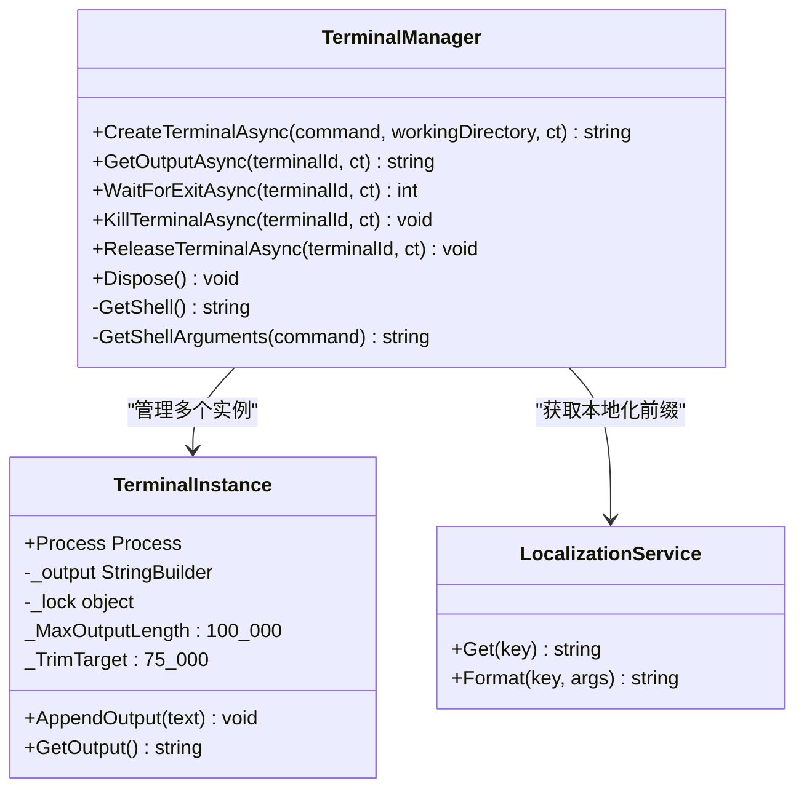
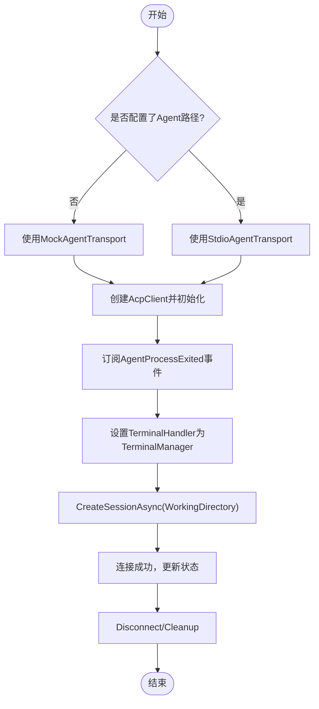
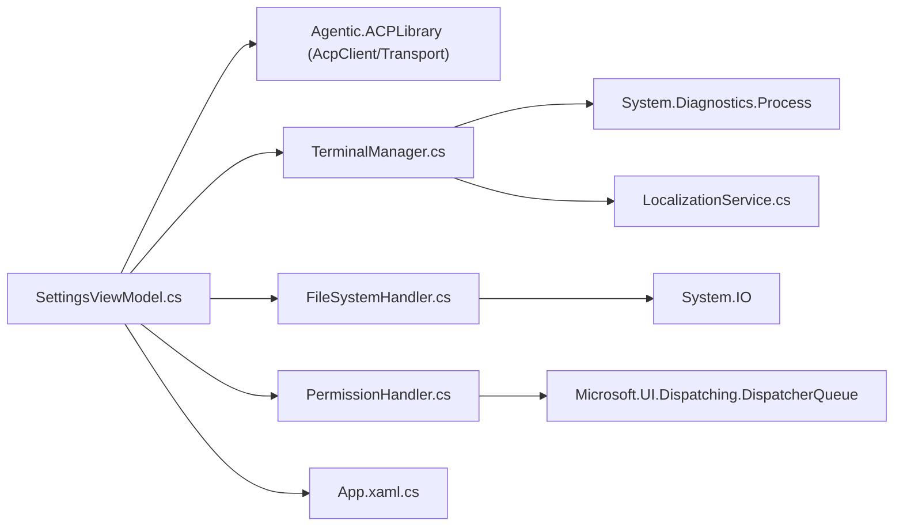

# 终端管理

<cite>
**本文引用的文件**   
- [TerminalManager.cs](file://Agentic.Desktop/Services/TerminalManager.cs)
- [SettingsViewModel.cs](file://Agentic.Desktop/ViewModels/SettingsViewModel.cs)
- [App.xaml.cs](file://Agentic.Desktop/App.xaml.cs)
- [MainWindow.xaml.cs](file://Agentic.Desktop/MainWindow.xaml.cs)
- [MainPage.xaml.cs](file://Agentic.Desktop/MainPage.xaml.cs)
- [FileSystemHandler.cs](file://Agentic.Desktop/Services/FileSystemHandler.cs)
- [PermissionHandler.cs](file://Agentic.Desktop/Services/PermissionHandler.cs)
- [LocalizationService.cs](file://Agentic.Desktop/Services/LocalizationService.cs)
- [Resources.resw](file://Agentic.Desktop/Strings/zh-CN/Resources.resw)
- [Agentic.Desktop.csproj](file://Agentic.Desktop/Agentic.Desktop.csproj)
</cite>

## 更新摘要
**变更内容**   
- 新增内存优化机制：100KB最大输出长度限制和自动修剪功能
- 增强stderr处理：使用本地化前缀标识标准错误输出
- 改进错误处理：更健壮的异常捕获和清理逻辑
- 优化资源管理：防止内存泄漏和进程句柄泄露

## 目录
1. [简介](#简介)
2. [项目结构](#项目结构)
3. [核心组件](#核心组件)
4. [架构总览](#架构总览)
5. [详细组件分析](#详细组件分析)
6. [依赖关系分析](#依赖关系分析)
7. [性能与内存优化](#性能与内存优化)
8. [故障排查指南](#故障排查指南)
9. [结论](#结论)
10. [附录：扩展开发与最佳实践](#附录扩展开发与最佳实践)

## 简介
本技术文档围绕"终端管理"功能，系统性解析 TerminalManager 的多进程并发管理机制、标准输入输出重定向、进程生命周期控制、跨平台 Shell 支持、命令执行安全策略、会话管理示例、错误处理机制、资源清理、进程同步与通信协议，以及性能优化、内存管理与调试技巧。同时提供终端扩展开发指导与安全最佳实践，帮助开发者在 WinUI 3 桌面应用中安全、稳定地集成并扩展终端能力。

**最新更新**：TerminalManager 现已实现智能内存管理，通过100KB最大输出长度限制和自动修剪机制，有效防止内存溢出问题。stderr输出现在带有本地化前缀，便于区分不同类型的输出流。

## 项目结构
终端管理相关代码主要位于 Services 与 ViewModels 层：
- Services/TerminalManager.cs：终端实例的创建、输出读取、等待退出、终止与释放等核心逻辑，包含最新的内存优化功能。
- Services/LocalizationService.cs：本地化字符串服务，为stderr前缀等用户提供友好的提示信息。
- Services/FileSystemHandler.cs：文件系统访问的安全校验（工作目录白名单）。
- Services/PermissionHandler.cs：权限请求的 UI 线程调度与回调封装。
- ViewModels/SettingsViewModel.cs：Agent 连接、会话创建、TerminalManager 注入与生命周期管理。
- App.xaml.cs：应用级日志与 UI 线程调度器。
- MainWindow.xaml.cs / MainPage.xaml.cs：窗口与页面导航、状态更新与事件订阅。

图表来源 
- [TerminalManager.cs:1-170](file://Agentic.Desktop/Services/TerminalManager.cs#L1-L170)
- [SettingsViewModel.cs:1-162](file://Agentic.Desktop/ViewModels/SettingsViewModel.cs#L1-L162)
- [LocalizationService.cs:1-23](file://Agentic.Desktop/Services/LocalizationService.cs#L1-L23)
- [App.xaml.cs:1-85](file://Agentic.Desktop/App.xaml.cs#L1-L85)
- [MainWindow.xaml.cs:1-97](file://Agentic.Desktop/MainWindow.xaml.cs#L1-L97)
- [MainPage.xaml.cs:1-105](file://Agentic.Desktop/MainPage.xaml.cs#L1-L105)

章节来源
- [TerminalManager.cs:1-170](file://Agentic.Desktop/Services/TerminalManager.cs#L1-L170)
- [SettingsViewModel.cs:1-162](file://Agentic.Desktop/ViewModels/SettingsViewModel.cs#L1-L162)
- [LocalizationService.cs:1-23](file://Agentic.Desktop/Services/LocalizationService.cs#L1-L23)
- [App.xaml.cs:1-85](file://Agentic.Desktop/App.xaml.cs#L1-L85)
- [MainWindow.xaml.cs:1-97](file://Agentic.Desktop/MainWindow.xaml.cs#L1-L97)
- [MainPage.xaml.cs:1-105](file://Agentic.Desktop/MainPage.xaml.cs#L1-L105)

## 核心组件
- TerminalManager：实现 ITerminalHandler，负责多终端进程的并发管理、标准 I/O 异步读取、进程等待与终止、资源释放，**新增智能内存管理**。
- TerminalInstance：封装单个进程与其输出缓冲区，使用锁保证多线程安全，**内置100KB内存限制和自动修剪**。
- SettingsViewModel：负责 Agent 连接、会话创建、注入 TerminalManager 到 AcpClient，并在断开时统一清理。
- LocalizationService：提供本地化字符串服务，支持多语言用户界面。
- FileSystemHandler：对文件读写进行路径白名单校验，防止越权访问。
- PermissionHandler：将权限请求派发至 UI 线程，通过事件驱动对话框并回传结果。
- App：提供全局日志工厂与 UI 线程调度器。

章节来源
- [TerminalManager.cs:11-170](file://Agentic.Desktop/Services/TerminalManager.cs#L11-L170)
- [SettingsViewModel.cs:1-162](file://Agentic.Desktop/ViewModels/SettingsViewModel.cs#L1-L162)
- [LocalizationService.cs:8-23](file://Agentic.Desktop/Services/LocalizationService.cs#L8-L23)
- [FileSystemHandler.cs:1-42](file://Agentic.Desktop/Services/FileSystemHandler.cs#L1-L42)
- [PermissionHandler.cs:1-52](file://Agentic.Desktop/Services/PermissionHandler.cs#L1-L52)
- [App.xaml.cs:1-85](file://Agentic.Desktop/App.xaml.cs#L1-L85)

## 架构总览
终端管理的整体流程由 SettingsViewModel 发起连接与会话创建，随后将 TerminalManager 注入到 AcpClient 中。AcpClient 在需要执行终端命令时调用 TerminalManager，后者启动子进程并异步读取标准输出与错误流，最终通过 GetOutputAsync 暴露给上层消费方。**新增的内存管理机制确保输出缓冲区不会无限增长**。

图表来源 
- [SettingsViewModel.cs:85-113](file://Agentic.Desktop/ViewModels/SettingsViewModel.cs#L85-L113)
- [TerminalManager.cs:16-68](file://Agentic.Desktop/Services/TerminalManager.cs#L16-L68)
- [TerminalManager.cs:137-170](file://Agentic.Desktop/Services/TerminalManager.cs#L137-L170)

## 详细组件分析

### TerminalManager 与 TerminalInstance（已更新）
- 多进程并发管理：使用 ConcurrentDictionary<string, TerminalInstance> 维护多个终端实例，ID 自增生成。
- 标准 I/O 重定向：启动进程时启用 RedirectStandardInput/Output/Error，UseShellExecute=false，CreateNoWindow=true。
- 异步读取：分别对 stdout 和 stderr 启动独立 Task 循环读取行，追加到对应实例的输出缓冲区。
- **智能内存管理**：TerminalInstance 内置100KB最大输出长度限制，超过阈值时自动从开头修剪，保持最近75KB的数据。
- **增强的stderr处理**：stderr输出自动添加本地化前缀"[标准错误]"，便于区分不同类型的输出。
- 生命周期控制：WaitForExitAsync 等待进程退出；KillTerminalAsync 与 ReleaseTerminalAsync 强制终止并释放资源；Dispose 遍历所有实例确保进程树被终止。
- 跨平台 Shell：Windows 使用 cmd.exe 参数 /c，非 Windows 使用 /bin/sh 参数 -c。

图表来源 
- [TerminalManager.cs:11-135](file://Agentic.Desktop/Services/TerminalManager.cs#L11-L135)
- [TerminalManager.cs:137-170](file://Agentic.Desktop/Services/TerminalManager.cs#L137-L170)
- [LocalizationService.cs:8-23](file://Agentic.Desktop/Services/LocalizationService.cs#L8-L23)

章节来源
- [TerminalManager.cs:16-68](file://Agentic.Desktop/Services/TerminalManager.cs#L16-L68)
- [TerminalManager.cs:70-128](file://Agentic.Desktop/Services/TerminalManager.cs#L70-L128)
- [TerminalManager.cs:130-135](file://Agentic.Desktop/Services/TerminalManager.cs#L130-L135)
- [TerminalManager.cs:137-170](file://Agentic.Desktop/Services/TerminalManager.cs#L137-L170)
- [LocalizationService.cs:8-23](file://Agentic.Desktop/Services/LocalizationService.cs#L8-L23)

### 会话管理与生命周期（SettingsViewModel）
- 连接流程：根据配置选择 Mock 或 Stdio 传输，初始化 AcpClient，订阅 AgentProcessExited 事件，设置 TerminalHandler，创建会话。
- 断开流程：取消订阅事件，ShutdownAsync 关闭客户端，释放 TerminalManager。
- 状态同步：通过 App.SetAcpClient 通知全局状态变化，供其他页面订阅。

图表来源 
- [SettingsViewModel.cs:60-126](file://Agentic.Desktop/ViewModels/SettingsViewModel.cs#L60-L126)
- [SettingsViewModel.cs:128-161](file://Agentic.Desktop/ViewModels/SettingsViewModel.cs#L128-L161)

章节来源
- [SettingsViewModel.cs:60-126](file://Agentic.Desktop/ViewModels/SettingsViewModel.cs#L60-L126)
- [SettingsViewModel.cs:128-161](file://Agentic.Desktop/ViewModels/SettingsViewModel.cs#L128-L161)

### 文件系统安全（DesktopFileSystemHandler）
- 路径校验：将所有路径规范化后检查是否以工作目录开头，否则抛出 UnauthorizedAccessException。
- 读写操作：ReadTextFileAsync 与 WriteTextFileAsync 均先校验路径，再执行 IO。

章节来源
- [FileSystemHandler.cs:17-41](file://Agentic.Desktop/Services/FileSystemHandler.cs#L17-L41)

### 权限请求处理（DesktopPermissionHandler）
- UI 线程调度：通过 DispatcherQueue.TryEnqueue 将权限请求派发至 UI 线程触发对话框。
- 回调封装：使用 TaskCompletionSource 等待用户决策并返回 RequestPermissionResponse。

章节来源
- [PermissionHandler.cs:26-44](file://Agentic.Desktop/Services/PermissionHandler.cs#L26-L44)

### 本地化服务（LocalizationService）
- 资源加载：使用 Windows.ApplicationModel.Resources.ResourceLoader 加载 .resw 资源文件。
- 字符串获取：支持简单的键值获取和格式化字符串。
- 多语言支持：为不同语言环境提供相应的本地化字符串。

章节来源
- [LocalizationService.cs:8-23](file://Agentic.Desktop/Services/LocalizationService.cs#L8-L23)
- [Resources.resw:218-222](file://Agentic.Desktop/Strings/zh-CN/Resources.resw#L218-L222)

### 应用与窗口（App、MainWindow、MainPage）
- App：提供 ILoggerFactory 与 DispatcherQueue，用于日志与 UI 线程调度。
- MainWindow：窗口导航与状态指示更新。
- MainPage：绑定 ViewModel、订阅连接变化、滚动到底部等交互。

章节来源
- [App.xaml.cs:64-76](file://Agentic.Desktop/App.xaml.cs#L64-L76)
- [MainWindow.xaml.cs:65-87](file://Agentic.Desktop/MainWindow.xaml.cs#L65-87)
- [MainPage.xaml.cs:16-47](file://Agentic.Desktop/MainPage.xaml.cs#L16-L47)

## 依赖关系分析
- TerminalManager 依赖 System.Diagnostics.Process 与 .NET 异步 I/O，**新增对 LocalizationService 的依赖**。
- SettingsViewModel 依赖 Agentic.ACPLibrary 的 AcpClient、IAgentTransport、JsonRpcDispatcher 等。
- FileSystemHandler 与 PermissionHandler 依赖系统 IO 与 UI 调度。
- 项目目标框架与 SDK 版本由 csproj 与 global.json 指定。

图表来源 
- [Agentic.Desktop.csproj:53-60](file://Agentic.Desktop/Agentic.Desktop.csproj#L53-L60)
- [global.json:1-7](file://global.json#L1-L7)

章节来源
- [Agentic.Desktop.csproj:1-79](file://Agentic.Desktop/Agentic.Desktop.csproj#L1-L79)
- [global.json:1-7](file://global.json#L1-L7)

## 性能与内存优化（已更新）
- **智能内存管理**：TerminalInstance 内置100KB最大输出长度限制，当缓冲区超过此阈值时，自动从开头修剪数据，保留最近的75KB输出，有效防止内存溢出。
- 输出缓冲与锁粒度：TerminalInstance 使用 StringBuilder 与对象锁保护追加与读取，避免频繁分配与竞争。建议在高吞吐场景下评估分段缓冲或环形缓冲以降低锁竞争。
- 异步 I/O：stdout/stderr 读取采用 ReadLineAsync 与 Task.Run，避免阻塞 UI 线程。注意异常捕获与取消令牌传播，避免任务泄漏。
- 进程树终止：Kill(entireProcessTree: true) 可快速回收子进程，但需谨慎使用以避免误杀无关进程。
- 资源释放：ReleaseTerminalAsync 与 Dispose 确保进程句柄与缓冲区释放，防止句柄泄露。
- 日志与诊断：App.LoggerFactory 提供 Debug 输出，便于定位连接与终端问题。

**新增优化特性**：
- 自动修剪机制：当输出超过100KB时，自动移除最早的数据，保持缓冲区大小可控
- 内存效率：通过限制最大输出长度，避免长时间运行的终端会话导致内存持续增长
- 数据完整性：保留最近的75KB输出，确保重要的最新信息不丢失

章节来源
- [TerminalManager.cs:137-170](file://Agentic.Desktop/Services/TerminalManager.cs#L137-L170)

## 故障排查指南（已更新）
- 终端无输出：检查 CreateTerminalAsync 是否正确设置 RedirectStandardOutput/StandardError，确认 GetOutputAsync 是否在同一实例 ID 上调用。
- 进程未退出：确认 WaitForExitAsync 是否被调用，或 KillTerminalAsync 是否被触发；观察是否有未处理的异常导致读取循环提前退出。
- 权限拒绝：检查 DesktopFileSystemHandler 的路径校验逻辑，确保工作目录配置正确。
- 权限对话框未显示：确认 PermissionHandler 的 DispatcherQueue 是否正确获取，且 UI 线程可用。
- 连接失败：查看 SettingsViewModel.ConnectAsync 的异常分支与 ConnectionStatus 更新，结合 App.LoggerFactory 的日志定位。
- **内存相关问题**：如果终端输出过大，检查是否触发了自动修剪机制，确认100KB限制是否符合预期。
- **stderr识别问题**：确认stderr输出是否正确添加了本地化前缀"[标准错误]"。

章节来源
- [TerminalManager.cs:38-64](file://Agentic.Desktop/Services/TerminalManager.cs#L38-L64)
- [TerminalManager.cs:77-98](file://Agentic.Desktop/Services/TerminalManager.cs#L77-L98)
- [FileSystemHandler.cs:32-41](file://Agentic.Desktop/Services/FileSystemHandler.cs#L32-L41)
- [PermissionHandler.cs:26-44](file://Agentic.Desktop/Services/PermissionHandler.cs#L26-L44)
- [SettingsViewModel.cs:115-126](file://Agentic.Desktop/ViewModels/SettingsViewModel.cs#L115-L126)
- [App.xaml.cs:67-71](file://Agentic.Desktop/App.xaml.cs#L67-L71)

## 结论
TerminalManager 通过并发字典与异步 I/O 实现了稳定的多终端进程管理，配合 SettingsViewModel 的生命周期控制与 AcpClient 的会话管理，形成了完整的终端执行与输出采集链路。**最新的内存优化机制确保了系统的稳定性和可靠性，防止长时间运行导致的内存问题**。文件系统与权限处理提供了必要的安全边界。建议在大规模终端场景中进一步优化缓冲与锁策略，并完善错误恢复与监控能力。

## 附录：扩展开发与最佳实践（已更新）
- 扩展点
  - 自定义 Shell：修改 GetShell 与 GetShellArguments 以适配不同平台或自定义解释器。
  - 输出格式：在 AppendOutput 前对行数据进行预处理（如时间戳、级别标记）。
  - 安全策略：结合权限系统与命令白名单，限制危险命令的执行。
  - **内存配置**：可根据需求调整 MaxOutputLength 和 TrimTarget 常量以平衡内存使用和输出完整性。
- 最佳实践
  - 始终传递 CancellationToken，确保取消语义贯穿异步链。
  - 严格校验工作目录与路径，避免越权访问。
  - 在 UI 线程调度对话框与状态更新，避免跨线程异常。
  - 使用统一的日志记录与错误上报，便于问题追踪。
  - 定期释放资源，避免进程与句柄泄露。
  - **监控内存使用**：定期检查终端输出的内存占用，必要时调整修剪策略。
  - **国际化支持**：使用 LocalizationService 提供多语言支持的错误消息和用户提示。

**新增最佳实践**：
- 合理配置内存限制：根据应用场景调整100KB限制，平衡内存使用和输出完整性
- 利用本地化前缀：通过stderr前缀区分不同类型的输出，便于日志分析和用户界面展示
- 监控修剪行为：关注自动修剪机制的工作情况，确保重要信息不被意外删除

章节来源
- [TerminalManager.cs:137-170](file://Agentic.Desktop/Services/TerminalManager.cs#L137-L170)
- [LocalizationService.cs:8-23](file://Agentic.Desktop/Services/LocalizationService.cs#L8-L23)