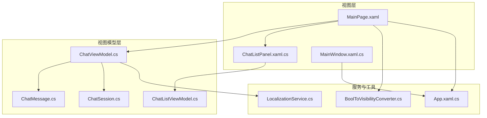
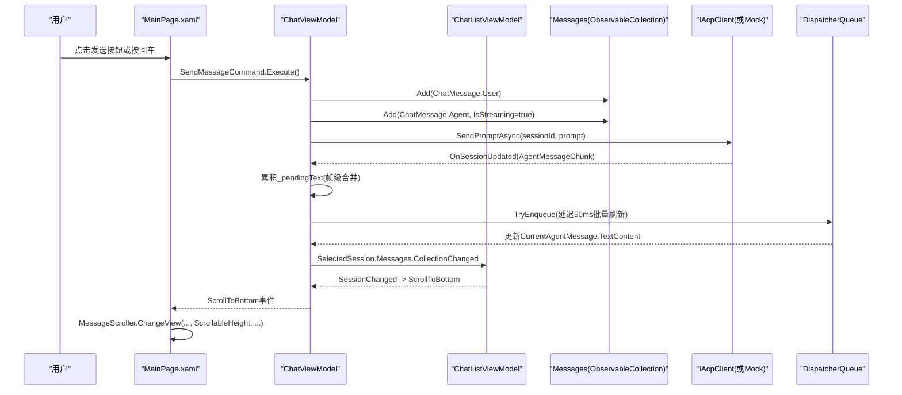
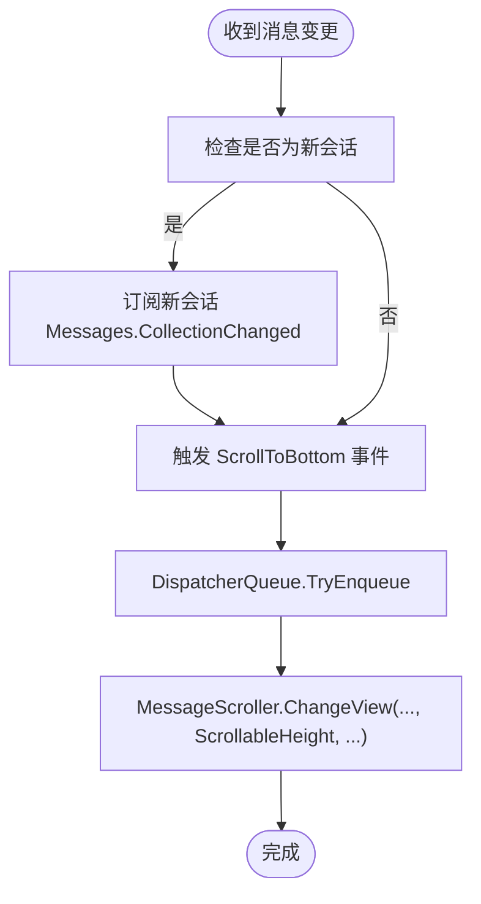
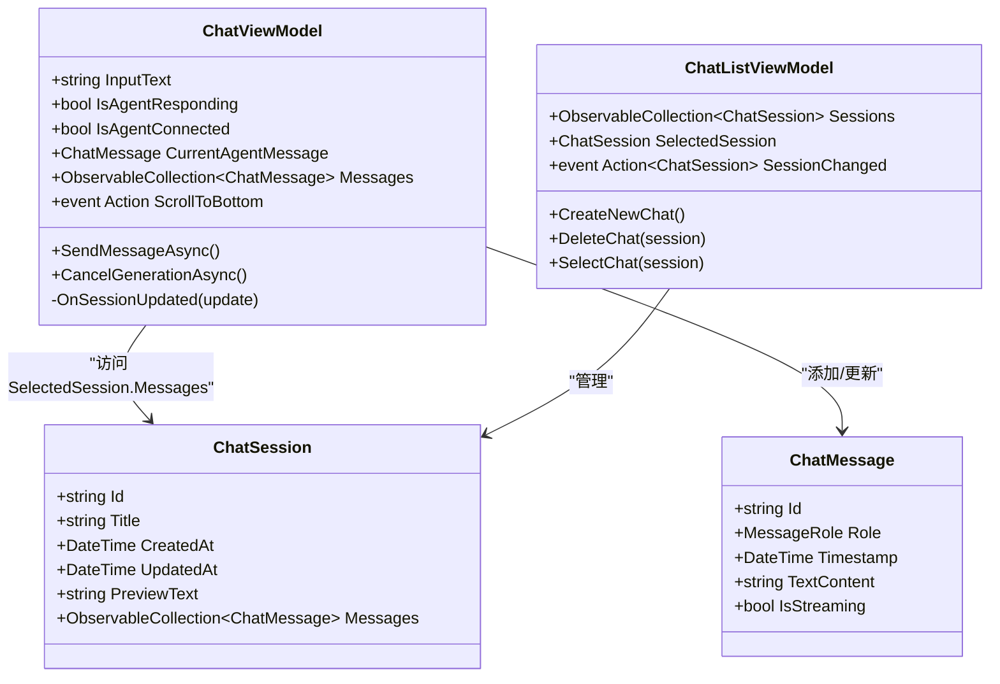
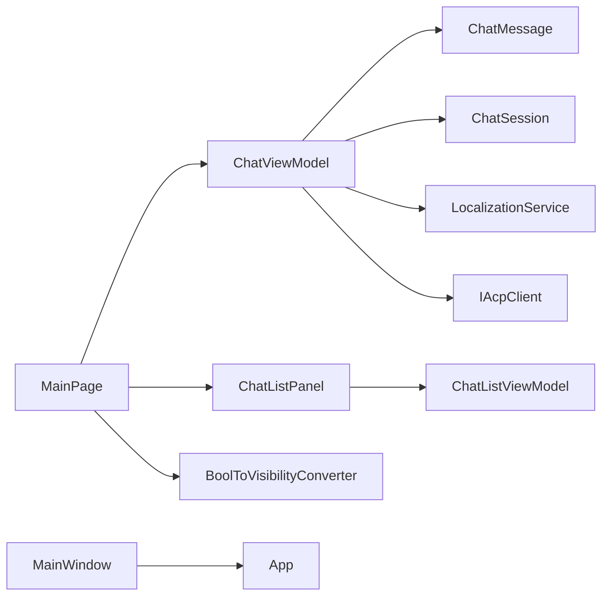

# UI 集成

<cite>
**本文引用的文件**   
- [MainPage.xaml](file://Agentic.Desktop/MainPage.xaml)
- [MainPage.xaml.cs](file://Agentic.Desktop/MainPage.xaml.cs)
- [ChatViewModel.cs](file://Agentic.Desktop/ViewModels/ChatViewModel.cs)
- [ChatListViewModel.cs](file://Agentic.Desktop/ViewModels/ChatListViewModel.cs)
- [ChatMessage.cs](file://Agentic.Desktop/ViewModels/Messages/ChatMessage.cs)
- [ChatSession.cs](file://Agentic.Desktop/ViewModels/Messages/ChatSession.cs)
- [BoolToVisibilityConverter.cs](file://Agentic.Desktop/Converters/BoolToVisibilityConverter.cs)
- [LocalizationService.cs](file://Agentic.Desktop/Services/LocalizationService.cs)
- [App.xaml.cs](file://Agentic.Desktop/App.xaml.cs)
- [MainWindow.xaml.cs](file://Agentic.Desktop/MainWindow.xaml.cs)
- [ChatListPanel.xaml.cs](file://Agentic.Desktop/Views/ChatListPanel.xaml.cs)
</cite>

## 目录
1. [简介](#简介)
2. [项目结构](#项目结构)
3. [核心组件](#核心组件)
4. [架构总览](#架构总览)
5. [详细组件分析](#详细组件分析)
6. [依赖关系分析](#依赖关系分析)
7. [性能考虑](#性能考虑)
8. [故障排查指南](#故障排查指南)
9. [结论](#结论)
10. [附录](#附录)

## 简介
本技术文档聚焦聊天系统的 UI 集成，重点解释 MainPage 中 ViewModel 的绑定与初始化、ScrollToBottom 事件触发机制与自动滚动实现、消息列表的数据绑定与实时更新机制，以及 XAML 界面与 C# 逻辑的交互模式。文档还包含 ObservableProperty 与 RelayCommand 的正确绑定示例路径、MVVM 在聊天系统中的实践要点，以及虚拟化列表与增量更新等性能优化策略。

## 项目结构
该 WinUI 3 桌面应用采用 MVVM 分层组织：
- Views（XAML + Code-behind）：页面与用户控件，负责展示与用户交互
- ViewModels（C#）：承载状态、命令与业务编排，使用 CommunityToolkit.Mvvm 生成通知与命令
- Services：本地化、Markdown 处理、权限等横切服务
- Converters：值转换器用于 XAML 数据绑定
- App/MainWindow：应用生命周期与导航容器

图表来源
- [MainPage.xaml:1-163](file://Agentic.Desktop/MainPage.xaml#L1-L163)
- [MainPage.xaml.cs:1-105](file://Agentic.Desktop/MainPage.xaml.cs#L1-L105)
- [ChatViewModel.cs:1-237](file://Agentic.Desktop/ViewModels/ChatViewModel.cs#L1-L237)
- [ChatListViewModel.cs:1-64](file://Agentic.Desktop/ViewModels/ChatListViewModel.cs#L1-L64)
- [ChatMessage.cs:1-39](file://Agentic.Desktop/ViewModels/Messages/ChatMessage.cs#L1-L39)
- [ChatSession.cs:1-28](file://Agentic.Desktop/ViewModels/Messages/ChatSession.cs#L1-L28)
- [BoolToVisibilityConverter.cs:1-28](file://Agentic.Desktop/Converters/BoolToVisibilityConverter.cs#L1-L28)
- [LocalizationService.cs:1-23](file://Agentic.Desktop/Services/LocalizationService.cs#L1-L23)
- [App.xaml.cs:1-85](file://Agentic.Desktop/App.xaml.cs#L1-L85)
- [MainWindow.xaml.cs:1-97](file://Agentic.Desktop/MainWindow.xaml.cs#L1-L97)

章节来源
- [MainPage.xaml:1-163](file://Agentic.Desktop/MainPage.xaml#L1-L163)
- [MainPage.xaml.cs:1-105](file://Agentic.Desktop/MainPage.xaml.cs#L1-L105)
- [ChatViewModel.cs:1-237](file://Agentic.Desktop/ViewModels/ChatViewModel.cs#L1-L237)
- [ChatListViewModel.cs:1-64](file://Agentic.Desktop/ViewModels/ChatListViewModel.cs#L1-L64)
- [ChatMessage.cs:1-39](file://Agentic.Desktop/ViewModels/Messages/ChatMessage.cs#L1-L39)
- [ChatSession.cs:1-28](file://Agentic.Desktop/ViewModels/Messages/ChatSession.cs#L1-L28)
- [BoolToVisibilityConverter.cs:1-28](file://Agentic.Desktop/Converters/BoolToVisibilityConverter.cs#L1-L28)
- [LocalizationService.cs:1-23](file://Agentic.Desktop/Services/LocalizationService.cs#L1-L23)
- [App.xaml.cs:1-85](file://Agentic.Desktop/App.xaml.cs#L1-L85)
- [MainWindow.xaml.cs:1-97](file://Agentic.Desktop/MainWindow.xaml.cs#L1-L97)

## 核心组件
- ChatViewModel：聊天会话的核心状态机与命令，维护输入文本、连接状态、当前 Agent 消息、消息集合，并协调 AcpClient 的事件流与 UI 刷新
- ChatListViewModel：会话列表管理，支持新建、删除、选择会话，并通过事件通知上层切换会话
- ChatMessage/ChatSession：数据模型，基于 ObservableObject 提供属性变更通知；ChatSession 持有 ObservableCollection<ChatMessage>
- MainPage：XAML 页面与少量代码后置，负责绑定 ViewModel、订阅 ScrollToBottom、处理键盘输入与侧边栏切换
- BoolToVisibilityConverter：将布尔值转换为 Visibility，支持反转参数
- LocalizationService：统一读取 .resw 资源字符串
- App/MainWindow：应用全局状态（AcpClient）、窗口导航与标题栏状态更新

章节来源
- [ChatViewModel.cs:1-237](file://Agentic.Desktop/ViewModels/ChatViewModel.cs#L1-L237)
- [ChatListViewModel.cs:1-64](file://Agentic.Desktop/ViewModels/ChatListViewModel.cs#L1-L64)
- [ChatMessage.cs:1-39](file://Agentic.Desktop/ViewModels/Messages/ChatMessage.cs#L1-L39)
- [ChatSession.cs:1-28](file://Agentic.Desktop/ViewModels/Messages/ChatSession.cs#L1-L28)
- [MainPage.xaml.cs:1-105](file://Agentic.Desktop/MainPage.xaml.cs#L1-L105)
- [BoolToVisibilityConverter.cs:1-28](file://Agentic.Desktop/Converters/BoolToVisibilityConverter.cs#L1-L28)
- [LocalizationService.cs:1-23](file://Agentic.Desktop/Services/LocalizationService.cs#L1-L23)
- [App.xaml.cs:1-85](file://Agentic.Desktop/App.xaml.cs#L1-L85)
- [MainWindow.xaml.cs:1-97](file://Agentic.Desktop/MainWindow.xaml.cs#L1-L97)

## 架构总览
下图展示了从用户输入到消息渲染的关键调用链，包括命令执行、消息追加、流式响应合并与 UI 滚动。

图表来源
- [MainPage.xaml:108-115](file://Agentic.Desktop/MainPage.xaml#L108-L115)
- [MainPage.xaml.cs:57-80](file://Agentic.Desktop/MainPage.xaml.cs#L57-L80)
- [ChatViewModel.cs:96-151](file://Agentic.Desktop/ViewModels/ChatViewModel.cs#L96-L151)
- [ChatViewModel.cs:153-206](file://Agentic.Desktop/ViewModels/ChatViewModel.cs#L153-L206)
- [ChatListViewModel.cs:56-63](file://Agentic.Desktop/ViewModels/ChatListViewModel.cs#L56-L63)

## 详细组件分析

### MainPage 中的 ViewModel 绑定与初始化
- 页面构造时创建 ChatViewModel 实例，并将其赋值给页面的只读属性
- 将 ChatListPanel 的 ViewModel 设置为 ViewModel.ChatList，完成侧边栏与主视图模型的关联
- 订阅 ViewModel.ScrollToBottom 事件，用于新消息到达后自动滚动到底部
- 若 App.CurrentAcpClient 已存在，立即调用 ViewModel.BindClient 建立通信；同时订阅 App.AcpClientChanged，以应对后续连接变化

章节来源
- [MainPage.xaml.cs:14-34](file://Agentic.Desktop/MainPage.xaml.cs#L14-L34)
- [App.xaml.cs:44-47](file://Agentic.Desktop/App.xaml.cs#L44-L47)

### ScrollToBottom 事件与自动滚动实现
- ChatViewModel 在会话切换时订阅新会话的 Messages 集合的 CollectionChanged，并在每次增删改时触发 ScrollToBottom
- MainPage 订阅该事件，通过 DispatcherQueue.TryEnqueue 确保在布局完成后调用 MessageScroller.ChangeView 将滚动条置底
- 由于 WinUI 3 ScrollViewer 无直接 ScrollToEnd，需在布局阶段结束后执行 ChangeView

图表来源
- [ChatViewModel.cs:52-74](file://Agentic.Desktop/ViewModels/ChatViewModel.cs#L52-L74)
- [MainPage.xaml.cs:72-80](file://Agentic.Desktop/MainPage.xaml.cs#L72-L80)

章节来源
- [ChatViewModel.cs:52-74](file://Agentic.Desktop/ViewModels/ChatViewModel.cs#L52-L74)
- [MainPage.xaml.cs:72-80](file://Agentic.Desktop/MainPage.xaml.cs#L72-L80)

### 消息列表的数据绑定与实时更新机制
- XAML 中使用 ItemsRepeater 绑定 ViewModel.Messages，并使用 DataTemplateSelector 根据 ChatMessage.Role 选择用户或 Agent 模板
- ChatMessage.TextContent 与 IsStreaming 均为 ObservableProperty，XAML 通过 x:Bind OneWay 绑定，实现实时显示与“正在输入”指示
- 当 AcpClient 推送 AgentMessageChunk 时，ChatViewModel 进行帧级合并（累积文本、延迟 50ms 批量刷新），减少 UI 抖动
- 工具调用通知会插入系统消息并更新会话预览文本

图表来源
- [ChatMessage.cs:14-31](file://Agentic.Desktop/ViewModels/Messages/ChatMessage.cs#L14-L31)
- [ChatSession.cs:10-27](file://Agentic.Desktop/ViewModels/Messages/ChatSession.cs#L10-L27)
- [ChatViewModel.cs:11-36](file://Agentic.Desktop/ViewModels/ChatViewModel.cs#L11-L36)
- [ChatListViewModel.cs:8-15](file://Agentic.Desktop/ViewModels/ChatListViewModel.cs#L8-L15)

章节来源
- [MainPage.xaml:18-54](file://Agentic.Desktop/MainPage.xaml#L18-L54)
- [MainPage.xaml:108-115](file://Agentic.Desktop/MainPage.xaml#L108-L115)
- [ChatViewModel.cs:153-206](file://Agentic.Desktop/ViewModels/ChatViewModel.cs#L153-L206)

### XAML 与 C# 的交互模式
- 双向绑定：输入框 Text="{x:Bind ViewModel.InputText, Mode=TwoWay, UpdateSourceTrigger=PropertyChanged}"，确保即时同步
- 单向绑定：IsEnabled、Visibility 等通过 Converter 控制 UI 状态
- 命令绑定：发送与取消按钮分别绑定 ViewModel.SendMessageCommand 与 CancelGenerationCommand
- 键盘事件：InputTextBox_KeyDown 捕获回车键，调用 ViewModel.SendMessageCommand.Execute
- 侧边栏切换：ToggleSidebar_Click 控制 SplitView.IsPaneOpen

章节来源
- [MainPage.xaml:128-156](file://Agentic.Desktop/MainPage.xaml#L128-L156)
- [MainPage.xaml.cs:57-70](file://Agentic.Desktop/MainPage.xaml.cs#L57-L70)
- [BoolToVisibilityConverter.cs:10-21](file://Agentic.Desktop/Converters/BoolToVisibilityConverter.cs#L10-L21)

### ObservableProperty 与 RelayCommand 的正确绑定示例路径
- ObservableProperty 使用位置：
  - ChatViewModel 的 InputText、IsAgentResponding、IsAgentConnected、CurrentAgentMessage
  - ChatMessage 的 TextContent、IsStreaming
  - ChatSession 的 Title、CreatedAt、UpdatedAt、PreviewText
- RelayCommand 使用位置：
  - ChatViewModel 的 SendMessageAsync、CancelGenerationAsync
  - ChatListViewModel 的 CreateNewChat、DeleteChat、SelectChat

章节来源
- [ChatViewModel.cs:19-31](file://Agentic.Desktop/ViewModels/ChatViewModel.cs#L19-L31)
- [ChatViewModel.cs:96-151](file://Agentic.Desktop/ViewModels/ChatViewModel.cs#L96-L151)
- [ChatViewModel.cs:208-218](file://Agentic.Desktop/ViewModels/ChatViewModel.cs#L208-L218)
- [ChatMessage.cs:20-24](file://Agentic.Desktop/ViewModels/Messages/ChatMessage.cs#L20-L24)
- [ChatSession.cs:14-24](file://Agentic.Desktop/ViewModels/Messages/ChatSession.cs#L14-L24)
- [ChatListViewModel.cs:22-62](file://Agentic.Desktop/ViewModels/ChatListViewModel.cs#L22-L62)

### MVVM 在聊天系统中的实践要点
- 视图仅负责展示与用户交互，不持有业务状态
- 视图模型暴露可观察属性与命令，供 XAML 绑定
- 数据模型独立于 UI，使用 ObservableObject 提供变更通知
- 通过事件（如 SessionChanged、ScrollToBottom）解耦模块间通信
- 使用 DispatcherQueue 保证跨线程 UI 更新安全

章节来源
- [ChatViewModel.cs:11-47](file://Agentic.Desktop/ViewModels/ChatViewModel.cs#L11-L47)
- [ChatListViewModel.cs:8-20](file://Agentic.Desktop/ViewModels/ChatListViewModel.cs#L8-L20)
- [ChatMessage.cs:14-31](file://Agentic.Desktop/ViewModels/Messages/ChatMessage.cs#L14-L31)
- [ChatSession.cs:10-27](file://Agentic.Desktop/ViewModels/Messages/ChatSession.cs#L10-L27)

## 依赖关系分析
- MainPage 依赖 ChatViewModel、ChatListPanel、App（获取 AcpClient）
- ChatViewModel 依赖 ChatListViewModel、ChatMessage、ChatSession、LocalizationService、IAcpClient
- ChatListViewModel 依赖 ChatSession
- 所有 ObservableObject 派生类依赖 CommunityToolkit.Mvvm 框架
- 值转换器与本地化服务为横切关注点

图表来源
- [MainPage.xaml.cs:1-34](file://Agentic.Desktop/MainPage.xaml.cs#L1-L34)
- [ChatViewModel.cs:1-16](file://Agentic.Desktop/ViewModels/ChatViewModel.cs#L1-L16)
- [ChatListViewModel.cs:1-10](file://Agentic.Desktop/ViewModels/ChatListViewModel.cs#L1-L10)
- [ChatMessage.cs:1-5](file://Agentic.Desktop/ViewModels/Messages/ChatMessage.cs#L1-L5)
- [ChatSession.cs:1-5](file://Agentic.Desktop/ViewModels/Messages/ChatSession.cs#L1-L5)
- [BoolToVisibilityConverter.cs:1-5](file://Agentic.Desktop/Converters/BoolToVisibilityConverter.cs#L1-L5)
- [App.xaml.cs:44-47](file://Agentic.Desktop/App.xaml.cs#L44-L47)
- [MainWindow.xaml.cs:1-20](file://Agentic.Desktop/MainWindow.xaml.cs#L1-L20)

章节来源
- [MainPage.xaml.cs:1-34](file://Agentic.Desktop/MainPage.xaml.cs#L1-L34)
- [ChatViewModel.cs:1-16](file://Agentic.Desktop/ViewModels/ChatViewModel.cs#L1-L16)
- [ChatListViewModel.cs:1-10](file://Agentic.Desktop/ViewModels/ChatListViewModel.cs#L1-L10)
- [ChatMessage.cs:1-5](file://Agentic.Desktop/ViewModels/Messages/ChatMessage.cs#L1-L5)
- [ChatSession.cs:1-5](file://Agentic.Desktop/ViewModels/Messages/ChatSession.cs#L1-L5)
- [BoolToVisibilityConverter.cs:1-5](file://Agentic.Desktop/Converters/BoolToVisibilityConverter.cs#L1-L5)
- [App.xaml.cs:44-47](file://Agentic.Desktop/App.xaml.cs#L44-L47)
- [MainWindow.xaml.cs:1-20](file://Agentic.Desktop/MainWindow.xaml.cs#L1-L20)

## 性能考虑
- 虚拟化列表：使用 ItemsRepeater 替代传统 ListView，避免不必要的 UI 元素创建，提升大数据量下的渲染性能
- 增量更新策略：
  - 帧级合并：对频繁到来的 AgentMessageChunk 进行文本累积，延迟 50ms 批量刷新，降低 UI 重绘频率
  - 单对象更新：直接追加 CurrentAgentMessage.TextContent，避免重建整个消息集合
- 异步与调度：使用 DispatcherQueue.TryEnqueue 确保 UI 更新在主线程执行，避免跨线程异常
- 条件渲染：通过 BoolToVisibilityConverter 控制“未连接提示”、“正在输入”等元素的可见性，减少无效布局

章节来源
- [MainPage.xaml:108-115](file://Agentic.Desktop/MainPage.xaml#L108-L115)
- [ChatViewModel.cs:153-182](file://Agentic.Desktop/ViewModels/ChatViewModel.cs#L153-L182)
- [BoolToVisibilityConverter.cs:10-21](file://Agentic.Desktop/Converters/BoolToVisibilityConverter.cs#L10-L21)

## 故障排查指南
- 无法自动滚动到底部：
  - 确认 ScrollToBottom 事件已订阅且 MessageScroller.ChangeView 在 DispatcherQueue 中执行
  - 检查 OnSessionChanged 是否正确订阅新会话的 Messages.CollectionChanged
- 消息不更新或闪烁：
  - 检查帧级合并逻辑是否生效，_flushScheduled 与 _pendingText 是否被正确重置
  - 确认 CurrentAgentMessage 是否为空导致更新失败
- 发送消息无响应：
  - 检查 SendMessageCommand.CanExecute 的条件（输入非空且未在响应中）
  - 确认 IAcpClient 已绑定且 CurrentSessionId 有效
- 连接状态不一致：
  - 检查 App.AcpClientChanged 事件是否触发，OnAcpClientChanged 是否正确设置 IsAgentConnected
  - 断连时是否调用 ClearMessages 清空消息

章节来源
- [MainPage.xaml.cs:72-80](file://Agentic.Desktop/MainPage.xaml.cs#L72-L80)
- [ChatViewModel.cs:52-74](file://Agentic.Desktop/ViewModels/ChatViewModel.cs#L52-L74)
- [ChatViewModel.cs:153-182](file://Agentic.Desktop/ViewModels/ChatViewModel.cs#L153-L182)
- [ChatViewModel.cs:96-151](file://Agentic.Desktop/ViewModels/ChatViewModel.cs#L96-L151)
- [App.xaml.cs:78-83](file://Agentic.Desktop/App.xaml.cs#L78-L83)

## 结论
本聊天系统通过清晰的 MVVM 分层与 WinUI 3 的数据绑定能力，实现了高内聚、低耦合的 UI 集成方案。ChatViewModel 作为核心协调者，结合帧级合并与增量更新策略，保证了流畅的用户体验。通过合理的事件驱动与 DispatcherQueue 调度，系统在复杂交互场景下仍保持稳定性与可维护性。建议在生产环境中继续优化虚拟化与内存占用，并完善错误日志与监控。

## 附录
- 关键绑定路径参考：
  - 输入框双向绑定：[MainPage.xaml:128-136](file://Agentic.Desktop/MainPage.xaml#L128-L136)
  - 发送命令绑定：[MainPage.xaml:139-147](file://Agentic.Desktop/MainPage.xaml#L139-L147)
  - 取消命令绑定：[MainPage.xaml:148-155](file://Agentic.Desktop/MainPage.xaml#L148-L155)
  - 消息列表绑定与模板选择器：[MainPage.xaml:108-115](file://Agentic.Desktop/MainPage.xaml#L108-L115)
  - 用户/Agent 模板定义：[MainPage.xaml:18-54](file://Agentic.Desktop/MainPage.xaml#L18-L54)
- 事件与命令定义位置：
  - ScrollToBottom 事件：[ChatViewModel.cs:36](file://Agentic.Desktop/ViewModels/ChatViewModel.cs#L36)
  - SendMessageAsync 命令：[ChatViewModel.cs:96-151](file://Agentic.Desktop/ViewModels/ChatViewModel.cs#L96-L151)
  - CancelGenerationAsync 命令：[ChatViewModel.cs:208-218](file://Agentic.Desktop/ViewModels/ChatViewModel.cs#L208-L218)
  - SelectChat/CreateNewChat/DeleteChat 命令：[ChatListViewModel.cs:22-62](file://Agentic.Desktop/ViewModels/ChatListViewModel.cs#L22-L62)