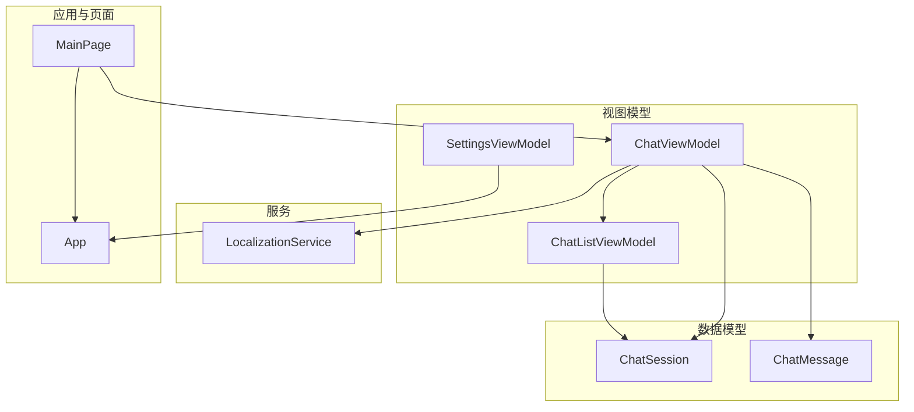
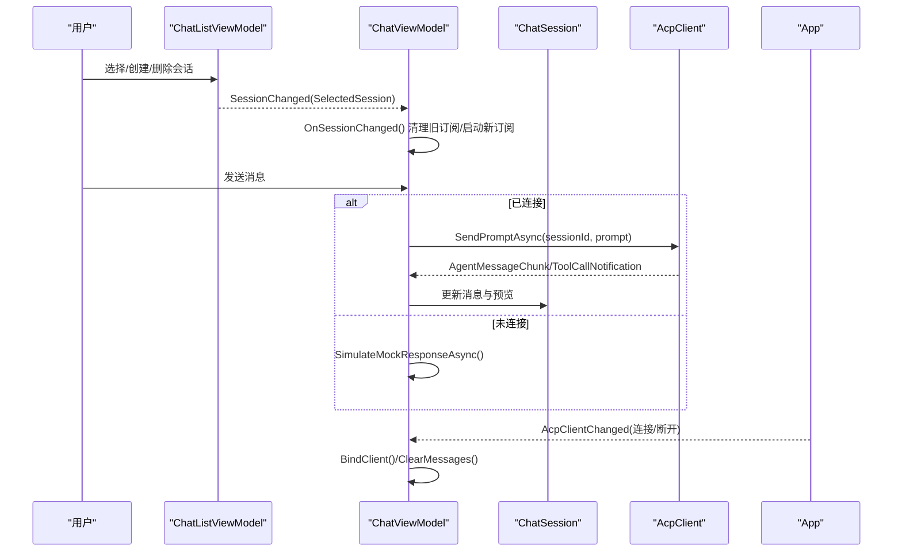
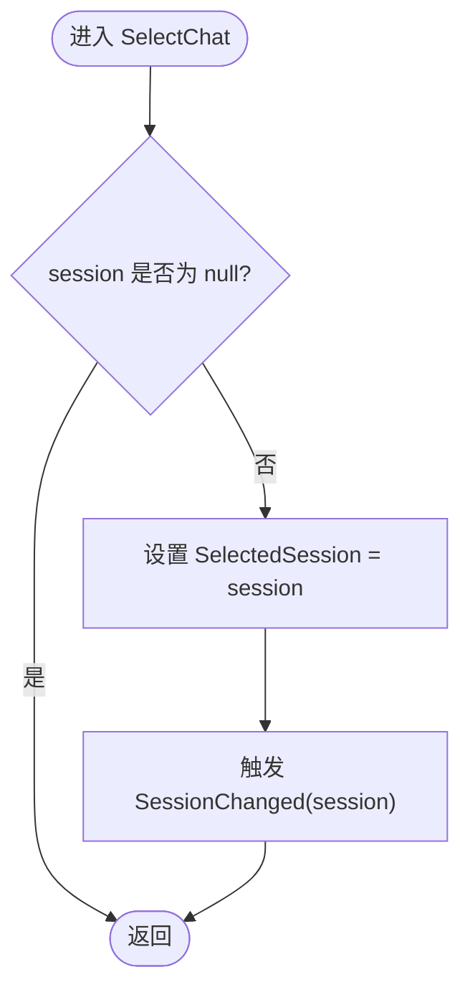
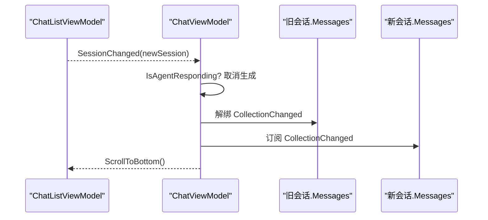
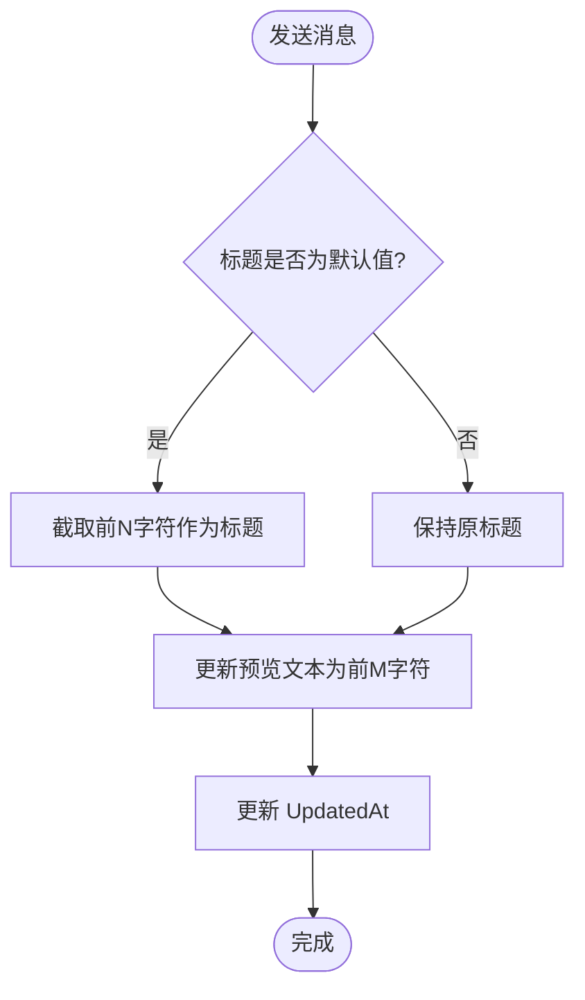
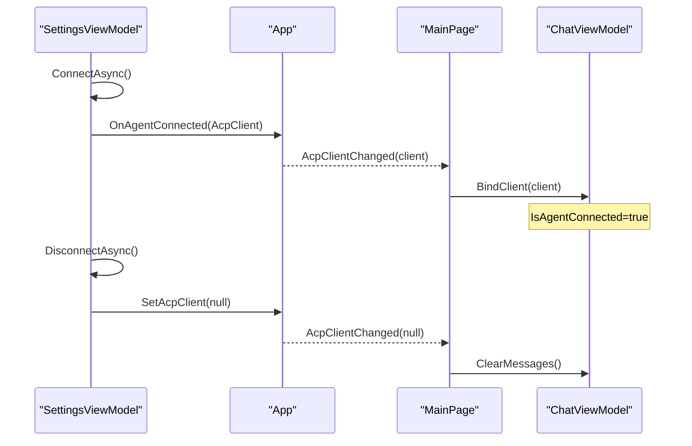
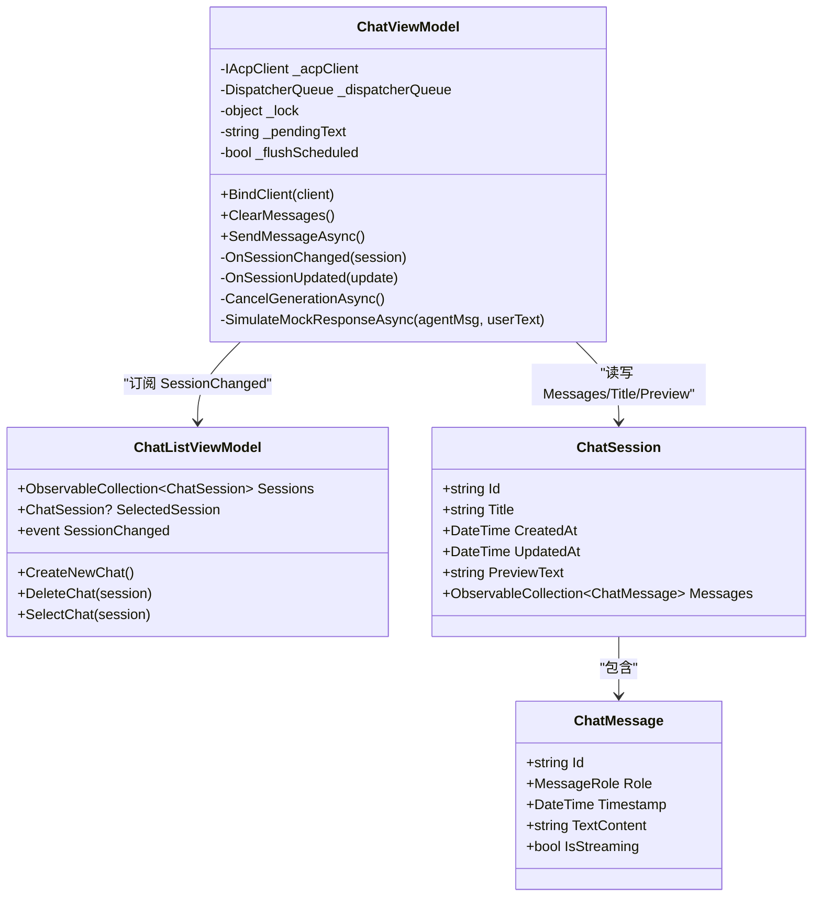
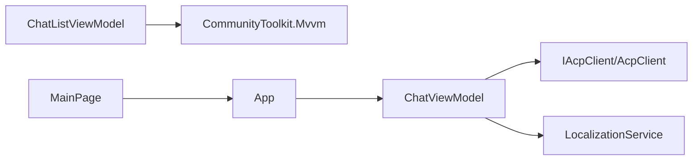

# 会话管理

<cite>
**本文引用的文件**   
- [ChatListViewModel.cs](file://Agentic.Desktop/ViewModels/ChatListViewModel.cs)
- [ChatSession.cs](file://Agentic.Desktop/ViewModels/Messages/ChatSession.cs)
- [ChatMessage.cs](file://Agentic.Desktop/ViewModels/Messages/ChatMessage.cs)
- [ChatViewModel.cs](file://Agentic.Desktop/ViewModels/ChatViewModel.cs)
- [LocalizationService.cs](file://Agentic.Desktop/Agentic.Desktop/Services/LocalizationService.cs)
- [SettingsViewModel.cs](file://Agentic.Desktop/ViewModels/SettingsViewModel.cs)
- [App.xaml.cs](file://Agentic.Desktop/Agentic.Desktop/App.xaml.cs)
- [MainPage.xaml.cs](file://Agentic.Desktop/Agentic.Desktop/MainPage.xaml.cs)
</cite>

## 目录
1. [简介](#简介)
2. [项目结构](#项目结构)
3. [核心组件](#核心组件)
4. [架构总览](#架构总览)
5. [详细组件分析](#详细组件分析)
6. [依赖关系分析](#依赖关系分析)
7. [性能考量](#性能考量)
8. [故障排查指南](#故障排查指南)
9. [结论](#结论)
10. [附录：操作示例与最佳实践](#附录：操作示例与最佳实践)

## 简介
本技术文档聚焦于“会话管理”功能，围绕 ChatListViewModel 的会话集合管理与选择逻辑展开，详细说明会话切换时的资源清理与订阅管理（OnSessionChanged），解释会话标题与预览文本的自动生成规则，并给出会话持久化存储的设计建议。同时涵盖与 AcpClient 的连接状态管理与重连机制、多会话并发处理注意事项以及内存管理策略。

## 项目结构
该应用采用 MVVM 模式，会话相关的数据模型位于 Messages 命名空间，视图模型位于 ViewModels，服务层提供本地化与系统能力封装。会话列表由 ChatListViewModel 维护，聊天交互由 ChatViewModel 驱动，连接与设置由 SettingsViewModel 负责，全局连接状态通过 App 暴露。

图表来源
- [ChatListViewModel.cs:1-64](file://Agentic.Desktop/ViewModels/ChatListViewModel.cs#L1-L64)
- [ChatViewModel.cs:1-237](file://Agentic.Desktop/ViewModels/ChatViewModel.cs#L1-L237)
- [ChatSession.cs:1-28](file://Agentic.Desktop/ViewModels/Messages/ChatSession.cs#L1-L28)
- [ChatMessage.cs:1-39](file://Agentic.Desktop/ViewModels/Messages/ChatMessage.cs#L1-L39)
- [LocalizationService.cs:1-23](file://Agentic.Desktop/Agentic.Desktop/Services/LocalizationService.cs#L1-L23)
- [SettingsViewModel.cs:1-161](file://Agentic.Desktop/ViewModels/SettingsViewModel.cs#L1-L161)
- [App.xaml.cs:1-84](file://Agentic.Desktop/Agentic.Desktop/App.xaml.cs#L1-L84)
- [MainPage.xaml.cs:1-51](file://Agentic.Desktop/Agentic.Desktop/MainPage.xaml.cs#L1-L51)

章节来源
- [ChatListViewModel.cs:1-64](file://Agentic.Desktop/ViewModels/ChatListViewModel.cs#L1-L64)
- [ChatViewModel.cs:1-237](file://Agentic.Desktop/ViewModels/ChatViewModel.cs#L1-L237)
- [ChatSession.cs:1-28](file://Agentic.Desktop/ViewModels/Messages/ChatSession.cs#L1-L28)
- [ChatMessage.cs:1-39](file://Agentic.Desktop/ViewModels/Messages/ChatMessage.cs#L1-L39)
- [LocalizationService.cs:1-23](file://Agentic.Desktop/Agentic.Desktop/Services/LocalizationService.cs#L1-L23)
- [SettingsViewModel.cs:1-161](file://Agentic.Desktop/ViewModels/SettingsViewModel.cs#L1-L161)
- [App.xaml.cs:1-84](file://Agentic.Desktop/Agentic.Desktop/App.xaml.cs#L1-L84)
- [MainPage.xaml.cs:1-51](file://Agentic.Desktop/Agentic.Desktop/MainPage.xaml.cs#L1-L51)

## 核心组件
- ChatListViewModel：维护会话集合 ObservableCollection<ChatSession>，提供创建、删除、选择会话的命令，并通过 SessionChanged 事件通知外部订阅者当前选中会话变更。
- ChatSession：表示一次对话会话，包含唯一 Id、标题 Title、创建时间 CreatedAt、更新时间 UpdatedAt、预览文本 PreviewText 以及消息集合 Messages。
- ChatMessage：表示单条消息，包含角色 Role、时间戳 Timestamp、文本内容 TextContent 与流式标记 IsStreaming。
- ChatViewModel：绑定 UI 输入与发送流程，管理 AcpClient 连接状态，处理会话切换时的资源清理与订阅管理，实现流式响应合并与工具调用提示更新。
- SettingsViewModel：负责 AcpClient 的连接、断开、生命周期管理，并在连接成功后通知 UI 层。
- App：全局持有当前连接的 IAcpClient，并提供 AcpClientChanged 事件以跨页面同步连接状态。

章节来源
- [ChatListViewModel.cs:1-64](file://Agentic.Desktop/ViewModels/ChatListViewModel.cs#L1-L64)
- [ChatSession.cs:1-28](file://Agentic.Desktop/ViewModels/Messages/ChatSession.cs#L1-L28)
- [ChatMessage.cs:1-39](file://Agentic.Desktop/ViewModels/Messages/ChatMessage.cs#L1-L39)
- [ChatViewModel.cs:1-237](file://Agentic.Desktop/ViewModels/ChatViewModel.cs#L1-L237)
- [SettingsViewModel.cs:1-161](file://Agentic.Desktop/ViewModels/SettingsViewModel.cs#L1-L161)
- [App.xaml.cs:1-84](file://Agentic.Desktop/Agentic.Desktop/App.xaml.cs#L1-L84)

## 架构总览
下图展示了会话管理与连接管理的整体交互：用户通过 ChatListViewModel 切换会话，ChatViewModel 监听 SessionChanged 进行资源清理与订阅；发送消息时根据是否已连接 AcpClient 走真实或模拟流程；连接状态变化通过 App 全局事件在页面间同步。

图表来源
- [ChatListViewModel.cs:1-64](file://Agentic.Desktop/ViewModels/ChatListViewModel.cs#L1-L64)
- [ChatViewModel.cs:1-237](file://Agentic.Desktop/ViewModels/ChatViewModel.cs#L1-L237)
- [App.xaml.cs:1-84](file://Agentic.Desktop/Agentic.Desktop/App.xaml.cs#L1-L84)
- [MainPage.xaml.cs:1-51](file://Agentic.Desktop/Agentic.Desktop/MainPage.xaml.cs#L1-L51)

## 详细组件分析

### ChatListViewModel：会话集合管理与选择逻辑
- 使用 ObservableCollection<ChatSession> 维护会话列表，支持 UI 自动刷新。
- CreateNewChat：插入新会话到列表头部，并立即选中。
- DeleteChat：从集合移除会话；若被删除的是当前选中项，则自动选择相邻会话或新建会话以保持列表非空。
- SelectChat：设置 SelectedSession 并触发 SessionChanged 事件，供上层订阅者执行切换逻辑。

图表来源
- [ChatListViewModel.cs:56-62](file://Agentic.Desktop/ViewModels/ChatListViewModel.cs#L56-L62)

章节来源
- [ChatListViewModel.cs:1-64](file://Agentic.Desktop/ViewModels/ChatListViewModel.cs#L1-L64)

### ChatViewModel：会话切换的资源清理与订阅管理（OnSessionChanged）
- 构造函数中订阅 ChatList.SessionChanged。
- OnSessionChanged：
  - 若当前有正在进行的生成（IsAgentResponding），先取消以避免数据损坏。
  - 解绑旧会话的 Messages 集合的 CollectionChanged 事件，防止内存泄漏。
  - 重新订阅新会话的 Messages 集合，滚动到底部。
- BindClient/ClearMessages：用于连接/断开时的客户端绑定与消息清空。
- SendMessageAsync：添加用户消息，更新会话标题与预览文本，创建占位 Agent 消息，并根据连接状态走真实或模拟流程。
- OnSessionUpdated：对 AgentMessageChunk 进行帧级合并，批量更新 UI；对 ToolCallNotification 插入系统消息并更新预览。

图表来源
- [ChatViewModel.cs:43-74](file://Agentic.Desktop/ViewModels/ChatViewModel.cs#L43-L74)

章节来源
- [ChatViewModel.cs:43-74](file://Agentic.Desktop/ViewModels/ChatViewModel.cs#L43-L74)

### 会话标题与预览文本的自动生成规则
- 标题生成：当会话标题为默认值时，首次发送消息会将标题设置为前若干字符（不足截断加省略号）。
- 预览文本：每次发送消息或收到工具调用通知时，会更新预览文本为最近的消息片段或工具调用标题。
- 更新时间：每次会话内容变更后更新 UpdatedAt。

图表来源
- [ChatViewModel.cs:96-151](file://Agentic.Desktop/ViewModels/ChatViewModel.cs#L96-L151)
- [ChatViewModel.cs:184-206](file://Agentic.Desktop/ViewModels/ChatViewModel.cs#L184-L206)

章节来源
- [ChatViewModel.cs:96-151](file://Agentic.Desktop/ViewModels/ChatViewModel.cs#L96-L151)
- [ChatViewModel.cs:184-206](file://Agentic.Desktop/ViewModels/ChatViewModel.cs#L184-L206)

### 与 AcpClient 的连接状态管理与重连机制
- 连接建立：SettingsViewModel.ConnectAsync 创建 AcpClient 并初始化，成功后通过 App.AcpClientChanged 通知 MainPage，MainPage 再调用 ChatViewModel.BindClient。
- 连接断开：SettingsViewModel.DisconnectAsync 清理 AcpClient 与 TerminalManager，并通过 App.SetAcpClient(null) 通知 UI 层，MainPage 调用 ChatViewModel.ClearMessages。
- 重连机制：当前代码未实现自动重连；建议在 SettingsViewModel 中增加重试策略（指数退避、最大重试次数），并在失败时更新 ConnectionStatus 与 ConnectionState。

图表来源
- [SettingsViewModel.cs:60-126](file://Agentic.Desktop/ViewModels/SettingsViewModel.cs#L60-L126)
- [App.xaml.cs:78-84](file://Agentic.Desktop/Agentic.Desktop/App.xaml.cs#L78-L84)
- [MainPage.xaml.cs:26-47](file://Agentic.Desktop/Agentic.Desktop/MainPage.xaml.cs#L26-L47)
- [ChatViewModel.cs:76-94](file://Agentic.Desktop/ViewModels/ChatViewModel.cs#L76-L94)

章节来源
- [SettingsViewModel.cs:60-126](file://Agentic.Desktop/ViewModels/SettingsViewModel.cs#L60-L126)
- [App.xaml.cs:78-84](file://Agentic.Desktop/Agentic.Desktop/App.xaml.cs#L78-L84)
- [MainPage.xaml.cs:26-47](file://Agentic.Desktop/Agentic.Desktop/MainPage.xaml.cs#L26-L47)
- [ChatViewModel.cs:76-94](file://Agentic.Desktop/ViewModels/ChatViewModel.cs#L76-L94)

### 多会话并发处理与内存管理策略
- 并发处理：
  - ChatViewModel 使用锁对象与 _pendingText 缓冲，将高频 AgentMessageChunk 合并为批次更新，减少 UI 线程压力。
  - 使用 DispatcherQueue.TryEnqueue 确保 UI 更新在主线程执行。
- 内存管理：
  - 会话切换时解绑旧集合事件，避免事件引用导致内存泄漏。
  - 断开连接时清空消息集合，释放大对象引用。
  - 建议实现会话历史裁剪策略（如保留最近 N 条消息），降低长会话的内存占用。

图表来源
- [ChatViewModel.cs:1-237](file://Agentic.Desktop/ViewModels/ChatViewModel.cs#L1-L237)
- [ChatListViewModel.cs:1-64](file://Agentic.Desktop/ViewModels/ChatListViewModel.cs#L1-L64)
- [ChatSession.cs:1-28](file://Agentic.Desktop/ViewModels/Messages/ChatSession.cs#L1-L28)
- [ChatMessage.cs:1-39](file://Agentic.Desktop/ViewModels/Messages/ChatMessage.cs#L1-L39)

章节来源
- [ChatViewModel.cs:153-206](file://Agentic.Desktop/ViewModels/ChatViewModel.cs#L153-L206)
- [ChatViewModel.cs:43-74](file://Agentic.Desktop/ViewModels/ChatViewModel.cs#L43-L74)

## 依赖关系分析
- ChatListViewModel 依赖 CommunityToolkit.Mvvm 的 ObservableObject 与 RelayCommand，提供可观察的集合与命令。
- ChatViewModel 依赖 IAcpClient 接口与 AcpClient 实现，通过事件驱动更新 UI。
- LocalizationService 提供本地化字符串获取与格式化。
- App 提供全局 AcpClient 状态与事件，MainPage 订阅并转发给 ChatViewModel。

图表来源
- [ChatListViewModel.cs:1-64](file://Agentic.Desktop/ViewModels/ChatListViewModel.cs#L1-L64)
- [ChatViewModel.cs:1-237](file://Agentic.Desktop/ViewModels/ChatViewModel.cs#L1-L237)
- [LocalizationService.cs:1-23](file://Agentic.Desktop/Agentic.Desktop/Services/LocalizationService.cs#L1-L23)
- [App.xaml.cs:1-84](file://Agentic.Desktop/Agentic.Desktop/App.xaml.cs#L1-L84)
- [MainPage.xaml.cs:1-51](file://Agentic.Desktop/Agentic.Desktop/MainPage.xaml.cs#L1-L51)

章节来源
- [ChatListViewModel.cs:1-64](file://Agentic.Desktop/ViewModels/ChatListViewModel.cs#L1-L64)
- [ChatViewModel.cs:1-237](file://Agentic.Desktop/ViewModels/ChatViewModel.cs#L1-L237)
- [LocalizationService.cs:1-23](file://Agentic.Desktop/Agentic.Desktop/Services/LocalizationService.cs#L1-L23)
- [App.xaml.cs:1-84](file://Agentic.Desktop/Agentic.Desktop/App.xaml.cs#L1-L84)
- [MainPage.xaml.cs:1-51](file://Agentic.Desktop/Agentic.Desktop/MainPage.xaml.cs#L1-L51)

## 性能考量
- 流式响应合并：使用 50ms 批处理窗口聚合文本，减少 UI 更新频率，提升流畅度。
- 主线程调度：所有 UI 更新通过 DispatcherQueue.TryEnqueue 确保线程安全。
- 事件订阅管理：切换会话时及时解绑旧事件，避免内存泄漏与重复回调。
- 消息集合裁剪：建议实现 LRU 或固定长度队列，限制历史消息数量，控制内存增长。

[本节为通用指导，不直接分析具体文件]

## 故障排查指南
- 会话切换后消息不滚动：检查 OnSessionChanged 是否正确订阅新集合的 CollectionChanged 事件。
- 流式输出卡顿：确认 OnSessionUpdated 的批处理逻辑与 DispatcherQueue 调度是否正常。
- 连接断开后 UI 未清理：检查 App.AcpClientChanged 事件是否触发，MainPage 是否调用 ClearMessages。
- 标题与预览未更新：确认 SendMessageAsync 中对 Title 与 PreviewText 的赋值逻辑是否被执行。

章节来源
- [ChatViewModel.cs:43-74](file://Agentic.Desktop/ViewModels/ChatViewModel.cs#L43-L74)
- [ChatViewModel.cs:153-206](file://Agentic.Desktop/ViewModels/ChatViewModel.cs#L153-L206)
- [MainPage.xaml.cs:26-47](file://Agentic.Desktop/Agentic.Desktop/MainPage.xaml.cs#L26-L47)

## 结论
本项目的会话管理基于 MVVM 架构，通过 ChatListViewModel 与 ChatViewModel 的协作实现了健壮的会话集合管理与切换逻辑。连接管理通过 SettingsViewModel 与 App 的全局事件机制完成，具备良好的可扩展性。当前尚未实现会话持久化与自动重连，建议在后续迭代中补充 JSON 序列化存储与重试策略，以提升用户体验与稳定性。

[本节为总结，不直接分析具体文件]

## 附录：操作示例与最佳实践

### 会话的创建、更新与删除（代码路径指引）
- 创建会话：参考 [ChatListViewModel.CreateNewChat:22-28](file://Agentic.Desktop/ViewModels/ChatListViewModel.cs#L22-L28)。
- 删除会话：参考 [ChatListViewModel.DeleteChat:30-54](file://Agentic.Desktop/ViewModels/ChatListViewModel.cs#L30-L54)。
- 选择会话：参考 [ChatListViewModel.SelectChat:56-62](file://Agentic.Desktop/ViewModels/ChatListViewModel.cs#L56-L62)。
- 更新会话标题与预览：参考 [ChatViewModel.SendMessageAsync:96-151](file://Agentic.Desktop/ViewModels/ChatViewModel.cs#L96-L151)、[ChatViewModel.OnSessionUpdated:184-206](file://Agentic.Desktop/ViewModels/ChatViewModel.cs#L184-L206)。

### 会话持久化存储设计与实现建议
- 存储格式：JSON 文件，包含会话元数据（Id、Title、CreatedAt、UpdatedAt、PreviewText）与消息数组（Id、Role、Timestamp、TextContent、IsStreaming）。
- 存储位置：应用沙盒或用户配置目录，按会话 Id 分文件或以单一索引文件聚合。
- 写入策略：增量写入（追加新消息）+ 定期全量快照，避免频繁 I/O。
- 读取策略：应用启动时加载最近 N 个会话，按需懒加载历史消息。
- 版本兼容：在 JSON 中加入 schemaVersion 字段，便于未来迁移。

[本节为概念性设计，不直接分析具体文件]

### 与 AcpClient 的重连机制建议
- 在 SettingsViewModel 中增加重试计数器与指数退避延迟。
- 监听 AgentProcessExited 事件，触发自动重连或提示用户。
- 连接失败时更新 ConnectionStatus 与 ConnectionState，保证 UI 一致性。

章节来源
- [SettingsViewModel.cs:89-126](file://Agentic.Desktop/ViewModels/SettingsViewModel.cs#L89-L126)

### 多会话并发与内存管理最佳实践
- 限制每个会话的消息数量，实现滑动窗口或 LRU 淘汰。
- 会话切换时务必解绑事件与释放临时对象。
- 使用不可变数据结构或只读视图展示历史，避免意外修改。

[本节为通用指导，不直接分析具体文件]