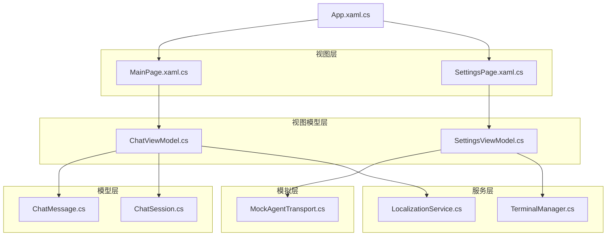
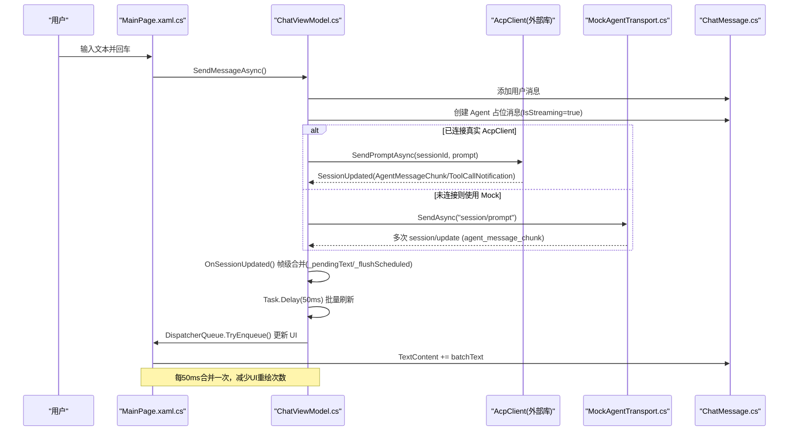
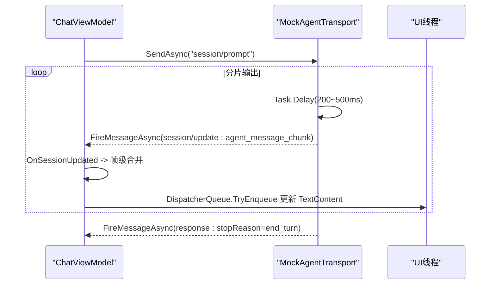
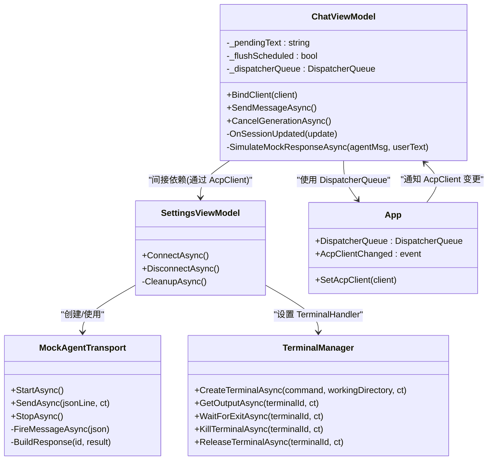

# 流式响应实现

<cite>
**本文引用的文件**   
- [ChatViewModel.cs](file://Agentic.Desktop/ViewModels/ChatViewModel.cs)
- [MockAgentTransport.cs](file://Agentic.Desktop/Mocks/MockAgentTransport.cs)
- [TerminalManager.cs](file://Agentic.Desktop/Services/TerminalManager.cs)
- [SettingsViewModel.cs](file://Agentic.Desktop/ViewModels/SettingsViewModel.cs)
- [MainPage.xaml.cs](file://Agentic.Desktop/MainPage.xaml.cs)
- [App.xaml.cs](file://Agentic.Desktop/App.xaml.cs)
- [ChatMessage.cs](file://Agentic.Desktop/ViewModels/Messages/ChatMessage.cs)
- [ChatSession.cs](file://Agentic.Desktop/ViewModels/Messages/ChatSession.cs)
- [LocalizationService.cs](file://Agentic.Desktop/Services/LocalizationService.cs)
</cite>

## 目录
1. [简介](#简介)
2. [项目结构](#项目结构)
3. [核心组件](#核心组件)
4. [架构总览](#架构总览)
5. [详细组件分析](#详细组件分析)
6. [依赖关系分析](#依赖关系分析)
7. [性能考量](#性能考量)
8. [故障排查指南](#故障排查指南)
9. [结论](#结论)
10. [附录：代码示例路径](#附录代码示例路径)

## 简介
本技术文档聚焦于桌面端应用中的“流式响应”实现，重点解释帧级合并算法、UI 线程调度策略与批量刷新机制。通过 ChatViewModel 的 OnSessionUpdated 方法处理 AgentMessageChunk 和 ToolCallNotification 事件，结合 _pendingText 缓冲区和 _flushScheduled 标志，将高频的流式数据帧合并为批次更新 UI，从而降低渲染压力并提升流畅度。同时，文档涵盖 DispatcherQueue 的使用模式、错误处理与异常恢复机制，以及 MockAgentTransport 的模拟响应方式，便于测试与演示。

## 项目结构
该应用采用 MVVM 分层组织：
- ViewModels：业务逻辑与状态管理（ChatViewModel、SettingsViewModel）
- Services：横切服务（TerminalManager、PermissionHandler、FileSystemHandler、LocalizationService）
- Mocks：用于开发与测试的模拟传输层（MockAgentTransport）
- Views：XAML 界面与页面控制（MainPage、SettingsPage）
- Messages：消息模型（ChatMessage、ChatSession）



图表来源
- [MainPage.xaml.cs:1-51](file://Agentic.Desktop/MainPage.xaml.cs#L1-L51)
- [ChatViewModel.cs:1-237](file://Agentic.Desktop/ViewModels/ChatViewModel.cs#L1-L237)
- [SettingsViewModel.cs:1-161](file://Agentic.Desktop/ViewModels/SettingsViewModel.cs#L1-L161)
- [MockAgentTransport.cs:1-142](file://Agentic.Desktop/Mocks/MockAgentTransport.cs#L1-L142)
- [TerminalManager.cs:1-161](file://Agentic.Desktop/Services/TerminalManager.cs#L1-L161)
- [App.xaml.cs:1-85](file://Agentic.Desktop/App.xaml.cs#L1-L85)
- [ChatMessage.cs:1-38](file://Agentic.Desktop/ViewModels/Messages/ChatMessage.cs#L1-L38)
- [ChatSession.cs:1-28](file://Agentic.Desktop/ViewModels/Messages/ChatSession.cs#L1-L28)

章节来源
- [MainPage.xaml.cs:1-51](file://Agentic.Desktop/MainPage.xaml.cs#L1-L51)
- [ChatViewModel.cs:1-237](file://Agentic.Desktop/ViewModels/ChatViewModel.cs#L1-L237)
- [SettingsViewModel.cs:1-161](file://Agentic.Desktop/ViewModels/SettingsViewModel.cs#L1-L161)
- [MockAgentTransport.cs:1-142](file://Agentic.Desktop/Mocks/MockAgentTransport.cs#L1-L142)
- [TerminalManager.cs:1-161](file://Agentic.Desktop/Services/TerminalManager.cs#L1-L161)
- [App.xaml.cs:1-85](file://Agentic.Desktop/App.xaml.cs#L1-L85)
- [ChatMessage.cs:1-38](file://Agentic.Desktop/ViewModels/Messages/ChatMessage.cs#L1-L38)
- [ChatSession.cs:1-28](file://Agentic.Desktop/ViewModels/Messages/ChatSession.cs#L1-L28)

## 核心组件
- ChatViewModel：负责会话消息的发送、接收与流式更新；实现帧级合并与 UI 线程调度。
- MockAgentTransport：模拟 ACP 协议的消息流，生成 session/update 通知，驱动 UI 流式显示。
- TerminalManager：管理终端进程输出，异步读取标准输出/错误并追加到缓冲区。
- SettingsViewModel：连接/断开代理，创建 AcpClient，设置 TerminalHandler，触发连接状态变化。
- App：提供全局 DispatcherQueue、窗口句柄与 AcpClient 变更事件。
- ChatMessage/ChatSession：消息与会话的数据模型，支持 Observable 属性以驱动 UI 更新。
- LocalizationService：本地化字符串获取与格式化。

章节来源
- [ChatViewModel.cs:1-237](file://Agentic.Desktop/ViewModels/ChatViewModel.cs#L1-L237)
- [MockAgentTransport.cs:1-142](file://Agentic.Desktop/Mocks/MockAgentTransport.cs#L1-L142)
- [TerminalManager.cs:1-161](file://Agentic.Desktop/Services/TerminalManager.cs#L1-L161)
- [SettingsViewModel.cs:1-161](file://Agentic.Desktop/ViewModels/SettingsViewModel.cs#L1-L161)
- [App.xaml.cs:1-85](file://Agentic.Desktop/App.xaml.cs#L1-L85)
- [ChatMessage.cs:1-38](file://Agentic.Desktop/ViewModels/Messages/ChatMessage.cs#L1-L38)
- [ChatSession.cs:1-28](file://Agentic.Desktop/ViewModels/Messages/ChatSession.cs#L1-L28)
- [LocalizationService.cs:1-23](file://Agentic.Desktop/Services/LocalizationService.cs#L1-L23)

## 架构总览
下图展示了从用户输入到流式响应更新的完整调用链，包括 AcpClient 的事件分发、ChatViewModel 的帧级合并与 UI 线程调度。



图表来源
- [MainPage.xaml.cs:1-51](file://Agentic.Desktop/MainPage.xaml.cs#L1-L51)
- [ChatViewModel.cs:96-206](file://Agentic.Desktop/ViewModels/ChatViewModel.cs#L96-L206)
- [MockAgentTransport.cs:55-94](file://Agentic.Desktop/Mocks/MockAgentTransport.cs#L55-L94)
- [ChatMessage.cs:1-38](file://Agentic.Desktop/ViewModels/Messages/ChatMessage.cs#L1-L38)

## 详细组件分析

### ChatViewModel：帧级合并与 UI 线程调度
- 帧级合并变量
  - _pendingText：累积当前批次的文本片段，避免每次收到一个 AgentMessageChunk 就立即更新 UI。
  - _flushScheduled：标记是否已有待执行的 flush 任务，防止重复调度。
- OnSessionUpdated 处理逻辑
  - AgentMessageChunk：将 chunk.Content.Text 追加到 _pendingText；若尚未安排 flush，则延迟 50ms 后执行批量更新。
  - ToolCallNotification：直接通过 DispatcherQueue 在 UI 线程插入系统消息，并更新会话预览。
- UI 线程调度
  - 使用 Microsoft.UI.Dispatching.DispatcherQueue.TryEnqueue 确保 UI 更新发生在 UI 线程。
- 取消与清理
  - CancelGenerationAsync 会调用 AcpClient.CancelSessionAsync，并重置 IsStreaming 状态。
- 错误处理
  - SendMessageAsync 捕获 OperationCanceledException 与通用 Exception，并在 agentMsg.TextContent 中附加错误信息。

```mermaid
flowchart TD
Start(["OnSessionUpdated 入口"]) --> Switch{"update 类型?"}
Switch --> |AgentMessageChunk| Lock["lock(_lock)"]
Lock --> Append["_pendingText += tc.Text"]
Append --> CheckFlush{"_flushScheduled ?"}
CheckFlush --> |否| Schedule["设置 _flushScheduled = true<br/>Task.Delay(50ms).ContinueWith(...)"]
CheckFlush --> |是| End1["返回"]
Schedule --> Flush["进入 ContinueWith:<br/>lock(_lock)<br/>batchText = _pendingText<br/>_pendingText = \"\"<br/>_flushScheduled = false"]
Flush --> Enqueue["DispatcherQueue.TryEnqueue(() => { CurrentAgentMessage.TextContent += batchText; })"]
Enqueue --> End2["返回"]
Switch --> |ToolCallNotification| UIEnqueue["DispatcherQueue.TryEnqueue(() => { 插入系统消息; 更新会话预览; })"]
UIEnqueue --> End3["返回"]
```

图表来源
- [ChatViewModel.cs:153-206](file://Agentic.Desktop/ViewModels/ChatViewModel.cs#L153-L206)

章节来源
- [ChatViewModel.cs:38-42](file://Agentic.Desktop/ViewModels/ChatViewModel.cs#L38-L42)
- [ChatViewModel.cs:153-206](file://Agentic.Desktop/ViewModels/ChatViewModel.cs#L153-L206)
- [ChatViewModel.cs:208-218](file://Agentic.Desktop/ViewModels/ChatViewModel.cs#L208-L218)
- [ChatViewModel.cs:123-151](file://Agentic.Desktop/ViewModels/ChatViewModel.cs#L123-L151)

### MockAgentTransport：模拟流式响应
- 初始化与状态
  - State 初始为 Created，StartAsync 设置为 Running。
- session/prompt 流程
  - 分片生成多个文本块，每个块以 JSON-RPC 2.0 的 session/update 通知形式发出，包含 agent_message_chunk 与 text 内容。
  - 随机延迟 200-500ms，模拟网络或后端处理耗时。
  - 最后发送 stopReason=end_turn 的响应结束提示。
- 取消支持
  - 使用 CancellationTokenSource 支持 session/cancel 请求，中断流式输出。
- 错误处理
  - 捕获 OperationCanceledException 视为正常取消；其他异常通过 TransportFaulted 事件上报。



图表来源
- [MockAgentTransport.cs:55-94](file://Agentic.Desktop/Mocks/MockAgentTransport.cs#L55-L94)
- [ChatViewModel.cs:153-206](file://Agentic.Desktop/ViewModels/ChatViewModel.cs#L153-L206)

章节来源
- [MockAgentTransport.cs:21-25](file://Agentic.Desktop/Mocks/MockAgentTransport.cs#L21-L25)
- [MockAgentTransport.cs:55-94](file://Agentic.Desktop/Mocks/MockAgentTransport.cs#L55-L94)
- [MockAgentTransport.cs:96-101](file://Agentic.Desktop/Mocks/MockAgentTransport.cs#L96-L101)
- [MockAgentTransport.cs:108-117](file://Agentic.Desktop/Mocks/MockAgentTransport.cs#L108-L117)

### TerminalManager：终端输出缓冲与异步读取
- 多实例管理
  - 使用 ConcurrentDictionary<string, TerminalInstance> 管理多个终端进程。
- 异步读取
  - 分别启动两个后台任务读取 StandardOutput 与 StandardError，逐行追加到 StringBuilder。
- 生命周期
  - CreateTerminalAsync 启动进程并注册回调；ReleaseTerminalAsync 与 KillTerminalAsync 负责释放与终止进程。
- 线程安全
  - AppendOutput 与 GetOutput 使用 lock 保护内部缓冲区。

章节来源
- [TerminalManager.cs:16-68](file://Agentic.Desktop/Services/TerminalManager.cs#L16-L68)
- [TerminalManager.cs:70-84](file://Agentic.Desktop/Services/TerminalManager.cs#L70-L84)
- [TerminalManager.cs:86-98](file://Agentic.Desktop/Services/TerminalManager.cs#L86-L98)
- [TerminalManager.cs:100-113](file://Agentic.Desktop/Services/TerminalManager.cs#L100-L113)
- [TerminalManager.cs:137-161](file://Agentic.Desktop/Services/TerminalManager.cs#L137-L161)

### SettingsViewModel：连接管理与 AcpClient 配置
- 连接流程
  - ConnectAsync 根据配置选择 MockAgentTransport 或 StdioAgentTransport，创建 AcpClient 并初始化。
  - 设置 TerminalHandler、订阅 AgentProcessExited 事件、创建会话并通知 UI。
- 断开流程
  - DisconnectAsync 清理资源、重置状态并同步全局 AcpClient。
- 错误处理
  - 连接失败时记录状态与错误信息，最终恢复 IsConnecting=false。

章节来源
- [SettingsViewModel.cs:61-126](file://Agentic.Desktop/ViewModels/SettingsViewModel.cs#L61-L126)
- [SettingsViewModel.cs:128-140](file://Agentic.Desktop/ViewModels/SettingsViewModel.cs#L128-L140)
- [SettingsViewModel.cs:142-161](file://Agentic.Desktop/ViewModels/SettingsViewModel.cs#L142-L161)

### App：全局 DispatcherQueue 与 AcpClient 变更
- 提供静态 DispatcherQueue，供各组件进行 UI 线程调度。
- 暴露 AcpClientChanged 事件，通知页面绑定新的 AcpClient。
- SetAcpClient 用于设置当前客户端并触发事件。

章节来源
- [App.xaml.cs:26-31](file://Agentic.Desktop/App.xaml.cs#L26-L31)
- [App.xaml.cs:44-47](file://Agentic.Desktop/App.xaml.cs#L44-L47)
- [App.xaml.cs:78-84](file://Agentic.Desktop/App.xaml.cs#L78-L84)

### ChatMessage/ChatSession：数据模型
- ChatMessage：包含 Id、Role、Timestamp、TextContent、IsStreaming，支持 Observable 属性驱动 UI。
- ChatSession：包含 Id、Title、CreatedAt、UpdatedAt、PreviewText 与 Messages 集合。

章节来源
- [ChatMessage.cs:14-31](file://Agentic.Desktop/ViewModels/Messages/ChatMessage.cs#L14-L31)
- [ChatSession.cs:10-27](file://Agentic.Desktop/ViewModels/Messages/ChatSession.cs#L10-L27)

## 依赖关系分析
- ChatViewModel 依赖：
  - IAcpClient（通过 BindClient 注入），用于发送提示与接收 SessionUpdated 事件。
  - DispatcherQueue（Microsoft.UI.Dispatching）用于 UI 线程调度。
  - LocalizationService 用于本地化文本。
  - ChatList/ChatSession/ChatMessage 用于消息与会话状态管理。
- SettingsViewModel 依赖：
  - IAgentTransport（MockAgentTransport 或 StdioAgentTransport）。
  - JsonRpcDispatcher、ILoggerFactory（可选）、AcpClient。
  - TerminalManager 作为 ITerminalHandler。
- MockAgentTransport 依赖：
  - IAgentTransport 接口，模拟 JSON-RPC 2.0 通信。
- App 依赖：
  - Microsoft.UI.Dispatching.DispatcherQueue，提供 UI 线程调度能力。



图表来源
- [ChatViewModel.cs:1-237](file://Agentic.Desktop/ViewModels/ChatViewModel.cs#L1-L237)
- [MockAgentTransport.cs:1-142](file://Agentic.Desktop/Mocks/MockAgentTransport.cs#L1-L142)
- [TerminalManager.cs:1-161](file://Agentic.Desktop/Services/TerminalManager.cs#L1-L161)
- [SettingsViewModel.cs:1-161](file://Agentic.Desktop/ViewModels/SettingsViewModel.cs#L1-L161)
- [App.xaml.cs:1-85](file://Agentic.Desktop/App.xaml.cs#L1-L85)

章节来源
- [ChatViewModel.cs:1-237](file://Agentic.Desktop/ViewModels/ChatViewModel.cs#L1-L237)
- [MockAgentTransport.cs:1-142](file://Agentic.Desktop/Mocks/MockAgentTransport.cs#L1-L142)
- [TerminalManager.cs:1-161](file://Agentic.Desktop/Services/TerminalManager.cs#L1-L161)
- [SettingsViewModel.cs:1-161](file://Agentic.Desktop/ViewModels/SettingsViewModel.cs#L1-L161)
- [App.xaml.cs:1-85](file://Agentic.Desktop/App.xaml.cs#L1-L85)

## 性能考量
- 帧级合并与 50ms 批量刷新
  - 通过 _pendingText 累积多个 AgentMessageChunk，减少 UI 更新频率。
  - _flushScheduled 避免重复调度，确保同一时间只有一个 flush 任务在执行。
  - 50ms 延迟平衡了实时性与渲染开销，适合大多数聊天场景。
- UI 线程调度
  - 使用 DispatcherQueue.TryEnqueue 将 UI 更新排队到 UI 线程，避免跨线程访问导致的异常与竞态条件。
- 内存与字符串拼接
  - 频繁字符串拼接可能带来 GC 压力，但在 50ms 批次内合并可显著降低更新次数。
- 并发与锁
  - 使用 object _lock 保护 _pendingText 与 _flushScheduled 的读写，确保线程安全。

[本节为一般性指导，不直接分析具体文件]

## 故障排查指南
- 常见问题
  - UI 无更新：检查 DispatcherQueue.TryEnqueue 是否被调用；确认 CurrentAgentMessage 不为 null。
  - 流式卡顿：增大批量刷新间隔（如 50ms）或优化 UI 模板渲染。
  - 取消无效：确认 MockAgentTransport 的 CancellationTokenSource 是否正确传递与取消。
- 错误处理
  - SendMessageAsync 捕获 OperationCanceledException 与 Exception，并在 agentMsg.TextContent 中附加错误信息。
  - MockAgentTransport 捕获 OperationCanceledException 视为正常取消；其他异常通过 TransportFaulted 上报。
- 调试建议
  - 启用 App.LoggerFactory 日志，观察 AcpClient 初始化与事件触发。
  - 在 OnSessionUpdated 中添加断点，验证 _pendingText 与 _flushScheduled 的状态变化。

章节来源
- [ChatViewModel.cs:123-151](file://Agentic.Desktop/ViewModels/ChatViewModel.cs#L123-L151)
- [MockAgentTransport.cs:108-117](file://Agentic.Desktop/Mocks/MockAgentTransport.cs#L108-L117)
- [App.xaml.cs:66-71](file://Agentic.Desktop/App.xaml.cs#L66-L71)

## 结论
本实现通过帧级合并与 50ms 批量刷新机制，有效降低了 UI 渲染压力，提升了流式响应的流畅度。ChatViewModel 的 OnSessionUpdated 方法清晰区分了文本片段与工具调用通知的处理逻辑，并结合 DispatcherQueue 确保 UI 线程安全。MockAgentTransport 提供了可靠的模拟环境，便于开发与测试。整体架构职责清晰、扩展性强，适用于多种 Agent 接入场景。

[本节为总结性内容，不直接分析具体文件]

## 附录：代码示例路径
- 帧级合并与批量刷新
  - [ChatViewModel.cs:153-206](file://Agentic.Desktop/ViewModels/ChatViewModel.cs#L153-L206)
- UI 线程调度
  - [ChatViewModel.cs:173-178](file://Agentic.Desktop/ViewModels/ChatViewModel.cs#L173-L178)
  - [MainPage.xaml.cs:72-80](file://Agentic.Desktop/MainPage.xaml.cs#L72-L80)
- Mock 流式响应
  - [MockAgentTransport.cs:55-94](file://Agentic.Desktop/Mocks/MockAgentTransport.cs#L55-L94)
- 错误处理与取消
  - [ChatViewModel.cs:123-151](file://Agentic.Desktop/ViewModels/ChatViewModel.cs#L123-L151)
  - [MockAgentTransport.cs:96-117](file://Agentic.Desktop/Mocks/MockAgentTransport.cs#L96-L117)
- 连接管理与 AcpClient 配置
  - [SettingsViewModel.cs:61-126](file://Agentic.Desktop/ViewModels/SettingsViewModel.cs#L61-L126)
- 终端输出缓冲
  - [TerminalManager.cs:39-68](file://Agentic.Desktop/Services/TerminalManager.cs#L39-L68)