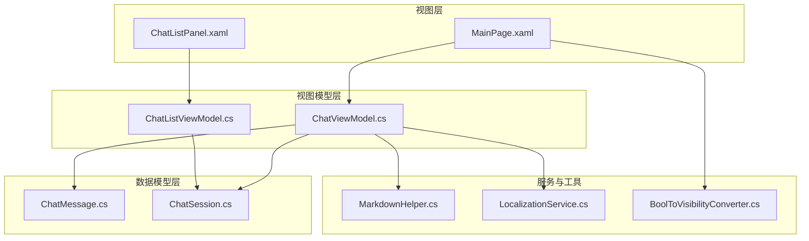
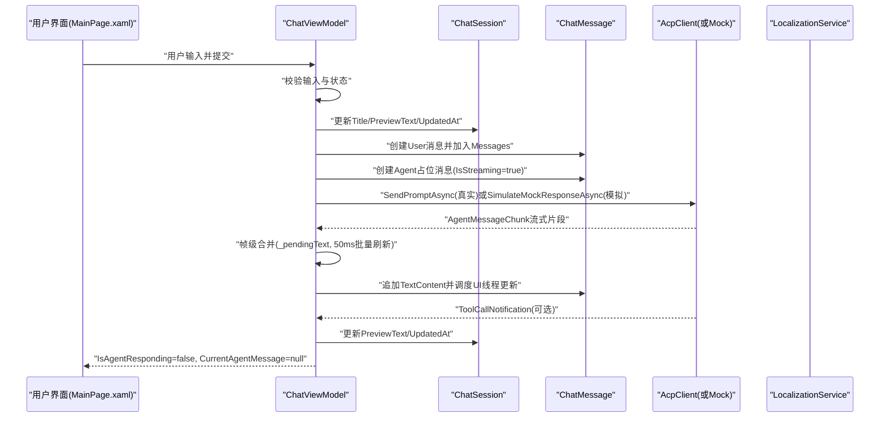
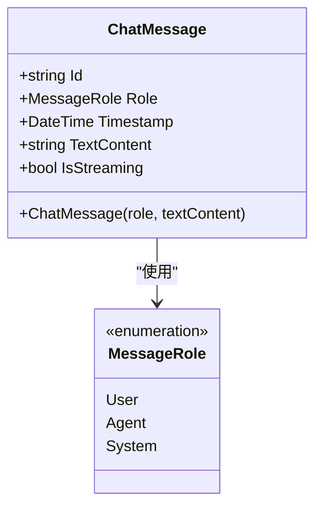
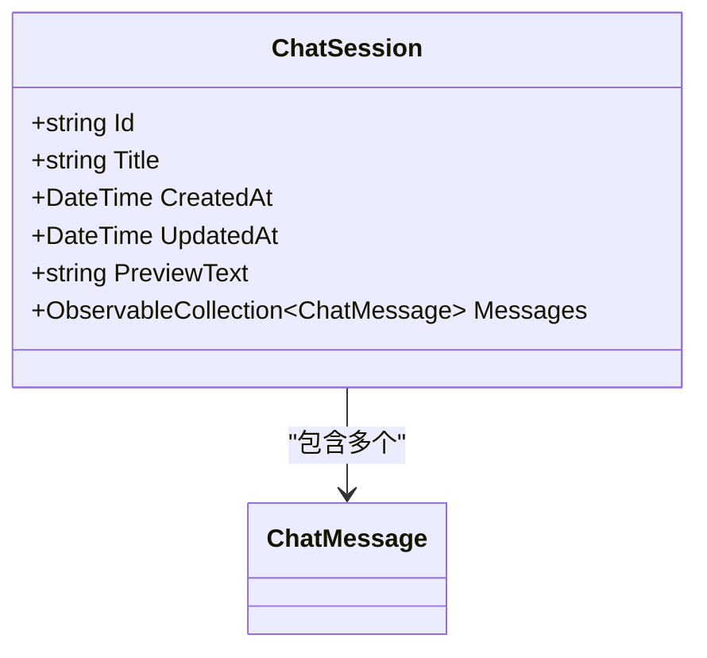
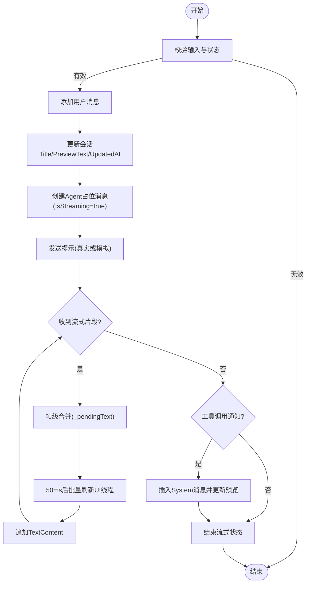
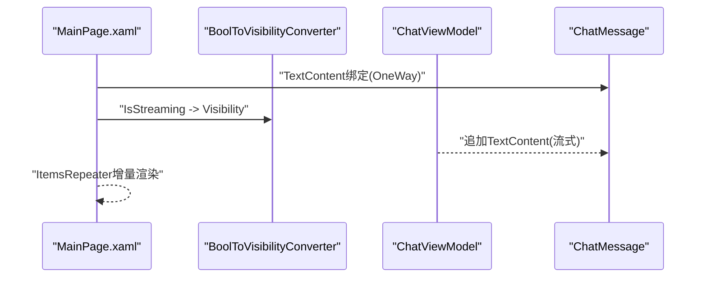
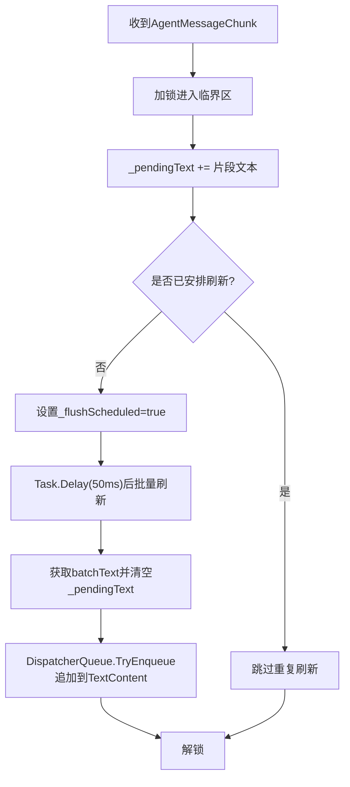
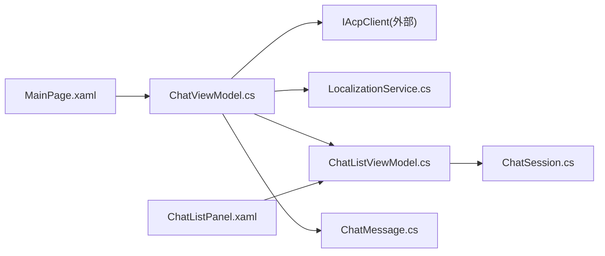

# 消息处理机制

<cite>
**本文引用的文件**   
- [ChatMessage.cs](file://Agentic.Desktop/ViewModels/Messages/ChatMessage.cs)
- [ChatSession.cs](file://Agentic.Desktop/ViewModels/Messages/ChatSession.cs)
- [ChatViewModel.cs](file://Agentic.Desktop/ViewModels/ChatViewModel.cs)
- [ChatListViewModel.cs](file://Agentic.Desktop/ViewModels/ChatListViewModel.cs)
- [MarkdownHelper.cs](file://Agentic.Desktop/Services/MarkdownHelper.cs)
- [LocalizationService.cs](file://Agentic.Desktop/Services/LocalizationService.cs)
- [BoolToVisibilityConverter.cs](file://Agentic.Desktop/Converters/BoolToVisibilityConverter.cs)
- [MainPage.xaml](file://Agentic.Desktop/Agentic.Desktop/MainPage.xaml)
- [ChatListPanel.xaml](file://Agentic.Desktop/Agentic.Desktop/Views/ChatListPanel.xaml)
</cite>

## 目录
1. [简介](#简介)
2. [项目结构](#项目结构)
3. [核心组件](#核心组件)
4. [架构总览](#架构总览)
5. [详细组件分析](#详细组件分析)
6. [依赖关系分析](#依赖关系分析)
7. [性能考量](#性能考量)
8. [故障排查指南](#故障排查指南)
9. [结论](#结论)
10. [附录：使用示例与最佳实践](#附录使用示例与最佳实践)

## 简介
本技术文档聚焦于应用的消息处理机制，围绕 ChatMessage 数据模型、ChatSession 会话结构、消息生命周期管理（从用户输入到 Agent 响应）、消息验证与格式化渲染、以及与 ObservableCollection 的集成和性能优化策略进行深入说明。文档同时提供可视化图表与代码级来源定位，帮助读者快速理解并扩展该子系统。

## 项目结构
消息处理相关代码主要分布在 ViewModels/Messages、ViewModels、Services、Converters 以及 XAML 视图文件中：
- 数据模型：ChatMessage、ChatSession
- 视图模型：ChatViewModel（消息发送、流式更新、会话联动）、ChatListViewModel（会话列表）
- 服务：MarkdownHelper（Markdown 转 HTML/纯文本）、LocalizationService（本地化字符串）
- 转换器：BoolToVisibilityConverter（布尔到可见性）
- 视图：MainPage.xaml（聊天主界面与消息模板）、ChatListPanel.xaml（会话侧边栏）

**图示来源** 
- [MainPage.xaml:1-163](file://Agentic.Desktop/Agentic.Desktop/MainPage.xaml#L1-L163)
- [ChatListPanel.xaml:1-88](file://Agentic.Desktop/Agentic.Desktop/Views/ChatListPanel.xaml#L1-L88)
- [ChatViewModel.cs:1-237](file://Agentic.Desktop/Agentic.Desktop/ViewModels/ChatViewModel.cs#L1-L237)
- [ChatListViewModel.cs:1-64](file://Agentic.Desktop/Agentic.Desktop/ViewModels/ChatListViewModel.cs#L1-L64)
- [ChatMessage.cs:1-39](file://Agentic.Desktop/Agentic.Desktop/ViewModels/Messages/ChatMessage.cs#L1-L39)
- [ChatSession.cs:1-28](file://Agentic.Desktop/Agentic.Desktop/ViewModels/Messages/ChatSession.cs#L1-L28)
- [MarkdownHelper.cs:1-52](file://Agentic.Desktop/Agentic.Desktop/Services/MarkdownHelper.cs#L1-L52)
- [LocalizationService.cs:1-23](file://Agentic.Desktop/Agentic.Desktop/Services/LocalizationService.cs#L1-L23)
- [BoolToVisibilityConverter.cs:1-28](file://Agentic.Desktop/Agentic.Desktop/Converters/BoolToVisibilityConverter.cs#L1-L28)

**章节来源**
- [ChatMessage.cs:1-39](file://Agentic.Desktop/Agentic.Desktop/ViewModels/Messages/ChatMessage.cs#L1-L39)
- [ChatSession.cs:1-28](file://Agentic.Desktop/Agentic.Desktop/ViewModels/Messages/ChatSession.cs#L1-L28)
- [ChatViewModel.cs:1-237](file://Agentic.Desktop/Agentic.Desktop/ViewModels/ChatViewModel.cs#L1-L237)
- [ChatListViewModel.cs:1-64](file://Agentic.Desktop/Agentic.Desktop/ViewModels/ChatListViewModel.cs#L1-L64)
- [MarkdownHelper.cs:1-52](file://Agentic.Desktop/Agentic.Desktop/Services/MarkdownHelper.cs#L1-L52)
- [LocalizationService.cs:1-23](file://Agentic.Desktop/Agentic.Desktop/Services/LocalizationService.cs#L1-L23)
- [BoolToVisibilityConverter.cs:1-28](file://Agentic.Desktop/Agentic.Desktop/Converters/BoolToVisibilityConverter.cs#L1-L28)
- [MainPage.xaml:1-163](file://Agentic.Desktop/Agentic.Desktop/MainPage.xaml#L1-L163)
- [ChatListPanel.xaml:1-88](file://Agentic.Desktop/Agentic.Desktop/Views/ChatListPanel.xaml#L1-L88)

## 核心组件
- ChatMessage：单条消息的数据载体，包含角色、时间戳、可观察的文本内容与流式状态。
- MessageRole：消息角色枚举，区分 User、Agent、System。
- ChatSession：会话容器，维护标题、创建/更新时间、预览文本及消息集合。
- ChatViewModel：协调用户输入、消息添加、流式响应、会话元数据更新、取消生成等。
- ChatListViewModel：会话列表管理，新增、删除、选择会话并触发 UI 同步。
- MarkdownHelper：Markdown 转换工具，支持 HTML 与纯文本输出。
- LocalizationService：本地化资源读取与格式化。
- BoolToVisibilityConverter：XAML 值转换器，用于显示/隐藏 UI 元素。

**章节来源**
- [ChatMessage.cs:1-39](file://Agentic.Desktop/Agentic.Desktop/ViewModels/Messages/ChatMessage.cs#L1-L39)
- [ChatSession.cs:1-28](file://Agentic.Desktop/Agentic.Desktop/ViewModels/Messages/ChatSession.cs#L1-L28)
- [ChatViewModel.cs:1-237](file://Agentic.Desktop/Agentic.Desktop/ViewModels/ChatViewModel.cs#L1-L237)
- [ChatListViewModel.cs:1-64](file://Agentic.Desktop/Agentic.Desktop/ViewModels/ChatListViewModel.cs#L1-L64)
- [MarkdownHelper.cs:1-52](file://Agentic.Desktop/Agentic.Desktop/Services/MarkdownHelper.cs#L1-L52)
- [LocalizationService.cs:1-23](file://Agentic.Desktop/Agentic.Desktop/Services/LocalizationService.cs#L1-L23)
- [BoolToVisibilityConverter.cs:1-28](file://Agentic.Desktop/Agentic.Desktop/Converters/BoolToVisibilityConverter.cs#L1-L28)

## 架构总览
消息处理采用 MVVM 模式，UI 通过 XAML 绑定到 ViewModel，ViewModel 负责业务逻辑与数据变更通知，底层通过 AcpClient（或 Mock）与 Agent 通信。消息以 ObservableCollection 驱动 UI 增量更新，流式响应通过帧级合并减少 UI 重绘开销。

**图示来源** 
- [MainPage.xaml:108-113](file://Agentic.Desktop/Agentic.Desktop/MainPage.xaml#L108-L113)
- [ChatViewModel.cs:96-151](file://Agentic.Desktop/Agentic.Desktop/ViewModels/ChatViewModel.cs#L96-L151)
- [ChatViewModel.cs:153-206](file://Agentic.Desktop/Agentic.Desktop/ViewModels/ChatViewModel.cs#L153-L206)
- [ChatSession.cs:1-28](file://Agentic.Desktop/Agentic.Desktop/ViewModels/Messages/ChatSession.cs#L1-L28)
- [ChatMessage.cs:1-39](file://Agentic.Desktop/Agentic.Desktop/ViewModels/Messages/ChatMessage.cs#L1-L39)
- [LocalizationService.cs:1-23](file://Agentic.Desktop/Agentic.Desktop/Services/LocalizationService.cs#L1-L23)

## 详细组件分析

### ChatMessage 数据模型设计
- Id：唯一标识，构造时生成 GUID。
- Role：消息角色，来自 MessageRole 枚举（User、Agent、System）。
- Timestamp：消息创建时间。
- TextContent：可观察的文本内容，支持流式追加；当前由 TextBlock 直接显示原始文本，未来可通过 MarkdownHelper 转换为 HTML 在 WebView2 中渲染。
- IsStreaming：可观察的流式状态，控制“正在输入”指示器的显示。

**图示来源** 
- [ChatMessage.cs:1-39](file://Agentic.Desktop/Agentic.Desktop/ViewModels/Messages/ChatMessage.cs#L1-L39)

**章节来源**
- [ChatMessage.cs:1-39](file://Agentic.Desktop/Agentic.Desktop/ViewModels/Messages/ChatMessage.cs#L1-L39)

### ChatSession 会话结构
- Id：会话唯一标识。
- Title：会话标题，首次消息时可自动设置为输入内容的截断。
- CreatedAt/UpdatedAt：创建与更新时间，用于排序与展示。
- PreviewText：会话预览文本，反映最近一次交互摘要。
- Messages：ObservableCollection<ChatMessage>，承载会话消息历史。

**图示来源** 
- [ChatSession.cs:1-28](file://Agentic.Desktop/Agentic.Desktop/ViewModels/Messages/ChatSession.cs#L1-L28)

**章节来源**
- [ChatSession.cs:1-28](file://Agentic.Desktop/Agentic.Desktop/ViewModels/Messages/ChatSession.cs#L1-L28)

### 消息生命周期管理（用户输入到 Agent 响应）
- 输入校验：空输入或正在响应时阻止重复发送。
- 用户消息创建：添加到当前会话的 Messages 集合。
- 会话元数据更新：根据首条消息设置 Title，更新 PreviewText 与 UpdatedAt。
- Agent 占位消息：创建 IsStreaming=true 的 Agent 消息，作为流式更新的载体。
- 流式响应：接收 AgentMessageChunk，进行帧级合并（50ms 批量），在 UI 线程追加 TextContent。
- 工具调用通知：插入 System 消息并更新会话预览。
- 结束清理：关闭流式状态，清空当前 Agent 消息引用，重置响应标志。

**图示来源** 
- [ChatViewModel.cs:96-151](file://Agentic.Desktop/Agentic.Desktop/ViewModels/ChatViewModel.cs#L96-L151)
- [ChatViewModel.cs:153-206](file://Agentic.Desktop/Agentic.Desktop/ViewModels/ChatViewModel.cs#L153-L206)

**章节来源**
- [ChatViewModel.cs:96-151](file://Agentic.Desktop/Agentic.Desktop/ViewModels/ChatViewModel.cs#L96-L151)
- [ChatViewModel.cs:153-206](file://Agentic.Desktop/Agentic.Desktop/ViewModels/ChatViewModel.cs#L153-L206)

### 消息验证、格式化与渲染
- 验证：输入为空或 Agent 正在响应时拒绝发送。
- 格式化：
  - MarkdownHelper.ToHtml：将 Markdown 转为 HTML，供未来 WebView2 渲染。
  - MarkdownHelper.ToPlainText：去除格式标记，临时用于纯文本显示。
  - LocalizationService.Format：对错误前缀、工具调用提示等进行本地化格式化。
- 渲染：
  - MainPage.xaml 定义用户与 Agent 消息模板，绑定 TextContent 与 IsStreaming。
  - BoolToVisibilityConverter 控制“正在输入”指示器可见性。
  - ItemsRepeater 绑定 ViewModel.Messages，实现高效滚动列表。

**图示来源** 
- [MainPage.xaml:18-54](file://Agentic.Desktop/Agentic.Desktop/MainPage.xaml#L18-L54)
- [BoolToVisibilityConverter.cs:1-28](file://Agentic.Desktop/Agentic.Desktop/Converters/BoolToVisibilityConverter.cs#L1-L28)
- [ChatViewModel.cs:153-206](file://Agentic.Desktop/Agentic.Desktop/ViewModels/ChatViewModel.cs#L153-L206)

**章节来源**
- [MarkdownHelper.cs:1-52](file://Agentic.Desktop/Agentic.Desktop/Services/MarkdownHelper.cs#L1-L52)
- [LocalizationService.cs:1-23](file://Agentic.Desktop/Agentic.Desktop/Services/LocalizationService.cs#L1-L23)
- [MainPage.xaml:18-54](file://Agentic.Desktop/Agentic.Desktop/MainPage.xaml#L18-L54)
- [BoolToVisibilityConverter.cs:1-28](file://Agentic.Desktop/Agentic.Desktop/Converters/BoolToVisibilityConverter.cs#L1-L28)

### 与 ObservableCollection 的集成与性能优化
- 会话切换订阅：OnSessionChanged 中解绑旧集合事件，订阅新集合，并在变化时触发 ScrollToBottom。
- 流式合并：使用 _lock 保护 _pendingText，避免并发写入；_flushScheduled 确保仅安排一次批量刷新任务。
- UI 线程调度：DispatcherQueue.TryEnqueue 确保文本追加在 UI 线程执行，避免跨线程异常。
- 空集合保护：未连接时使用静态 _emptyMessages 避免空引用。

**图示来源** 
- [ChatViewModel.cs:153-206](file://Agentic.Desktop/Agentic.Desktop/ViewModels/ChatViewModel.cs#L153-L206)

**章节来源**
- [ChatViewModel.cs:49-74](file://Agentic.Desktop/Agentic.Desktop/ViewModels/ChatViewModel.cs#L49-L74)
- [ChatViewModel.cs:153-206](file://Agentic.Desktop/Agentic.Desktop/ViewModels/ChatViewModel.cs#L153-L206)

## 依赖关系分析
- ChatViewModel 依赖：
  - IAcpClient（外部库）用于与 Agent 通信。
  - LocalizationService 用于本地化字符串。
  - DispatcherQueue 用于 UI 线程调度。
  - ChatListViewModel 用于会话管理与事件通知。
- ChatListViewModel 依赖：
  - ObservableCollection<ChatSession> 驱动侧边栏列表。
- 视图依赖：
  - MainPage.xaml 绑定 ChatViewModel 与消息模板。
  - ChatListPanel.xaml 绑定 ChatListViewModel 与会话项模板。

**图示来源** 
- [ChatViewModel.cs:1-237](file://Agentic.Desktop/Agentic.Desktop/ViewModels/ChatViewModel.cs#L1-L237)
- [ChatListViewModel.cs:1-64](file://Agentic.Desktop/Agentic.Desktop/ViewModels/ChatListViewModel.cs#L1-L64)
- [ChatSession.cs:1-28](file://Agentic.Desktop/Agentic.Desktop/ViewModels/Messages/ChatSession.cs#L1-L28)
- [ChatMessage.cs:1-39](file://Agentic.Desktop/Agentic.Desktop/ViewModels/Messages/ChatMessage.cs#L1-L39)
- [MainPage.xaml:1-163](file://Agentic.Desktop/Agentic.Desktop/MainPage.xaml#L1-L163)
- [ChatListPanel.xaml:1-88](file://Agentic.Desktop/Agentic.Desktop/Views/ChatListPanel.xaml#L1-L88)

**章节来源**
- [ChatViewModel.cs:1-237](file://Agentic.Desktop/Agentic.Desktop/ViewModels/ChatViewModel.cs#L1-L237)
- [ChatListViewModel.cs:1-64](file://Agentic.Desktop/Agentic.Desktop/ViewModels/ChatListViewModel.cs#L1-L64)
- [ChatSession.cs:1-28](file://Agentic.Desktop/Agentic.Desktop/ViewModels/Messages/ChatSession.cs#L1-L28)
- [ChatMessage.cs:1-39](file://Agentic.Desktop/Agentic.Desktop/ViewModels/Messages/ChatMessage.cs#L1-L39)
- [MainPage.xaml:1-163](file://Agentic.Desktop/Agentic.Desktop/MainPage.xaml#L1-L163)
- [ChatListPanel.xaml:1-88](file://Agentic.Desktop/Agentic.Desktop/Views/ChatListPanel.xaml#L1-L88)

## 性能考量
- 流式合并：通过 50ms 窗口聚合片段，显著降低 UI 重绘次数。
- 线程安全：使用 lock 保护共享缓冲，避免竞态条件。
- UI 线程调度：DispatcherQueue.TryEnqueue 确保 UI 操作在主线程执行。
- 集合事件订阅：会话切换时正确解绑/订阅，防止内存泄漏与重复事件。
- 空集合保护：未连接时使用静态空集合，避免空引用异常。
- 渲染优化：ItemsRepeater 配合 DataTemplate 提升长列表滚动性能。

[本节为通用指导，不直接分析具体文件]

## 故障排查指南
- 输入被忽略：检查 InputText 是否为空或 IsAgentResponding 是否为 true。
- 流式无更新：确认 OnSessionUpdated 分支是否正确处理 AgentMessageChunk，且 _flushScheduled 未被重复设置。
- UI 线程异常：确保文本追加通过 DispatcherQueue.TryEnqueue 执行。
- 会话切换闪烁：检查 OnSessionChanged 是否正确解绑旧集合事件并订阅新集合。
- 本地化缺失：确认 LocalizationService.Get/Format 的资源键存在。

**章节来源**
- [ChatViewModel.cs:96-151](file://Agentic.Desktop/Agentic.Desktop/ViewModels/ChatViewModel.cs#L96-L151)
- [ChatViewModel.cs:153-206](file://Agentic.Desktop/Agentic.Desktop/ViewModels/ChatViewModel.cs#L153-L206)
- [LocalizationService.cs:1-23](file://Agentic.Desktop/Agentic.Desktop/Services/LocalizationService.cs#L1-L23)

## 结论
该消息处理机制以清晰的 MVVM 分层与可观察数据结构为基础，结合帧级合并与 UI 线程调度，实现了流畅的流式对话体验。ChatMessage 与 ChatSession 的职责分离明确，便于扩展与维护。通过 MarkdownHelper 与 LocalizationService，系统具备良好的国际化与未来富文本渲染能力。整体设计在保证性能的同时，提供了良好的可扩展性与可测试性。

[本节为总结性内容，不直接分析具体文件]

## 附录：使用示例与最佳实践
- 创建消息对象：
  - 用户消息：使用 ChatMessage(MessageRole.User, text)。
  - Agent 消息：使用 ChatMessage(MessageRole.Agent) 并将 IsStreaming 设为 true。
  - 系统消息：使用 ChatMessage(MessageRole.System, localizedText)。
- 更新消息对象：
  - 流式追加：CurrentAgentMessage.TextContent += chunk.Text。
  - 错误信息：agentMsg.TextContent += LocalizationService.Format("ErrorPrefix", ex.Message)。
- 删除消息对象：
  - 清空当前会话：Messages.Clear()。
  - 删除会话：ChatListViewModel.DeleteChat(session) 会移除会话并自动选择相邻会话或新建会话。
- 与 ObservableCollection 集成：
  - 会话切换时订阅 Messages.CollectionChanged，触发滚动到底部。
  - 避免频繁 UI 更新，使用帧级合并与批量刷新。
- 最佳实践：
  - 始终在 UI 线程更新 TextContent。
  - 使用 IsStreaming 控制“正在输入”指示器。
  - 使用 MarkdownHelper.ToPlainText 或 ToHtml 进行文本预处理。
  - 使用 LocalizationService 统一文案与格式化。

**章节来源**
- [ChatViewModel.cs:96-151](file://Agentic.Desktop/Agentic.Desktop/ViewModels/ChatViewModel.cs#L96-L151)
- [ChatViewModel.cs:153-206](file://Agentic.Desktop/Agentic.Desktop/ViewModels/ChatViewModel.cs#L153-L206)
- [ChatListViewModel.cs:30-54](file://Agentic.Desktop/Agentic.Desktop/ViewModels/ChatListViewModel.cs#L30-L54)
- [MarkdownHelper.cs:1-52](file://Agentic.Desktop/Agentic.Desktop/Services/MarkdownHelper.cs#L1-L52)
- [LocalizationService.cs:1-23](file://Agentic.Desktop/Agentic.Desktop/Services/LocalizationService.cs#L1-L23)