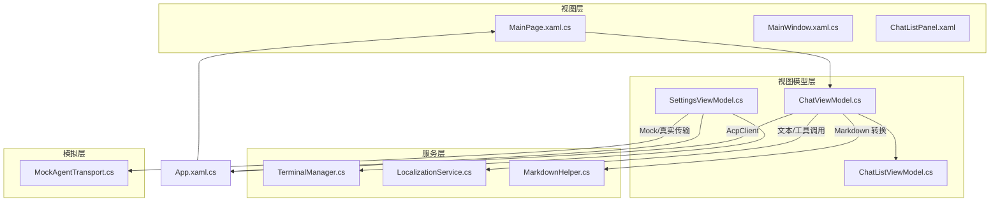
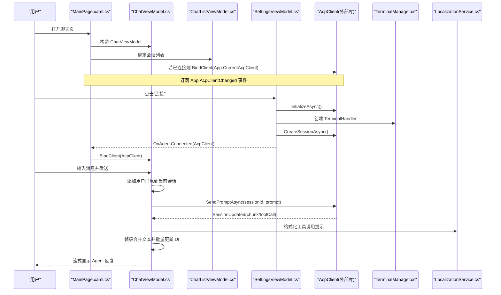
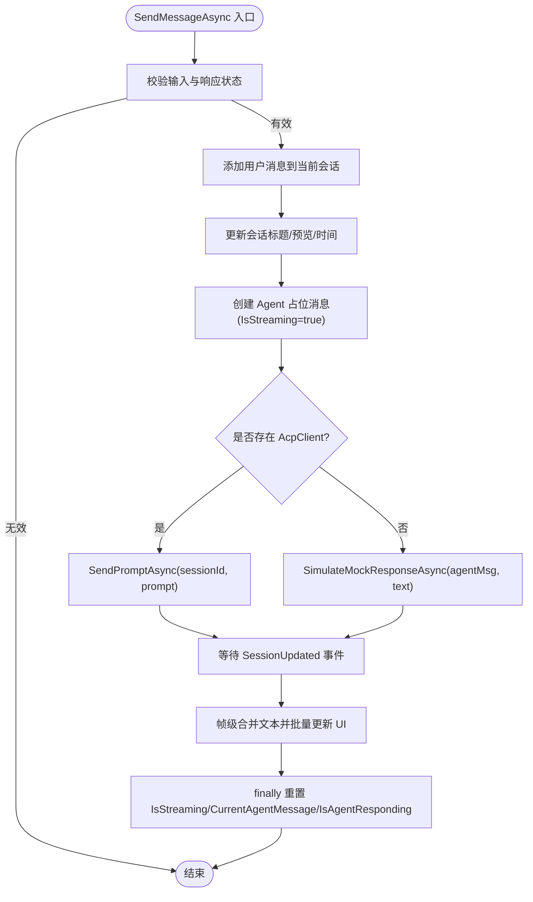
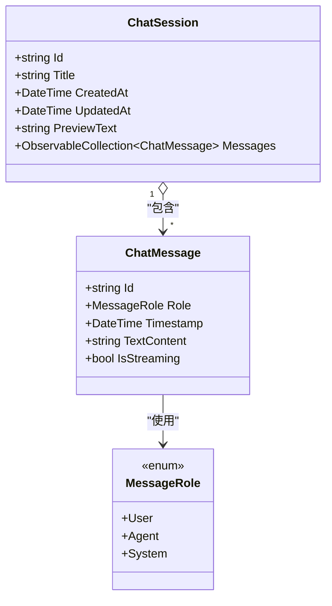
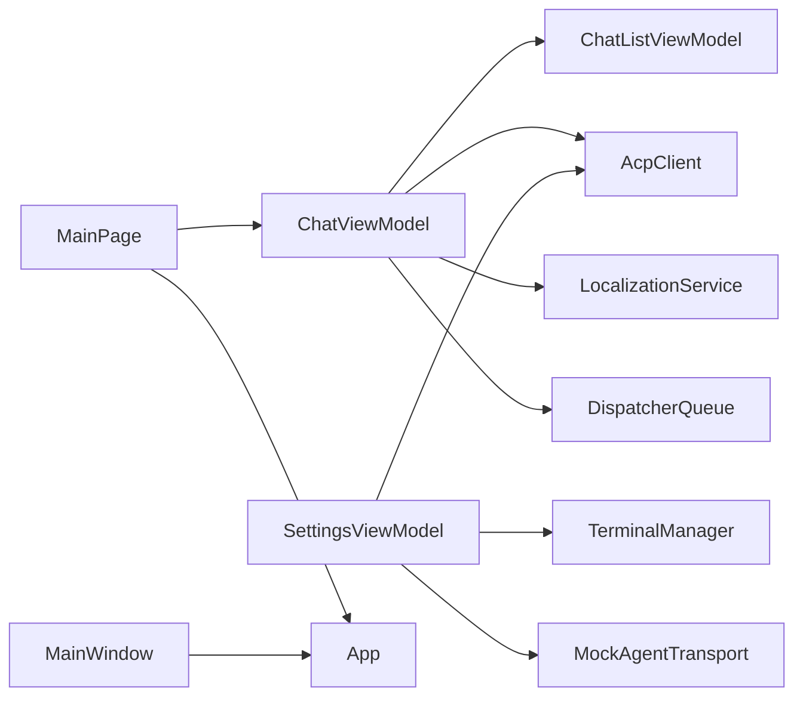

# 聊天系统

<cite>
**本文引用的文件**   
- [ChatViewModel.cs](file://Agentic.Desktop/ViewModels/ChatViewModel.cs)
- [ChatMessage.cs](file://Agentic.Desktop/ViewModels/Messages/ChatMessage.cs)
- [ChatSession.cs](file://Agentic.Desktop/ViewModels/Messages/ChatSession.cs)
- [ChatListViewModel.cs](file://Agentic.Desktop/ViewModels/ChatListViewModel.cs)
- [SettingsViewModel.cs](file://Agentic.Desktop/ViewModels/SettingsViewModel.cs)
- [MainPage.xaml.cs](file://Agentic.Desktop/MainPage.xaml.cs)
- [MainWindow.xaml.cs](file://Agentic.Desktop/MainWindow.xaml.cs)
- [App.xaml.cs](file://Agentic.Desktop/App.xaml.cs)
- [TerminalManager.cs](file://Agentic.Desktop/Services/TerminalManager.cs)
- [LocalizationService.cs](file://Agentic.Desktop/Services/LocalizationService.cs)
- [MarkdownHelper.cs](file://Agentic.Desktop/Services/MarkdownHelper.cs)
- [MockAgentTransport.cs](file://Agentic.Desktop/Mocks/MockAgentTransport.cs)
</cite>

## 目录
1. [简介](#简介)
2. [项目结构](#项目结构)
3. [核心组件](#核心组件)
4. [架构总览](#架构总览)
5. [详细组件分析](#详细组件分析)
6. [依赖关系分析](#依赖关系分析)
7. [性能考量](#性能考量)
8. [故障排查指南](#故障排查指南)
9. [结论](#结论)
10. [附录](#附录)

## 简介
本文件为聊天系统的功能与实现文档，重点围绕 ChatViewModel 的消息处理机制、流式响应实现与会话管理逻辑展开。同时详细说明 ChatMessage 与 ChatSession 数据模型的设计与使用模式，给出消息发送、接收与渲染的完整流程说明，并解释与 AcpClient 的集成方式、事件处理和状态管理。最后提供性能优化策略（帧级合并与批量更新）以及常见问题解决方案和调试技巧。

## 项目结构
本项目采用 WinUI 3 + MVVM 架构：
- ViewModels 层负责业务逻辑与状态管理
- Views 层通过 XAML 绑定 ViewModel
- Services 层提供通用能力（本地化、Markdown 转换、终端管理等）
- Mocks 层提供模拟传输以支持 UI 开发测试

图表来源
- [MainPage.xaml.cs:1-51](file://Agentic.Desktop/MainPage.xaml.cs#L1-L51)
- [MainWindow.xaml.cs:1-97](file://Agentic.Desktop/MainWindow.xaml.cs#L1-L97)
- [ChatViewModel.cs:1-237](file://Agentic.Desktop/ViewModels/ChatViewModel.cs#L1-L237)
- [ChatListViewModel.cs:1-64](file://Agentic.Desktop/ViewModels/ChatListViewModel.cs#L1-L64)
- [SettingsViewModel.cs:43-161](file://Agentic.Desktop/ViewModels/SettingsViewModel.cs#L43-L161)
- [TerminalManager.cs:1-161](file://Agentic.Desktop/Services/TerminalManager.cs#L1-L161)
- [LocalizationService.cs:1-23](file://Agentic.Desktop/Services/LocalizationService.cs#L1-L23)
- [MarkdownHelper.cs:1-52](file://Agentic.Desktop/Services/MarkdownHelper.cs#L1-L52)
- [MockAgentTransport.cs:1-142](file://Agentic.Desktop/Mocks/MockAgentTransport.cs#L1-L142)

章节来源
- [MainPage.xaml.cs:1-51](file://Agentic.Desktop/MainPage.xaml.cs#L1-L51)
- [MainWindow.xaml.cs:1-97](file://Agentic.Desktop/MainWindow.xaml.cs#L1-L97)
- [App.xaml.cs:1-84](file://Agentic.Desktop/App.xaml.cs#L1-L84)

## 核心组件
- ChatViewModel：聊天主视图模型，负责消息发送、流式响应处理、会话切换、滚动行为以及与 AcpClient 的集成。
- ChatMessage：单条消息的数据模型，包含角色、时间戳、文本内容与流式标记。
- ChatSession：会话数据模型，包含标题、创建/更新时间、预览文本与消息集合。
- ChatListViewModel：会话列表管理，负责新建、删除、选择会话并通知变更。
- SettingsViewModel：连接管理，负责 AcpClient 初始化、会话创建、进程退出监听、全局状态同步。
- TerminalManager：终端进程管理，用于 Agent 执行命令时的输出捕获与生命周期控制。
- LocalizationService：多语言资源加载与格式化。
- MarkdownHelper：Markdown 转 HTML/纯文本的工具类。
- MockAgentTransport：模拟 ACP 传输，用于无真实 Agent 时的 UI 演示。

章节来源
- [ChatViewModel.cs:1-237](file://Agentic.Desktop/ViewModels/ChatViewModel.cs#L1-L237)
- [ChatMessage.cs:1-39](file://Agentic.Desktop/ViewModels/Messages/ChatMessage.cs#L1-L39)
- [ChatSession.cs:1-28](file://Agentic.Desktop/ViewModels/Messages/ChatSession.cs#L1-L28)
- [ChatListViewModel.cs:1-64](file://Agentic.Desktop/ViewModels/ChatListViewModel.cs#L1-L64)
- [SettingsViewModel.cs:43-161](file://Agentic.Desktop/ViewModels/SettingsViewModel.cs#L43-L161)
- [TerminalManager.cs:1-161](file://Agentic.Desktop/Services/TerminalManager.cs#L1-L161)
- [LocalizationService.cs:1-23](file://Agentic.Desktop/Services/LocalizationService.cs#L1-L23)
- [MarkdownHelper.cs:1-52](file://Agentic.Desktop/Services/MarkdownHelper.cs#L1-L52)
- [MockAgentTransport.cs:1-142](file://Agentic.Desktop/Mocks/MockAgentTransport.cs#L1-L142)

## 架构总览
聊天系统基于 MVVM 分层，结合 AcpClient 进行远程 Agent 通信。UI 通过 DataBinding 与 ViewModel 交互；设置页负责建立连接并将 AcpClient 注入到全局与应用页面；聊天页订阅连接变化并在需要时绑定客户端。

图表来源
- [MainPage.xaml.cs:1-51](file://Agentic.Desktop/MainPage.xaml.cs#L1-L51)
- [ChatViewModel.cs:1-237](file://Agentic.Desktop/ViewModels/ChatViewModel.cs#L1-L237)
- [ChatListViewModel.cs:1-64](file://Agentic.Desktop/ViewModels/ChatListViewModel.cs#L1-L64)
- [SettingsViewModel.cs:43-161](file://Agentic.Desktop/ViewModels/SettingsViewModel.cs#L43-L161)
- [TerminalManager.cs:1-161](file://Agentic.Desktop/Services/TerminalManager.cs#L1-L161)
- [LocalizationService.cs:1-23](file://Agentic.Desktop/Services/LocalizationService.cs#L1-L23)

## 详细组件分析

### ChatViewModel：消息处理、流式响应与会话管理
- 消息发送流程
  - 校验输入与是否正在响应
  - 清空输入框
  - 向当前会话追加用户消息
  - 根据首条消息自动设置会话标题与预览
  - 创建 Agent 占位消息并标记 IsStreaming=true
  - 若存在 AcpClient，则调用 SendPromptAsync；否则走本地 Mock 模拟
  - 异常捕获与 finally 中重置流式状态
- 流式响应处理
  - 订阅 AcpClient.SessionUpdated 事件
  - 对 AgentMessageChunk 进行帧级合并：累积文本，50ms 后批量刷新 UI，避免频繁 UI 更新
  - 对 ToolCallNotification 插入系统消息并更新会话预览
  - 所有 UI 更新通过 DispatcherQueue.TryEnqueue 确保线程安全
- 会话管理
  - 通过 ChatListViewModel.SelectedSession 获取当前会话
  - 订阅 Messages 集合变更事件，自动滚动到底部
  - 切换会话时取消正在进行的生成，防止数据错乱
- 取消与清理
  - CancelGenerationAsync 调用 AcpClient.CancelSessionAsync，并重置 UI 状态
  - ClearMessages 在断开连接时清空消息并重置连接状态

图表来源
- [ChatViewModel.cs:96-151](file://Agentic.Desktop/ViewModels/ChatViewModel.cs#L96-L151)
- [ChatViewModel.cs:153-206](file://Agentic.Desktop/ViewModels/ChatViewModel.cs#L153-L206)
- [ChatViewModel.cs:208-218](file://Agentic.Desktop/ViewModels/ChatViewModel.cs#L208-L218)
- [ChatViewModel.cs:220-235](file://Agentic.Desktop/ViewModels/ChatViewModel.cs#L220-L235)

章节来源
- [ChatViewModel.cs:1-237](file://Agentic.Desktop/ViewModels/ChatViewModel.cs#L1-L237)

### ChatMessage 与 ChatSession 数据模型
- ChatMessage
  - 属性：唯一 Id、角色 Role、时间戳 Timestamp、可观察的 TextContent 与 IsStreaming
  - 用途：表示单条对话消息，支持流式增量更新
- ChatSession
  - 属性：唯一 Id、Title、CreatedAt、UpdatedAt、PreviewText 与可观察的 Messages 集合
  - 用途：维护一次会话的历史消息与元信息，支持 UI 展示与自动更新

图表来源
- [ChatMessage.cs:1-39](file://Agentic.Desktop/ViewModels/Messages/ChatMessage.cs#L1-L39)
- [ChatSession.cs:1-28](file://Agentic.Desktop/ViewModels/Messages/ChatSession.cs#L1-L28)

章节来源
- [ChatMessage.cs:1-39](file://Agentic.Desktop/ViewModels/Messages/ChatMessage.cs#L1-L39)
- [ChatSession.cs:1-28](file://Agentic.Desktop/ViewModels/Messages/ChatSession.cs#L1-L28)

### ChatListViewModel：会话列表管理
- 维护 Sessions 集合与 SelectedSession
- 提供新建、删除、选择会话的命令
- 选择会话时触发 SessionChanged 事件，通知 ChatViewModel 切换订阅与滚动

章节来源
- [ChatListViewModel.cs:1-64](file://Agentic.Desktop/ViewModels/ChatListViewModel.cs#L1-L64)

### SettingsViewModel：连接管理与 AcpClient 集成
- 连接流程
  - 根据配置选择 MockAgentTransport 或 StdioAgentTransport
  - 初始化 AcpClient，订阅进程退出事件
  - 创建 TerminalManager 并设置为 TerminalHandler
  - 创建会话并保存 SessionId
  - 通过 OnAgentConnected 回调通知 MainPage 绑定 AcpClient
- 断开与清理
  - 释放 AcpClient 与 TerminalManager
  - 同步全局状态 App.SetAcpClient(null)

章节来源
- [SettingsViewModel.cs:43-161](file://Agentic.Desktop/ViewModels/SettingsViewModel.cs#L43-L161)

### MainPage 与 App：页面与全局状态
- MainPage
  - 构造 ChatViewModel 并绑定 ChatListPanel
  - 订阅 ScrollToBottom 事件
  - 若已有连接的 AcpClient，立即绑定；否则订阅 App.AcpClientChanged
- App
  - 提供 CurrentAcpClient 与 AcpClientChanged 事件
  - SetAcpClient 方法用于设置全局客户端并通知订阅者

章节来源
- [MainPage.xaml.cs:1-51](file://Agentic.Desktop/MainPage.xaml.cs#L1-L51)
- [App.xaml.cs:1-84](file://Agentic.Desktop/App.xaml.cs#L1-L84)

### TerminalManager：终端进程管理
- 管理多个终端进程实例，异步读取 stdout/stderr 并缓存输出
- 提供创建、查询输出、等待退出、终止与释放接口
- 适用于 Agent 执行命令时的输出捕获与生命周期控制

章节来源
- [TerminalManager.cs:1-161](file://Agentic.Desktop/Services/TerminalManager.cs#L1-L161)

### LocalizationService 与 MarkdownHelper：本地化与富文本
- LocalizationService：从 .resw 资源文件加载本地化字符串，支持格式化
- MarkdownHelper：将 Markdown 转换为 HTML（未来 WebView2 渲染）或纯文本（临时方案）

章节来源
- [LocalizationService.cs:1-23](file://Agentic.Desktop/Services/LocalizationService.cs#L1-L23)
- [MarkdownHelper.cs:1-52](file://Agentic.Desktop/Services/MarkdownHelper.cs#L1-L52)

### MockAgentTransport：模拟 ACP 传输
- 模拟 initialize、session/new、session/prompt、session/cancel 等 JSON-RPC 消息
- 按片段推送 session/update 通知，模拟流式响应
- 支持取消令牌，便于测试取消流程

章节来源
- [MockAgentTransport.cs:1-142](file://Agentic.Desktop/Mocks/MockAgentTransport.cs#L1-L142)

## 依赖关系分析
- ChatViewModel 依赖：
  - ChatListViewModel：获取当前会话与消息集合
  - AcpClient：发送提示与接收会话更新
  - LocalizationService：格式化工具调用提示
  - DispatcherQueue：UI 线程调度
- SettingsViewModel 依赖：
  - AcpClient：初始化、会话创建、关闭
  - TerminalManager：终端处理器
  - MockAgentTransport：模拟传输
- MainPage 依赖：
  - ChatViewModel、App：绑定与订阅连接变化
- MainWindow：应用窗口与导航控制

图表来源
- [ChatViewModel.cs:1-237](file://Agentic.Desktop/ViewModels/ChatViewModel.cs#L1-L237)
- [SettingsViewModel.cs:43-161](file://Agentic.Desktop/ViewModels/SettingsViewModel.cs#L43-L161)
- [MainPage.xaml.cs:1-51](file://Agentic.Desktop/MainPage.xaml.cs#L1-L51)
- [MainWindow.xaml.cs:1-97](file://Agentic.Desktop/MainWindow.xaml.cs#L1-L97)

章节来源
- [ChatViewModel.cs:1-237](file://Agentic.Desktop/ViewModels/ChatViewModel.cs#L1-L237)
- [SettingsViewModel.cs:43-161](file://Agentic.Desktop/ViewModels/SettingsViewModel.cs#L43-L161)
- [MainPage.xaml.cs:1-51](file://Agentic.Desktop/MainPage.xaml.cs#L1-L51)

## 性能考量
- 帧级合并与批量更新
  - 在 OnSessionUpdated 中对 AgentMessageChunk 的文本进行累积，延迟 50ms 后一次性追加到 UI，减少频繁更新导致的卡顿
  - 使用 lock 保护 _pendingText 与 _flushScheduled，避免并发写入冲突
- UI 线程调度
  - 所有 UI 更新通过 DispatcherQueue.TryEnqueue 确保在主线程执行，避免跨线程异常
- 集合变更订阅
  - 仅在切换会话时订阅 Messages 集合变更，避免重复订阅与内存泄漏
- 取消与清理
  - 切换会话时主动取消正在进行的生成，防止数据错乱与资源占用

[本节为通用性能建议，不直接分析具体文件]

## 故障排查指南
- 无法连接 Agent
  - 检查 SettingsViewModel.ConnectAsync 是否正确初始化 AcpClient 与 Transport
  - 确认 App.AcpClientChanged 事件是否被 MainPage 订阅
  - 查看日志与异常信息，定位初始化失败原因
- 流式响应不显示或卡顿
  - 检查 OnSessionUpdated 中的帧级合并逻辑是否正常触发
  - 确认 DispatcherQueue.TryEnqueue 是否成功调度到 UI 线程
  - 验证 CurrentAgentMessage 是否为空导致无法追加文本
- 会话切换后消息未滚动
  - 检查 OnSessionChanged 中是否正确订阅新会话的 Messages 集合
  - 确认 ScrollToBottom 事件是否被 MainPage 订阅并处理
- 权限请求对话框未弹出
  - 检查 DesktopPermissionHandler.PermissionRequested 事件是否被订阅
  - 确认 DispatcherQueue.TryEnqueue 是否成功调度到 UI 线程
- 终端输出为空或进程未释放
  - 检查 TerminalManager.CreateTerminalAsync 是否正确启动进程并异步读取输出
  - 确认 ReleaseTerminalAsync 或 Dispose 是否被调用

章节来源
- [SettingsViewModel.cs:43-161](file://Agentic.Desktop/ViewModels/SettingsViewModel.cs#L43-L161)
- [ChatViewModel.cs:153-206](file://Agentic.Desktop/ViewModels/ChatViewModel.cs#L153-L206)
- [TerminalManager.cs:1-161](file://Agentic.Desktop/Services/TerminalManager.cs#L1-L161)
- [MainPage.xaml.cs:1-51](file://Agentic.Desktop/MainPage.xaml.cs#L1-L51)

## 结论
本聊天系统通过清晰的 MVVM 架构与 AcpClient 集成，实现了稳定的消息发送、流式响应与会话管理。ChatViewModel 的帧级合并与批量更新策略有效提升了 UI 流畅度。配合 SettingsViewModel 的连接管理与 TerminalManager 的进程控制，整体具备较好的扩展性与可维护性。建议在后续迭代中引入 WebView2 渲染 Markdown，进一步提升用户体验。

[本节为总结性内容，不直接分析具体文件]

## 附录
- 实际代码示例路径（不包含代码内容）
  - 消息发送与流式响应：[ChatViewModel.cs:96-151](file://Agentic.Desktop/ViewModels/ChatViewModel.cs#L96-L151)、[ChatViewModel.cs:153-206](file://Agentic.Desktop/ViewModels/ChatViewModel.cs#L153-L206)
  - 会话管理：[ChatListViewModel.cs:1-64](file://Agentic.Desktop/ViewModels/ChatListViewModel.cs#L1-L64)
  - 连接管理：[SettingsViewModel.cs:43-161](file://Agentic.Desktop/ViewModels/SettingsViewModel.cs#L43-L161)
  - 页面与全局状态：[MainPage.xaml.cs:1-51](file://Agentic.Desktop/MainPage.xaml.cs#L1-L51)、[App.xaml.cs:1-84](file://Agentic.Desktop/App.xaml.cs#L1-L84)
  - 终端管理：[TerminalManager.cs:1-161](file://Agentic.Desktop/Services/TerminalManager.cs#L1-L161)
  - 本地化与 Markdown：[LocalizationService.cs:1-23](file://Agentic.Desktop/Services/LocalizationService.cs#L1-L23)、[MarkdownHelper.cs:1-52](file://Agentic.Desktop/Services/MarkdownHelper.cs#L1-L52)
  - 模拟传输：[MockAgentTransport.cs:1-142](file://Agentic.Desktop/Mocks/MockAgentTransport.cs#L1-L142)

[本节为附录，不直接分析具体文件]