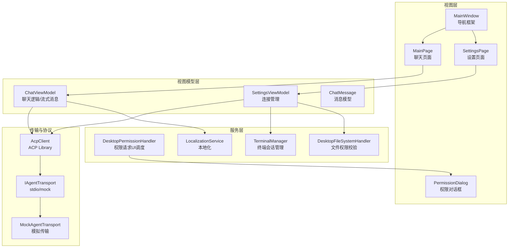
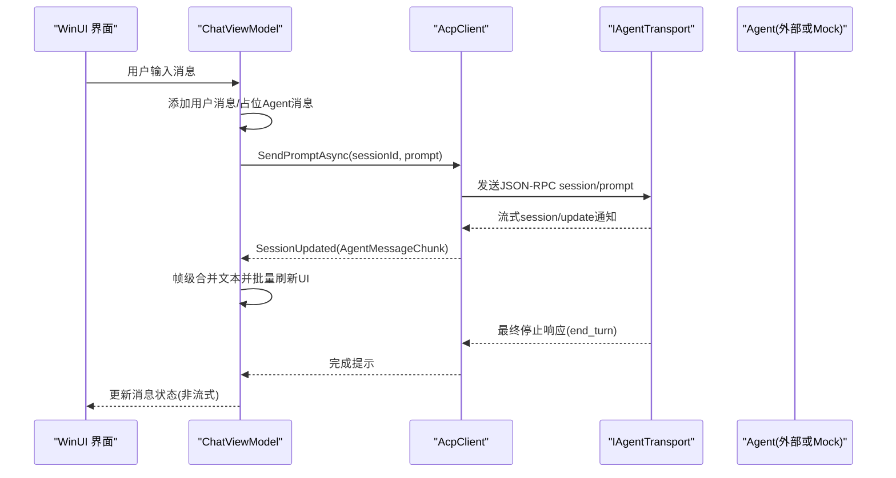
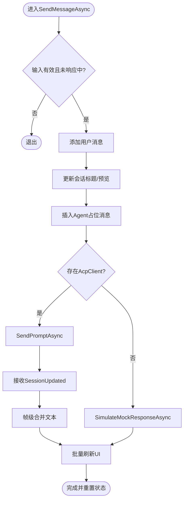
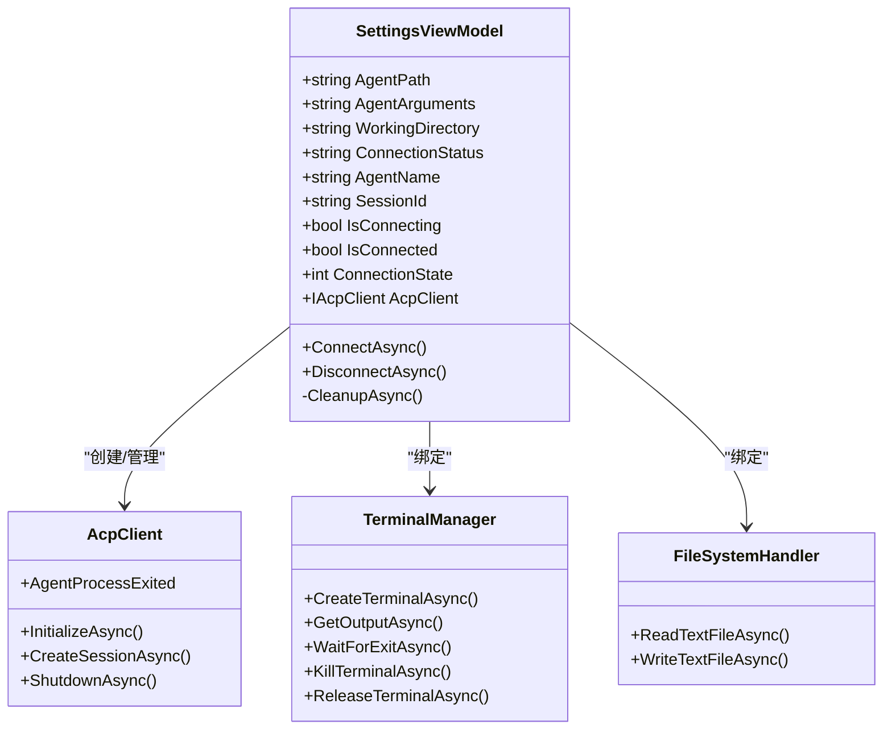
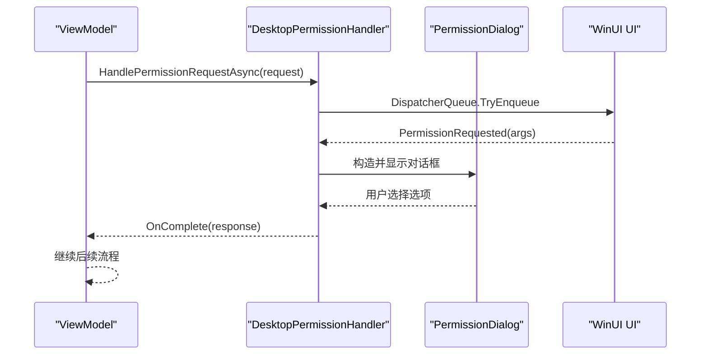
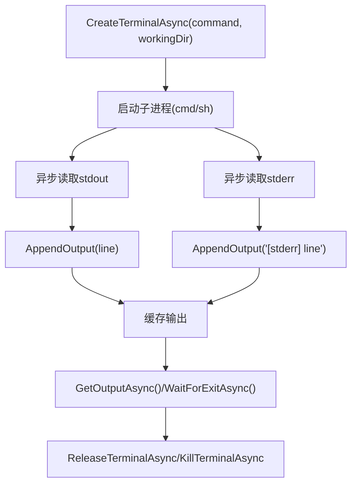
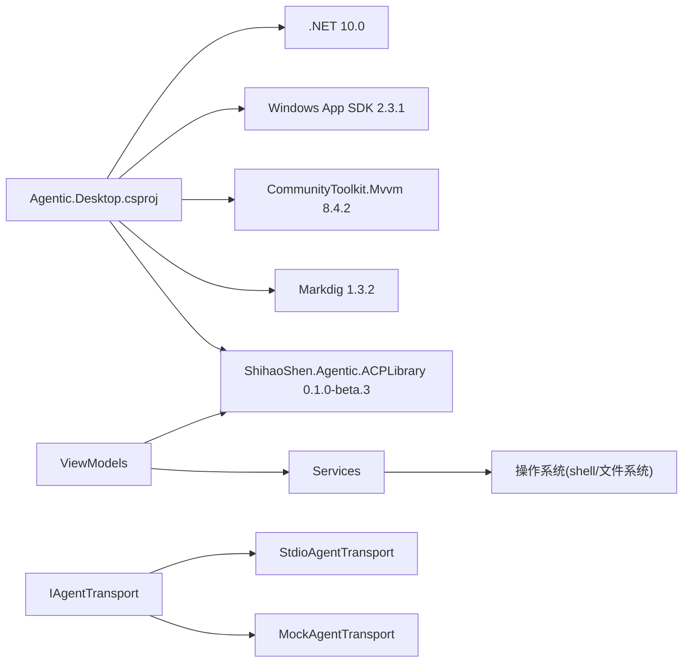

# 项目概述

<cite>
**本文引用的文件**   
- [README.md](file://README.md)
- [Agentic.Desktop.csproj](file://Agentic.Desktop/Agentic.Desktop.csproj)
- [App.xaml.cs](file://Agentic.Desktop/App.xaml.cs)
- [MainWindow.xaml.cs](file://Agentic.Desktop/MainWindow.xaml.cs)
- [MainPage.xaml.cs](file://Agentic.Desktop/MainPage.xaml.cs)
- [ChatViewModel.cs](file://Agentic.Desktop/ViewModels/ChatViewModel.cs)
- [SettingsViewModel.cs](file://Agentic.Desktop/ViewModels/SettingsViewModel.cs)
- [PermissionHandler.cs](file://Agentic.Desktop/Services/PermissionHandler.cs)
- [TerminalManager.cs](file://Agentic.Desktop/Services/TerminalManager.cs)
- [FileSystemHandler.cs](file://Agentic.Desktop/Services/FileSystemHandler.cs)
- [LocalizationService.cs](file://Agentic.Desktop/Services/LocalizationService.cs)
- [MockAgentTransport.cs](file://Agentic.Desktop/Mocks/MockAgentTransport.cs)
- [ChatMessage.cs](file://Agentic.Desktop/ViewModels/Messages/ChatMessage.cs)
</cite>

## 目录
1. [简介](#简介)
2. [项目结构](#项目结构)
3. [核心组件](#核心组件)
4. [架构总览](#架构总览)
5. [详细组件分析](#详细组件分析)
6. [依赖关系分析](#依赖关系分析)
7. [性能考量](#性能考量)
8. [故障排查指南](#故障排查指南)
9. [结论](#结论)
10. [附录](#附录)

## 简介
Agentic.Desktop 是一个基于 WinUI 3 的 ACP（Agent Communication Protocol）桌面客户端，提供与 AI Agent 进行实时流式对话的聊天界面。其核心价值在于：
- 统一的 ACP 交互体验：通过标准协议与任意 ACP 兼容的 Agent 通信，支持流式输出、工具调用与权限确认。
- 开箱即用的本地能力：内置 Mock Agent，无需真实 Agent 即可体验完整 UI 流程；同时支持 stdio 传输层连接外部可执行 Agent。
- 安全可控的扩展点：文件系统访问限制在工作目录内，终端命令执行由用户授权后运行，权限请求以交互式对话框呈现。
- 现代 Fluent 设计：Mica 背景、亚克力材质、自适应主题，提升用户体验。

技术栈包括 .NET 10.0、Windows App SDK 2.3.1、CommunityToolkit.Mvvm、Markdig、以及 ShihaoShen.Agentic.ACPLibrary 等。系统要求为 Windows 10 1809 及以上，并需安装 .NET SDK 10.0 与 WinApp CLI，开启开发者模式。

快速开始步骤见 README 中的“快速开始”和“使用说明”，包括克隆仓库、构建、运行与配置 Agent。

**章节来源**
- [README.md:1-92](file://README.md#L1-L92)

## 项目结构
应用采用 MVVM 架构，按职责划分模块：
- ViewModels：业务逻辑与状态管理（聊天、设置、消息模型）。
- Views：XAML 页面与对话框（主窗口、聊天页、设置页、权限对话框）。
- Services：基础服务（权限处理、终端管理、文件系统、Markdown 渲染、本地化）。
- Mocks：MockAgentTransport 用于无真实 Agent 时的 UI 开发测试。
- Converters：XAML 值转换器。
- Assets/Strings：资源与多语言字符串。

**图表来源**
- [MainWindow.xaml.cs:1-97](file://Agentic.Desktop/MainWindow.xaml.cs#L1-L97)
- [MainPage.xaml.cs:1-105](file://Agentic.Desktop/MainPage.xaml.cs#L1-L105)
- [ChatViewModel.cs:1-237](file://Agentic.Desktop/ViewModels/ChatViewModel.cs#L1-L237)
- [SettingsViewModel.cs:1-162](file://Agentic.Desktop/ViewModels/SettingsViewModel.cs#L1-L162)
- [PermissionHandler.cs:1-52](file://Agentic.Desktop/Services/PermissionHandler.cs#L1-L52)
- [TerminalManager.cs:1-161](file://Agentic.Desktop/Services/TerminalManager.cs#L1-L161)
- [FileSystemHandler.cs:1-42](file://Agentic.Desktop/Services/FileSystemHandler.cs#L1-L42)
- [LocalizationService.cs:1-23](file://Agentic.Desktop/Services/LocalizationService.cs#L1-L23)
- [MockAgentTransport.cs:1-142](file://Agentic.Desktop/Mocks/MockAgentTransport.cs#L1-L142)

**章节来源**
- [README.md:51-88](file://README.md#L51-L88)

## 核心组件
- 应用生命周期与全局状态
  - App 类维护窗口句柄、DispatcherQueue、当前 AcpClient 实例及连接变更事件，集中初始化日志工厂与窗口激活。
- 主窗口与导航
  - MainWindow 使用 NavigationView 在聊天页与设置页之间切换，更新连接状态指示器，并提供返回与侧边栏切换。
- 聊天视图模型
  - ChatViewModel 负责发送消息、订阅 AcpClient 的 SessionUpdated 事件、帧级合并流式文本、取消生成、以及 Mock 响应模拟。
- 设置视图模型
  - SettingsViewModel 管理 Agent 连接（stdio/mock）、创建会话、绑定 TerminalManager 与 FileSystemHandler、处理进程退出与断开回调。
- 权限处理
  - DesktopPermissionHandler 将权限请求调度到 UI 线程，触发 PermissionRequested 事件，由 PermissionDialog 展示选项并返回结果。
- 终端管理
  - TerminalManager 实现 ITerminalHandler，启动子进程（cmd/sh），异步读取 stdout/stderr，支持查询输出、等待退出、终止与释放。
- 文件系统处理
  - DesktopFileSystemHandler 对路径进行工作目录白名单校验，确保读写操作仅发生在允许范围内。
- 本地化
  - LocalizationService 封装 .resw 资源加载与格式化，供 UI 与服务层统一获取文案。
- 消息模型
  - ChatMessage 表示单条消息，包含角色、时间戳、文本内容与流式标记；MessageRole 枚举区分用户、Agent、系统消息。
- Mock 传输
  - MockAgentTransport 实现 IAgentTransport，模拟 initialize/session/prompt/cancel 等 JSON-RPC 消息，提供流式片段与最终结束响应。

**章节来源**
- [App.xaml.cs:1-85](file://Agentic.Desktop/App.xaml.cs#L1-L85)
- [MainWindow.xaml.cs:1-97](file://Agentic.Desktop/MainWindow.xaml.cs#L1-L97)
- [MainPage.xaml.cs:1-105](file://Agentic.Desktop/MainPage.xaml.cs#L1-L105)
- [ChatViewModel.cs:1-237](file://Agentic.Desktop/ViewModels/ChatViewModel.cs#L1-L237)
- [SettingsViewModel.cs:1-162](file://Agentic.Desktop/ViewModels/SettingsViewModel.cs#L1-L162)
- [PermissionHandler.cs:1-52](file://Agentic.Desktop/Services/PermissionHandler.cs#L1-L52)
- [TerminalManager.cs:1-161](file://Agentic.Desktop/Services/TerminalManager.cs#L1-L161)
- [FileSystemHandler.cs:1-42](file://Agentic.Desktop/Services/FileSystemHandler.cs#L1-L42)
- [LocalizationService.cs:1-23](file://Agentic.Desktop/Services/LocalizationService.cs#L1-L23)
- [ChatMessage.cs:1-39](file://Agentic.Desktop/ViewModels/Messages/ChatMessage.cs#L1-L39)
- [MockAgentTransport.cs:1-142](file://Agentic.Desktop/Mocks/MockAgentTransport.cs#L1-L142)

## 架构总览
应用遵循 MVVM 模式，通过 AcpClient 与 Agent 通信，传输层抽象为 IAgentTransport（支持 stdio 或 mock）。UI 层通过 XAML 与值转换器呈现，ViewModel 层使用 CommunityToolkit.Mvvm 进行数据绑定与命令处理。服务层提供权限、终端、文件系统等能力，并通过事件驱动与 UI 解耦。

**图表来源**
- [ChatViewModel.cs:96-151](file://Agentic.Desktop/ViewModels/ChatViewModel.cs#L96-L151)
- [ChatViewModel.cs:153-206](file://Agentic.Desktop/ViewModels/ChatViewModel.cs#L153-L206)
- [MockAgentTransport.cs:27-117](file://Agentic.Desktop/Mocks/MockAgentTransport.cs#L27-L117)

## 详细组件分析

### 聊天视图模型（ChatViewModel）
- 功能要点
  - 绑定 AcpClient，订阅 SessionUpdated，处理 AgentMessageChunk 与 ToolCallNotification。
  - 帧级合并策略：累积文本片段，延迟 50ms 批量刷新 UI，降低频繁更新开销。
  - 发送消息流程：添加用户消息、更新会话标题与预览、插入 Agent 占位消息、调用 AcpClient 或本地 Mock。
  - 取消生成：调用 CancelSessionAsync，清理流式状态。
- 复杂度与性能
  - 流式文本合并采用锁保护与延迟批处理，避免 UI 抖动；消息集合变更事件驱动滚动到底部。
- 错误处理
  - 捕获 OperationCanceledException 与通用异常，格式化错误信息并显示在消息中。

**图表来源**
- [ChatViewModel.cs:96-151](file://Agentic.Desktop/ViewModels/ChatViewModel.cs#L96-L151)
- [ChatViewModel.cs:153-206](file://Agentic.Desktop/ViewModels/ChatViewModel.cs#L153-L206)

**章节来源**
- [ChatViewModel.cs:1-237](file://Agentic.Desktop/ViewModels/ChatViewModel.cs#L1-L237)

### 设置视图模型（SettingsViewModel）
- 功能要点
  - 连接管理：根据 AgentPath 选择 MockAgentTransport 或 StdioAgentTransport；创建 AcpClient、JsonRpcDispatcher 与 Logger。
  - 会话管理：InitializeAsync、CreateSessionAsync，记录 AgentName 与 SessionId。
  - 资源管理：订阅 AgentProcessExited，设置 TerminalManager 与 FileSystemHandler；DisconnectAsync 与 CleanupAsync 释放资源。
- 错误处理
  - 连接失败时更新状态与提示信息，清空 AgentName 与 SessionId。

**图表来源**
- [SettingsViewModel.cs:60-126](file://Agentic.Desktop/ViewModels/SettingsViewModel.cs#L60-L126)
- [TerminalManager.cs:16-68](file://Agentic.Desktop/Services/TerminalManager.cs#L16-L68)
- [FileSystemHandler.cs:17-30](file://Agentic.Desktop/Services/FileSystemHandler.cs#L17-L30)

**章节来源**
- [SettingsViewModel.cs:1-162](file://Agentic.Desktop/ViewModels/SettingsViewModel.cs#L1-L162)

### 权限处理与对话框（PermissionHandler + PermissionDialog）
- 功能要点
  - DesktopPermissionHandler 将权限请求调度到 UI 线程，触发 PermissionRequested 事件。
  - PermissionDialog 展示工具调用信息与选项，用户选择后返回 RequestPermissionResponse。
- 交互流程
  - ViewModel 订阅 PermissionRequested，弹出对话框，等待用户选择，调用 OnComplete 回调完成权限决策。

**图表来源**
- [PermissionHandler.cs:26-44](file://Agentic.Desktop/Services/PermissionHandler.cs#L26-L44)
- [PermissionDialog.xaml.cs:26-49](file://Agentic.Desktop/Views/PermissionDialog.xaml.cs#L26-L49)

**章节来源**
- [PermissionHandler.cs:1-52](file://Agentic.Desktop/Services/PermissionHandler.cs#L1-L52)
- [PermissionDialog.xaml.cs:1-64](file://Agentic.Desktop/Views/PermissionDialog.xaml.cs#L1-L64)

### 终端管理（TerminalManager）
- 功能要点
  - 创建终端进程（cmd/sh），异步读取 stdout/stderr，缓存输出。
  - 支持查询输出、等待退出、终止进程树、释放资源。
- 并发与安全
  - 使用 ConcurrentDictionary 管理多个终端实例，StringBuilder 加锁保证输出一致性。
  - Dispose 时统一终止并释放所有进程。

**图表来源**
- [TerminalManager.cs:16-68](file://Agentic.Desktop/Services/TerminalManager.cs#L16-L68)
- [TerminalManager.cs:70-113](file://Agentic.Desktop/Services/TerminalManager.cs#L70-L113)

**章节来源**
- [TerminalManager.cs:1-161](file://Agentic.Desktop/Services/TerminalManager.cs#L1-L161)

### Mock 传输（MockAgentTransport）
- 功能要点
  - 实现 IAgentTransport，模拟 initialize/session/prompt/cancel 等 JSON-RPC 方法。
  - 流式推送 session/update 通知，最终返回 stopReason=end_turn 响应。
- 用途
  - 在无真实 Agent 的情况下，验证 UI 流程与流式渲染效果。

**章节来源**
- [MockAgentTransport.cs:1-142](file://Agentic.Desktop/Mocks/MockAgentTransport.cs#L1-L142)

### 应用与窗口（App + MainWindow + MainPage）
- App
  - 初始化日志工厂、窗口与 DispatcherQueue，暴露 CurrentAcpClient 与 AcpClientChanged 事件。
- MainWindow
  - 设置窗口尺寸、图标、标题栏扩展；NavigationView 切换页面；UpdateConnectionStatus 更新状态指示。
- MainPage
  - 绑定 ChatListPanel 与 ViewModel；监听 AcpClient 变化；回车发送消息；侧边栏切换与自动滚动。

**章节来源**
- [App.xaml.cs:1-85](file://Agentic.Desktop/App.xaml.cs#L1-L85)
- [MainWindow.xaml.cs:1-97](file://Agentic.Desktop/MainWindow.xaml.cs#L1-L97)
- [MainPage.xaml.cs:1-105](file://Agentic.Desktop/MainPage.xaml.cs#L1-L105)

## 依赖关系分析
- 项目依赖
  - .NET 10.0、Windows App SDK 2.3.1、CommunityToolkit.Mvvm 8.4.2、Markdig 1.3.2、ShihaoShen.Agentic.ACPLibrary 0.1.0-beta.3。
- 内部依赖
  - ViewModels 依赖 AcpClient 与 Services；Services 提供权限、终端、文件系统能力；Mock 传输替代 stdio 传输用于开发测试。
- 外部集成
  - AcpClient 通过 IAgentTransport 与外部 Agent 通信；TerminalManager 与操作系统 shell 交互；LocalizationService 使用 Windows 资源系统。

**图表来源**
- [Agentic.Desktop.csproj:19-60](file://Agentic.Desktop/Agentic.Desktop.csproj#L19-L60)

**章节来源**
- [Agentic.Desktop.csproj:1-79](file://Agentic.Desktop/Agentic.Desktop.csproj#L1-L79)

## 性能考量
- 流式文本帧级合并：通过 50ms 延迟批量刷新 UI，减少频繁绑定更新带来的卡顿。
- 异步 I/O：终端输出读取、文件读写、网络通信均采用异步 API，避免阻塞 UI 线程。
- 资源管理：Disconnect/Cleanup 时释放 AcpClient 与 TerminalManager，防止进程泄漏。
- 日志与调试：启用 Debug 日志工厂，便于定位问题。

[本节为通用指导，不直接分析具体文件]

## 故障排查指南
- 连接失败
  - 检查 Agent 路径与参数是否正确；确认工作目录存在；查看 ConnectionStatus 的错误信息。
- 权限拒绝
  - 文件系统访问被拒绝通常因路径不在工作目录内；确认 DesktopFileSystemHandler 的 ValidatePath 逻辑。
- 终端无输出
  - 检查 Shell 选择与命令参数；确认 stdout/stderr 异步读取是否成功；查看进程是否已退出。
- Mock 无响应
  - 确认 MockAgentTransport 的 State 为 Running；检查 JSON-RPC 方法名与 id 匹配。

**章节来源**
- [SettingsViewModel.cs:115-126](file://Agentic.Desktop/ViewModels/SettingsViewModel.cs#L115-L126)
- [FileSystemHandler.cs:32-40](file://Agentic.Desktop/Services/FileSystemHandler.cs#L32-L40)
- [TerminalManager.cs:39-64](file://Agentic.Desktop/Services/TerminalManager.cs#L39-L64)
- [MockAgentTransport.cs:21-25](file://Agentic.Desktop/Mocks/MockAgentTransport.cs#L21-L25)

## 结论
Agentic.Desktop 以 MVVM 架构与 ACP 协议为核心，提供了现代化、可扩展的 Agent 桌面客户端。其设计兼顾了易用性与安全性，支持流式对话、权限管理与终端执行，适用于开发与演示场景。通过 Mock 传输与清晰的依赖边界，开发者可以快速集成真实 Agent 并迭代功能。

[本节为总结性内容，不直接分析具体文件]

## 附录
- 系统要求与快速开始
  - 参考 README 中的“系统要求”与“快速开始”部分，包括 .NET SDK 10.0、WinApp CLI 安装与开发者模式启用。
- 使用说明
  - 设置页配置 Agent 路径、参数与工作目录；点击连接后切换到聊天页开始对话。

**章节来源**
- [README.md:24-50](file://README.md#L24-L50)